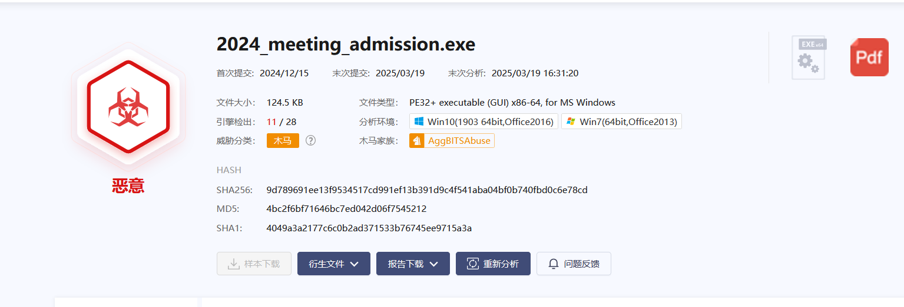

> > 某单位网管日常巡检中发现某员工电脑（IP：192.168.116.123）存在异常外连及数据传输行为，随后立即对该电脑进行断网处理，并启动网络安全应急预案进行排查。

### WinFT_1

1、受控机木马的回连域名及ip及端口是（示例：`flag{xxx.com:127.0.0.1:2333}`）

使用`CurrPorts`工具

`flvupdate.exe`为可疑进程


```
flag{miscsecure.com:192.168.116.130:443}
```

### WinFT_2

2、受控机启动项中隐藏flag是

查看任务计划


解码即可

```
Nice，flag is {AES_encryption_algorithm_is_an_excellent_encryption_algorithm}
```

### WinFT_3

3、受控机中驻留的flag是

查看用户临时目录`C:\Users\zx\AppData\Local\Temp`


这个文件是7z压缩包，密码是木马的名字：`flvupdate`

```
flag{Timeline_correlation_is_a_very_important_part_of_the_digital_forensics_process}
```

### WinFT_4

4、受控源头隐藏的flag是

发现桌面有雷鸟Thunderbird（中文俗称“雷鸟”）,一个邮箱客户端

猜测来源可能是，收到了钓鱼邮件，然后被上线了

于是优先查找带有附件的邮件


然后下载下来，放到沙箱分析




创建了定时任务


然后再找该邮箱的其他邮件

发现还存在一个链接


```
https://autorevertech.com/?key=%61%47%6E%76%76%49%78%6D%62%47%46%6E%49%47%6C%7A%49%48%74%55%61%47%55%67%53%6D%39%31%63%6D%35%6C%65%53%42%30%62%79%42%30%61%47%55%67%56%32%56%7A%64%48%30%3D
```

解码key的值，拿到flag

```
hi,flag is {The Journey to the West}
```

### WinFT_5

5、分析流量，获得压缩包中得到答案

流量中存在client和server两部分


两部分合成一个zip文件，存在密码，发现压缩包有注释

`5pe26Ze057q/5YWz6IGU6Z2e5bi46YeN6KaB`

解码：`时间线关联非常重要`,成功打开压缩包，拿到flag

```
flag{a1b2c3d4e5f67890abcdef1234567890-2f4d90a1b7c8e2349d3f56e0a9b01b8a-CBC}
```

### WinFT_6

6、通过aes解密得到的flag

通过上一题的flag，aes的key和iv有了，mode是CBC

现在需要找到密文

筛选出`ip.addr == 192.168.116.130`的数据包


```
a7b86dfc266043b2a7750f0a9c4a02a269bc72acc55f501d7bc37af237b6abc280a5d0ddb393f79a07bfa5cc0a432086
```


```
flag{Hey, keep going and look for another flag}
```

