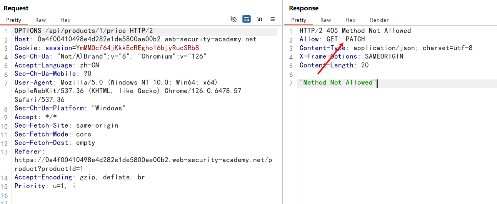
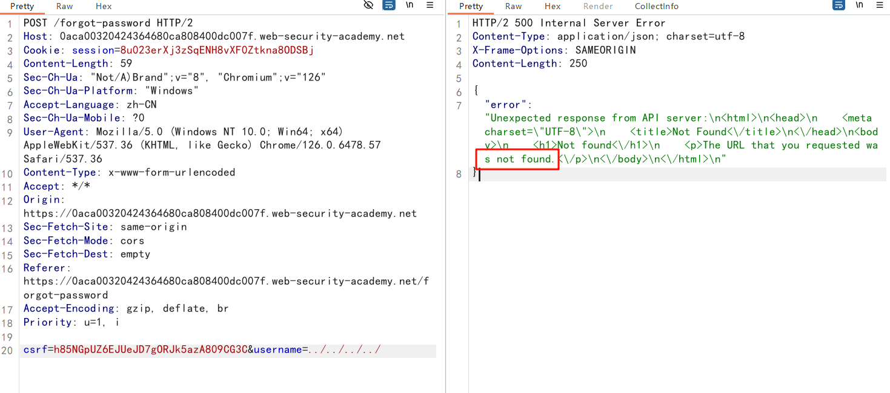
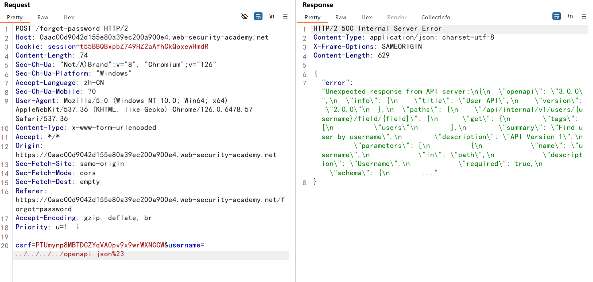

## API testing

API testing（API 测试）

API（应用程序编程接口）使软件系统和应用程序能够通信和共享数据。

所有动态网站都由 API 组成，因此 SQL 注入等经典 Web 漏洞可以归类为 API 测试


## 发现 API 文档

API文档：通常记录 API，以便开发人员知道如何使用和集成它们

可能的API文档路径

```
/api
/swagger/index.html
/openapi.json
```

如果发现了`/api/swagger/v1/users/123`这个API路径，应该继续探索下列路径：

```
/api/swagger/v1
/api/swagger
/api
```

## 识别 API 接口

查看各种**功能点**调用的接口

通过API字典，大量发送API请求

注意`JavaScript`文件，会包含一些API接口

### 确定支持的 HTTP 方法

```
1. GET: 发送一个请求来取得服务器上的某一资源.
2. POST: 向指定资源提交数据进行处理请求（例如提交表单或者上传文件）。
3. HEAD: 类似于 GET 请求，只不过返回的响应中没有具体的内容，用于获取报头。
4. OPTIONS: 客户端询问服务器可以提交哪些请求方法。
5. PUT: 从客户端向服务器传送的数据取代指定的文档的内容，即指定上传资源存放路径。
# 本质上来讲， PUT和POST极为相似，都是向服务器发送数据，但它们之间有一个重要区别，PUT通常指定了资源的存放位置，而POST则没有，POST的数据存放位置由服务器自己决定。
6. PATCH: 是对 PUT 方法的补充，用来对已知资源进行局部更新。
7. DELETE: 请求服务器删除指定的资源。
8. TRACE: 让Web服务器端将之前的请求通信还给客户端的方法。
9. CONNECT: 要求在与代理服务器通信时建立隧道，实现用隧道协议进行TCP通信。
```

API 接口可能支持不同的 HTTP 方法。因此，在调查 API 接口时，测试所有可能的方法非常重要。

例如，接口 `/api/tasks` 可能支持以下方法：

- `GET /api/tasks` - 检索任务列表
- `POST /api/tasks` - 创建新任务
- `DELETE /api/tasks/1` - 删除任务

### 确定支持的内容类型

`Content-Type` 头部

使用Burp的` Content type converter`插件，在 XML 和 JSON 之间自动转换请求中提交的数据

### 发现一些隐藏的接口

例如：`PUT /api/user/update`

那么，还可以尝试将`update`，修改为`delete` 和 `add`

或者，直接使用字典直接爆破

## 查找隐藏参数

[使用内容发现](https://portswigger.net/burp/documentation/desktop/tools/engagement-tools/content-discovery)工具，可以发现未从您可以浏览到的可见内容（包括参数）链接的内容。


### Mass assignment

Mass assignment vulnerabilities（批量分配漏洞）

批量分配（也称为自动绑定）可能会无意中创建隐藏参数。

当软件框架自动将请求参数绑定到内部对象上的字段时，就会发生这种情况。因此，批量分配可能会导致应用程序支持开发人员从未打算处理的参数。

#### 识别隐藏参数

由于批量分配会从对象字段创建参数，因此您通常可以通过手动检查 API 返回的对象来识别这些隐藏的参数

例如，考虑一个 `PATCH /api/users/` 请求，该请求使用户能够更新其用户名和电子邮件，并包含以下 JSON：

```json
{
    "username": "wiener",
    "email": "wiener@example.com",
}
```

`GET /api/users/123` 请求返回以下 JSON：

```json
{
    "id": 123,
    "name": "John Doe",
    "email": "john@example.com",
    "isAdmin": "false"
}
```

这可能表示 hidden `id` 和 `isAdmin` 参数与更新的 username 和 email 参数一起绑定到内部用户对象。

#### 测试批量分配漏洞

添加 `isAdmin` 参数值设置为 `true`的请求

```json
{
    "username": "wiener",
    "email": "wiener@example.com",
    "isAdmin": true,
}
```

如果请求中的 `isAdmin` 值绑定到用户对象，而没有进行充分的验证和清理，则可能会错误地向用户 `wiener` 授予管理员权限

参考：

https://blog.csdn.net/qq_44232452/article/details/133920553

https://portswigger.net/web-security/api-testing#mass-assignment-vulnerabilities

#### API类漏洞防御

1. 保护所有版本的API文档，确保API文档不会被公网访问；
2. 禁用威胁的HTTP方法；
3. 使用通用错误消息以避免泄露信息。

## 服务端参数污染

某些系统包含无法直接从 Internet 访问的内部 API。当网站将用户输入嵌入到内部 API 的服务器端请求中而没有进行适当的编码时，就会发生服务器端参数污染。

### 测试参数污染

在参数值后拼接`?`、`#`、 `&` 和 `=` 并观察应用程序的响应方式

有一个功能是可以根据其他用户名搜索其他用户，当您搜索用户时，您的浏览器会发出以下请求：

```http
GET /userSearch?name=peter&back=/home
```

为了检索用户信息，服务器使用以下请求查询内部 API：

```http
GET /users/search?name=peter&publicProfile=true
```

#### 截断参数

使用 URL 编码的 `#` 字符尝试截断服务器端请求，为了更好解释响应，还可以在 `#` 字符后添加一个字符串

```http
GET /userSearch?name=peter%23foo&back=/home
```

服务器实际请求：

```http
GET /users/search?name=peter#foo&publicProfile=true
```

查看响应以获取有关查询是否已被截断的线索。

例如，如果响应返回用户 `peter`，则服务器端查询可能已被截断。如果返回 `Invalid name` 错误消息，则应用程序可能已将 `foo` 作为用户名的一部分。这表明服务器端请求可能尚未被截断。

#### 注入参数

使用 URL 编码的 `&` 字符来尝试向服务器端请求添加第二个参数

已经知道 `email` 参数，则可以将其添加到查询字符串中，如下所示：

```http
GET /userSearch?name=peter%26email=foo&back=/home
```

这会导致对内部 API 的以下服务器端请求：

```http
GET /users/search?name=peter&email=foo&publicProfile=true
```

#### 覆盖参数

要确认是否存在服务器端参数污染，您可以尝试覆盖原始参数。通过注入具有相同名称的第二个参数来执行

```http
GET /userSearch?name=peter%26name=carlos&back=/home
```

这会导致对内部 API 的以下服务器端请求：

```http
GET /users/search?name=peter&name=carlos&publicProfile=true
```

- PHP解析器仅仅解析最后一个参数，即`carlos`；
- ASP.NET解析器拼接两个值，即`peter,carlos`；
- Node.js / express解析第一个参数的值，即`peter`。

### restful api 参数污染

RESTful API 可以将参数名称和值放在 URL 路径中，而不是查询字符串中，例如下面的路径：

注意：查询字符串传参：`?username=123`

```
/api/users/123
```

- `/api` 是根 API 路径
- `/users` 表示资源
- `/123` 表示一个参数，这里指用户名

假如有一个功能，它根据用户的用户名编辑用户配置文件，请求 API 如下：

```http
GET /edit_profile.php?name=peter
```

restful api 服务端请求表示为：

```http
GET /api/private/users/peter
```

我们可以使用`../`来修改参数值，例如：`peter/../admin`

```http
GET /edit_profile.php?name=peter%2f..%2fadmin
```

可能会导致以下服务器端请求：

```http
GET /api/private/users/peter/../admin
```

如果服务器端客户端或后端 API 规范化此路径，则可以将其解析为 `/api/private/users/admin`

### 防止服务器端参数污染

为防止服务器端参数污染，请使用允许列表定义不需要编码的字符，并确保所有其他用户输入在包含在服务器端请求之前都经过编码。您还应确保所有输入都符合预期的格式和结构。

## labs

### 使用文档利用API

访问`/api`，找到API文档，使用DELETE删除`carlos`用户即可


### 查找和利用未使用的API接口

您可以使用以下凭据登录到自己的帐户：`wiener:peter`

登录上自己的账号，查看商品详情，发现`/api/products/1/price`


使用`OPTIONS`方法，查看可以使用那些请求方法



发现可以使用`PATCH`方法，它可以对资源进行更新

尝试是不是可以修改价格

根据报错信息，需要使用json格式


修改价格为0

```json
{
	"price":0
}
```


查看商品信息


### 利用批量分配漏洞

您可以使用以下凭据登录到自己的帐户：`wiener:peter`

添加商品到购物车，点击下订单

发现有两个请求

`GET /api/checkout`，`POST /api/checkout`


`GET /api/checkout`，显示我购物车里的商品


`POST /api/checkout`，提交订单，201表示订单创建了，但是账户余额不够，跳转到错误页面


添加`percentage`参数，就是设置折扣百分比，100就是零元购


购买成功


### 查询字符串中的参数污染

实验目标：拿到`administrator`账号

点击忘记密码，输入`administrator`，数据包如下：


它默认返回的`type`是email，那会不会有`password`类型呢

尝试在username后拼接%23，看能不能截断服务器端请求

还可以在 `#` 字符后添加一个字符串，来根据响应判断是否截断成功

当username参数输入为：`administratorfoo`，响应是：`"error":"Invalid username."`

那么我输入`administrator%23foo`，如果响应是无效用户名，说明没有截断服务器端请求（直接将`%23foo`部分当作用户名处理了）

这里响应是：`field`参数未指定


发现并没有`password`类型


在js代码中，发现`reset_token`，是重置密码的token


尝试获取该字段


`/forgot-password?reset_token=dh094phmc9xxu6rf1en03b7h6xsv58ci`

成功修改密码

### rest url 中的参数污染

和上一关相似，点击忘记密码，提交`administrator`用户名

提交`administrator%23`，响应是无效的路由，请参阅API定义


提交`administrator%26xyz=foo`，响应是用户名不存在，说明后端可能不是用`&`传递参数


提交`?`符号，因为`?`是传递参数的开始，会截断 URL 路径

响应还是`Invalid route`


输入`./administrator`，响应正常

简单猜测后端请求是：`/api/user/./administrator`，最后解析为`/api/user/administrator`

而输入`../administrator`，响应是`Invalid route`，解析的可能是`/api/administrator`


查看`forgotPassword.js`

`/forgot-password?passwordResetToken=${resetToken}`

尝试获取`passwordResetToken`

通过增加`../`，直到根 API 上一级

输入`../../../../`



读取 API 文档

```
../../../../openapi.json%23
```



服务端请求是：

```
/api/internal/v1/users/{username}/field/{field}
```

尝试读取passwordResetToken，但是响应是：`This version of API only supports the email field for security reasons`

```
./administrator/field/passwordResetToken%23
```

更改为

```
../../v1/users/administrator/field/passwordResetToken%23
```

成功读到

