## 业务逻辑漏洞

业务逻辑漏洞是应用程序设计和实现中的缺陷，允许攻击者诱导未预期的行为。

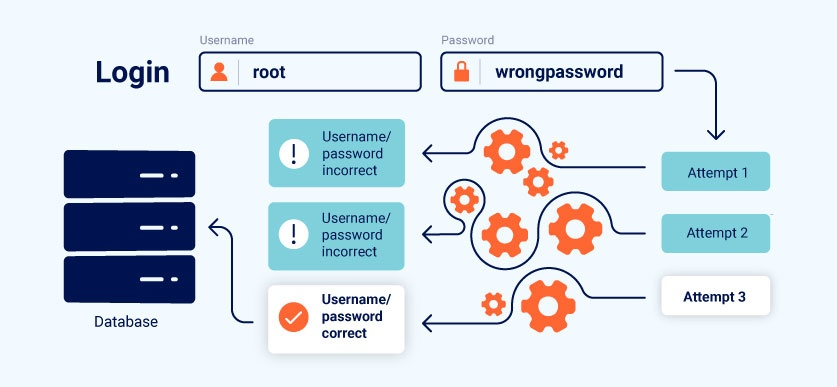

## labs

### 高级逻辑漏洞

**挑战：购买一件价格是：1337的夹克**

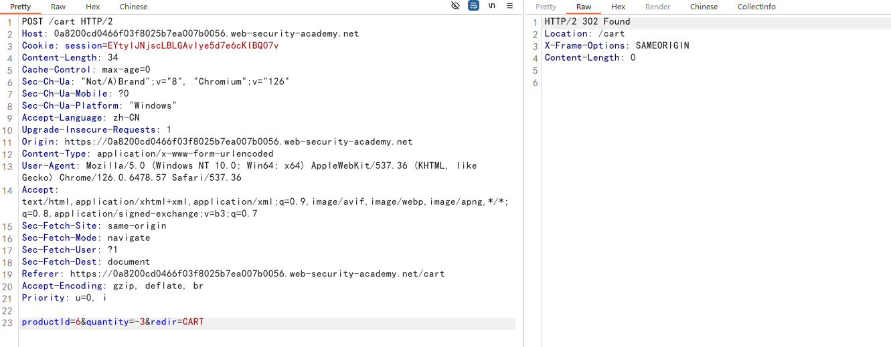

通过这个包修改购物车里的某个产品的数量。`-3`代表数量减3，`1`代表数量加1

你要购买的产品，这个夹克，数量必须为正数，然后通过其他的产品数量负增加，让总价达到100以内

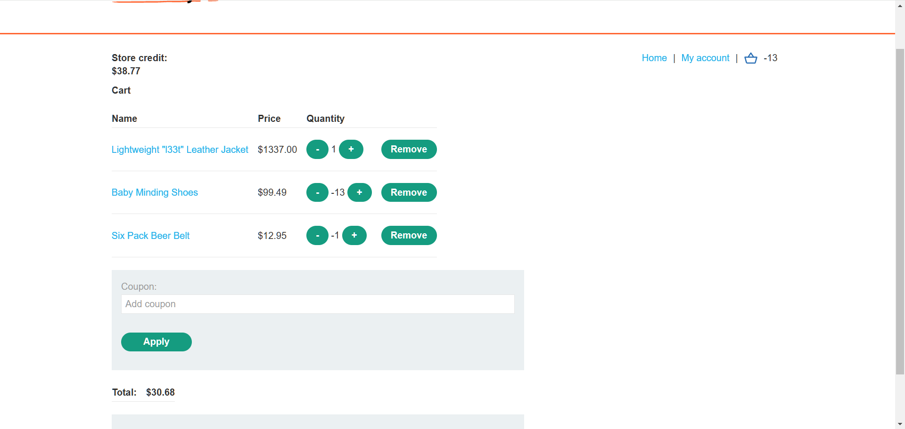

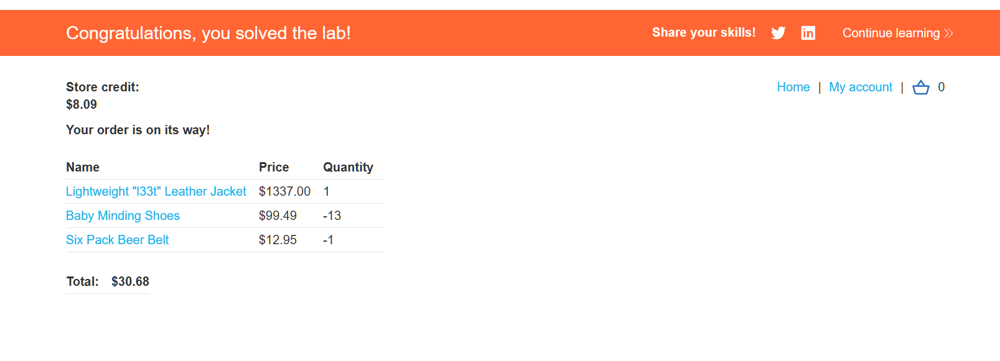

### 不一致的安全控制

**挑战：进入管理员接口，删除carlos用户**

给了一个邮箱地址，可以注册一个账号

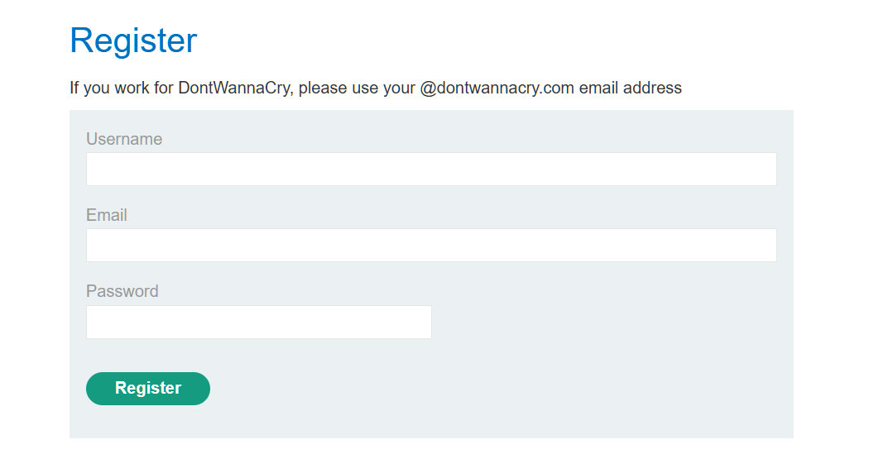

告诉我们使用`@dontwannacry.com`邮箱地址，就是一个工作者或者内部人员

访问`/admin`，提示：`Admin interface only available if logged in as a DontWannaCry user`

这个接口只有`DontWannaCry user`才能访问

但是登录以后，修改邮箱功能是不存在验证的，可以修改任意邮件地址

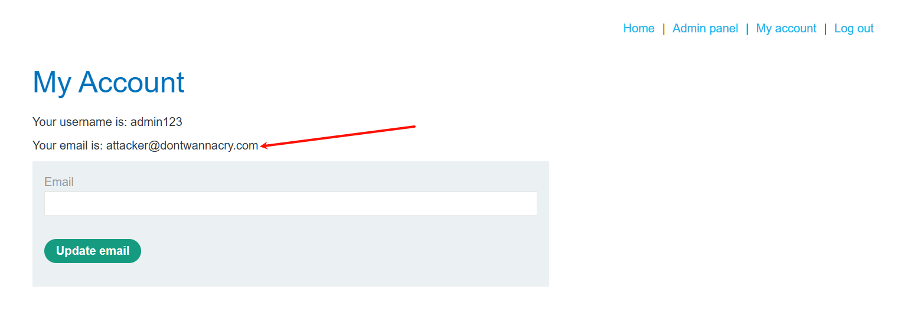

修改成指定的邮件地址即可

这里和注册中的逻辑校验不同，并没有接受验证码

### 业务规则的执行存在缺陷

**挑战：购买一件价格是：1337的夹克**

注册输入邮箱会给一个优惠券`SIGNUP30`

新客户能用一个优惠券

`New customers use code at checkout: NEWCUST5`

重复添加时，会显示已经添加

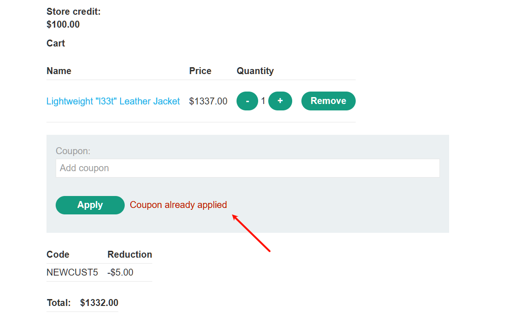

但是，这两张优惠券可以交叉使用，如下图，使用过第一张之后使用第二张，再使用第一张，循环往下，可以一直使用

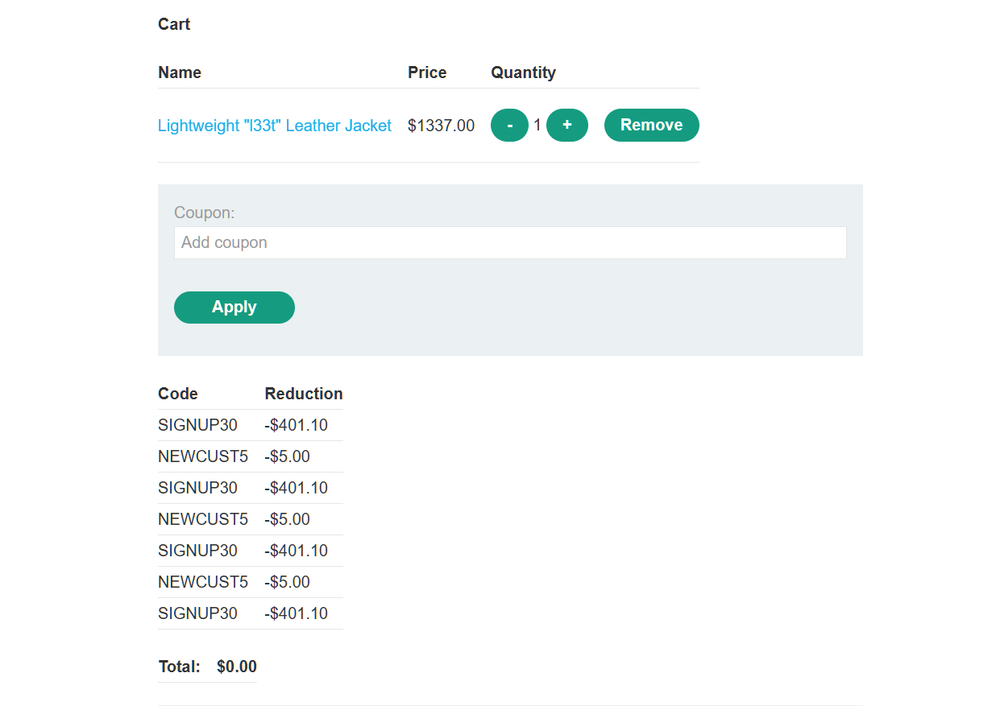

### 低级逻辑缺陷

**挑战：购买一件价格是：1337的夹克**

往自己的购物车增加商品数量，当价格到达一定数值（价格已超过后端语言中允许的整数最大值），总价会变成负数

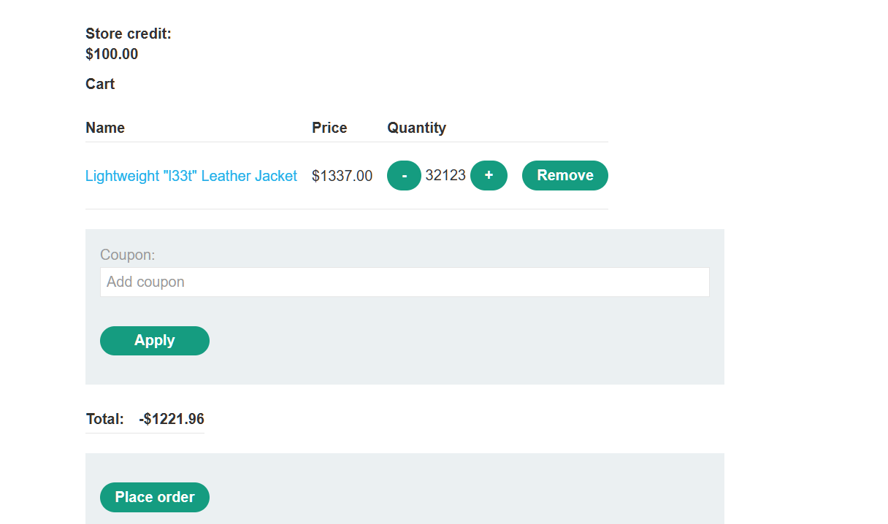

然后通过其他商品凑够100以内

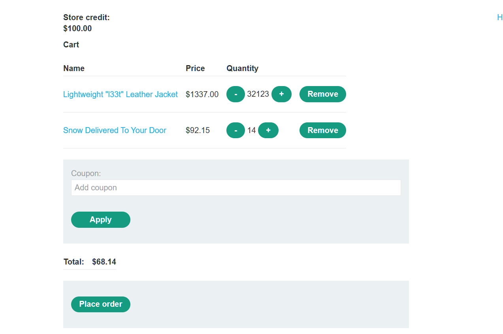

完成

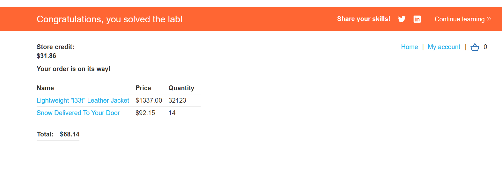