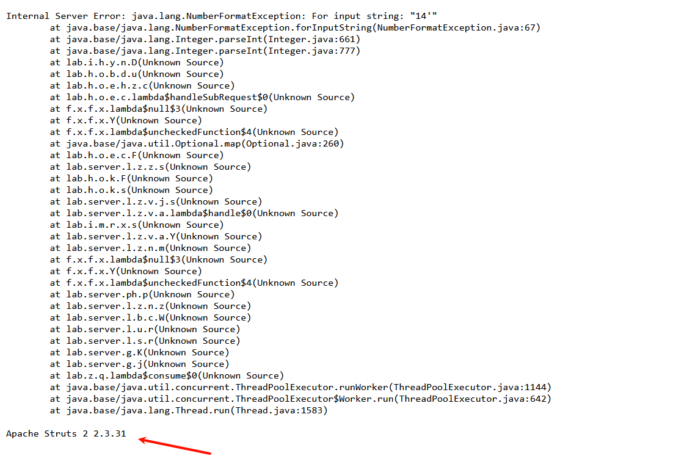
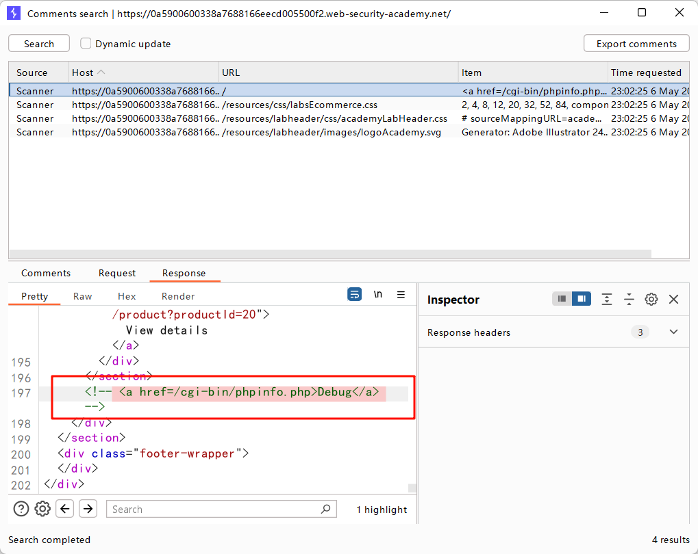
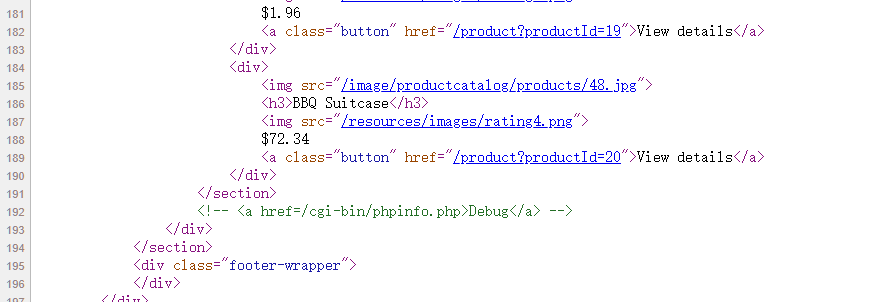
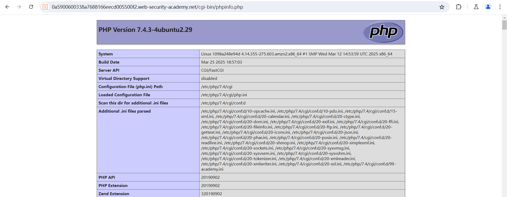
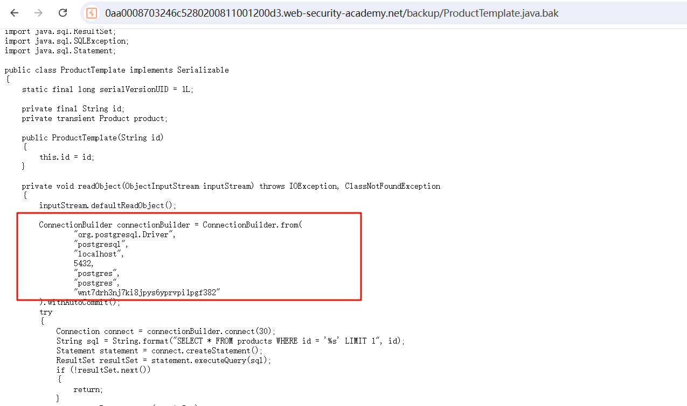
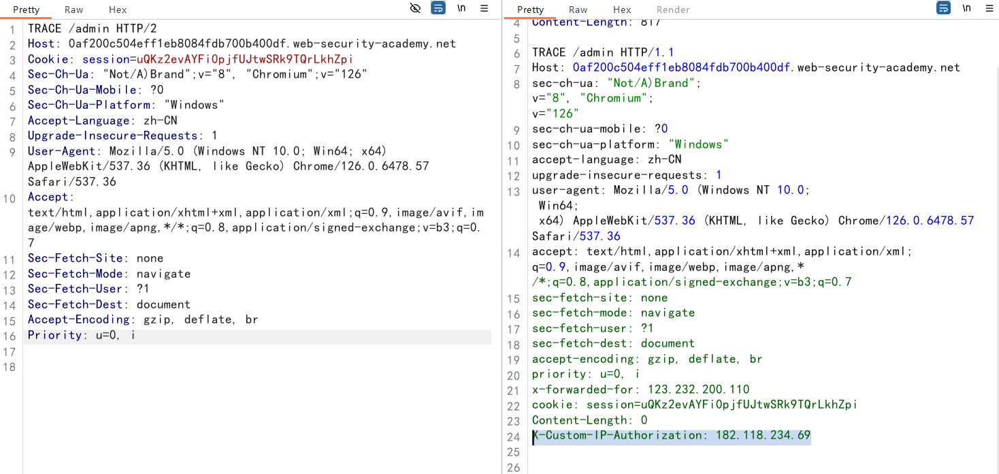
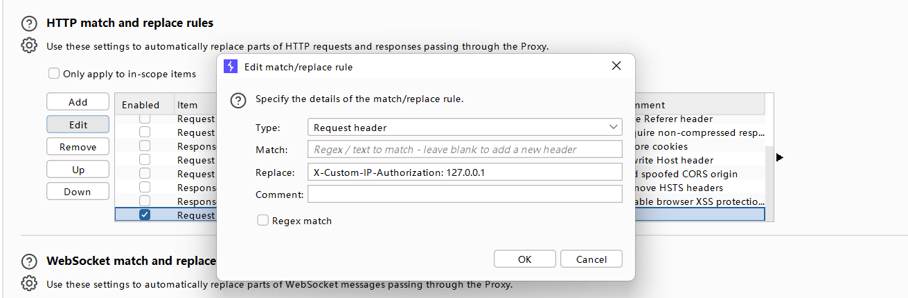
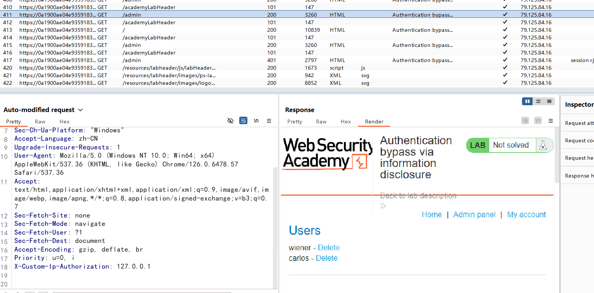
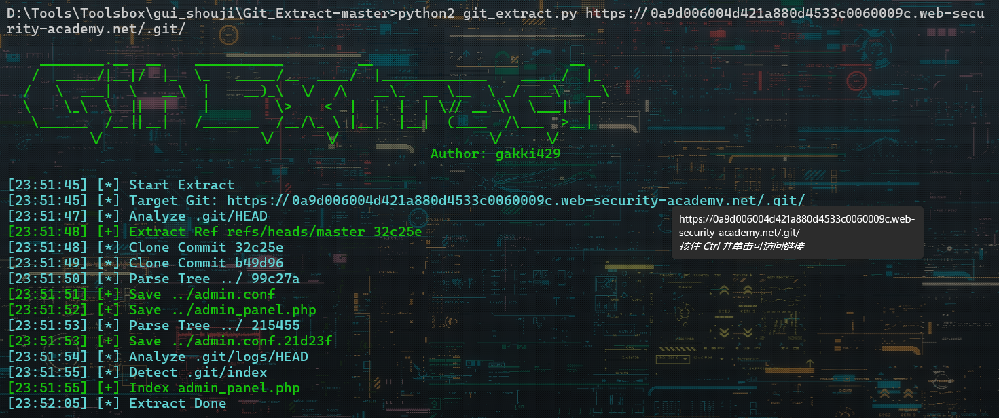
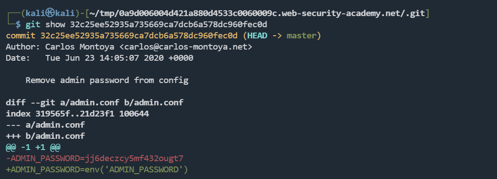

## Information disclosure vulnerabilities

Information disclosure vulnerabilities（ 信息泄露漏洞）


信息泄露，是指网站无意中向其用户泄露敏感信息


## labs

### 网站错误信息

在数字后面加上`'`，发现网站报错，找到网站框架信息



### 调试页面

打开`Target`，选择`site map`，右键该网站选择`Engagement tools`，再选择`Find comments`

功能是：查看网站资源中注释的行和字符



同样，直接查看源代码，也可以观察到





### 备份文件

查看`/robots.txt`

```
User-agent: *
Disallow: /backup
```



提交数据库密码

### 通过信息泄露绕过身份验证

自己的凭据：`wiener:peter`

访问到`GET /admin`

```
Admin interface only available to local users
```

只有本地用户才能进入管理页面

> TRACE 是 HTTP 协议中的一种请求方法，它的主要功能是用于诊断和调试
>
> 由于 TRACE 可能会泄露敏感信息（如身份验证头），所以不建议在生产环境中启用此方法。

使用 `TRACE` 方法

查看响应发现，包含当前机器 IP 地址的 `X-Custom-IP-Authorization` 标头已自动附加到请求中

这用于确定请求是否来自 `localhost` IP 地址



打开代理，添加HTTP头部匹配替换规则



只要是经过BURP的数据包，全部自动添加该头部信息



删除`carlos`用户，完成实验

### 版本控制历史

`.git`文件泄露，查看历史版本

使用`Git_Extract`可以直接梭



查看`admin.conf`文件

```
ADMIN_PASSWORD=jj6deczcy5mf432ougt7
```

手动操作

递归下载所有文件

```
wget -r https://0a9d006004d421a880d4533c0060009c.web-security-academy.net/.git
```

`git log`查看所有提交日志

```
commit 32c25ee52935a735669ca7dcb6a578dc960fec0d (HEAD -> master)
Author: Carlos Montoya <carlos@carlos-montoya.net>
Date:   Tue Jun 23 14:05:07 2020 +0000

    Remove admin password from config

commit b49d9606874e281ab31e2773fc56c3d464aa33d3
Author: Carlos Montoya <carlos@carlos-montoya.net>
Date:   Mon Jun 22 16:23:42 2020 +0000

    Add skeleton admin panel
```

`git show`查看特定版本的文件内容



登录`administrator`，删除`carlos`用户