:::info

靶机来源于州弟学安全，请使用RDP访问远程桌面 账号密码：administrator/Sierting789@   flag获取请在终端中运行桌面的ulabflag.exe，请勿双击exe，完成答题获取    

勒索病毒排查溯源靶场核心考点

- 勒索家族识别（通过勒索信、加密后缀、专属标识等特征判定）
- 勒索ID提取（从勒索信或关联文件中获取唯一凭证）
- 加密文件解密（查找对应版本解密工具并正确执行解密操作）
- Windows Defender日志分析（查杀记录、开启/关闭时间排查）
- 恶意程序（C2）绝对路径定位（结合文件排查工具与攻击时间线）
- C2外联IP识别（通过沙箱分析或网络连接命令检测）
- 加密器路径查找（依据加密时间、文件类型筛选定位）
- 攻击漏洞溯源（开放端口分析、Web应用漏洞探测与验证）
- Windows事件日志分析（登录日志、系统操作日志筛选解读）
- 专业工具使用（Everything、FullEventLogView等文件/日志排查工具）
- 攻击时间线梳理（还原攻击者完整操作流程）
- 沙箱工具应用（恶意文件属性及行为分析）
- 渗透思维应用（验证潜在漏洞并确认攻击路径）

:::

勒索信

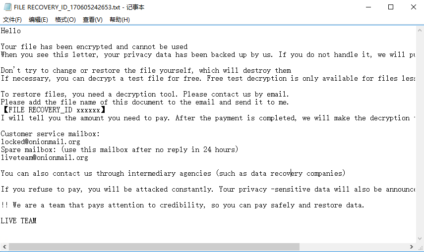

被加密的文件如下，`live`后缀

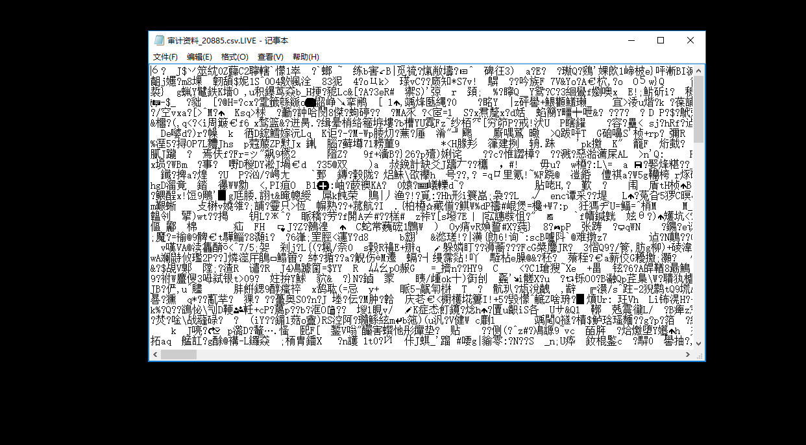

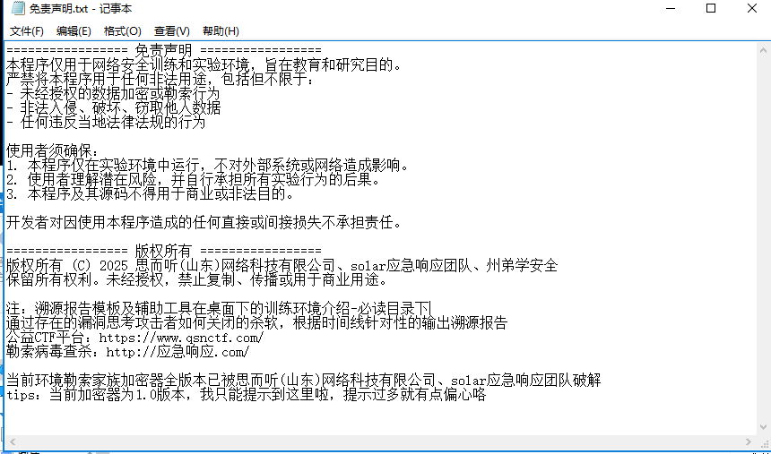

```
问题1：病毒家族的名称（不区分大小写）：
答案：live
```

搜索一下找到


https://mp.weixin.qq.com/s/XV0x10YV-Wrs1ZI6tNHjLA

```
问题2：勒索病毒预留的ID
答案：170605242653
```

从勒索信或关联文件中获取唯一凭证，查看勒索信的名称

```
问题3：解密并提交桌面中flag.txt.LIVE的flag：
答案：cf0971c1d17a03823c3db541ea3b4ec2
```

找到这篇文章：https://bbs.kanxue.com/thread-282296-1.htm#msg_header_h1_11

下载1.0解密工具

https://www.solarsecurity.cn/index.html

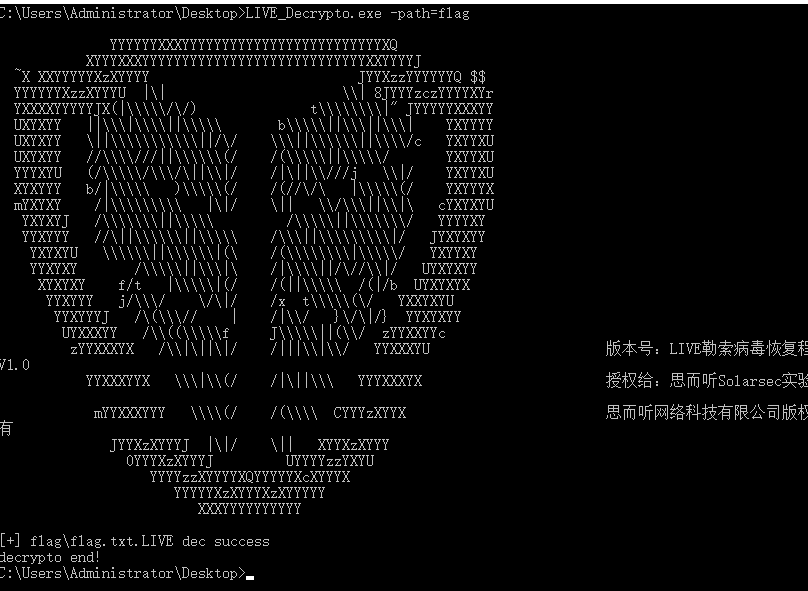

```
问题4：Windows Defender删除攻击者C2的时间（格式示例：2070.12.13）：
答案：2025.8.25
```

这里应该有记录的

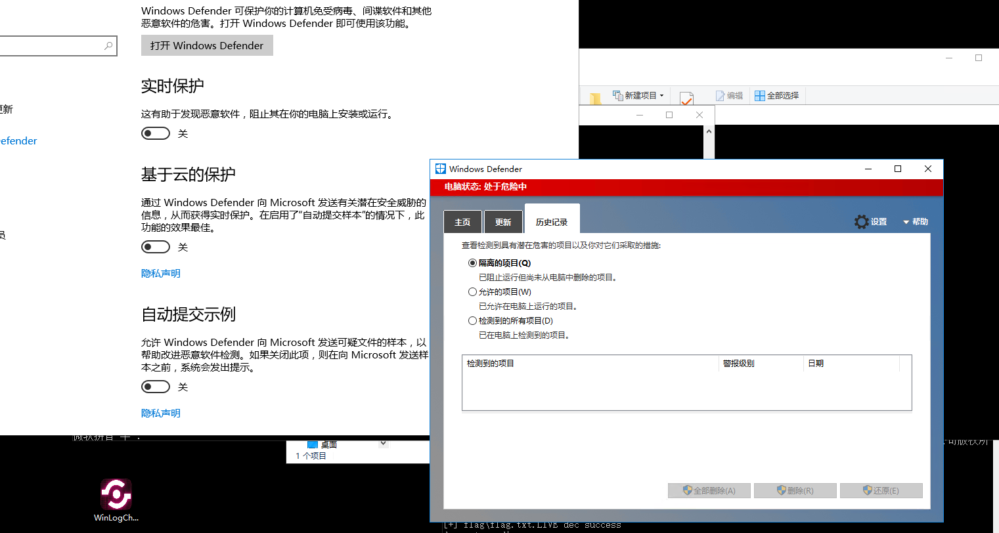

 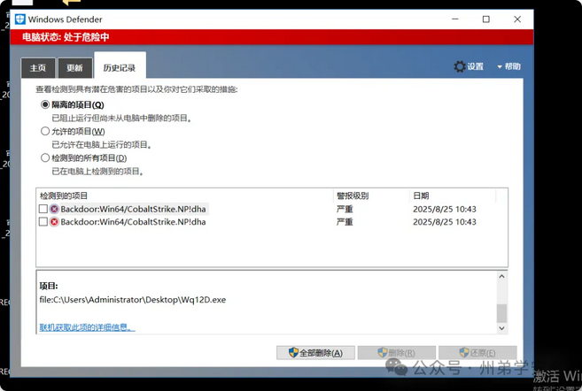

在2025年8月25日10:43分杀软对**C:\Users\Administrator\Desktop\Wq12D.exe**进行了查杀，判定此程序为cobalt strike

```
问题5：攻击者上传C2的绝对路径：
答案：C:\Users\Administrator\Downloads\Wq12D.exe
回答正确，进入下一题。
```

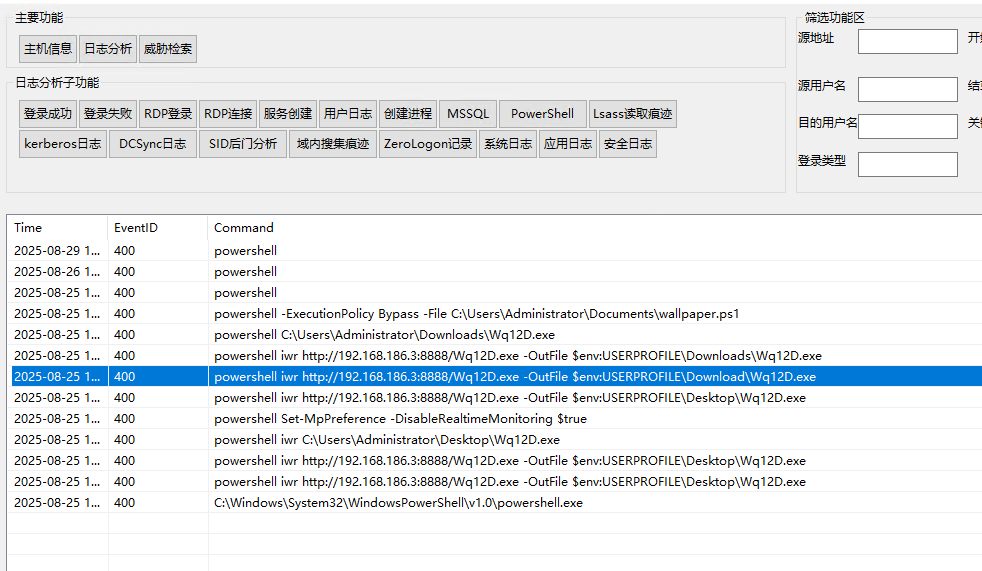

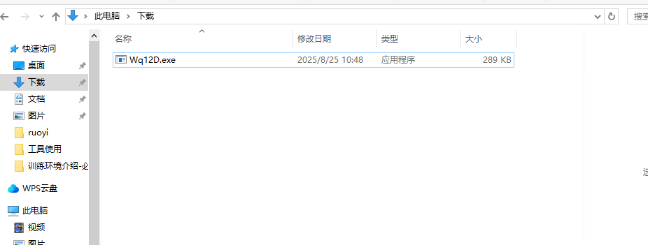

在下载目录里

```
问题6：提交攻击者C2的IP外联地址
答案：192.168.186.2
```

沙箱检测就行

```
提交攻击者关闭Windows Defender的时间
答案：2025.8.25 10:45:08
```

开启审核策略记录日志

 **WIN+R->gpedit->计算机配置->Windows设置->安全设置->本次策略->审核策略->审核登录事件**

事件id 5001会记录开启和关闭的日志

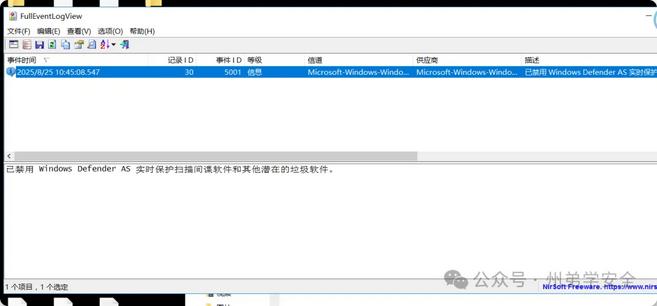

```
提交攻击者加密器绝对路径
答案：C:\Users\Administrator\Documents\systime.exe
```

根据关闭Windows Defender的时间，查找时间相似的文件

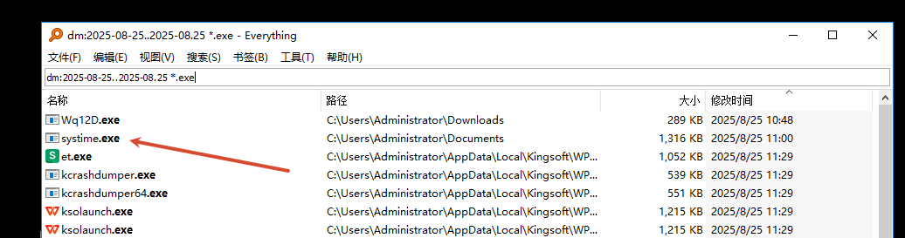

丢沙箱来确认是否是加密器

```
9. 溯源黑客攻击路径，利用的哪个漏洞并推测验证
```

根据前面的分析，可以得到黑客的攻击路径：

1. 上传 C2 被 window defender 清除
2. 关闭 window defender
3. 再次上传 C2 
4. 上传加密器，开始加密

继续排查黑客通过什么漏洞进来的

查看当前主机上的服务

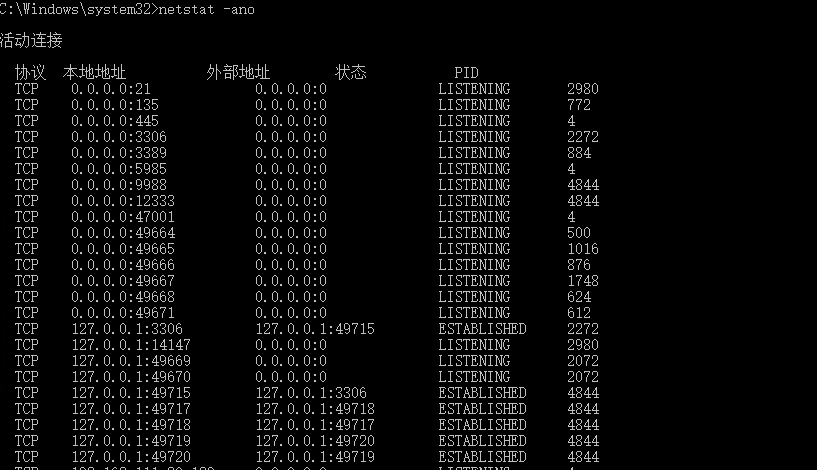

逐一端口进行排查

排查登录日志，21，3306，3389端口是否存在弱口令

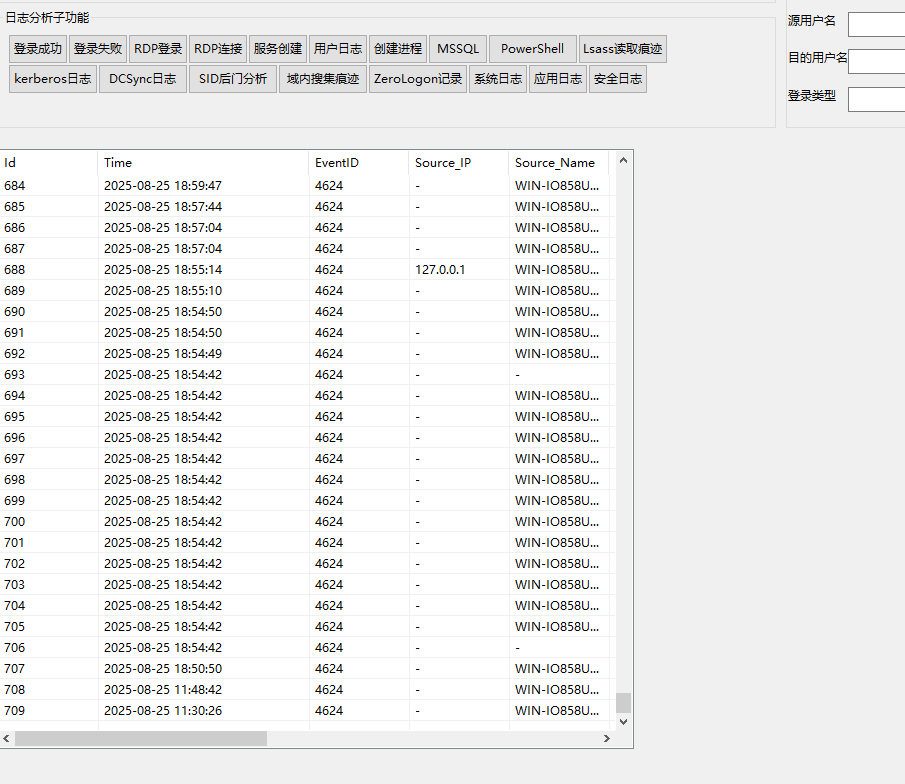

根据登录日志，并没有发现对应时间的登录成功的记录

12333端口

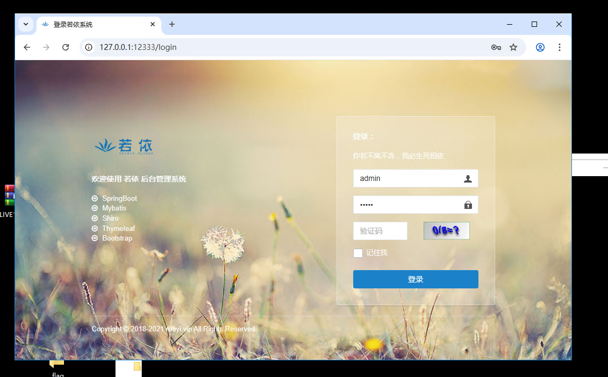

老版本若依，这里存在shiro反序列化

详细wp

https://mp.weixin.qq.com/s/P0x6W7QhhPToJod8v-QI0g
