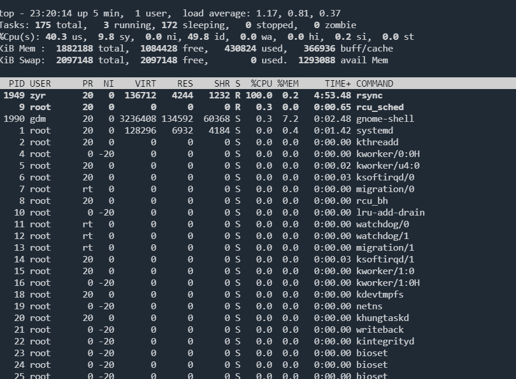
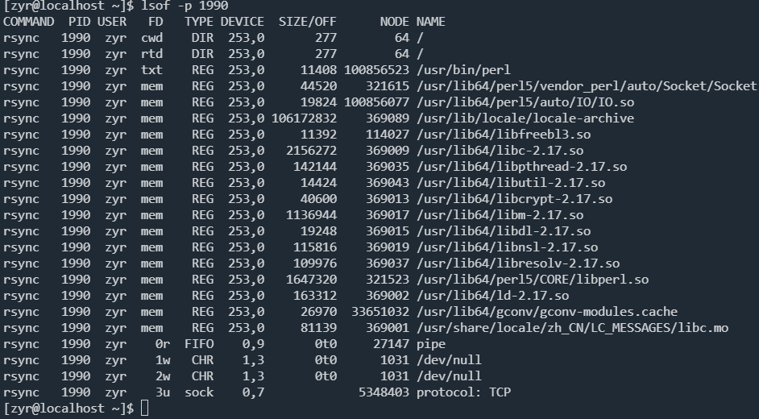
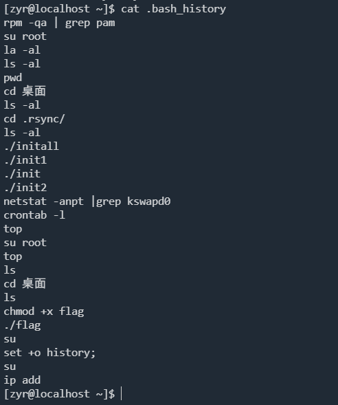
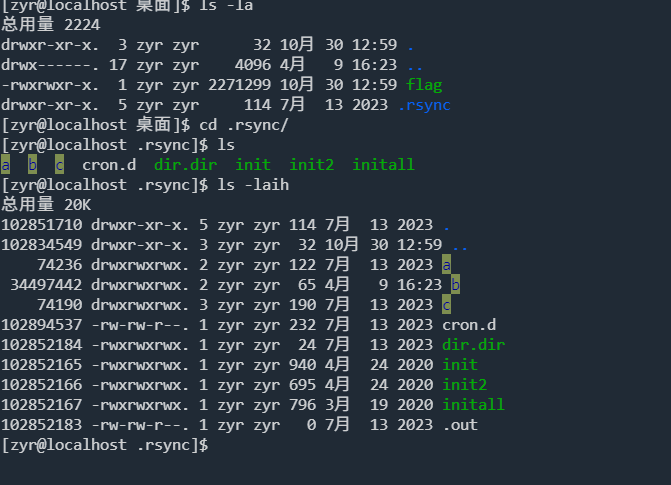
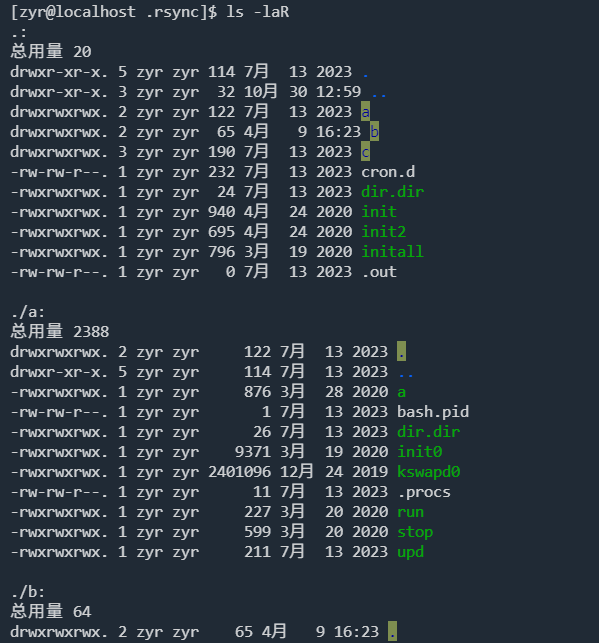
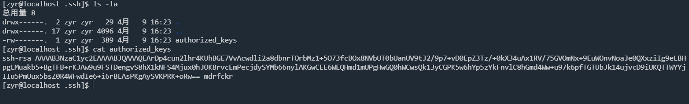

:::info

靶机来源于wxiaoge应急响应培训，请使用ssh访问机器，账户：zyr 密码：wxiaoge123 flag在用户桌面目录中，请答题获取最终flag

目标是彻底清理挖矿程序，你的任务是尽快使机器恢复正常，检查重启后是否不再被挖矿，不溯源

:::

```
[zyr@localhost 桌面]$ ./flag 
=== 答题程序 ===
欢迎来到无境靶场！
请依次回答以下问题，答对上一个才能回答下一个。

问题 1: 挖矿进程的command是什么？
请输入答案: rsync
✓ 回答正确！

```

查看进程占用情况



`rsync`进程占用cpu很大资源

根据进程id，查看进程打开的文件

```
lsof -p 1990
```



```
问题 2: 最终运行的挖矿程序名称？提示：k开头
请输入答案: kswapd0
✓ 回答正确！
```

是zyr用户的进程，排查一下该用户的文件



`.rsync`目录很可疑的



定时任务配置文件

```
[zyr@localhost .rsync]$ cat cron.d
1 1 */2 * * /home/zyr/桌面/.rsync/a/upd>/dev/null 2>&1
5 8 * * 0 /home/zyr/桌面/.rsync/b/sync>/dev/null 2>&1 
@reboot /home/zyr/桌面/.rsync/b/sync>/dev/null 2>&1  
0 0 */3 * * /home/zyr/桌面/.rsync/c/aptitude>/dev/null 2>&1
```

的确存在定时任务

```
[zyr@localhost .rsync]$ crontab -l
1 1 */2 * * /home/zyr/桌面/.rsync/a/upd>/dev/null 2>&1
5 8 * * 0 /home/zyr/桌面/.rsync/b/sync>/dev/null 2>&1 
@reboot /home/zyr/桌面/.rsync/b/sync>/dev/null 2>&1  
0 0 */3 * * /home/zyr/桌面/.rsync/c/aptitude>/dev/null 2>&1
```

排查文件找到`kswapd0`



```
问题 3: 计划任务中完整的重启计划。
请输入答案: @reboot /home/zyr/桌面/.rsync/b/sync>/dev/null 2>&1
✓ 回答正确！
```

找到公钥

```
问题 4: Ssh 公钥免密后门文件全路径？
请输入答案: /home/zyr/.ssh/authorized_keys
✓ 回答正确！

==================================================
🎉 恭喜！全部答对！
Flag: 08e8bdc6b4385ca57dcb62e284438ef2
==================================================
```



总结

找到挖矿进程、定位用户、找到挖矿文件、排查清理挖矿程序、后门（SSH 公钥、启动项、服务、定时任务等）

