:::info

靶机来源于州弟学安全 题目描述：   角色: 你是一名初级安全工程师。   事件: 运维团队报告，公司的一台核心开发服务器（Ubuntu 22.04 LTS）出现CPU使用率异常飙高告警及安全设备检出外联挖矿事件。现在，你需要登录该服务器，排查并处置这一安全事件，并最终找出问题的根源。   账号：root   密码：P@ssw0rd  请使用ssh远程 flag获取请运行ulabflag，完成答题获取    

特洛伊挖矿木马靶场考点总结

1. 挖矿文件定位与识别

- 通过系统资源占用（CPU使用率异常）排查可疑进程
- 利用进程分析工具（lsof、ps）定位挖矿文件存储路径
- 结合文件特征（tmp目录随机命名文件、ELF格式可执行文件）确认挖矿程序

2. 外联行为检测

- 通过网络连接工具（ss）排查挖矿程序外联矿池的IP与端口
- 分析进程网络连接状态（SYN-SENT）识别异常外联行为
- 应对挖矿程序心跳机制导致的间歇性外联检测难点

3. 守护机制与进程持久化分析

- 排查计划任务（crontab、/etc/cron.d目录）中的恶意守护脚本
- 识别隐藏守护进程脚本的运行逻辑与进程重生机制
- 分析命令篡改（rm权限异常）与文件感染导致的进程不死特性

4. 恶意代码传播溯源

- 结合人员操作记录（内部聊天记录、操作日志）追溯病毒入侵源头
- 识别钓鱼网站诱导下载捆绑恶意程序的攻击路径
- 分析恶意程序伪装（仿冒工具软件）的社会工程学攻击特征

5. 系统命令感染检测

- 通过逆向分析（IDA）提取恶意程序感染的系统命令列表
- 识别命令篡改（alias别名劫持、二进制文件植入）行为
- 验证被感染命令（stat、top等）的功能异常与隐藏逻辑

6. 系统修复与文件完整性恢复

- 利用离线deb包覆盖修复被感染的系统命令与程序
- 验证修复后文件属性与功能的完整性
- 处理断网环境下的系统修复策略与操作流程

7. 恶意残留彻底清理

- 全面删除挖矿程序、守护进程脚本与计划任务文件
- 强制终止挖矿相关进程与衍生进程
- 验证清理效果，防止恶意程序二次重生

8. 应急响应思路与实战能力

- 应对权限异常（root删除文件失败）的排查方法
- 利用busybox等第三方工具规避被感染命令的干扰
- 结合静态分析（strings）与动态分析（沙箱）的恶意文件鉴定方法

:::

### 挖矿文件的绝对路径

主机上的top没有输出，有三种情况（alias起别名、环境变量劫持、程序被替换）

上传busybox

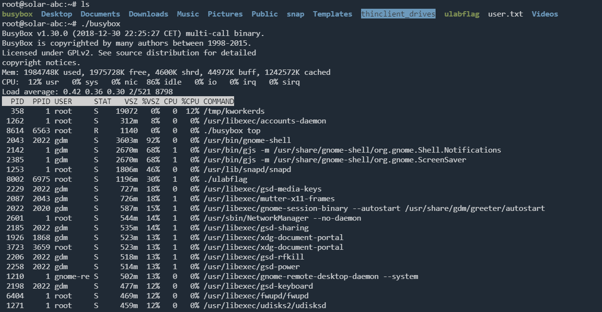

查看进程关联文件

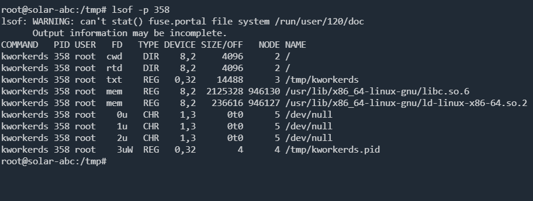

```bash
cat ~/.bashrc
source ~/.bashrc
```

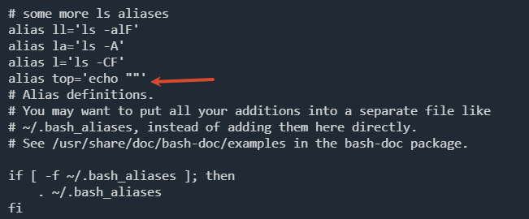

删除这一行，生效配置文件，top命令正常

静态分析一下这个文件

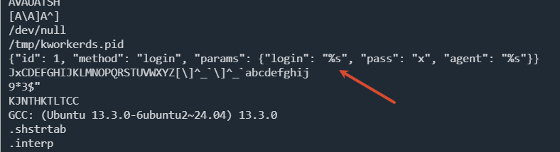

存在 json 登录格式，应该是钱包登录用的

### 提交挖矿文件的外联的IP与端口

实际业务种肯定是先提交到沙箱，发现并没有跑出外联地址；用 tcpdump 进行抓包，可能会影响业务，这里是可以抓到的

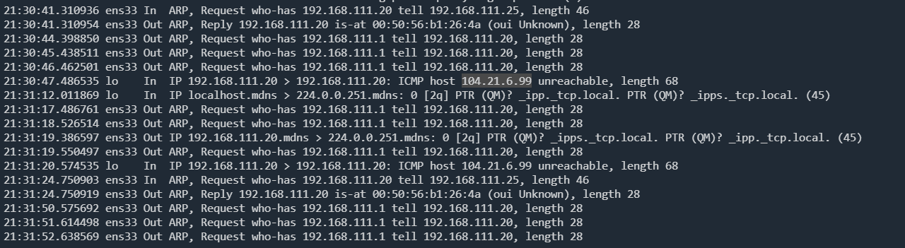

接着用IDA分析这个挖矿文件

`KJNTHKTLTCC ` 逐字节做 xor 0x7a

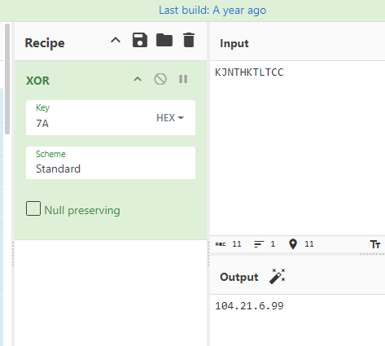

27 FB = 端口的大端序，0x27FB 转十进制就是 10235

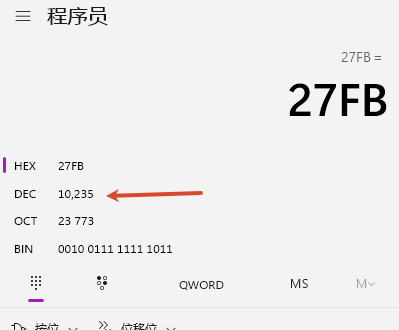

硬编码目标地址是 `104.21.6.99:10235`

还可以使用ss筛选相关程序的外联情况

```bash
ss -tanpan|grep "kworker"
```

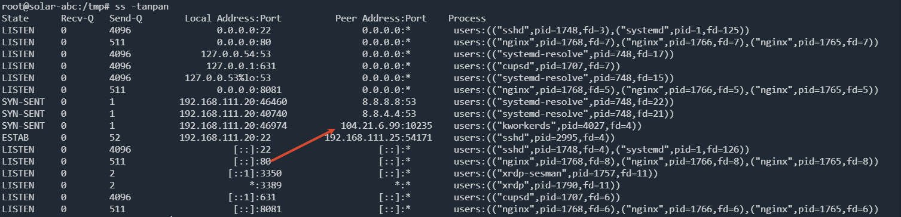

执行完发现没结果，可能是因为这个程序外联有心跳机制

用`lsof -p pid`发现查不到

```
root@solar-abc:~# ./ulabflag
无境 ulab vip.bdziyi.com

问题 1: 挖矿文件的绝对路径
请输入答案: /tmp/kworkerds
回答正确！

问题 2: 提交挖矿文件的外联的IP与端口，以ip:port格式提交
请输入答案: 104.21.6.99:10235
回答正确！
```

### 守护进程脚本的绝对路径

先尝试删除和停止挖矿程序

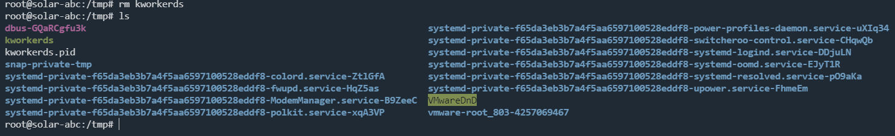

我用rm删除后，立刻执行ls，发现挖矿文件还存在，大概率rm被感染了

也可以查看一下文件是否存在隐藏属性

```bash
root@solar-abc:/tmp# lsattr kworkerds
--------------e------- kworkerds
```

不存在隐藏属性，chattr 命令可以对属性进行编辑

使用`busybox`工具进行删除

```bash
root@solar-abc:/tmp# /busybox rm -rf kworkerds
```

我这里还是删除不掉，可能是有定时任务一直在释放文件

排查定时任务文件

```
crontab -l
cat /etc/crontab
ls -l /var/spool/cron/
ls -l /etc/cron*
```

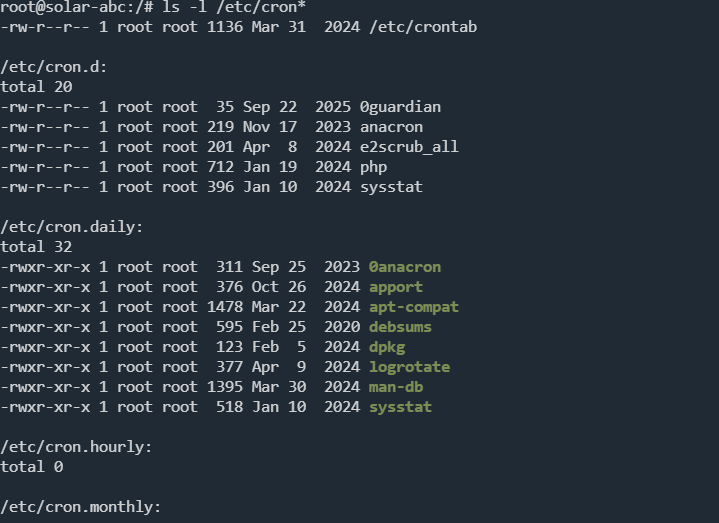

```sh
root@solar-abc:/etc/cron.d# cat 0guardian 
* * * * * root /usr/bin/.0guardian
root@solar-abc:/etc/cron.d# cat /usr/bin/.0guardian
#!/bin/bash
# Guardian Script: Periodically triggers an infected command
# to ensure the core service is checked and revived if needed.
/usr/bin/stat /tmp > /dev/null 2>&1
```

守护进程脚本就是`/usr/bin/.0guardian`，接着分析`stat`文件

```
问题 3: 停止挖矿进程并尝试删除挖矿程序，根据异常判断，提交守护进程脚本的绝对路径
请输入答案: /usr/bin/.0guardian
回答正确！
```

> 计划任务(每分钟)->调用守护进程脚本->调用stat命令->检查挖矿程序是否存在、进程是否存活->如有则退出->如没有则释放程序和启动进程

### 分析病毒文件逻辑，提交感染程序名

```sh
问题 4: 分析病毒文件逻辑，提交感染程序名，最终以md5(/usr/bin/whoai,/usr/bin/ls,/usr/bin/top)后的密文进行提交,比如e10adc3949ba59abbe56e057f20f883e，顺序需以病毒文件中为准
请输入答案: dac48e98a53b81b0218e2156e364f7ba
回答正确！
```

静态分析一下`stat`文件

```bash
strings stat
```

```bash
/proc
/proc/%s/cmdline
/tmp/kworkerds
/proc/self/exe
/tmp/.miner.lock
/etc/cron.d/0guardian
/usr/bin/.0guardian
stat
original_exe
.....
/tmp/kworkerds.pid
{"id": 1, "method": "login", "params": {"login": "%s", "pass": "x", "agent": "%s"}}
JxCDEFGHIJKLMNOPQRSTUVWXYZ[\]^_`\]^_`abcdefghij
9*3$"
KJNTHKTLTCC
```

确认是被感染了

这里环境崩了，借一下图

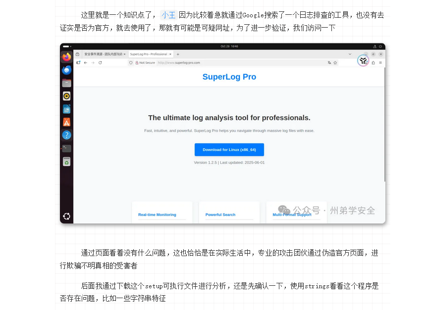

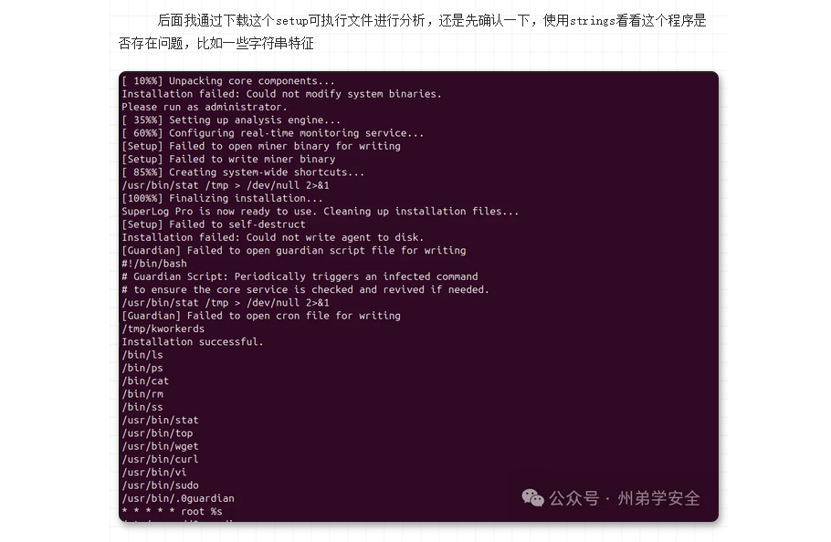

可以确认是小王下载了一个捆绑安装包，这个就是病毒文件

用IDA分析完之后

```bash
md5(/bin/ls,/bin/ps,/bin/cat,/bin/rm,/bin/ss,/usr/bin/stat,/usr/bin/top,/usr/bin/wget,/usr/bin/curl,/usr/bin/vi,/usr/bin/sudo)
```

### 修复系统并恢复文件完整性

```bash
问题 5: 修复系统并恢复文件完整性：已知所有程序被感染，当前系统属于断网状态，所以作者贴心的在/deb_final目录下存放了对应程序的deb包，请尝试恢复所有程序，恢复完毕后在/var/flag/1文件获取flag
请输入答案: e510c5fca680b1b4bd5c9d8d6b3f4bdc
回答正确！

恭喜你答对了所有问题！
最终flag: 7190c38e3ab9ced84381ca5a1a8080b6
```

因为`wget`也被感染了，使用apt更新的时候会调用wget，所以是不安全的，自己下载deb包进行离线安装

执行命令：`dpkg -i --force-overwrite *.deb`会自动安装覆盖所有的感染程序

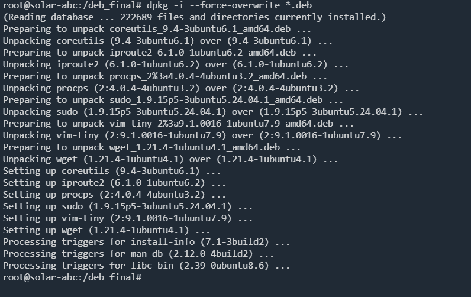

```bash
root@solar-abc:/deb_final# cat /var/flag/1
flag{e510c5fca680b1b4bd5c9d8d6b3f4bdc}
```

排查被感染文件，均正常

### 清理挖矿病毒遗留

清理挖矿程序，杀进程，守护进程脚本，计划任务

```bash
rm kworkerds
kill -9 4027
rm /etc/cron.d/0guardian
rm /usr/bin/.0guardian
```

```bash
root@solar-abc:~# cat /var/flag/2
flag{081ce3688c6cd6e2946125081381087c}
```

### 总结

本次事件梳理：

运维人员下载了有病毒的捆绑程序，执行后程序会感染系统命令，然后添加恶意代码到stat文件，释放挖矿文件

创建守护脚本`.0guardian`，并创建定时任务执行守护脚本；守护脚本会调用stat，分析挖矿文件、进程是否存在，如果不就释放挖矿文件。
