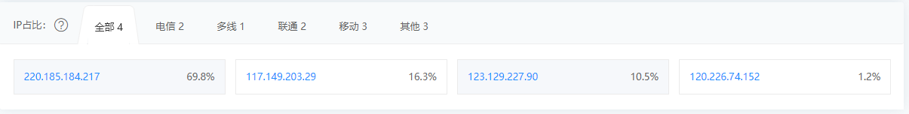
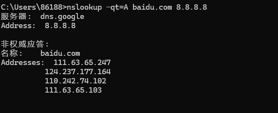
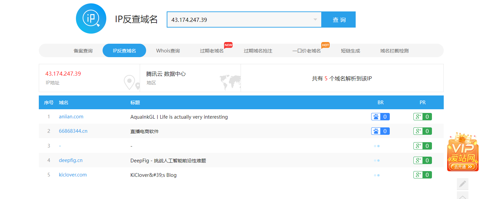
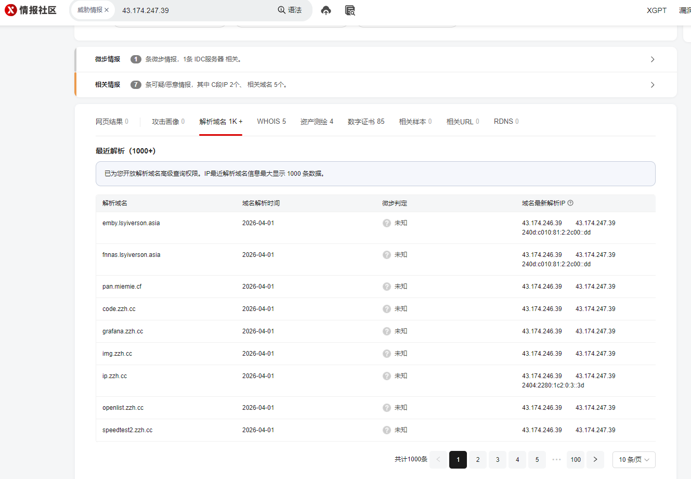
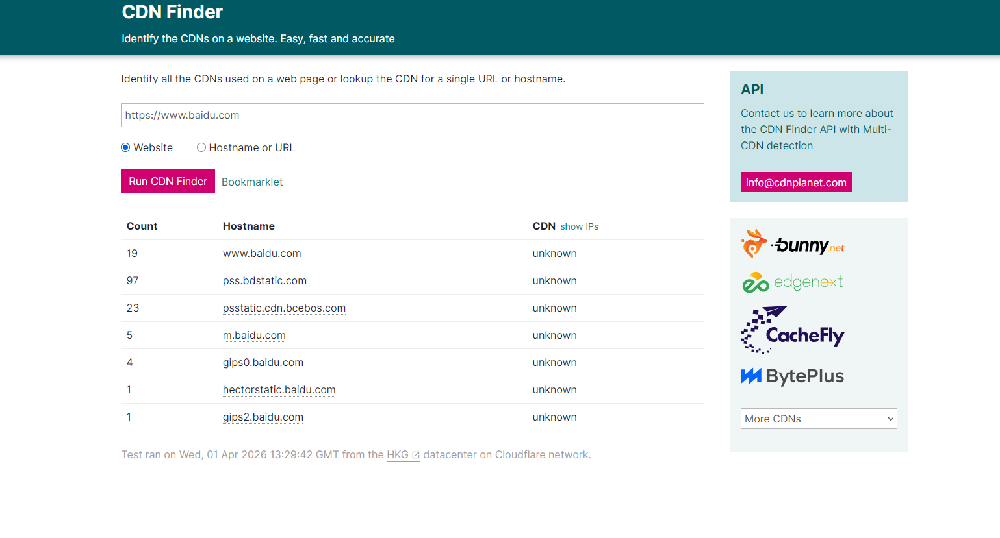
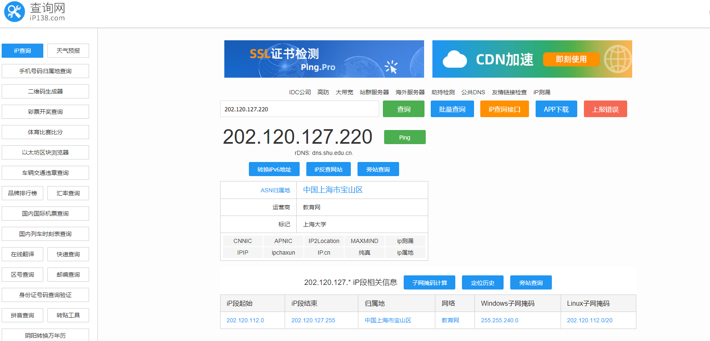
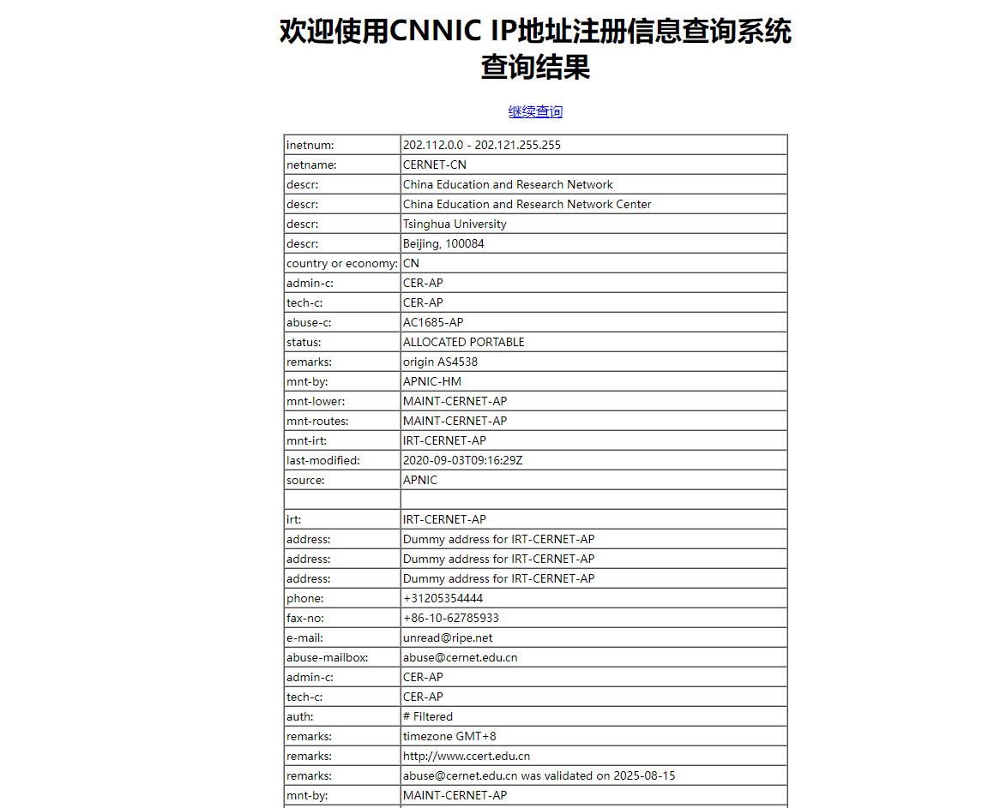

## 绕过CDN常见方法

### 判断有没有CDN

#### 多地ping

如果没有CDN只会显示一个IP地址




网站：

https://boce.aliyun.com/detect/ping

http://ping.chinaz.com/

https://ping.aizhan.com/

http://www.webkaka.com/Ping.aspx

https://www.host-tracker.com/v3/check/

#### DNS 历史记录

网站刚开始搭建起来的时候，可能不使用CDN

查历史域名解析记录：https://www.ip138.com/

https://x.threatbook.cn

https://webiplookup.com

https://viewdns.info/iphistory

https://securitytrails.com/#search

https://toolbar.netcraft.com/site_report

#### nslookup

用国外的dns服务器，如果返回域名解析对应多个 IP 地址多半是使用了 CDN（一个IP也可能有CDN）

```
nslookup -qt=A baidu.com 8.8.8.8
```



#### IP 反查域名

查看是否存在大量不相关的域名

- https://securitytrails.com/
- https://dns.aizhan.com/
- https://x.threatbook.cn



解析到大量域名



#### 在线检测工具

- https://www.cdnplanet.com/tools/cdnfinder/
- https://tools.ipip.net/cdn.php



## IP 段收集

目标比较大的时候查看分配的 IP 段

通过 IP138 可以找到对应IP段



https://ipwhois.cnnic.net.cn

