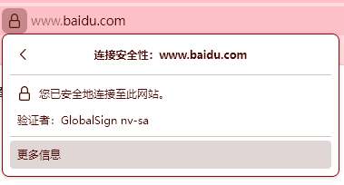
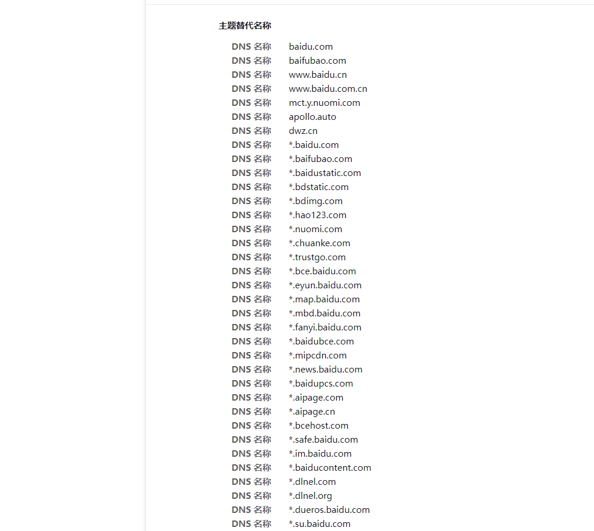
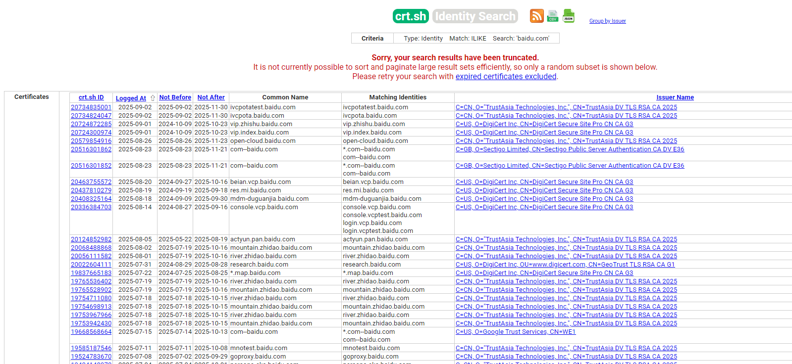
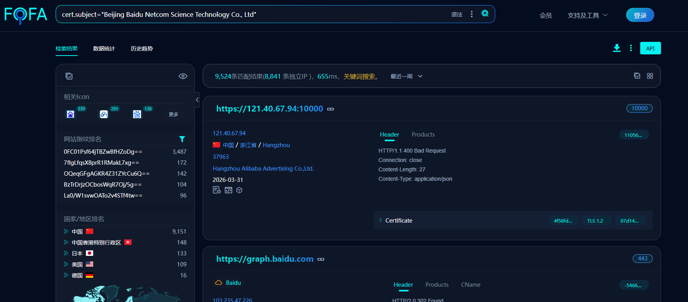
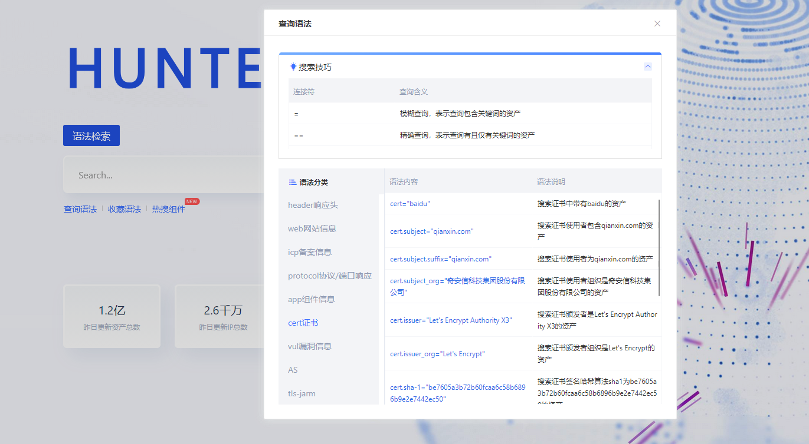

### SSL 证书

​	SSL证书是遵循SSL/TLS协议的数字证书，由受信任的数字证书颁发机构（CA）验证服务器身份后颁发，具备身份验证和加密传输功能 。该证书通过公钥加密技术建立客户端与服务器的安全通道，防止数据泄露和篡改，包含证书颁发机构、有效期、公钥等信息，并通过域名所有权验证流程完成签发。

### 作用

查询共用 SSL 证书的网站，得到相关域名

### 方法

浏览器直接查看，点击查看更多信息

查看证书，找到其他网站

利用在线网站

https://crt.sh/?q=baidu.com

使用网络空间搜索引擎

