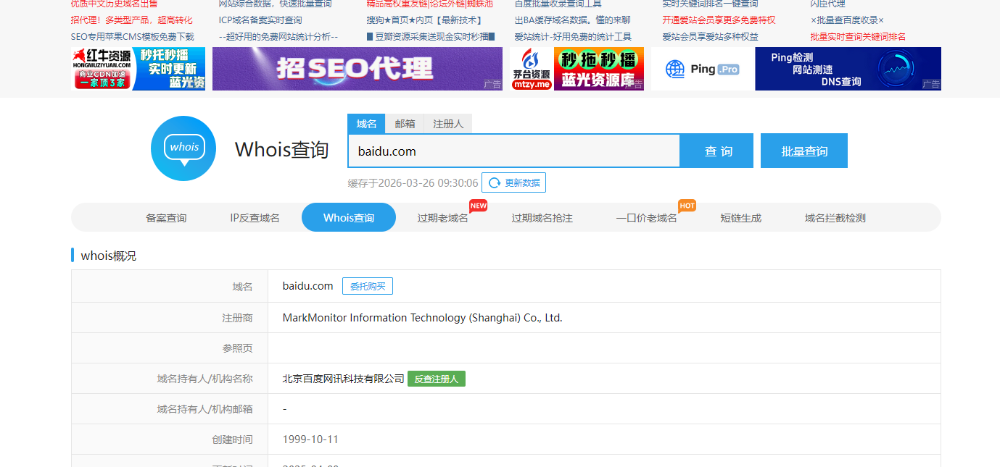
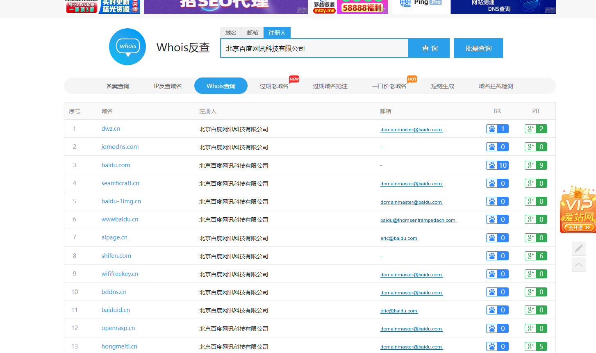

## Whois 查询

### 简介

Whois是一种用于查询域名及IP地址注册信息的传输协议，通过检索数据库可获取域名状态、所有者、注册商、注册及到期时间等数据。该协议基于 TCP 协议 43 端口运行，支持命令行工具或网页查询方式发送请求，不同顶级域名（如.com、.cn）由对应管理机构维护独立数据库

### 作用

通过查询目标的WHOIS信息，对联系人、联系邮箱等信息进行反查，获取更多相关的域名信息。

重点关注注册商、注册人、邮件、DNS解析服务器、注册人联系电话。

### 步骤

先进行whois查询

然后反查注册人或者根据邮箱反查

### 网站

站长之家：http://whois.chinaz.com

Bugscaner： http://whois.bugscaner.com

国外在线： https://bgp.he.net

爱站网：https://whois.aizhan.com/

国家域名whois：https://whois.cnnic.cn/WelcomeServlet

全球 WHOIS 查询：https://www.whois365.com/cn/

域名信息查询 - 腾讯云：https://whois.cloud.tencent.com/

whois查询-中国万网：https://whois.aliyun.com/
