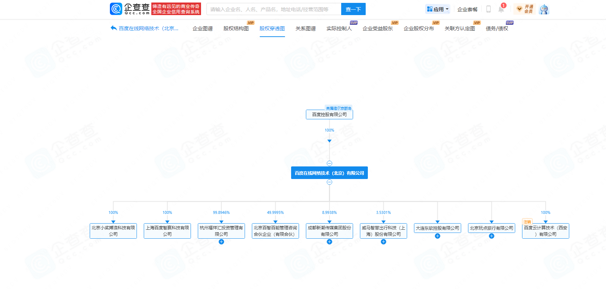
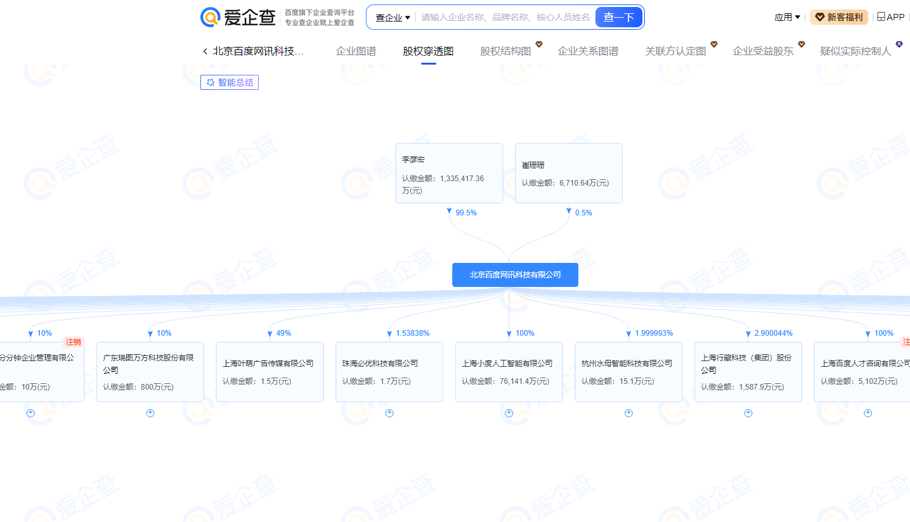
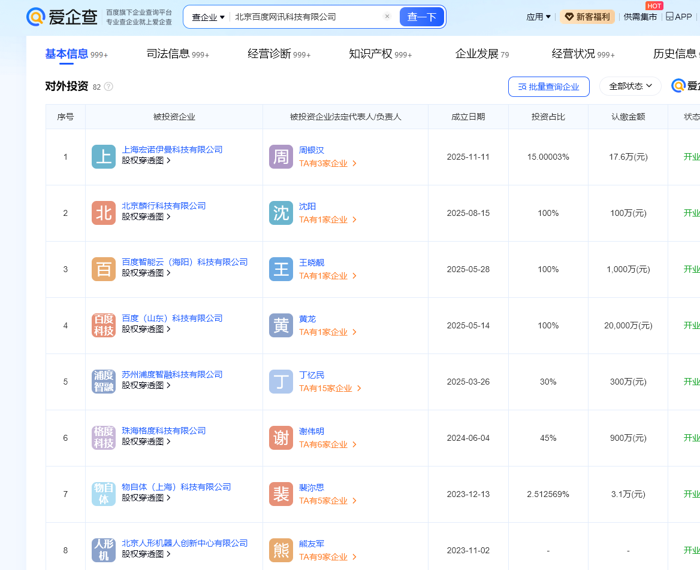

## 公司层次架构、股权

我们需要全面收集资产就需要先确定子公司，确定所有相关公司的结构。

通过股权结构图、对外投资，查询子公司、孙公司、控股公司等；查询子公司，一般控股在`51%`以上就可以算隶属于该目标的资产

### 网站

爱站：https://icp.aizhan.com/

站长：https://data.chinaz.com/company

零零信安：https://0.zone/almanac

小蓝本: https://www.xiaolanben.com/pc

企查查: https://www.qichacha.com

天眼查: https://www.tianyancha.com

爱企查: https://aiqicha.baidu.com

### 工具

https://github.com/wgpsec/ENScan_GO

https://github.com/TideSec/TscanPlus