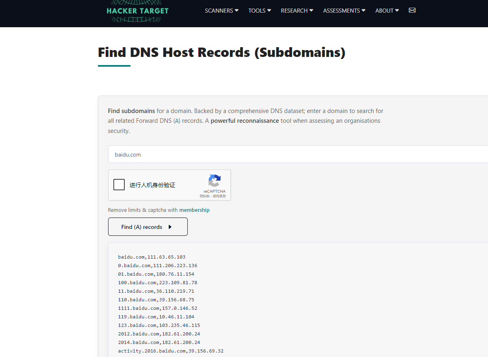

## DNS 公开数据

Rapid7的开源数据项目：https://opendata.rapid7.com/

收集了多种全互联网范围内的扫描数据，任何人都可下载这些数据，而本次主题中主要涉及两个数据集，分别是FDNS和RDNS，可从中获取到大量的子域名信息。

## 网站查询

Find DNS Host Records (Subdomains)：https://hackertarget.com/find-dns-host-records/

netcraft：https://searchdns.netcraft.com/

